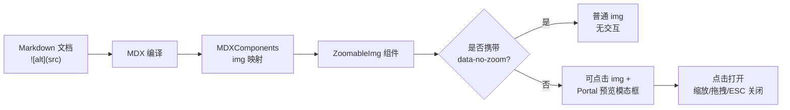

# 图片放大预览

QVMConsole 文档站点的所有图片都支持**点击放大预览**。无需任何额外操作，在任意文档页面点击图片即可打开全屏预览，方便查看截图中的细节。

## 体验一下

点击下方图片，立即感受预览效果：


## 交互方式

预览打开后，支持以下操作：

| 操作 | 效果 |
| --- | --- |
| 点击图片 | 打开预览 |
| 点击遮罩区域 | 关闭预览 |
| 点击右上角关闭按钮 | 关闭预览 |
| 按 `ESC` 键 | 关闭预览 |
| 滚动鼠标滚轮 | 放大 / 缩小图片 |
| 按住图片拖拽 | 移动图片位置 |
| 双击图片 | 重置缩放与位置 |

:::tip 操作提示
预览界面左下角会显示“滚轮缩放 · 拖拽移动 · ESC 关闭”提示。移动端窄屏下会自动隐藏该提示并放宽图片显示区域。
:::

## 使用方式

### Markdown 图片（自动生效）

文档中使用标准 Markdown 图片语法即可自动启用预览，**无需修改任何现有文档**：

```md

```

给图片填写说明文字（``）后，该说明会作为标题显示在预览界面底部：

```md

```

### 禁用某张图片的预览

如果某些图片（如小图标、装饰图）不需要放大预览，可在 MDX 中使用原生 `` 标签并添加 `data-no-zoom` 属性：

```mdx

```

## 实现原理

图片预览通过 Docusaurus 的 **theme wrapper** 机制实现：覆盖默认 MDX 组件映射中的 `img`，将其替换为自定义的 `ZoomableImg` 组件。这样所有 Markdown 图片在渲染时都会走自定义组件，自动获得点击放大能力。



### 涉及文件

| 文件 | 作用 |
| --- | --- |
| `src/theme/MDXComponents.tsx` | 覆盖原生 `img` 映射为 `ZoomableImg`，对现有文档零侵入 |
| `src/components/ZoomableImg/index.tsx` | 预览组件，处理点击、缩放、拖拽、键盘等交互 |
| `src/components/ZoomableImg/styles.module.css` | 预览模态框与图片样式，适配明暗主题 |

### 关键设计

- **零侵入**：通过全局 MDX 组件映射覆盖，所有现有文档无需改动即自动生效。
- **SSR 安全**：预览模态框通过 `createPortal` 渲染到 `document.body`，且仅在客户端挂载后渲染，服务端输出普通图片，避免 hydration 不匹配。
- **滚轮缩放**：使用原生非 passive 的 `wheel` 监听器，确保 `preventDefault` 生效，缩放时不会触发页面滚动。
- **无障碍**：模态框使用 `role="dialog"` 与 `aria-modal`，打开时自动聚焦以支持键盘关闭。
- **无额外依赖**：仅使用 React 内置能力与项目已有的 `clsx`，不引入第三方图片预览库。

## 常见问题

:::note 所有图片都会被放大吗？
是的。所有通过 Markdown `` 语法插入的图片都会启用预览。如需排除特定图片，请使用 ``。
:::
