# QVMConsole 架构设计

QVMConsole 是一款面向企业与云服务场景的开源虚拟机管理平台，围绕 KVM/QEMU 虚拟化进行深度集成。本文档全面展示程序的技术架构、分层设计、核心组件和实现细节。

## 整体架构

QVMConsole 采用经典的三层架构设计，将系统分为表现层、业务层和数据访问层，通过依赖注入实现松耦合。

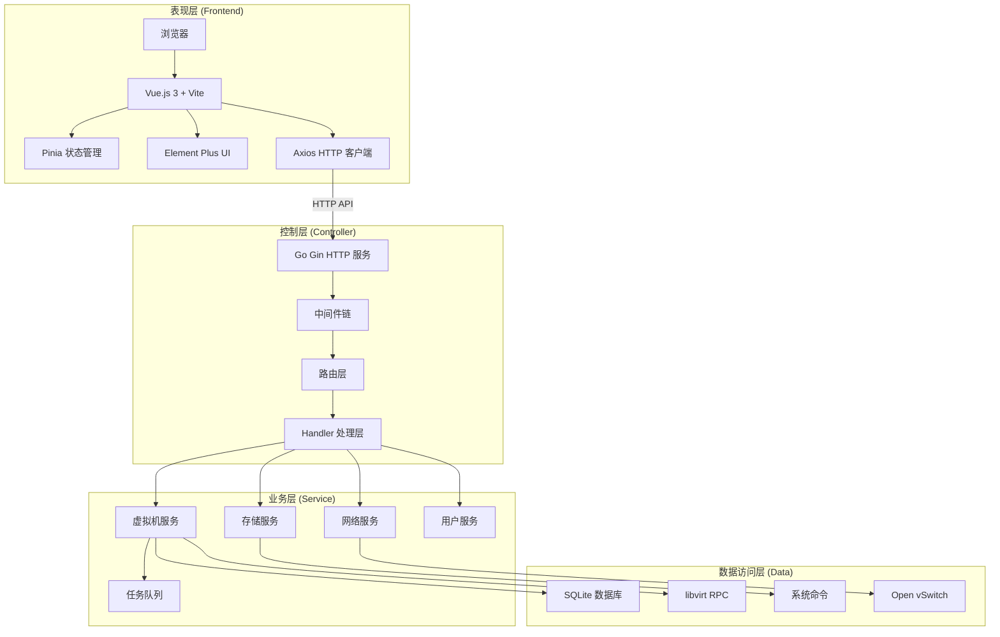

## 后端架构

### 技术栈

| 组件 | 技术 | 说明 |
|------|------|------|
| Web 框架 | Gin | 高性能 HTTP 框架，支持中间件链 |
| 虚拟化 API | go-libvirt | 通过 UNIX Socket 与 libvirt 守护进程通信，高性能 RPC 调用 |
| 数据库 | SQLite + GORM | 轻量级嵌入式数据库，自动迁移与兼容性修复 |
| 任务队列 | 自研 | 基于 goroutine 的异步任务系统，支持进度回调和 SSE 推送 |
| 网络虚拟化 | Open vSwitch | 支持 VLAN 隔离、流表管理和 TC 限速 |

### 目录结构

```
server/
├── main.go              # 程序入口，启动流程编排
├── config/              # 配置管理（环境变量 > 数据库 > 默认值）
│   └── config.go
├── router/              # 路由定义与中间件注册
│   └── router.go
├── handler/             # HTTP 请求处理层
│   ├── auth.go          # 认证相关（登录/登出/2FA）
│   ├── vm.go            # 虚拟机管理
│   ├── vm_sse.go        # VM 实时推送
│   ├── network.go       # 网络管理
│   ├── template.go      # 模板管理
│   ├── user.go          # 用户管理
│   ├── task.go          # 任务队列接口
│   └── ...
├── middleware/          # 中间件
│   ├── auth.go          # JWT/API Key 认证
│   └── cors.go          # CORS 跨域
├── model/               # 数据模型（GORM 实体）
│   ├── db.go            # 数据库初始化与自动迁移
│   ├── user.go          # 用户模型
│   ├── vm_cache.go      # VM 缓存模型
│   ├── task.go          # 任务模型
│   └── ...
├── service/             # 业务逻辑层
│   ├── vm/              # 虚拟机服务（创建/生命周期/缓存/详情）
│   │   ├── create.go    # VM 创建逻辑
│   │   ├── lifecycle.go # 生命周期操作（开机/关机/重启）
│   │   ├── runtime.go   # 运行时状态管理
│   │   ├── cache.go     # 缓存同步
│   │   ├── list.go      # 列表查询
│   │   ├── detail.go    # 详情查询
│   │   └── deps.go      # 依赖注入容器
│   ├── network/         # 网络服务
│   │   ├── vpc/         # VPC 交换机与 ACL
│   │   ├── port_forward.go    # 端口转发
│   │   ├── static_ip.go       # 静态 IP
│   │   └── diagnostics/       # 网络诊断
│   ├── firewall/        # 防火墙策略
│   ├── ovs/             # Open vSwitch 集成
│   ├── security/        # 安全服务（JWT 密钥/令牌）
│   └── scheduler/       # 调度器事件中心
├── taskqueue/           # 任务队列内核
│   └── queue.go         # 任务提交/分发/执行/SSE/清理
└── utils/               # 工具函数
    └── cmd.go           # 系统命令执行
```

### 启动流程

后端启动流程严格按照依赖顺序执行：

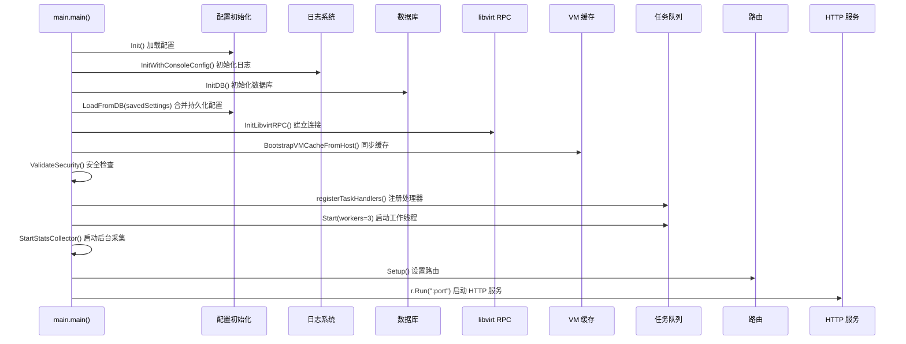

### 分层架构设计

系统采用严格的三层架构，各层职责明确：

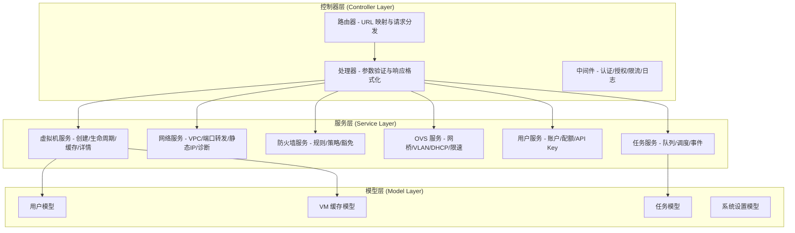

### 中间件链

中间件按顺序执行，形成处理管道：

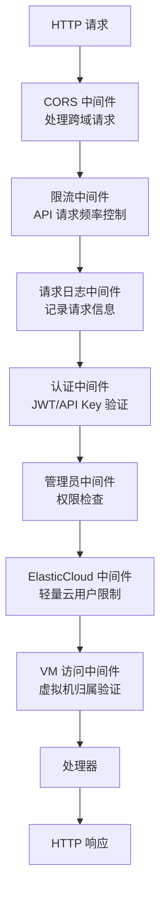

| 中间件 | 功能 | 应用范围 |
|--------|------|----------|
| `CORSMiddleware` | 处理跨域请求，设置 CORS 头 | 全局 |
| `RateLimitMiddleware` | API 请求频率控制，防止滥用 | 全局 |
| `RequestLogMiddleware` | 记录请求路径、方法、耗时 | 全局 |
| `AuthMiddleware` | JWT 令牌/API Key 验证，注入用户身份 | 需要认证的接口 |
| `AdminMiddleware` | 管理员权限验证 | 管理员接口 |
| `ElasticCloudOnlyMiddleware` | 轻量云用户功能限制 | 轻量云专属功能 |
| `VMAccessMiddleware` | 虚拟机归属权限验证 | VM 操作接口 |

### 依赖注入机制

服务层通过依赖容器实现松耦合，避免循环依赖：

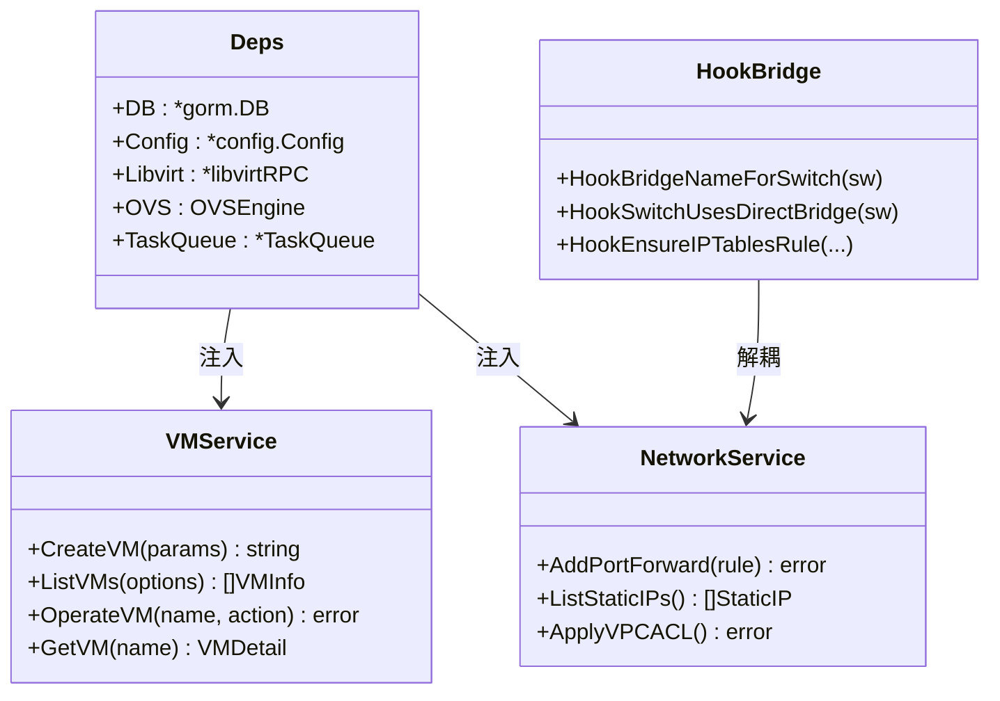

**依赖关系特点**：

| 特点 | 说明 |
|------|------|
| **向上依赖** | 下层模块可以依赖上层模块的接口 |
| **接口隔离** | 通过 Hook 机制定义抽象依赖 |
| **依赖注入** | 通过 Deps 容器集中注入依赖 |
| **Wire 适配器** | 集中注册 Hook，屏蔽实现差异 |

### 请求处理流程

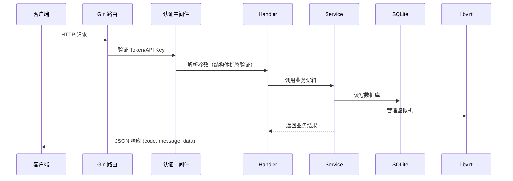

### API 路由结构

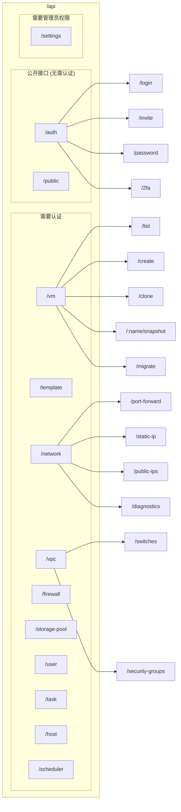

## 前端架构

### 技术栈

| 组件 | 技术 | 说明 |
|------|------|------|
| 框架 | Vue.js 3 | 渐进式 JavaScript 框架 |
| 构建工具 | Vite | 下一代前端构建工具，支持热更新 |
| 状态管理 | Pinia | Vue 3 官方状态管理 |
| UI 组件库 | Element Plus | Vue 3 组件库 |
| HTTP 客户端 | Axios | 基于 Promise 的 HTTP 库，支持拦截器 |
| 路由 | Vue Router 4 | Vue.js 官方路由 |

### 目录结构

```
web/src/
├── main.js              # 程序入口，注册插件
├── App.vue              # 根组件
├── api/                 # API 接口定义
│   ├── auth.js          # 认证接口
│   ├── vm.js            # 虚拟机接口
│   ├── network.js       # 网络接口
│   └── ...
├── components/          # 公共组件
│   ├── VmForm.vue       # VM 表单组件
│   ├── SnapshotList.vue # 快照列表组件
│   └── ...
├── layout/              # 布局组件
│   └── index.vue        # 主布局
├── router/              # 路由配置
│   └── index.js
├── store/               # 状态管理
│   ├── user.js          # 用户状态（Token/角色/云类型）
│   └── vm.js            # VM 状态（列表缓存/访问历史）
├── utils/               # 工具函数
│   ├── request.js       # HTTP 请求封装（拦截器/二次验证）
│   ├── clipboard.js     # 剪贴板操作
│   └── vnc.js           # VNC 连接
└── views/               # 页面视图
    ├── dashboard/       # 首页仪表盘
    ├── vm/              # 虚拟机管理
    ├── network/         # 网络管理
    ├── template/        # 模板管理
    └── ...
```

### 请求封装与安全

Axios 拦截器统一处理认证和错误：

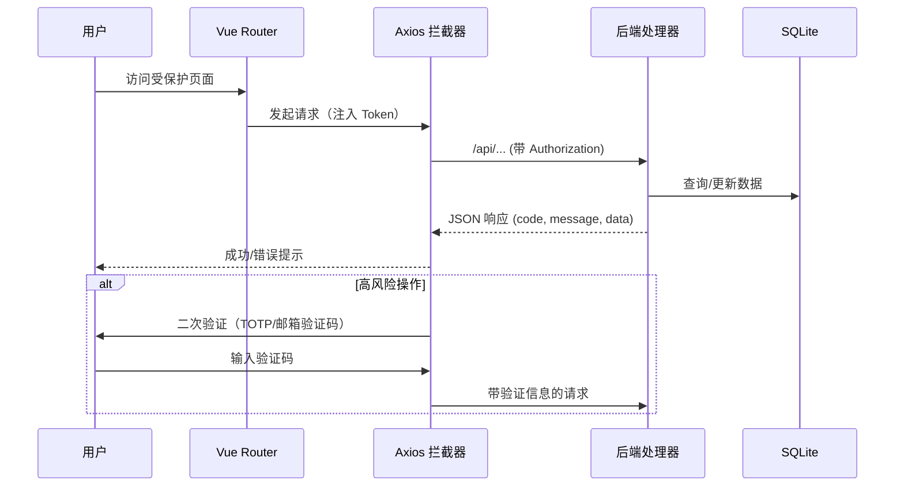

## 数据库设计

### 核心数据表

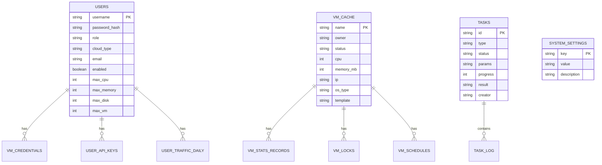

### 数据表说明

| 表名 | 用途 | 关键字段 |
|------|------|----------|
| `users` | 用户账户信息 | username, password_hash, role, cloud_type |
| `vm_cache` | 虚拟机信息缓存 | name, owner, status, cpu, memory_mb |
| `tasks` | 异步任务记录 | id, type, status, progress, result |
| `system_settings` | 系统配置项 | key, value, description |
| `vm_credentials` | VM 登录凭据 | vm_name, username, password |
| `vm_locks` | VM 锁定状态 | vm_name, locked, reason |
| `vm_schedules` | VM 定时任务 | vm_name, action, cron_expr |
| `storage_pools` | 存储池配置 | name, path, type, capacity |
| `vpc_switches` | VPC 交换机 | name, vlan_id, bridge |
| `vpc_security_groups` | 安全组 | name, rules_json |

### 配置优先级

系统配置按以下优先级加载：

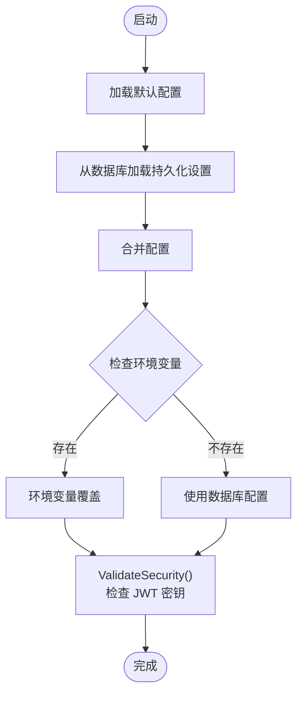

**优先级顺序**：环境变量 > 数据库持久化设置 > 默认值

## 任务队列系统

### 架构设计

任务队列采用"生产者-消费者"模型，结合 SSE 实现前端实时进度推送：

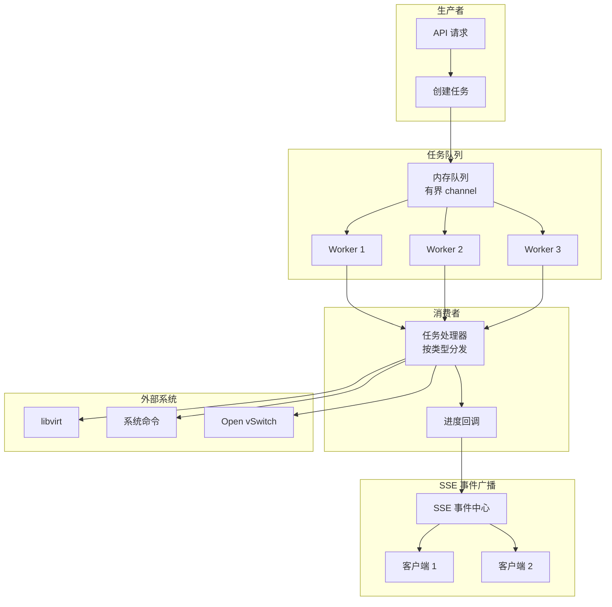

### 任务生命周期

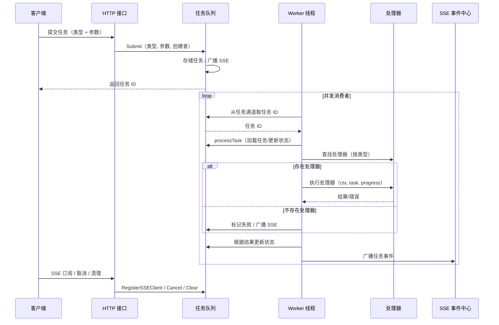

### 支持的任务类型

| 任务类型 | 说明 | 可取消 | 进度回调 |
|---------|------|--------|----------|
| `clone` | 虚拟机克隆 | ✅ | ✅ |
| `linked_clone` | 原生链式克隆 | ✅ | ✅ |
| `batch` | 批量克隆 | ✅ | ✅ |
| `create` | 普通创建 VM | ✅ | ✅ |
| `reinstall` | 重装系统 | ❌ | ✅ |
| `delete` | 删除 VM | ❌ | ✅ |
| `snapshot` | 快照操作 | ❌ | ✅ |
| `migration` | VM 迁移 | ❌ | ✅ |
| `import` | 导入 VM | ✅ | ✅ |
| `export` | 导出 VM | ✅ | ✅ |
| `template` | 模板操作 | ❌ | ✅ |
| `firewall_apply` | 防火墙策略应用 | ❌ | ✅ |

### 任务状态

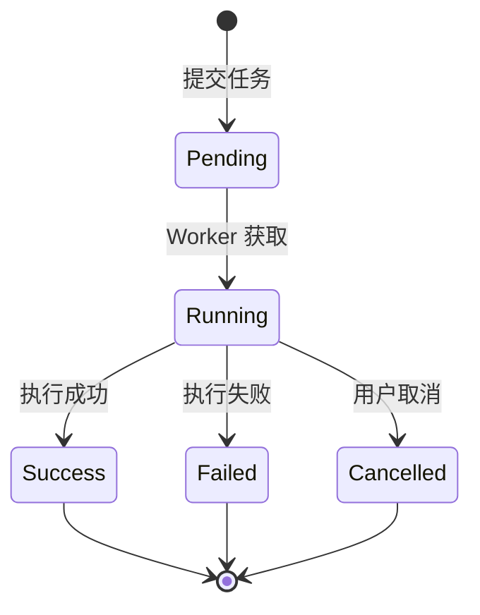

## 虚拟化集成

### libvirt 交互

QVMConsole 通过 go-libvirt 与 libvirt 守护进程通信，采用单例连接模式：

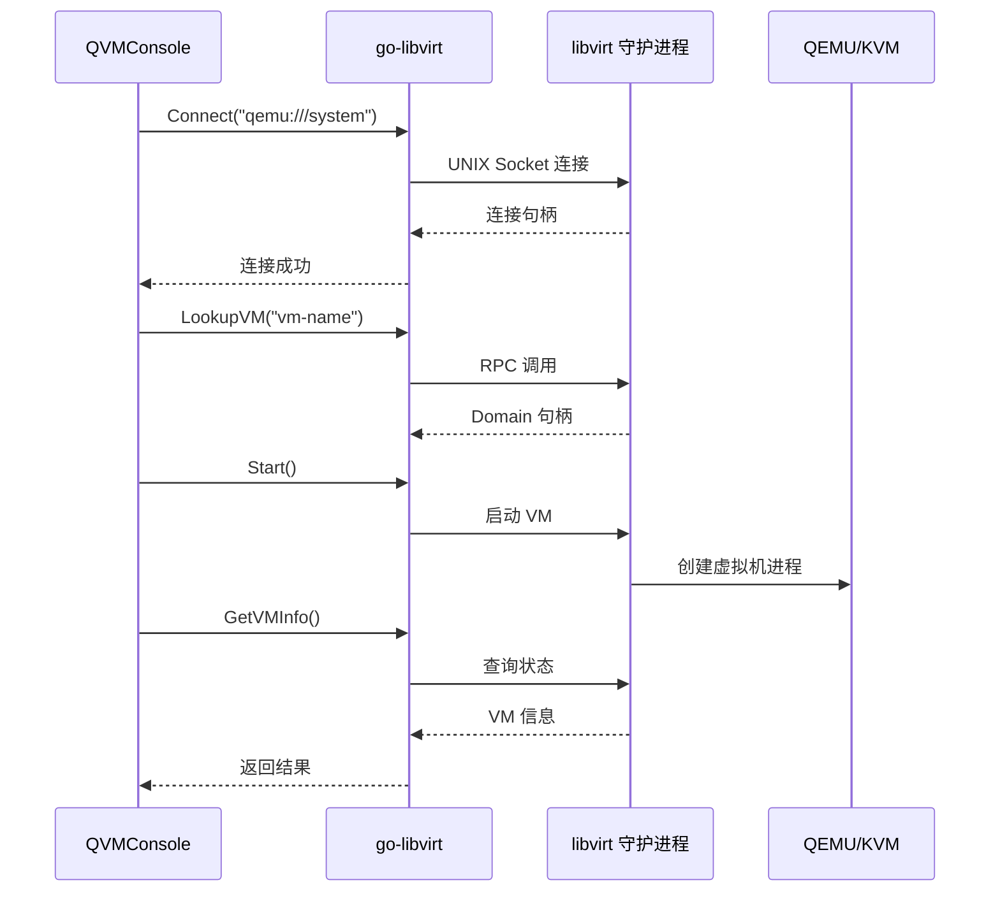

**连接特性**：
- 单例连接：全局共享一个 libvirt 连接，降低连接成本
- 自动重连：连接断开时自动尝试重新建立
- 错误降级：RPC 不可用时降级为 virsh 命令行

### 支持的虚拟化操作

| 操作 | libvirt API | 说明 |
|------|-------------|------|
| 创建 VM | `DefineXML` + `Create` | 定义并启动 |
| 关机 | `Shutdown` / `Destroy` | 正常/强制关机 |
| 暂停 | `Suspend` | 暂停 VM |
| 恢复 | `Resume` | 恢复运行 |
| 快照 | `SnapshotCreateXML` | 创建快照 |
| 迁移 | `MigrateToURI` | 跨节点迁移 |
| 克隆 | `DefineXML` + 磁盘复制 | 克隆 VM |

## 安全机制

### 认证流程

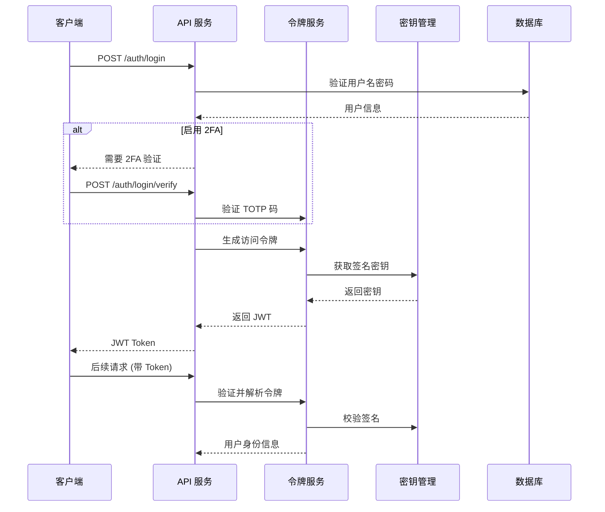

### JWT 令牌类型

| 令牌类型 | 用途 | 有效期 | 刷新支持 |
|---------|------|--------|----------|
| **访问令牌** | 常规 API 访问 | 较短 | 支持 |
| **引导令牌** | 首次登录后初始化 | 短 | 不支持 |
| **登录验证令牌** | 二次验证（TOTP） | 极短 | 不支持 |
| **高风险令牌** | 敏感操作（密码修改等） | 极短 | 不支持 |

### 权限控制

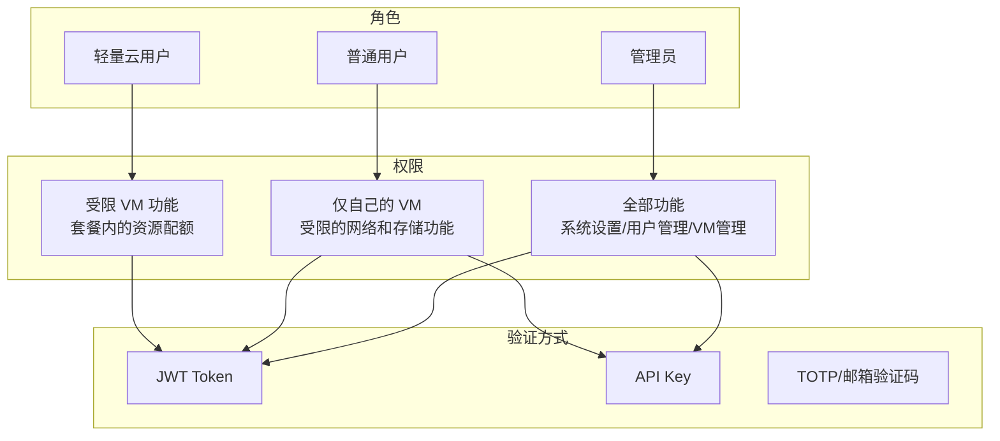

### 高风险操作二次验证

| 操作 | 验证方式 | 说明 |
|------|----------|------|
| 删除 VM | TOTP/邮箱验证码 | 不可逆操作 |
| 重置密码 | TOTP/邮箱验证码 | 安全敏感 |
| 导出 VM | TOTP/邮箱验证码 | 数据安全 |
| 修改系统设置 | TOTP/邮箱验证码 | 系统安全 |
| 删除用户 | TOTP/邮箱验证码 | 不可逆操作 |

## SSE 实时推送

QVMConsole 使用 Server-Sent Events 实现实时数据推送：

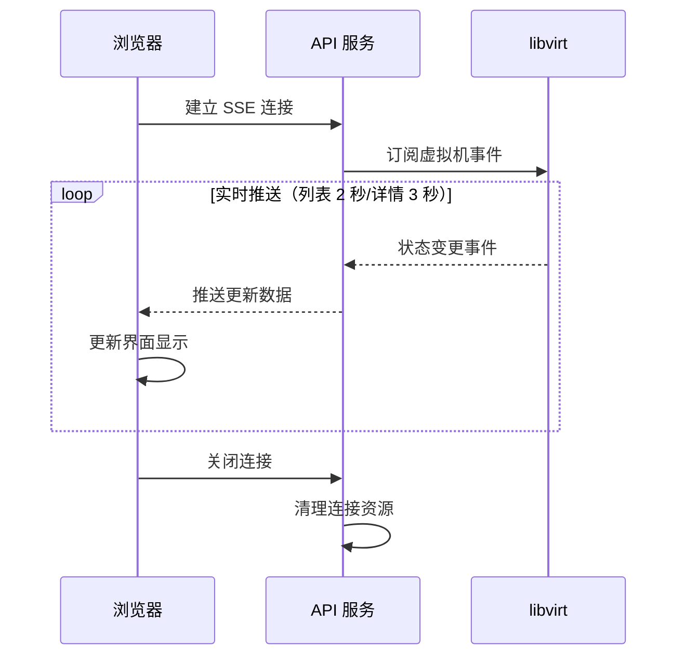

### SSE 端点

| 端点 | 推送内容 | 推送频率 |
|------|----------|----------|
| `/api/vm/sse` | VM 列表状态 | 2 秒 |
| `/api/vm/:name/sse` | 单个 VM 详情 | 3 秒 |
| `/api/host/stats/sse` | 宿主机资源 | 5 秒 |
| `/api/task/sse` | 任务进度 | 实时 |
| `/api/scheduler/events/sse` | 调度事件 | 实时 |

**SSE 优势**：
- 实时性：状态变更立即推送，无需轮询
- 低开销：相比轮询方式，减少不必要的网络请求
- 自动重连：连接断开后自动尝试重连

## 部署架构

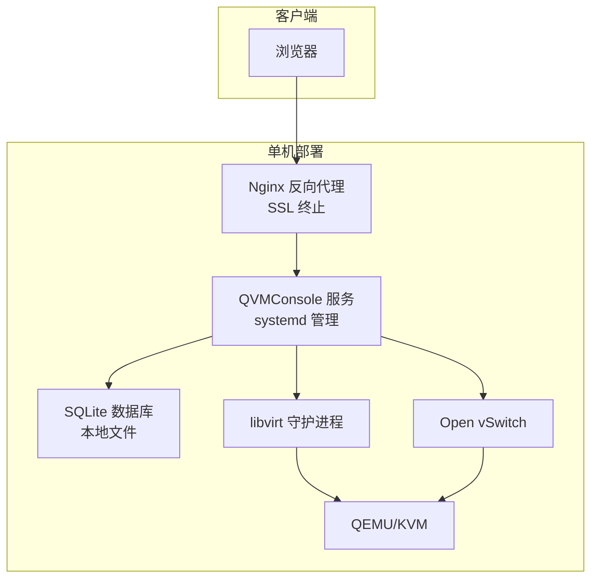

### 生产环境配置

| 组件 | 配置 | 说明 |
|------|------|------|
| Web 服务器 | Nginx | 反向代理 + SSL 终止 |
| 应用服务 | QVMConsole | systemd 管理，开机自启 |
| 数据库 | SQLite | 本地文件，自动迁移 |
| 虚拟化 | libvirt + QEMU/KVM | UNIX Socket 通信 |
| 网络 | Open vSwitch | VLAN 隔离、流表管理 |
| 前端 | 静态文件 | Nginx 托管或内嵌服务 |

## 性能考量

### 缓存策略

| 缓存层次 | 实现方式 | 效果 |
|----------|----------|------|
| VM 缓存 | 内存中缓存虚拟机状态 | 减少 libvirt 调用 |
| 配置缓存 | 启动时加载到内存 | 减少数据库访问 |
| 用户权限缓存 | 请求上下文缓存 | 减少重复查询 |

### 并发处理

- **任务队列**：默认 3 个工作线程，可根据资源与负载调整
- **libvirt 连接**：单例模式，自动重连，降低连接成本
- **SSE 推送**：异步推送，不阻塞主请求处理

### 网络与存储优化

- 支持 OVS 网络后端与带宽总限速
- 结合 IOPS 限制与磁盘迁移优化
- 优先使用 go-libvirt RPC，必要时降级为 virsh 命令行

## 故障排查指南

### 启动失败

| 问题 | 症状 | 解决方案 |
|------|------|----------|
| JWT 密钥错误 | 启动时安全检查失败 | 检查是否使用默认密钥，生产环境必须修改 |
| libvirt 连接失败 | 无法连接 libvirt 守护进程 | 确认 libvirtd 服务运行状态 |
| 数据库异常 | 迁移失败或连接错误 | 检查数据库路径和权限 |

### 运行时问题

| 问题 | 症状 | 解决方案 |
|------|------|----------|
| 认证失败 | 401 Unauthorized | 检查 Token 有效性和时间同步 |
| 权限不足 | 403 Forbidden | 检查用户角色和权限配置 |
| 网络异常 | VM 无法上网 | 检查 OVS 网桥和 VPC 配置 |
| 任务卡住 | 任务长时间无进度 | 通过任务队列接口查看状态，必要时取消重试 |

### 日志定位

- 根据日志级别与类型筛选
- 关注 libvirt 与命令执行日志
- 使用请求日志中间件追踪请求链路
