# QVMConsole 架构设计

本页面主要是展示QVMConsole程序技术公开。

## 整体架构

QVMConsole 采用前后端分离架构，后端基于 Go 语言，前端使用 Vue.js 3。

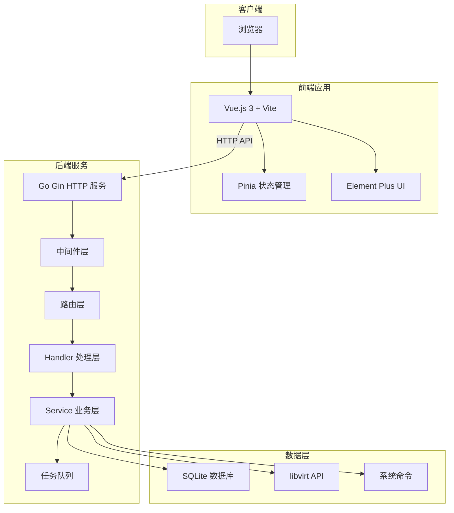

## 后端架构

### 技术栈

| 组件 | 技术 | 说明 |
|------|------|------|
| Web 框架 | Gin | 高性能 HTTP 框架 |
| 虚拟化 API | libvirt | 虚拟机管理接口 |
| 数据库 | SQLite | 轻量级嵌入式数据库 |
| 任务队列 | 自研 | 基于 goroutine 的异步任务系统 |

### 目录结构

```
server/
├── main.go              # 程序入口
├── config/              # 配置管理
│   └── config.go
├── router/              # 路由定义
│   └── router.go
├── handler/             # HTTP 请求处理
│   ├── auth.go          # 认证相关
│   ├── vm.go            # 虚拟机管理
│   ├── network.go       # 网络管理
│   ├── template.go      # 模板管理
│   ├── user.go          # 用户管理
│   └── ...
├── middleware/          # 中间件
│   ├── auth.go          # JWT 认证
│   └── cors.go          # CORS 跨域
├── model/               # 数据模型
│   ├── db.go            # 数据库初始化
│   ├── user.go          # 用户模型
│   ├── vm_cache.go      # VM 缓存模型
│   └── ...
├── service/             # 业务逻辑
│   ├── libvirt.go       # libvirt 封装
│   ├── vm_create.go     # VM 创建
│   ├── vm_runtime.go    # VM 运行时管理
│   ├── network.go       # 网络服务
│   └── ...
├── taskqueue/           # 任务队列
│   └── queue.go
└── utils/               # 工具函数
    └── cmd.go           # 系统命令执行
```

### 请求处理流程

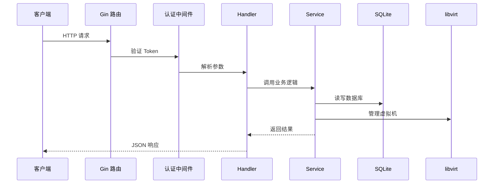

### API 路由结构

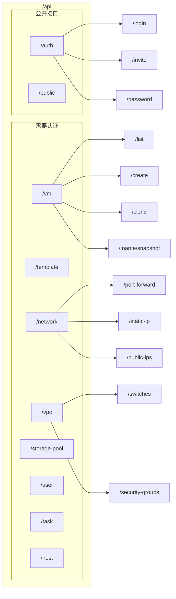

### 中间件系统

| 中间件 | 功能 | 应用范围 |
|--------|------|----------|
| `CORSMiddleware` | 处理跨域请求 | 全局 |
| `AuthMiddleware` | JWT 令牌验证 | 需要认证的接口 |
| `AdminMiddleware` | 管理员权限验证 | 管理员接口 |
| `VMAccessMiddleware` | VM 归属权限验证 | VM 操作接口 |
| `ElasticCloudOnlyMiddleware` | 弹性云功能限制 | 弹性云专属功能 |
| `TokenTypeMiddleware` | 令牌类型验证 | 特定类型接口 |

## 前端架构

### 技术栈

| 组件 | 技术 | 说明 |
|------|------|------|
| 框架 | Vue.js 3 | 渐进式 JavaScript 框架 |
| 构建工具 | Vite | 下一代前端构建工具 |
| 状态管理 | Pinia | Vue 3 官方状态管理 |
| UI 组件库 | Element Plus | Vue 3 组件库 |
| HTTP 客户端 | Axios | 基于 Promise 的 HTTP 库 |
| 路由 | Vue Router 4 | Vue.js 官方路由 |

### 目录结构

```
web/src/
├── main.js              # 程序入口
├── App.vue              # 根组件
├── api/                 # API 接口定义
│   ├── auth.js          # 认证接口
│   ├── vm.js            # 虚拟机接口
│   ├── network.js       # 网络接口
│   └── ...
├── assets/              # 静态资源
├── components/          # 公共组件
│   ├── VmForm.vue       # VM 表单组件
│   ├── SnapshotList.vue # 快照列表组件
│   └── ...
├── layout/              # 布局组件
│   └── index.vue        # 主布局
├── router/              # 路由配置
│   └── index.js
├── store/               # 状态管理
│   ├── user.js          # 用户状态
│   └── vm.js            # VM 状态
├── utils/               # 工具函数
│   ├── request.js       # HTTP 请求封装
│   ├── clipboard.js     # 剪贴板操作
│   └── vnc.js           # VNC 连接
└── views/               # 页面视图
    ├── dashboard/       # 首页仪表盘
    ├── vm/              # 虚拟机管理
    ├── network/         # 网络管理
    ├── template/        # 模板管理
    └── ...
```

### 页面路由

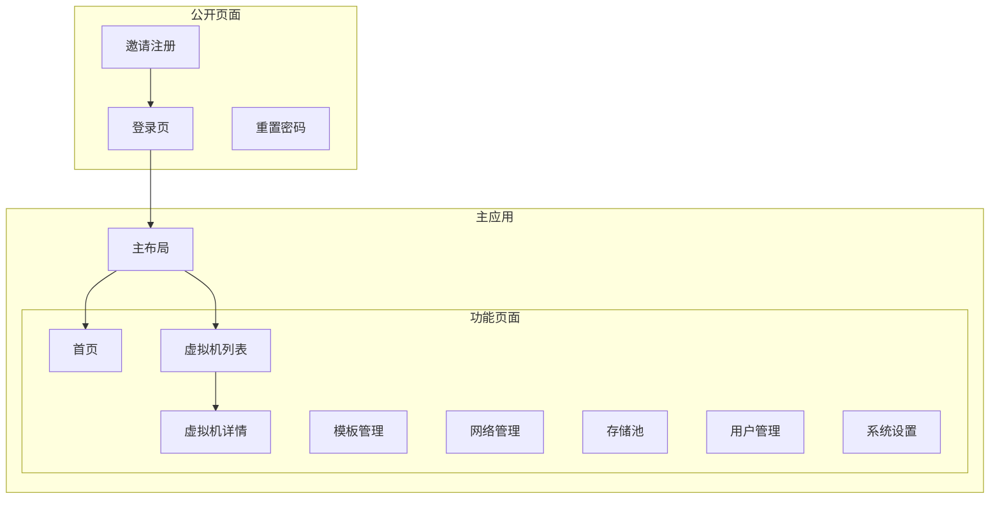

### 状态管理

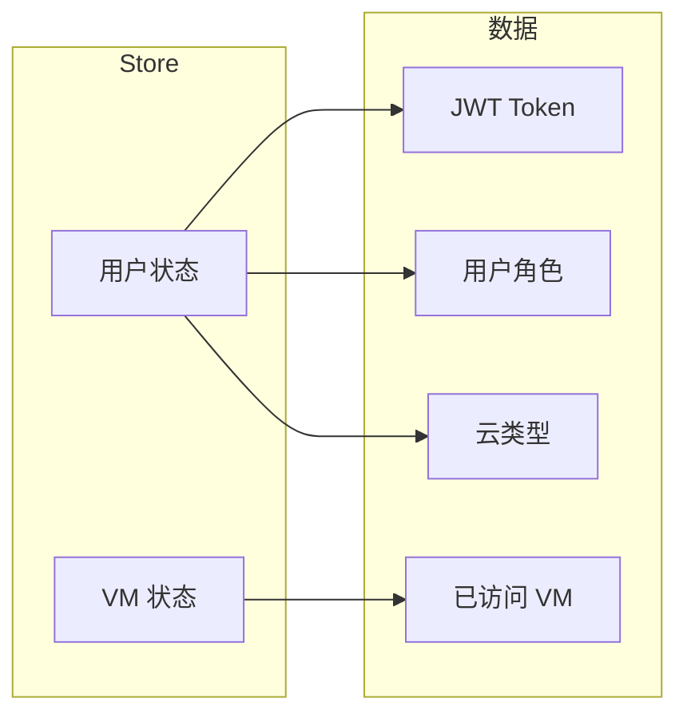

## 数据库设计

### 核心数据表

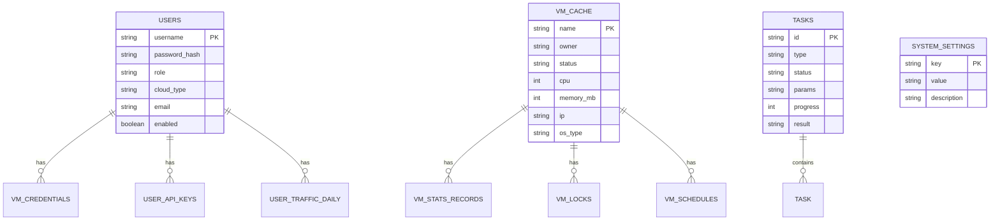

### 数据表说明

| 表名 | 用途 |
|------|------|
| `users` | 用户账户信息 |
| `vm_cache` | 虚拟机信息缓存 |
| `tasks` | 异步任务记录 |
| `system_settings` | 系统配置项 |
| `vm_credentials` | VM 登录凭据 |
| `vm_locks` | VM 锁定状态 |
| `vm_schedules` | VM 定时任务 |
| `storage_pools` | 存储池配置 |
| `network_bridges` | 网桥配置 |
| `vpc_switches` | VPC 交换机 |
| `vpc_security_groups` | 安全组 |

## 任务队列系统

### 架构设计

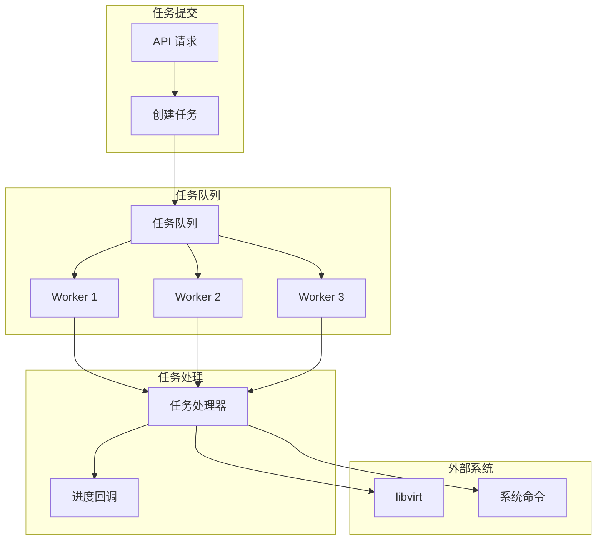

### 支持的任务类型

| 任务类型 | 说明 | 可取消 |
|---------|------|--------|
| `clone` | 虚拟机克隆 | ✅ |
| `linked_clone` | 原生链式克隆 | ✅ |
| `batch` | 批量克隆 | ✅ |
| `create` | 普通创建 VM | ✅ |
| `reinstall` | 重装系统 | ❌ |
| `delete` | 删除 VM | ❌ |
| `snapshot` | 快照操作 | ❌ |
| `migration` | VM 迁移 | ❌ |
| `import` | 导入 VM | ✅ |
| `export` | 导出 VM | ✅ |
| `template` | 模板操作 | ❌ |

### 任务生命周期

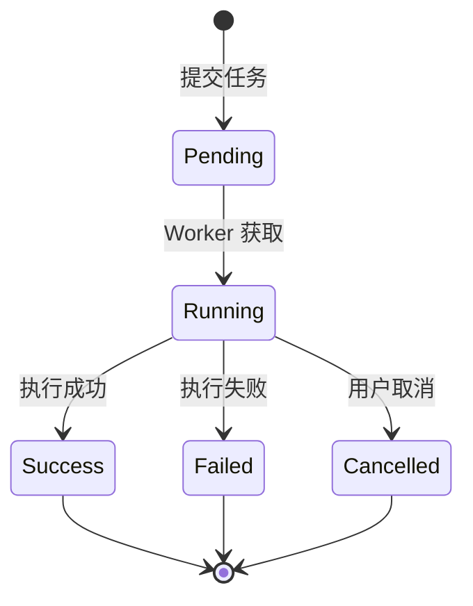

## 虚拟化集成

### libvirt 交互

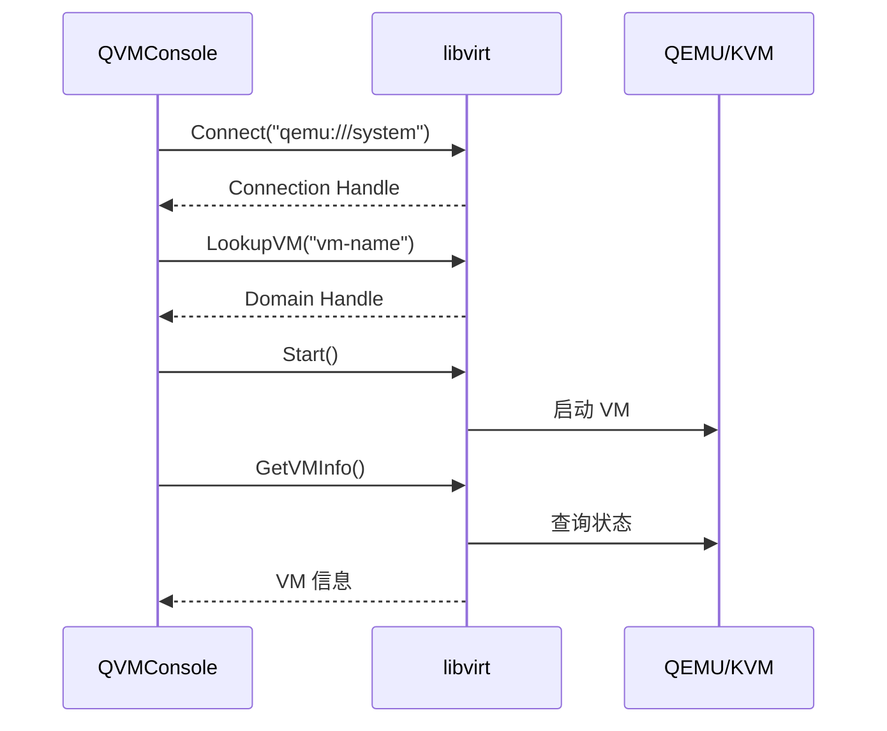

### 支持的虚拟化操作

| 操作 | libvirt API | 说明 |
|------|-------------|------|
| 创建 VM | `DefineXML` + `Create` | 定义并启动 |
| 关机 | `Shutdown` / `Destroy` | 正常/强制关机 |
| 暂停 | `Suspend` | 暂停 VM |
| 恢复 | `Resume` | 恢复运行 |
| 快照 | `SnapshotCreateXML` | 创建快照 |
| 迁移 | `MigrateToURI` | 跨节点迁移 |
| 克隆 | `DefineXML` + 磁盘复制 | 克隆 VM |

## 安全机制

### 认证流程

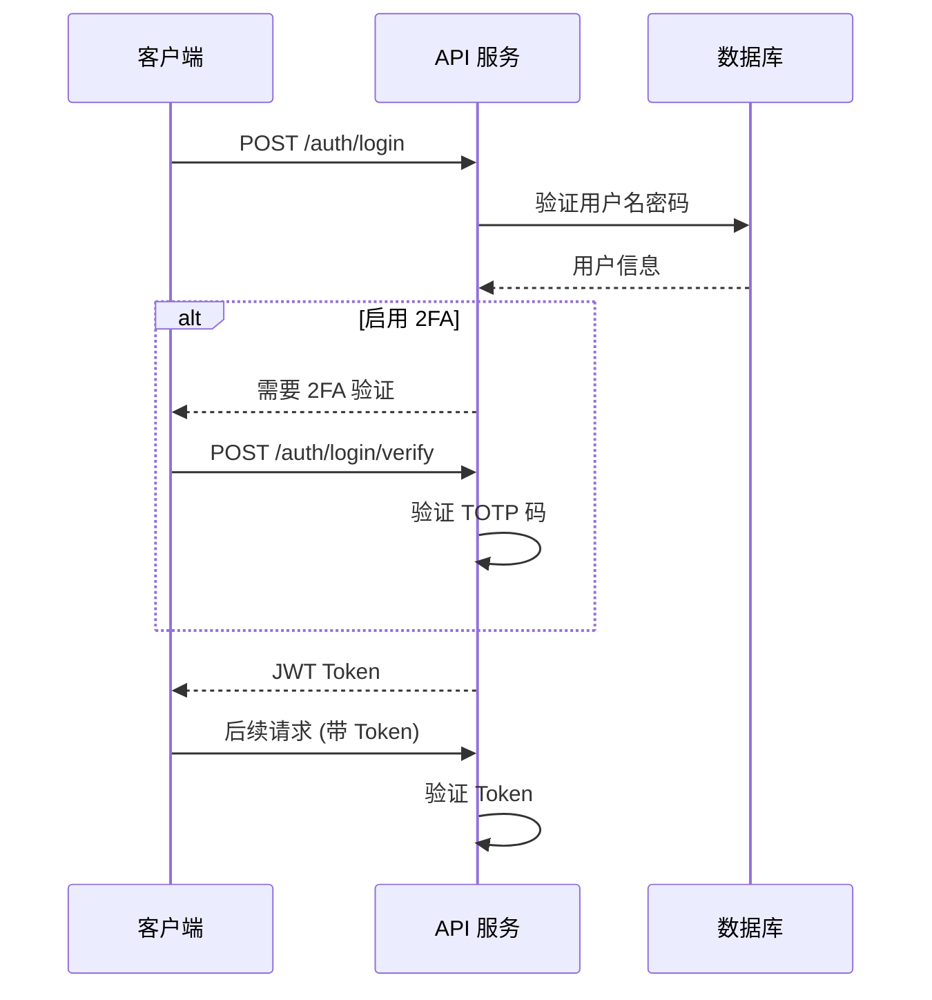

### 权限控制

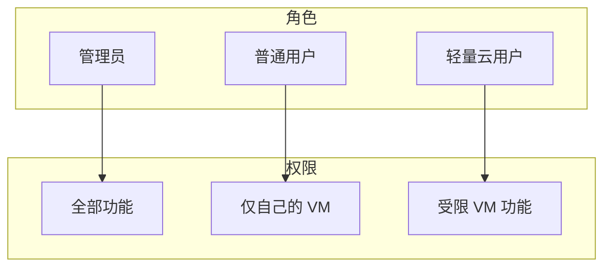

### 高风险操作二次验证

| 操作 | 验证方式 |
|------|----------|
| 删除 VM | TOTP/邮箱验证码 |
| 重置密码 | TOTP/邮箱验证码 |
| 导出 VM | TOTP/邮箱验证码 |
| 修改系统设置 | TOTP/邮箱验证码 |
| 删除用户 | TOTP/邮箱验证码 |

## SSE 实时推送

QVMConsole 使用 Server-Sent Events 实现实时数据推送：

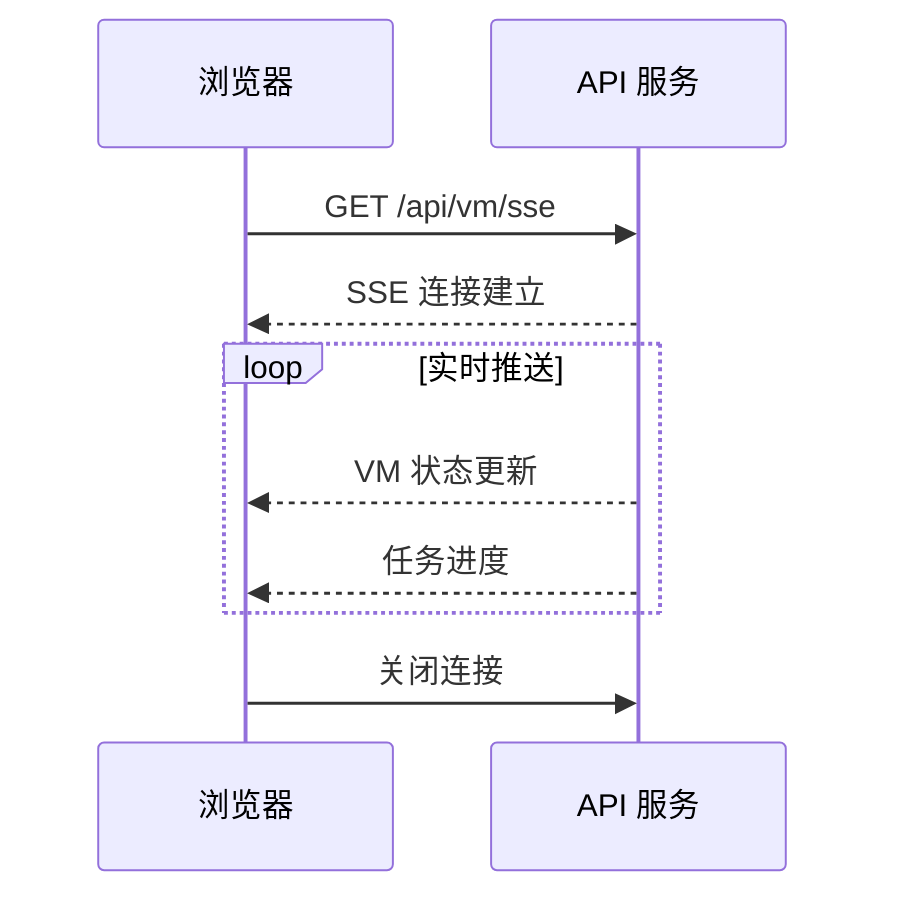

### SSE 端点

| 端点 | 推送内容 |
|------|----------|
| `/api/vm/sse` | VM 列表状态 |
| `/api/vm/:name/sse` | 单个 VM 详情 |
| `/api/host/stats/sse` | 宿主机资源 |
| `/api/task/sse` | 任务进度 |
| `/api/scheduler/events/sse` | 调度事件 |

## 部署架构

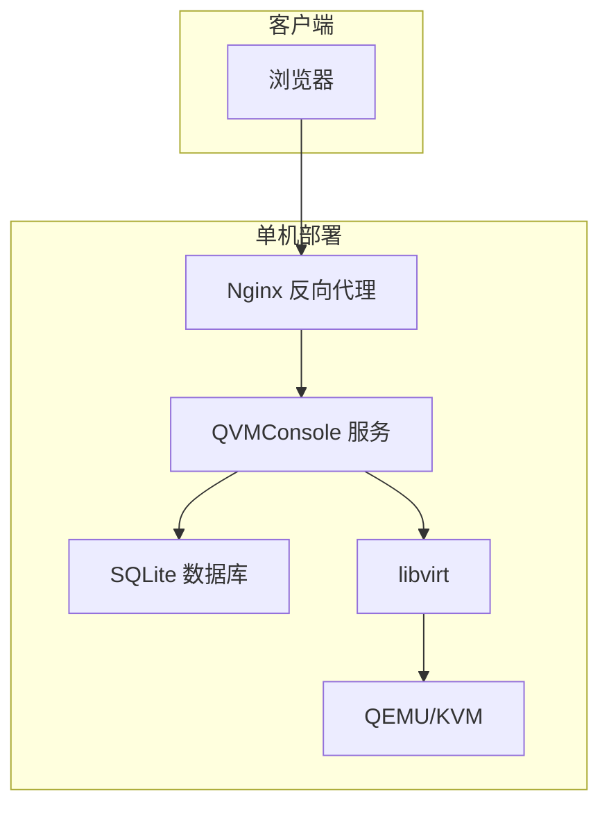

### 生产环境配置

| 组件 | 配置 |
|------|------|
| Web 服务器 | Nginx (反向代理 + SSL) |
| 应用服务 | QVMConsole (systemd) |
| 数据库 | SQLite (本地文件) |
| 虚拟化 | libvirt + QEMU/KVM |
| 前端 | 静态文件 (Nginx 托管) |
