# QVMConsole 架构设计

QVMConsole 是一款面向企业与云服务场景的开源虚拟机管理平台，围绕 KVM/QEMU 虚拟化进行深度集成。本文档全面展示程序的技术架构、分层设计、核心组件和实现细节。

## 整体架构

QVMConsole 采用经典的三层架构设计，将系统分为表现层、业务层和数据访问层，通过依赖注入实现松耦合。


## 后端架构

### 技术栈

| 组件 | 技术 | 说明 |
|------|------|------|
| 语言与运行时 | Go 1.26 | 编译型语言，单二进制部署 |
| Web 框架 | Gin v1.12 | 高性能 HTTP 框架，支持中间件链 |
| 虚拟化 API | go-libvirt（digitalocean/go-libvirt） | 通过 UNIX Socket `/var/run/libvirt/libvirt-sock` 与 libvirt 守护进程通信的 RPC 客户端 |
| 数据库 | SQLite + GORM v1.31 | 轻量级嵌入式数据库，WAL 模式、自动迁移与兼容性修复 |
| 任务队列 | 自研 | 基于 goroutine + 有界 channel 的异步任务系统，支持进度回调和 SSE 推送 |
| WebSocket | gorilla/websocket v1.5 | VNC WebSocket 代理等场景 |
| 认证 | JWT（HS256）+ TOTP | 会话指纹、会话指纹绑定与多类型令牌 |
| 日志 | slog + lumberjack v2.2 | 分类日志文件、按大小与日期轮转 |
| 网络虚拟化 | Open vSwitch | VLAN 隔离、OpenFlow 流表、端口安全与 TC/QoS 限速 |

### 目录结构

```
server/
├── main.go                  # 程序入口：启动流程编排、任务处理器注册
├── compatibility_command.go # system-compatibility-check 子命令（系统兼容性 CLI 检查）
├── config/                  # 配置管理（环境变量 > 数据库 > 默认值）
│   └── config.go
├── router/                  # 路由定义、全局中间件注册、前端静态文件服务
│   └── router.go
├── handler/                 # HTTP 请求处理层（按域划分）
│   ├── auth.go / api_key.go / password_breach.go / security_helper.go
│   ├── user.go / user_self.go / settings.go / version.go / host.go
│   ├── vm.go / vm_create.go / vm_sse.go / vm_schedule.go / vm_rescue.go
│   ├── vm_independent.go / vm_passthrough.go / vm_lock.go
│   ├── vm_appliance.go / vm_export_import.go / linked_clone.go
│   ├── clone.go / snapshot.go / disk.go / vnc.go / spice.go / share.go
│   ├── network.go / network_bridge.go / network_diagnostics.go
│   ├── vpc.go / port_security.go / ovs_diagnostics.go / public_ip.go
│   ├── firewall.go / storage_pool.go / template.go / template_transfer.go
│   ├── upload_chunk.go / task.go / scheduler.go / diagnostics.go
│   ├── node_migration.go / types.go / helpers.go
├── middleware/              # 中间件链
│   ├── auth.go              # JWT / API Key 认证与角色中间件
│   ├── fingerprint.go       # 会话指纹（IP 前缀 + User-Agent 哈希）
│   ├── cors.go              # CORS 跨域
│   ├── request_logger.go / request_filter.go / request_guard.go
│   ├── ratelimit.go / security_headers.go
├── model/                   # 数据模型（GORM 实体，28 张表 + 内存任务模型）
│   ├── db.go                # 数据库初始化、自动迁移、版本兼容修复
│   ├── user.go / user_api_key.go / user_traffic_daily.go
│   ├── vm_cache.go / vm_lock.go / vm_schedule.go / vm_stats_record.go / vm_credential.go
│   ├── storage_pool.go / public_ip.go / vpc.go / network_bridge.go
│   ├── task.go              # 任务模型与全部任务类型常量（纯内存，不落库）
│   ├── upload_session.go / scheduler_event.go / host_node.go / host_stats_record.go
│   ├── auth_action_token.go / security_challenge.go / system_setting.go
│   ├── lightweight_cloud.go / lightweight_vm_registration.go
│   └── port_forward_ip.go
├── service/                 # 业务逻辑层（按域分包）
│   ├── vm/                  # 虚拟机（创建/生命周期/缓存/详情/统计/独立化/密码重置/快照联动）
│   │   ├── create.go / lifecycle.go / runtime.go / list.go / detail.go / stats.go
│   │   ├── cpu.go / cpu_affinity.go / cpu_topology.go / cpu_limit.go
│   │   ├── memory/ # 动态内存（balloon / virtio-mem）配置与调度器
│   │   ├── migration/ # 跨节点整机迁移（预检/评估/执行/接管/锁）
│   │   ├── vmimport/ # 导入虚拟机组装
│   │   └── disk_migration.go 等 # 本机磁盘迁移、磁盘用量缓存等
│   ├── vm_xml/              # 域 XML 装配与规范化（显示/引导/Guest Agent/SMBIOS 等）
│   ├── clone/               # 克隆、批量克隆、重装、删除、Linux/Windows/OpenWrt/FnOS 初始化
│   ├── template/            # 模板元数据、树形结构、制作/上传/导入导出、Linux 依赖预处理
│   ├── snapshot/            # 内部/外部快照、NVRAM、overlay、锁、配额
│   ├── network/             # 端口转发、静态 IP、端口转发持久化与配额
│   │   ├── vpc/ bridge/ portsecurity/ diagnostics/
│   ├── firewall/            # 宿主机 UFW 防火墙 + KVM nftables 防火墙
│   ├── bandwidth/           # 全局/VM/OVS 带宽限速（TC 与 OVS QoS）
│   ├── ovs/                 # Open vSwitch 集成（网络/DHCP/静态主机/诊断）
│   ├── public_ip/           # 公网 IP 1:1 NAT/经典网络-路由/经典网络-桥接
│   ├── storage/             # 存储池（pool）、磁盘（disk）、配额（quota）与 IOPS
│   ├── share/               # 9p 共享目录
│   ├── spice/ vnc/          # SPICE / VNC 控制台
│   ├── scheduler/           # 调度事件中心
│   ├── rescue/              # 救援系统
│   ├── lightweight/         # 轻量云开通、配额与流量
│   ├── user/                # 用户、配额、SSH、存储
│   ├── security/            # JWT 密钥、令牌、TOTP、密码强度、SMTP、登录限流、密码泄露
│   ├── guest_agent/         # QEMU Guest Agent 通信
│   ├── guest_automation/    # 来宾内磁盘自动化
│   ├── ip_resolver/         # VM IP 解析
│   ├── libvirt_rpc/         # go-libvirt RPC 封装（单例连接与自动重连）
│   ├── arch/                # 架构探测（x86_64 / aarch64）与机型注册
│   ├── upload/              # 分片上传引擎（秒传/断点续传/抽样哈希）
│   ├── traffic/             # 流量配额与月度重置
│   ├── appliance/           # OVF/OVA 虚拟机包解析与导出
│   ├── compatibility/ diagnostics/ host/
│   └── *_register.go / *_wire.go # 根包 ↔ 子包依赖注入适配（init 期装配）
├── taskqueue/               # 任务队列内核
│   └── queue.go             # 任务提交/分发/执行/SSE 广播/自动清理
├── logger/                  # 分类日志（app/request/cmd/libvirt）与轮转
└── utils/                   # 工具函数（命令执行、文件系统、进程）
```

### 启动流程

后端启动流程严格按照依赖顺序执行（`server/main.go`）：

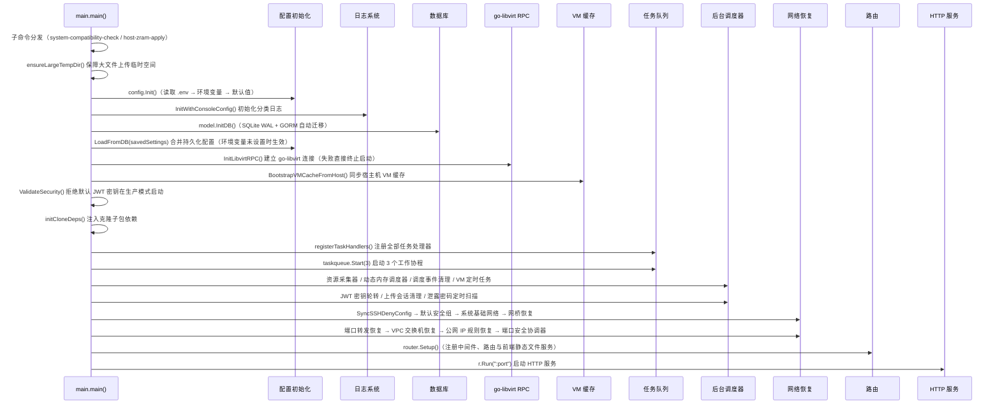

:::info 启动子命令
可执行文件还支持两个子命令：`system-compatibility-check`（独立执行系统兼容性检查，输出报告并以状态码区分结果）和 `host-zram-apply`（应用持久化的 zRAM 配置后直接退出，供 systemd 在面板主服务之前调用）。
:::

### 分层架构设计

系统采用严格的三层架构，各层职责明确：

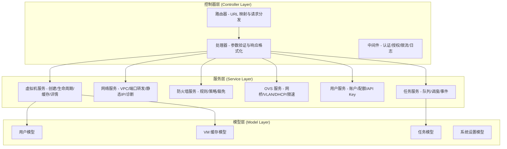

### 中间件链

全局中间件按顺序执行，形成处理管道；路由组内再叠加认证与授权中间件：

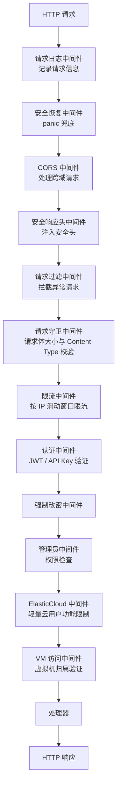

| 中间件 | 功能 | 应用范围 |
|--------|------|----------|
| `RequestLoggerMiddleware` | 记录请求路径、方法、状态码、耗时、来源 IP 与用户，按状态码分级输出 | 全局 |
| `SafeRecoveryMiddleware` | panic 兜底，避免单个请求导致进程退出 | 全局 |
| `CORSMiddleware` | 处理跨域请求；开发模式或未配置白名单时允许所有来源 | 全局 |
| `SecurityHeadersMiddleware` | 注入 nosniff、DENY、Referrer-Policy、Permissions-Policy 等安全头；API 响应禁用缓存；页面响应附加 CSP | 全局 |
| `RequestFilterMiddleware` | 过滤危险路径模式、扫描器探测路径、超长参数与请求体中的危险内容 | 全局（可配置开关） |
| `RequestGuardMiddleware` | 请求体大小限制（默认 2MB，大文件上传路径豁免）与 Content-Type 强制校验 | 全局 |
| `RateLimitMiddleware` | 按 IP 滑动窗口限流（公开接口默认 20 次/分钟，认证后接口默认不限），超限返回 429 | 全局 |
| `AuthMiddleware` | JWT 令牌 / API Key 双通道验证，注入用户身份，校验会话指纹与用户状态 | 需要认证的接口 |
| `JWTTokenTypeMiddleware` | 仅接受指定类型的 JWT（如仅 `access`/`bootstrap`），用于账户安全流程 | 安全初始化等接口 |
| `ForcePasswordChangeMiddleware` | 强制要求修改初始/重置密码后才能继续访问 | 需要认证的接口 |
| `AdminMiddleware` | 管理员权限验证 | 管理员接口 |
| `ElasticCloudOnlyMiddleware` | 轻量云用户功能限制 | 弹性云专属功能 |
| `VMAccessMiddleware` | 虚拟机归属权限验证（基于 VM 访问目录文件） | VM 操作接口 |

### 依赖注入机制

服务层通过手工实现的 `Deps` 容器实现子包与根包之间的解耦，避免循环 import：

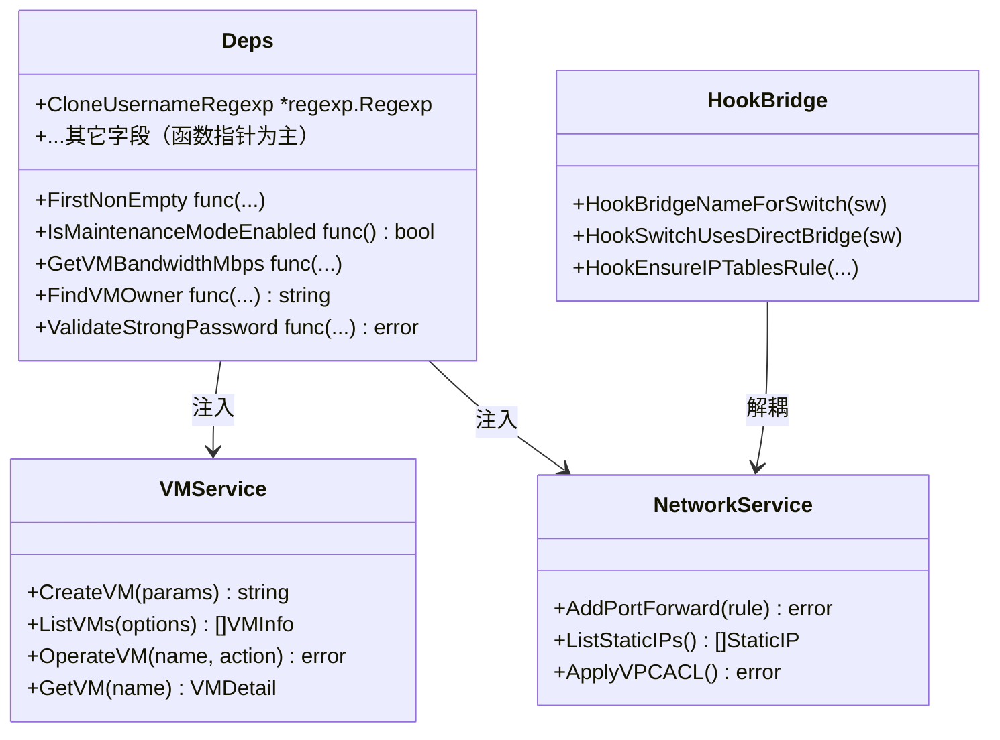

**依赖关系特点**：

| 特点 | 说明 |
|------|------|
| **Deps 容器** | 每个子包（`vm`、`clone`、`template`、`snapshot` 等）定义一个 `Deps` 结构体，承载其所需的外部依赖（多为函数指针） |
| **手工注入** | `main.go` 启动时调用 `InitDeps(&Deps{...})` 一次性注入到子包的包级变量 `D`；另有 `init()` 期注册的 `hooks.go` 钩子（VPC、迁移、快照、内存）完成横切装配 |
| **循环 import 规避** | 子包通过 `D.XXX()` 反向调用根包函数，避免根包反向 import 子包造成的循环 |
| **Hook 接口** | 横切关注点（如网桥名、iptables 规则、状态查询）通过 Hook 函数隔离，运行时由适配层注册 |

### 请求处理流程

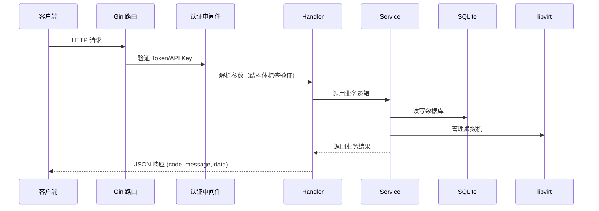

### API 路由结构

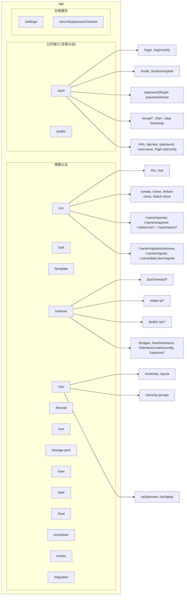

接口清单的完整说明请参阅 [API 接口与安全调用](/docs/tech/user-manage/api-console-auth)；前端「接口文档」页会在构建时从 `router.go` 与 handler 源码自动生成全量接口列表。

## 前端架构

### 技术栈

| 组件 | 技术 | 说明 |
|------|------|------|
| 框架 | React 19 + TypeScript 6 | 组件化框架，TypeScript 强化类型安全 |
| 构建工具 | Vite 8 | 下一代前端构建工具，支持热更新；开发环境代理 `/api` 至后端 |
| 状态管理 | Zustand 5 | 轻量级状态管理库，支持 localStorage 持久化 |
| UI 组件库 | Semi Design | 字节跳动企业级组件库（@douyinfe/semi-ui 2.101+） |
| HTTP 客户端 | Axios | 基于 Promise 的 HTTP 库，支持拦截器 |
| 路由 | react-router 8 | 数据路由 API（`createBrowserRouter` + `RouterProvider`），全站懒加载 |
| 图表 | ECharts 6 | 监控数据可视化 |
| 终端 | @xterm/xterm | 虚拟机终端控制台 |
| VNC | @novnc/novnc | 基于 RFB 协议的远程控制台客户端 |
| 其它 | spark-md5 / qrcode / nprogress | 分片上传哈希、TOTP 二维码、请求进度条 |

### 目录结构

```
web/src/
├── main.tsx              # 程序入口
├── App.tsx               # 根组件（挂载全局高风险验证弹窗等）
├── config/               # 全局配置
│   ├── constants.ts      # API 基础地址、存储键、登录阶段常量
│   ├── nav.tsx           # 管理员/普通用户导航菜单树
│   └── site.ts           # 公共站点信息同步与文档标题
├── api/                  # API 接口定义（按域拆分，统一 client.ts 请求层）
│   ├── client.ts         # 全局 Axios 封装（拦截器/428 二次验证重试）
│   ├── auth.ts / vm.ts / network.ts / vpc.ts / firewall.ts
│   ├── storage.ts / storagePool.ts / publicIp.ts / ovs.ts
│   ├── user.ts / task.ts / scheduler.ts / settings.ts / template.ts
│   ├── host.ts / node.ts / migration.ts / infra.ts / passwordBreach.ts
│   └── apiKey.ts
├── components/           # 公共组件
│   ├── business/         # HighRiskChallengeModal、TaskDetailSheet、TaskMessage
│   └── common/           # PreviewModal 等通用组件
├── features/vm-form/     # 创建/编辑虚拟机共享表单模块
│   ├── CreateVmWizard.tsx / EditVmForm.tsx
│   ├── sections/         # 表单分区组件（基础/硬件/存储/网络/直通/模板/应用导入等）
│   └── dialogs/          # 各类配置弹窗（磁盘/内存/网卡/直通/XML/SMBIOS/RTC 等）
├── hooks/                # 自定义 Hooks（VM 列表/详情、宿主机 SSE、主题、媒体查询、Modal 生命周期、内存优化）
├── layout/               # 布局组件
│   ├── index.tsx         # 主布局（Sidebar + TopBar + Outlet + TaskBar + 页面标签注册）
│   └── components/       # Sidebar / TopBar / PageTabsBar / TaskBar / SponsorWidget
├── router/               # 路由配置
│   ├── index.tsx         # 数据路由（createBrowserRouter + RouterProvider）
│   ├── pages.tsx         # 页面懒加载声明
│   └── guards.tsx        # 路由守卫（RequireAuth + 轻量云白名单）
├── stores/               # Zustand 状态管理
│   ├── user.ts           # 用户会话（Token/角色/云类型/安全状态）
│   ├── vm.ts             # VM 列表缓存与最近访问记录
│   ├── task.ts           # 全局任务中心（SSE 增量更新）
│   ├── app.ts            # 主题/侧边栏/站点标题/公共开关
│   ├── highRisk.ts       # 428 高风险挑战状态机
│   └── pageTabs.ts       # 顶部页面标签
├── utils/                # 工具函数
│   ├── clipboard.ts      # 剪贴板操作（含 HTTP 降级）
│   ├── chunkUploader.ts  # 分片上传器（抽样哈希/断点续传/秒传）
│   ├── vnc.ts / validate.ts / download.ts / format.ts
│   ├── confirm.tsx / templateCategory.ts
└── views/                # 页面视图
    ├── dashboard/        # 工作台（管理员/用户双视图）
    ├── vm/               # 虚拟机列表/详情/VNC 独立窗口
    ├── network/ public-ip/ firewall/ storage-pool/ my-storage/
    ├── template/ user/ node/ scheduler/ task/ settings/ security/
    ├── api-docs/         # 接口文档中心（构建时自动生成数据）
    ├── about/ login/ invite/ reset-password/ error/
```

### 请求封装与安全

Axios 拦截器统一处理认证和错误，并在 HTTP 428（高风险二次验证）时自动拉起验证弹窗：

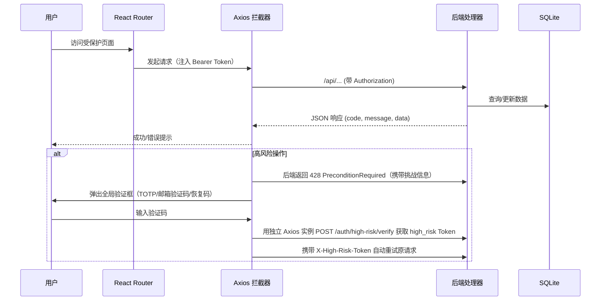

:::info SSE 推送方式
SSE 实时推送**不走 Axios**，前端使用浏览器原生 `EventSource`，通过 URL query 参数携带登录令牌建立连接；Axios 仅处理普通 HTTP 请求。
:::

## 数据库设计

### 存储配置

SQLite 数据库默认位于 `./data/kvm_console.db`（`KVM_DB_PATH` 可配置），连接参数启用 WAl 模式以支持并发读写：`busy_timeout=5000`、`journal_mode=WAL`、`txlock=immediate`。启动时通过 GORM 自动迁移全部数据表，并执行多项版本兼容修复（列迁移、索引重建、默认管理员初始化等）。

### 核心数据表

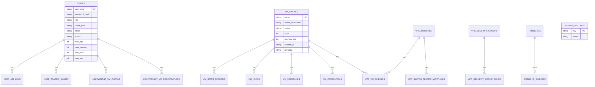

### 数据表说明

任务记录为**纯内存存储**（进程重启后清空），其余 28 张表通过 GORM 自动迁移持久化：

| 表名 | 用途 | 关键字段 |
|------|------|----------|
| `users` | 用户账户与配额 | username, password_hash, role, cloud_type, status, 配额字段（max_cpu/max_memory/max_disk/max_vm/max_storage/max_runtime_hours/max_port_forwards/max_snapshots/max_public_ips/带宽/流量） |
| `user_api_keys` | API Key 凭证（哈希存储） | api_key_id, key_hash, key_prefix, revoked_at |
| `user_traffic_dailies` | 用户日流量统计与限速标记 | username, date, traffic_down/up, is_limited_down/up |
| `vm_caches` | 虚拟机列表缓存投影（与宿主机实时同步） | name, owner_username, status, vcpu, memory_mb, cached_ip, template, group_name |
| `vm_credentials` | 虚拟机登录凭据（加密） | vm_name, username, password_enc, source |
| `vm_locks` | VM 操作锁 | vm_name, locked, locked_by |
| `vm_schedules` | VM 定时任务 | vm_name, event_type, action, schedule_type, run_at, next_run_at |
| `vm_stats_records` | VM 历史监控数据 | vm_name, cpu_percent, mem_used, net_rx/tx, disk_rd/wr, recorded_at |
| `host_stats_records` | 宿主机历史监控数据 | cpu_percent, mem_used/total, net/disk 累计字节, recorded_at |
| `tasks` | 异步任务（内存，不落库） | type, status, progress, params, result, created_by |
| `system_settings` | 系统配置键值对 | key, value |
| `upload_sessions` | 分片上传会话（秒传/断点续传） | file_path（主键）, file_hash, received_bmp, status, expires_at |
| `storage_pools`（host_storage_pools） | 存储池管理配置 | device_id, display_name, enabled, is_default, mount_path |
| `network_bridges` | 宿主机网桥 | name, mode (nat/bridge), uplink_if, host_addrs, host_gateway, host_dns |
| `port_forward_ips` | 端口转发手动 IP 映射 | vm_name, ip |
| `vpc_switches` | VPC 交换机 | name, bridge_name, vlan_id, cidr, gateway_ip, dhcp_start/end, 安全策略与配额字段 |
| `vpc_security_groups` | 安全组 | username, vm_name, name, is_default |
| `vpc_security_group_rules` | 安全组规则 | direction, protocol, port_start/end, target_type, target_value |
| `vpc_vm_bindings` | VM 与交换机/安全组绑定（支持多网卡 interface_order） | vm_name, switch_id, security_group_id, interface_order, nic_model |
| `vpc_switch_traffic_monthlies` | 交换机月流量统计 | switch_id, month, traffic_down/up, is_limited_down/up |
| `public_ips` | 公网 IP 资源池 | ip, cidr, gateway, uplink_if, supported_modes, status |
| `public_ip_bindings` | 公网 IP 绑定关系 | public_ip_id, username, vm_name, vm_private_ip, mode, runtime_status |
| `host_nodes` | 多节点主机（API 与 SSH 凭据加密存储） | name, api_base_url, ssh_host/port/user, status |
| `scheduler_events` | 调度事件日志 | scheduler_key, vm_name, status, trigger_reason, started_at |
| `auth_action_tokens` | 一次性操作令牌（邮箱验证等） | user_id, purpose, token_hash, expires_at |
| `security_challenges` | 二次验证挑战（TOTP/邮箱/恢复码） | user_id, purpose, method, code_hash, expires_at |
| `lightweight_vm_quotas` | 轻量云 VM 级配额 | vm_name, traffic/bandwidth/port_forwards/snapshots/runtime |
| `lightweight_vm_traffic_monthlies` | 轻量云 VM 月流量 | vm_name, month, traffic_down/up |
| `lightweight_vm_registrations` | 轻量云待确认开通注册 | username, vm_name, template, clone_mode, status |

### 配置优先级

系统配置按以下优先级加载：

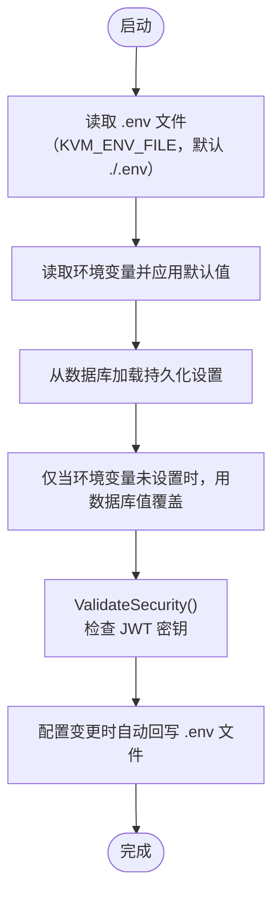

**优先级顺序**：环境变量 > 数据库持久化设置 > 默认值。密钥类配置（如安全密钥）首次为空时会自动生成并回写 `.env`。

## 任务队列系统

### 架构设计

任务队列采用"生产者-消费者"模型，结合 SSE 实现前端实时进度推送：

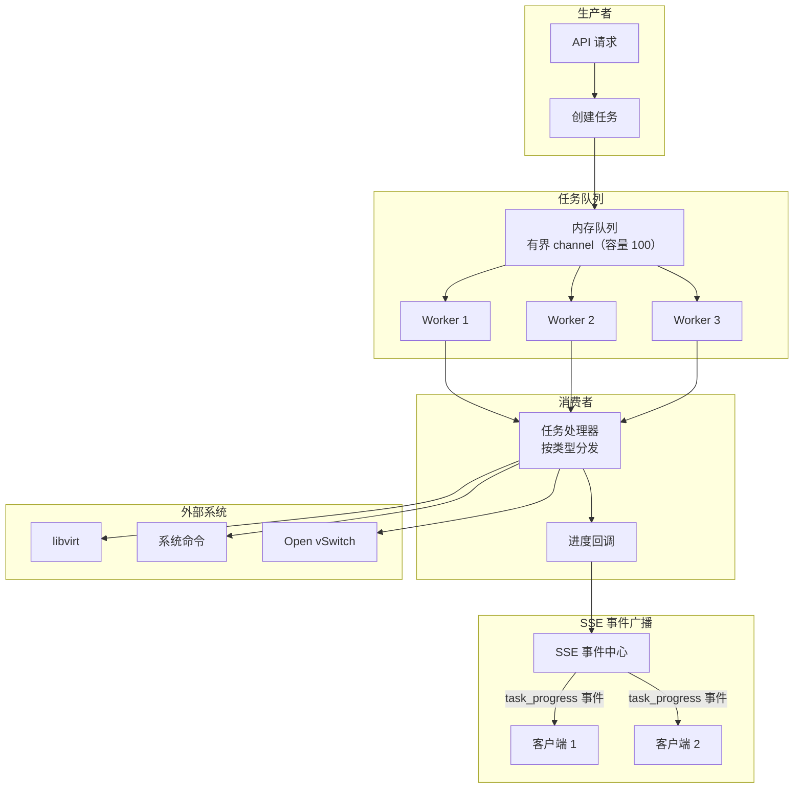

### 任务生命周期

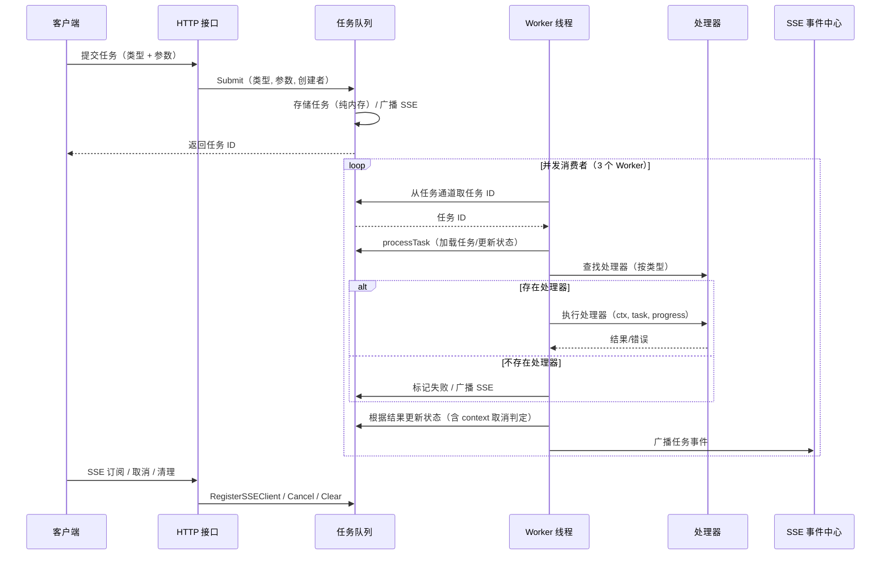

### 取消与清理语义

| 行为 | 说明 |
|------|------|
| **取消** | `pending` 任务直接置为 `canceled`；`running` 任务触发 context 取消，由执行器收敛为 `canceled`；权限上管理员可取消任意任务，普通用户仅能取消自己的任务 |
| **参数脱敏** | 任务列表返回前自动把 password/token/secret/private_key/credential 等键替换为 `******` |
| **自动清理** | 每小时清理一次创建超过 24 小时且已结束的任务；任务数据不持久化，服务重启后清空 |
| **防重复** | 同一 VM/资源已有活跃任务时（如迁移、重装、密码泄露扫描），重复提交会被拒绝 |

### 支持的任务类型

系统共定义 50 种任务类型（`server/model/task.go`），按域分组如下：

| 分组 | 任务类型 |
|------|----------|
| **虚拟机生命周期** | `create`（普通创建）、`delete`（删除）、`reinstall`（重装系统）、`make_vm_independent`（链式克隆转独立） |
| **克隆** | `clone`（链式克隆）、`linked_clone`（原生链式克隆）、`batch`（批量克隆） |
| **模板** | `prepare`（制作模板）、`template_export`（导出模板）、`template_import`（导入模板）、`template_linux_prepare`（预处理已导入 Linux 模板）、`delete_template`（删除模板） |
| **快照** | `snapshot`（快照操作） |
| **迁移** | `vm_migrate`（跨节点迁移虚拟机）、`vm_disk_migrate`（本机迁移虚拟机硬盘） |
| **导入导出** | `export`（导出虚拟机）、`import`（导入虚拟机）、`import_appliance`（导入 OVF/OVA 虚拟机包）、`import_disk`（管理员绝对路径导入磁盘建机）、`import_disk_attach`（导入磁盘挂载到已有 VM）、`disk_transfer`（磁盘转移到用户存储） |
| **磁盘** | `vm_disk_resize`（磁盘与来宾文件系统扩容）、`vm_disk_provision`（创建/关联磁盘并配置来宾挂载）、`vm_disk_guest_mount`（重试来宾磁盘挂载或扩容） |
| **用户** | `deleteuser`（删除用户含资产清理）、`disable_user`（封禁用户并关闭其资源）、`runtime_quota_shutdown`（运行时长配额耗尽关机）、`lightweight_runtime_quota_shutdown`（轻量云单 VM 运行时长配额耗尽关机）、`lightweight_vm_provision`（轻量云注册 VM 开通） |
| **网络与防火墙** | `apply_firewall` / `disable_firewall` / `rollback_firewall`（KVM 防火墙应用/禁用/回滚）、`update_firewall_geoip`（GeoIP 数据更新）、`enable_host_firewall` / `disable_host_firewall`（宿主机防火墙启停）、`ovs_repair`（OVS 网络修复）、`port_security`（端口安全启停/协调/隔离）、`public_ip_apply`（公网 IP 绑定/解绑/迁移）、`network_capture`（VM 网络抓包诊断） |
| **存储** | `storage_format`（格式化挂载硬盘）、`storage_create_partition`（创建分区）、`storage_delete_partitions`（删除分区）、`storage_create_lvm_volume` / `storage_delete_lvm_volume`（LVM 卷创建/删除） |
| **控制台与安全** | `rescue`（救援系统）、`reset_vm_password`（重置来宾虚拟机密码）、`vm_schedule_action`（定时任务动作执行）、`password_breach_scan`（泄露密码扫描）、`password_breach_notify`（泄露密码通知）、`enter_maintenance_mode` / `exit_maintenance_mode`（维护模式启停） |

### 任务状态

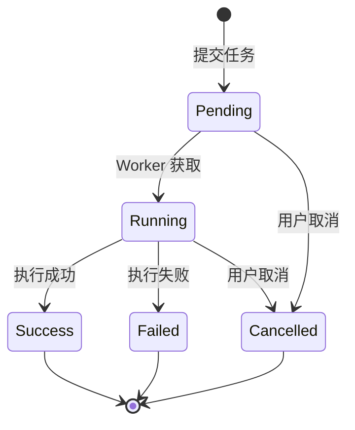

## 虚拟化集成

### libvirt 交互

QVMConsole 通过 go-libvirt 与 libvirt 守护进程通信，采用单例连接模式：

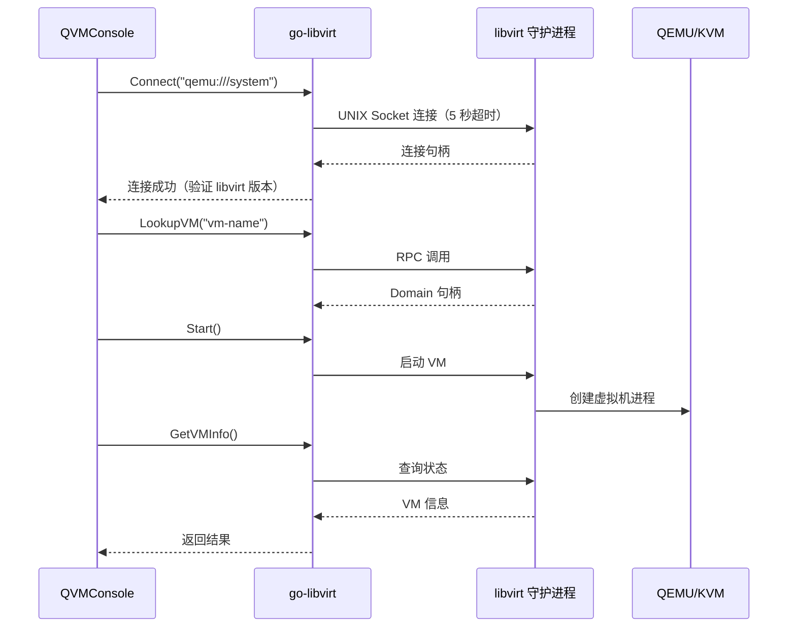

**连接特性**：
- 单例连接：全局共享一个 libvirt 连接，降低连接成本
- 自动重连：连接断开时按 1s/2s/4s 退避最多重试 3 次
- 错误降级：RPC 不可用时自动降级为 virsh 命令行执行
- 启动阻断：启动时 libvirt 连接失败会直接终止启动（`log.Fatal`）

### 支持的虚拟化操作

| 操作 | 实现方式 | 说明 |
|------|----------|------|
| 创建 VM | `DefineXML` / virt-install XML + `Create` | 定义并启动 |
| 开机 | `start` | 受维护模式、迁移锁、VM 锁校验 |
| 关机 | `shutdown` | ACPI 优雅关机，受 VM 锁校验 |
| 强制断电 | `destroy` | 立即停止，受 VM 锁校验 |
| 重启 | `reboot` | ACPI 重启 |
| 重置 | `reset` | 硬重置（相当于按复位键） |
| 快照 | virsh snapshot-* | 创建/恢复/删除，内部与外部快照 |
| 跨节点迁移 | virsh migrate（热）/ rsync + define（冷） | 见 [虚拟机迁移](/docs/tech/feature-analysis/vm-migration) |
| 克隆 | 磁盘复制（完整）/ backing 链（链式） | 见 [模板管理原理](/docs/tech/feature-analysis/template-management) |

## 安全机制

### 认证流程

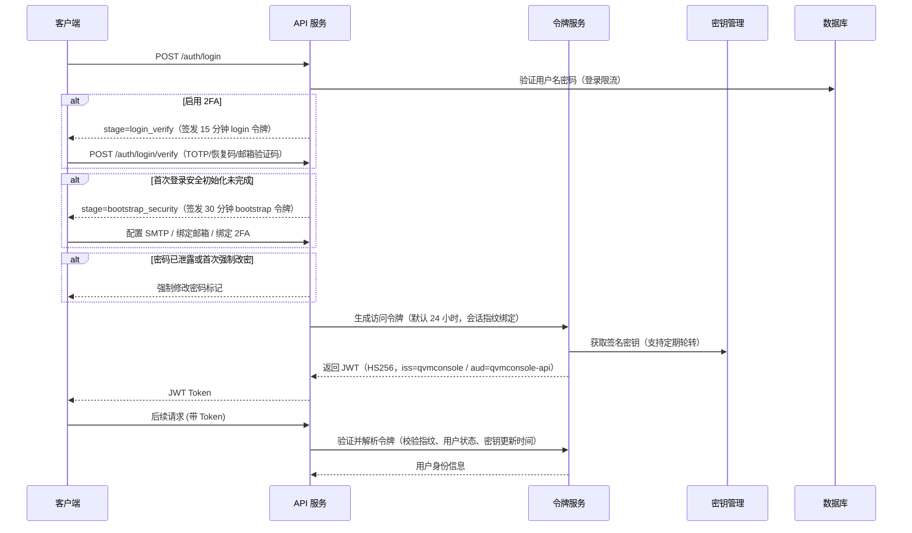

### JWT 令牌类型

| 令牌类型 | 用途 | 有效期 | 说明 |
|---------|------|--------|------|
| **访问令牌（access）** | 常规 API 访问 | `KVM_JWT_EXPIRE_HOURS`（默认 24 小时） | 支持会话指纹绑定，JWT 密钥轮转后旧密钥签发的令牌可被识别失效 |
| **引导令牌（bootstrap）** | 首次登录安全初始化（SMTP/邮箱/2FA） | 30 分钟 | 仅允许访问安全初始化与系统设置类接口 |
| **登录验证令牌（login）** | 二次验证（TOTP/恢复码/邮箱验证码） | 15 分钟 | 仅允许访问登录验证接口 |
| **高风险令牌（high_risk）** | 敏感操作（删除 VM、改密等） | 5 分钟 | 携带操作范围（operation），通过 `X-High-Risk-Token` 请求头使用 |
| **找回密码令牌** | 邮箱验证选择账户 / 重置密码 | 10 分钟 / 15 分钟 | 一次性使用 |

### 权限控制

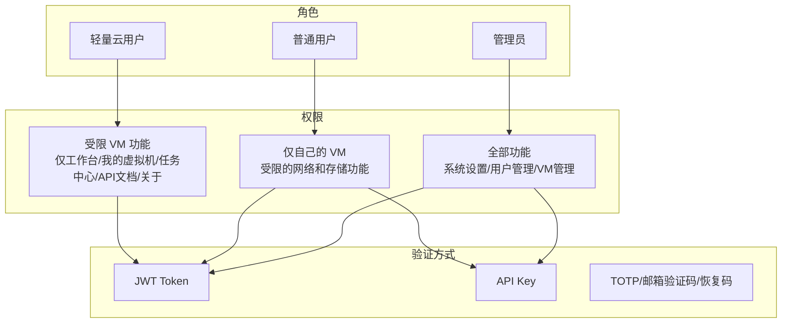

- 管理员：可见全部导航（工作台、虚拟机、模板、网络中心、公网 IP、防火墙、存储池、我的存储、用户管理、节点管理、调度事件、任务中心、系统设置、安全中心、API 文档、关于项目）。
- 普通用户（弹性云）：可见工作台、我的虚拟机、VPC 网络、我的存储、任务中心、安全中心、API 文档、关于项目。
- 轻量云用户：在上述基础上进一步隐藏「网络」与「存储」分组，路由守卫限制只能访问白名单页面。

### 高风险操作二次验证

敏感操作在后端统一要求二次验证，前端收到 HTTP 428 后弹出验证框：

| 操作 | 验证方式 | 说明 |
|------|----------|------|
| 删除/强制删除 VM | TOTP/邮箱验证码/恢复码 | 不可逆操作 |
| 重装系统 | 严格二次验证 | 删除全部快照并重建系统盘 |
| 重置来宾密码 / 修改登录密码 / 修改用户名 | TOTP/邮箱验证码 | 账户与凭据安全 |
| 生成/轮换/撤销 API Key | TOTP/邮箱验证码 | 凭证安全 |
| 绑定邮箱 / 关闭 2FA / 重新生成恢复码 | TOTP/邮箱验证码（部分需当前密码） | 账户安全 |
| 防火墙应用/禁用/回滚、启用宿主机防火墙 | TOTP/邮箱验证码 | 网络策略变更 |
| 公网 IP 绑定/解绑/迁移/应用/删除 | TOTP/邮箱验证码 | 对外暴露变更 |
| 虚拟机迁移、维护模式启停、删除用户等 | TOTP/邮箱验证码 | 高风险基础设施操作 |

:::info 开发模式
系统设置中的「开发环境模式」可绕过二段验证、首次强制绑定与高风险操作验证，仅用于开发调试，生产环境必须关闭。
:::

## SSE 实时推送

QVMConsole 使用 Server-Sent Events 实现实时数据推送，前端基于原生 `EventSource` 携带登录令牌建立连接：

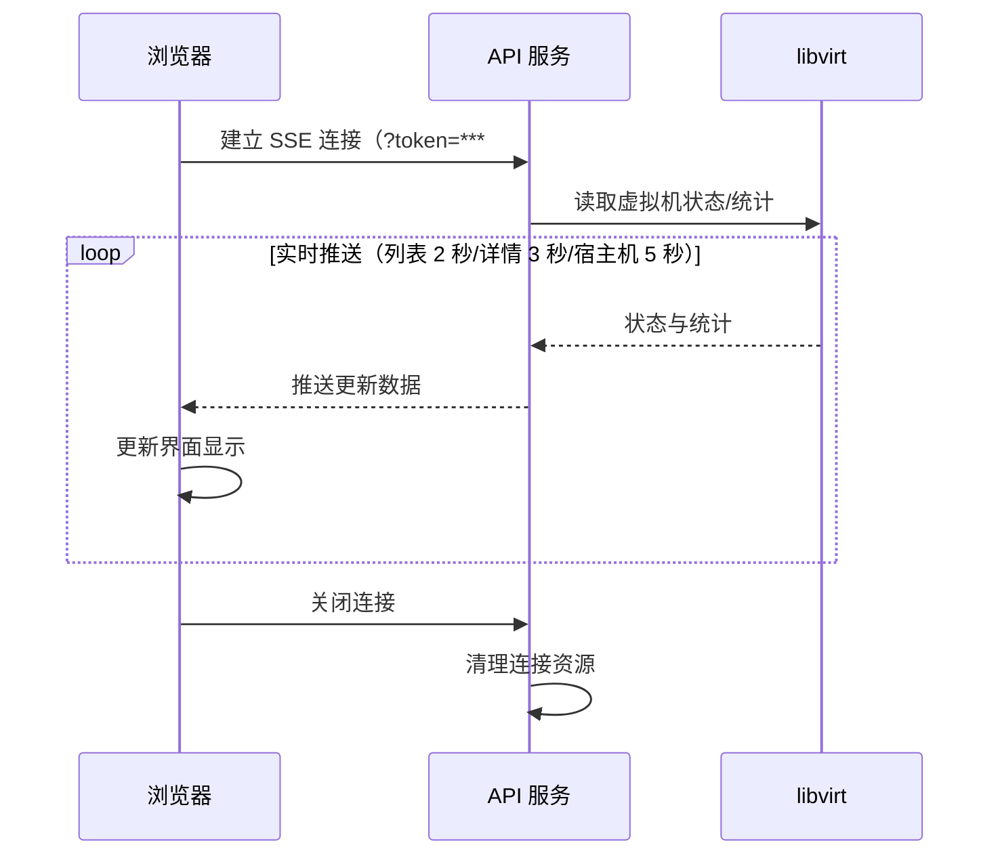

### SSE 端点

| 端点 | 推送内容 | 推送频率 |
|------|----------|----------|
| `/api/vm/sse`、`/api/self/vms/sse` | VM 列表状态（管理员/用户分流） | 2 秒 |
| `/api/vm/:name/sse` | 单个 VM 详情 | 3 秒 |
| `/api/host/stats/sse` | 宿主机资源统计 | 5 秒 |
| `/api/task/sse` | 任务进度（connected + task_progress 事件） | 实时 |
| `/api/scheduler/events/sse` | 调度事件 | 实时 |

**SSE 特性**：
- 实时性：状态变更立即推送，无需轮询
- 低开销：相比轮询方式，减少不必要的网络请求
- 自动重连：前端断线后按固定间隔（5 秒）自动尝试重连
- 权限过滤：任务 SSE 按用户归属过滤任务事件

## 部署架构

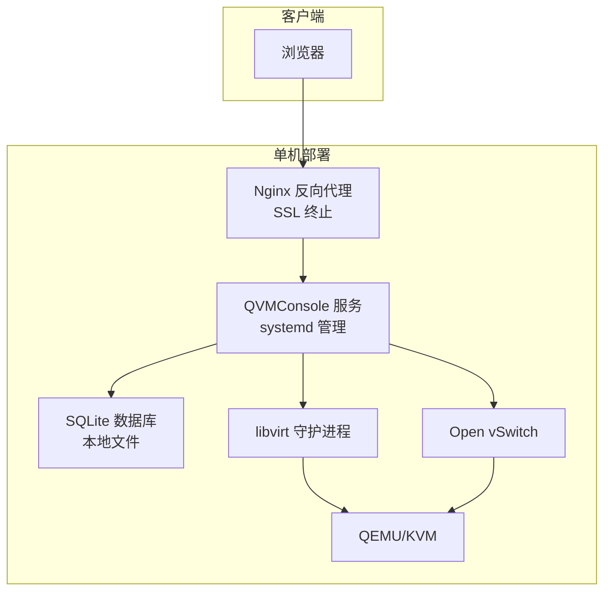

### 生产环境配置

| 组件 | 配置 | 说明 |
|------|------|------|
| Web 服务器 | Nginx | 反向代理 + SSL 终止 |
| 应用服务 | QVMConsole | systemd 管理，开机自启；前端静态文件由后端内嵌服务（`web-dist` 目录）或 Nginx 托管 |
| 数据库 | SQLite | 本地文件，WAL 模式，自动迁移 |
| 虚拟化 | libvirt + QEMU/KVM | UNIX Socket 通信 |
| 网络 | Open vSwitch | VLAN 隔离、流表管理、端口安全 |

## 性能考量

### 缓存策略

| 缓存层次 | 实现方式 | 效果 |
|----------|----------|------|
| VM 缓存 | `vm_caches` 表作为列表投影，后台采集器每 10 秒刷新、60 秒持久化 | 列表接口不阻塞于 libvirt 实时查询 |
| 配置缓存 | 启动时加载到内存，变更时同步数据库与 .env | 减少数据库访问 |
| 前端缓存 | Zustand vm store 缓存列表与最近访问，SSE 增量更新 | 页面切换秒开 |

### 并发处理

- **任务队列**：默认 3 个工作协程，队列容量 100，可根据资源与负载调整
- **libvirt 连接**：单例模式，自动重连，降低连接成本
- **SSE 推送**：异步广播（非阻塞，缓冲区满则丢弃），不阻塞主请求处理

### 网络与存储优化

- 支持 OVS 网络后端、全局带宽总限速与交换机级带宽/流量配额
- 磁盘 IOPS 限制（QEMU throttle）与磁盘迁移工具
- 优先使用 go-libvirt RPC，必要时自动降级为 virsh 命令行

## 故障排查指南

### 启动失败

| 问题 | 症状 | 解决方案 |
|------|------|----------|
| JWT 密钥错误 | 启动时安全检查失败退出 | 生产环境禁止使用默认密钥，通过 `KVM_JWT_SECRET` 设置强密钥 |
| libvirt 连接失败 | 启动直接终止并输出错误 | 确认 libvirtd 服务运行状态与 `/var/run/libvirt/libvirt-sock` 权限 |
| 数据库异常 | 迁移失败或连接错误 | 检查数据库路径和权限（默认 `./data/kvm_console.db`） |

### 运行时问题

| 问题 | 症状 | 解决方案 |
|------|------|----------|
| 认证失败 | 401 Unauthorized | 检查 Token 有效性和服务器时间同步；会话指纹变化（IP/UA 大变）也会导致令牌失效 |
| 权限不足 | 403 Forbidden | 检查用户角色和云类型（轻量云功能受限） |
| 网络异常 | VM 无法上网 | 在网络概览执行一键检测/修复，检查 OVS 网桥和 VPC 配置 |
| 任务卡住 | 任务长时间无进度 | 通过任务中心查看状态，必要时取消重试 |
| 428 二次验证 | 敏感操作被拦截 | 完成 TOTP/邮箱验证码验证后自动重试，或检查 2FA/邮箱绑定状态 |

### 日志定位

- 四类日志文件：`log/app.log`（应用）、`log/request.log`（请求）、`log/cmd.log`（命令执行）、`log/libvirt.log`（libvirt 交互）
- 日志按大小（默认 100MB）与每日 00:00 轮转，默认保留 7 天并压缩归档
- 系统设置页提供日志查看、导出与清理功能
- 使用请求日志中间件追踪请求链路（方法/路径/状态码/耗时/来源 IP）
