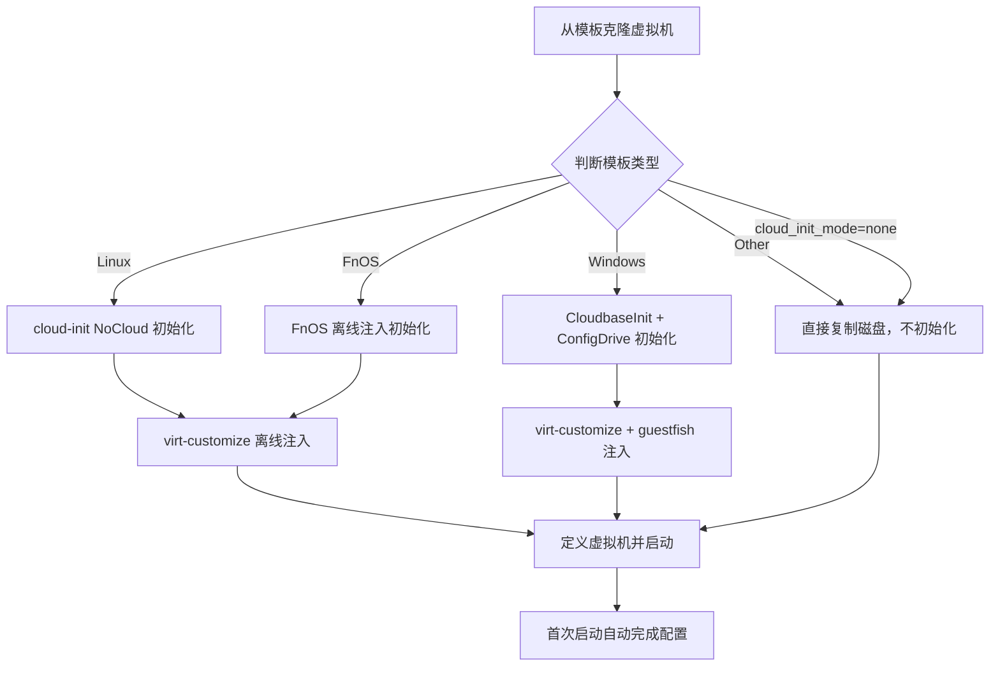
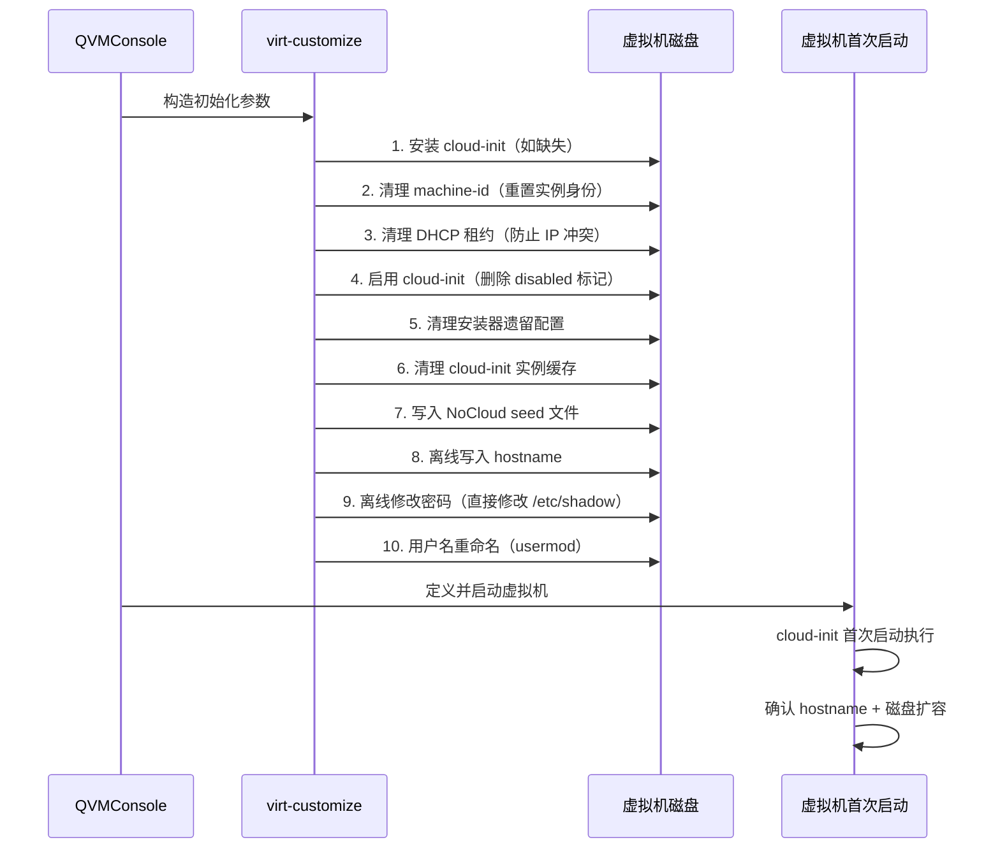
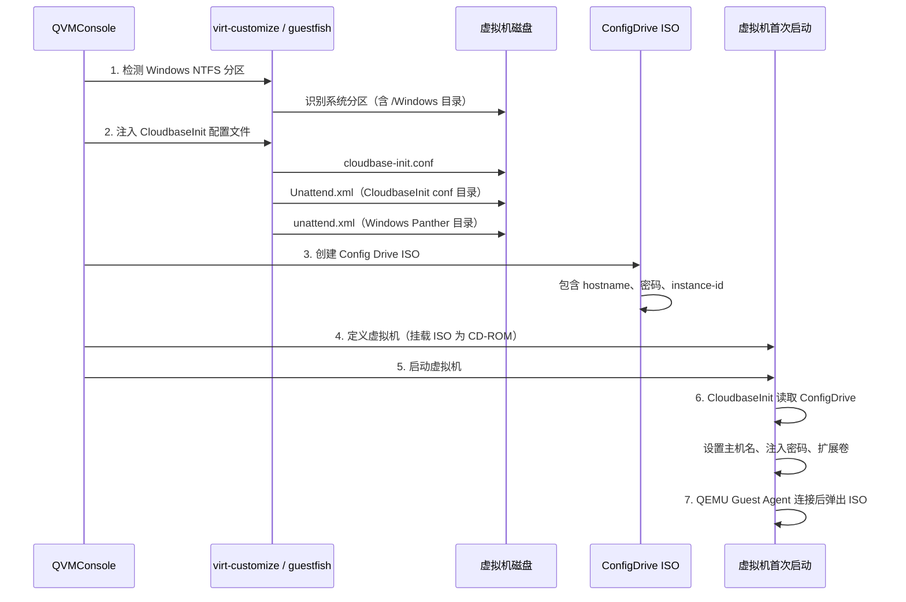
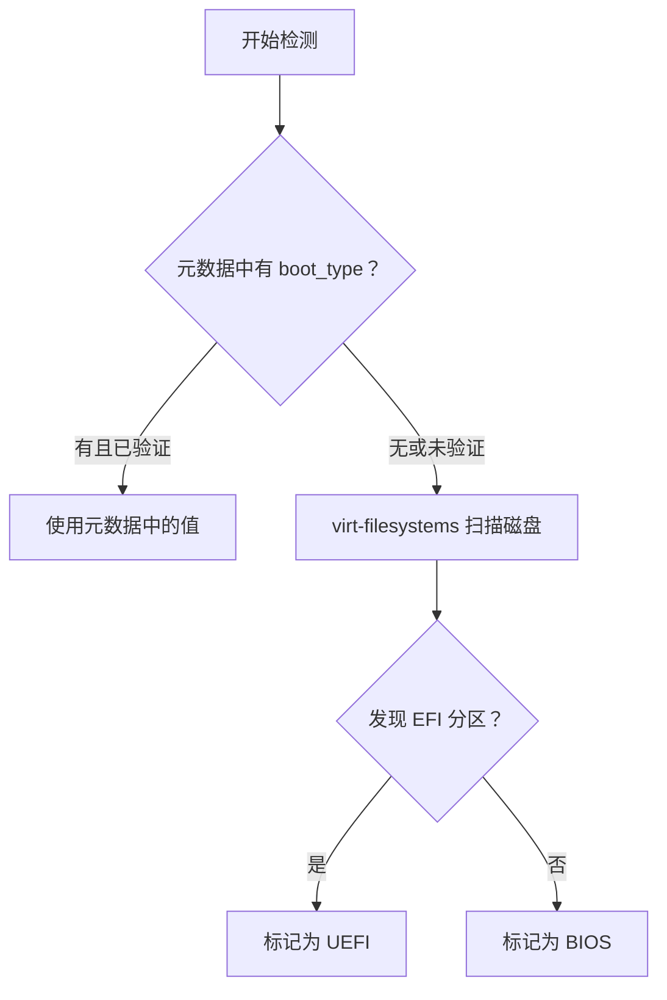

# 系统初始化原理

从模板克隆虚拟机时，QVMConsole 会根据不同操作系统类型自动执行**离线初始化**，在虚拟机首次启动前完成主机名、用户账号、密码等配置注入，实现开箱即用。

## 初始化流程总览



:::tip 离线初始化的优势
QVMConsole 的初始化完全在**离线阶段**（虚拟机启动前）通过 `virt-customize` 和 `guestfish` 工具完成，无需 SSH 连接虚拟机，也不依赖虚拟机网络状态，可靠性极高。
:::

---

## Linux 系统初始化（cloud-init NoCloud）

Linux 虚拟机的初始化采用 **cloud-init NoCloud** 数据源方式，是目前云环境中最成熟的初始化方案。

### 初始化流程



### 关键步骤详解

#### 1. 身份重置

克隆后的虚拟机与模板共享相同的 `machine-id`，这会导致 DHCP 服务器分配相同的 IP 地址。系统通过以下命令清理身份信息：

```bash
# 清空 machine-id
truncate -s 0 /etc/machine-id
rm -f /var/lib/dbus/machine-id

# 清理 DHCP 租约
rm -f /var/lib/dhcp/*.leases
rm -f /var/lib/NetworkManager/*.lease
rm -f /var/lib/systemd/network/*.lease
```

#### 2. cloud-init 配置清理

许多 Linux 发行版的安装器（如 Ubuntu 的 subiquity/curtin）会在安装后写入特殊配置文件，这些配置会干扰克隆后的初始化：

```bash
# 删除安装器遗留配置（强制恢复 NoCloud 数据源）
rm -f /etc/cloud/cloud.cfg.d/99-installer.cfg
rm -f /etc/cloud/cloud.cfg.d/00-subiquity-disable-cloudinit-networking.cfg
rm -f /etc/cloud/cloud.cfg.d/curtin-preserve-sources.cfg

# 清理实例缓存（强制重新初始化）
rm -rf /var/lib/cloud/instances/* /var/lib/cloud/instance

# 启用 cloud-init
rm -f /etc/cloud/cloud-init.disabled
```

#### 3. NoCloud Seed 文件注入

系统将 cloud-init 配置文件注入到 `/var/lib/cloud/seed/nocloud/` 目录：

**meta-data** 文件：

```yaml
instance-id: iid-<vm_name>-<timestamp>
local-hostname: <hostname>
```

**user-data** 文件：

```yaml
#cloud-config
hostname: <hostname>
manage_etc_hosts: true
ssh_pwauth: true

growpart:
  mode: auto
  devices: ['/']
resize_rootfs: true

runcmd:
  - hostnamectl set-hostname <hostname>
  # LVM 感知磁盘扩容脚本
  - |
    set +e
    ROOT_DEV=$(findmnt -n -o SOURCE /)
    # 自动检测 LVM 并执行 pvresize + lvextend
    ...
```

:::info LVM 自动扩容
user-data 中内置了 LVM 感知的磁盘扩容脚本。当克隆时指定了更大的磁盘大小，系统会在首次启动时自动检测根分区是否为 LVM，并执行 `pvresize` + `lvextend -r -l +100%FREE` 完成扩容。
:::

#### 4. 密码和用户名处理

密码修改通过 `virt-customize --password` 直接修改 `/etc/shadow`，无需 SSH 连接：

```bash
# 设置 root 密码
virt-customize -a <disk> --password root:password:<password>

# 设置模板用户密码
virt-customize -a <disk> --password <template_user>:password:<password>
```

用户名重命名通过 `usermod` 在离线阶段完成：

```bash
# 重命名用户
usermod -l <new_user> <template_user>
usermod -d /home/<new_user> -m <new_user>
groupmod -n <new_user> <template_user>
```

---

## Windows 系统初始化（CloudbaseInit + ConfigDrive）

Windows 虚拟机的初始化采用 **CloudbaseInit** 配合 **ConfigDrive** 元数据方式，是 Windows 云环境的标准初始化方案。

### 初始化流程



### CloudbaseInit 配置

系统注入的 `cloudbase-init.conf` 配置了以下关键参数：

| 配置项 | 值 | 说明 |
|--------|-----|------|
| `metadata_services` | ConfigDriveService | 使用 ConfigDrive 作为元数据源 |
| `plugins` | SetHostName, SetUserPassword, ExtendVolumes 等 | 启用的初始化插件列表 |
| `inject_user_password` | true | 允许注入用户密码 |
| `config_drive_cdrom` | true | 从 CD-ROM 读取 ConfigDrive |

### Unattend.xml 配置

系统为 Windows 生成 `Unattend.xml` 跳过 OOBE 向导，实现无人值守初始化：

- **specialize 阶段**：禁用 AutoLogon、设置临时密码防止无密码登录
- **oobeSystem 阶段**：跳过 EULA、网络位置选择、隐私设置等向导页面

:::note Windows Server 2025 / Windows 11 特殊处理
这两个版本需要在 oobeSystem 阶段额外配置 `UserAccounts/AdministratorPassword` 和 `AutoLogon(LogonCount=1)` 才能跳过密码设置屏幕。
:::

### Config Drive ISO 创建

系统创建一个包含以下内容的 ISO 文件作为 ConfigDrive 元数据：

```
/openstack/
  latest/
    meta_data.json    # 包含 instance-id、hostname
    user_data         # 包含密码设置脚本
```

ISO 文件以 SATA CD-ROM 方式挂载到虚拟机，CloudbaseInit 首次启动时读取并执行。

### 自动弹出机制

Config Drive ISO 在虚拟机启动后通过 QEMU Guest Agent 监控连接状态，当检测到 Guest Agent 连接成功后自动弹出 CD-ROM，避免残留光驱设备。

### NTFS 分区检测

注入配置文件前，系统通过 `guestfish` 检测磁盘中的 Windows NTFS 系统分区：

1. 使用 `guestfish list-filesystems` 列出所有文件系统
2. 筛选 NTFS 分区
3. 在每个 NTFS 分区中查找 `/Windows` 目录
4. 找到含 `/Windows` 的分区即为系统分区

:::warning Windows Server 2025 兼容性
`virt-customize` 的 OS 自动检测在 Windows Server 2025 上可能失败（已知问题），系统会自动回退为 `guestfish` 显式挂载 NTFS 分区方式绕过此问题。
:::

---

## FnOS 系统初始化

FnOS（飞牛 OS）的初始化通过 `virt-customize` 直接修改系统文件完成，不依赖 cloud-init。

### 初始化步骤

| 步骤 | 操作 | 说明 |
|------|------|------|
| 1 | 创建/更新用户 | 将用户加入 Users 和 Administrators 组 |
| 2 | 设置密码 | 通过 `chpasswd` 命令设置用户密码 |
| 3 | 设置主机名 | 写入 `/etc/hostname` 和更新 `/etc/hosts` |
| 4 | 标记系统已初始化 | 写入 `system_inited_timestamp` 文件 |
| 5 | 重置设备身份 | 清理 `machine-id` 和 `device_id` |
| 6 | 清理 DHCP 租约 | 防止 IP 地址冲突 |

### 设备 ID 管理

FnOS 使用 32 位十六进制字符串作为设备标识（Device ID），系统支持三种设备 ID 策略：

| 策略 | 说明 |
|------|------|
| **自动重置**（默认） | 清空 machine-id，每次克隆生成新身份 |
| **保留原始 ID** | 从模板继承 machine-id 和 device_id |
| **自定义 ID** | 用户指定 32 位或 40 位十六进制设备 ID |

:::info 设备 ID 保护
自定义设备 ID 写入后会被设置为不可变属性（`chattr +i`），防止运行时被意外修改。
:::

---

## 启动类型检测

系统在克隆时会自动检测并匹配正确的启动方式（BIOS 或 UEFI）。

### 检测逻辑



### UEFI 启动支持

当检测到模板使用 UEFI 启动时，克隆过程会：

1. 复制 OVMF NVRAM 变量文件作为虚拟机专属的 UEFI 变量存储
2. 在虚拟机 XML 中配置 `loader` 和 `nvram` 元素
3. 启用 SMM（System Management Mode）和 TPM 模拟器（安全引导场景）

---

## 各类型初始化对比

| 特性 | Linux | Windows | FnOS | Other |
|------|-------|---------|------|-------|
| **初始化工具** | virt-customize | virt-customize + guestfish | virt-customize | 无 |
| **主机名设置** | cloud-init + 离线写入 | CloudbaseInit | 离线写入 | 无 |
| **密码注入** | virt-customize --password | CloudbaseInit + ConfigDrive | chpasswd | 无 |
| **用户名重命名** | usermod（离线） | N/A（使用 Administrator） | useradd/usermod | 无 |
| **磁盘扩容** | cloud-init growpart + LVM 脚本 | CloudbaseInit ExtendVolumes | 无 | 无 |
| **身份重置** | 清理 machine-id + DHCP | 重置 instance-id | 清理 machine-id | 无 |
| **网络初始化** | cloud-init 清理租约 | DHCP 自动获取 | 清理租约 | 无 |
| **首次启动依赖** | cloud-init 服务 | CloudbaseInit 服务 | 无（离线完成） | 无 |

---

## 相关文档

- [模板管理原理](/docs/tech/feature-analysis/template-management) — 模板元数据、树形结构、克隆模式
- [使用模板创建虚拟机](/docs/install/quick-start/template-management) — 快速上手指南
- [制作模板](/docs/install/advanced/create-template) — 学习如何将虚拟机制作为模板
