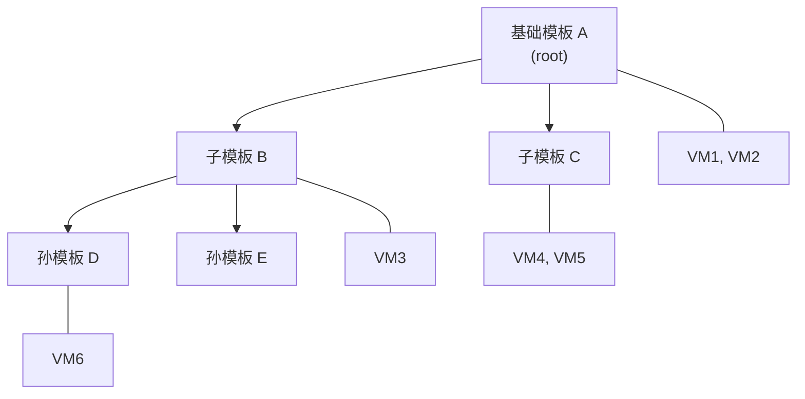
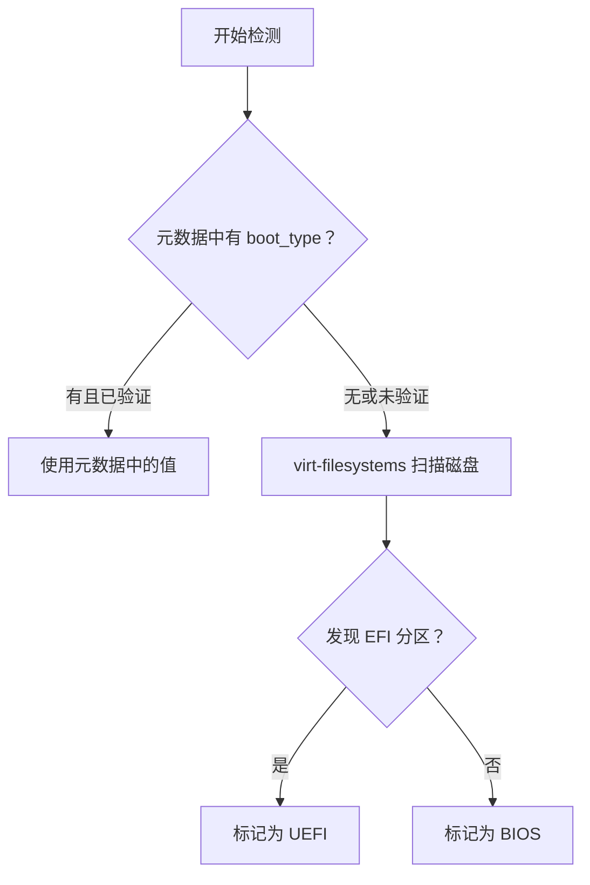
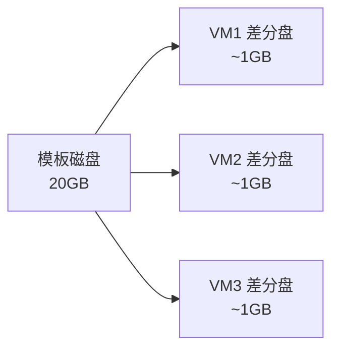
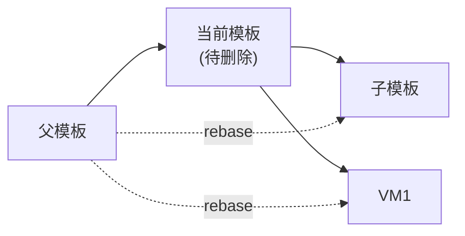

# 模板管理原理

QVMConsole 的模板系统是实现**毫秒级创建虚拟机**的核心基础设施。本文档从技术原理角度详细介绍模板的元数据结构、树形版本管理、克隆模式、删除策略和导入导出机制。

## 模板元数据系统

每个模板由两个文件组成：

| 文件 | 说明 |
|------|------|
| `<模板名>.qcow2` | 模板磁盘文件（qcow2 格式） |
| `<模板名>.meta.json` | 模板元数据文件（由程序自动维护） |

元数据文件记录了模板的核心信息：

| 字段 | 说明 |
|------|------|
| `type` | 模板类型：`linux` / `windows` / `fnos` / `openwrt` / `other` |
| `category` | 二级分类（Linux 发行版、Windows 版本或 OpenWrt 衍生版） |
| `boot_type` | 启动类型：`bios` / `uefi` |
| `boot_verified` | 启动类型是否已确认验证 |
| `template_user` | 模板中的默认用户名（用于克隆时的用户名重命名） |
| `cloud_init_mode` | 初始化模式：`nocloud` / `configdrive` / `fnos` / `none` |
| `default_config` | 模板默认硬件配置（CPU、内存、磁盘大小、网卡模型等） |
| `template_uid` | 模板族唯一标识（跨节点跟踪模板血缘） |
| `node_id` | 当前模板节点唯一标识 |
| `parent_node_id` | 父节点 ID（形成树形结构） |
| `root_node_id` | 根节点 ID |
| `admin_name` | 管理员侧名称 |
| `display_name` | 用户侧显示文本 |
| `clone_visible` | 是否允许普通用户克隆 |
| `disabled` | 是否禁用克隆 |
| `md5` / `sha256` | 磁盘文件校验哈希 |
| `file_size` | 磁盘文件字节数 |
| `created_from_vm` | 来源虚拟机名称 |
| `created_at` | 创建时间 |

:::info 文件保护
模板文件和元数据文件在创建后会被自动设置为**不可变属性**（`chattr +i`），防止意外删除或修改。只有通过模板管理接口才能删除（删除前会先移除不可变属性）。
:::

---

## 模板分类体系

系统支持以下模板类型和二级分类：

| 类型 | 二级分类 |
|------|---------|
| **Linux** | Ubuntu（默认）、Debian、CentOS |
| **Windows** | WindowsServer2022（默认）、WindowsServer2025、Windows11、Windows10、WindowsServer2012R2、其它 |
| **FnOS** | 无二级分类 |
| **OpenWrt** | OpenWrt（默认）、iStoreOS |
| **Other** | 无二级分类 |

模板类型可通过以下方式确定：
1. 用户在制作模板时显式指定
2. 从模板名称自动推断：
   - 名称包含 `win` 标识为 Windows
   - 名称包含 `openwrt` / `lede` / `istoreos` 标识为 OpenWrt
   - 名称包含 `fnos` 标识为 FnOS

---

## 模板树形结构

QVMConsole 的模板系统采用**树形链式结构**管理模板版本关系。当从一个模板 A 克隆出虚拟机，再将该虚拟机制作为新模板 B 时，B 自动成为 A 的子节点。



每个模板节点在树中的属性：

| 属性 | 说明 |
|------|------|
| `level` | 节点层级深度（根节点为 0） |
| `is_root` | 是否为根节点 |
| `has_children` | 是否有子模板 |
| `direct_vm_count` | 直接关联的链式克隆虚拟机数量 |
| `tree_vm_count` | 整棵子树中所有链式克隆虚拟机总数 |
| `children_count` | 直接子模板数量 |

### 树形结构的构建过程

1. 扫描模板目录下所有 `.qcow2` 文件
2. 加载每个模板的 `.meta.json` 元数据
3. 通过 `parent_node_id` 字段建立父子关系
4. 收集每个 VM 的模板来源信息（通过 libvirt XML 中的 `template-source` 注解）
5. 按树形结构深度优先排序输出

---

## 启动类型自动检测

系统会自动检测模板磁盘的启动类型（BIOS 或 UEFI），检测逻辑如下：



UEFI 模板会自动复制 NVRAM 变量文件（`.nvram.fd`），克隆时为每个虚拟机创建独立的 NVRAM 副本。

---

## 模板默认配置继承

从虚拟机制作模板时，系统自动采集源 VM 的硬件配置作为模板默认配置（`default_config`）：

| 配置项 | 采集方式 |
|--------|---------|
| vCPU 核心数 | 从 libvirt domain info 获取 |
| 内存大小 | 从 libvirt domain info 获取（转换为 GB） |
| 系统盘大小 | 从磁盘信息获取（`qemu-img info`） |
| 系统盘总线 | 从磁盘 XML 配置获取 |
| 网卡模型 | 从网络接口 XML 获取 |
| 视频模型 | 从 domain XML 解析 |
| CPU 拓扑模式 | 从 domain XML 解析 |

从模板克隆虚拟机时，这些默认配置会自动应用到创建表单，用户可按需覆盖。

---

## 克隆模式

### 链式克隆

链式克隆通过 `qemu-img create -f qcow2 -F qcow2 -b <模板路径>` 创建基于模板的差分磁盘（backing file），磁盘只存储与模板的差异数据。



**优点**：创建速度快（毫秒级）、节省存储空间

**缺点**：依赖模板文件完整性，模板丢失将导致所有链式克隆虚拟机磁盘损坏

### 完整克隆

完整克隆通过 `qemu-img convert -f qcow2 -O qcow2` 将模板数据完整复制到新磁盘文件，与模板完全独立。

**优点**：独立运行，不依赖模板

**缺点**：创建较慢（取决于磁盘大小），占用完整存储空间

### 原生链式克隆

原生链式克隆是一种特殊模式，直接基于模板生成 backing 磁盘并启动虚拟机，**不修改模板内的任何配置**（主机名、用户名、密码等保持原样）。适用于快速测试和更新模板场景，仅管理员可用。

---

## 模板删除策略

系统提供三种模板删除策略：

### 级联删除（cascade）

删除模板及其整棵子树中的所有模板和关联虚拟机。适用于确认不再需要任何基于该模板的虚拟机和子模板。

### 提升子节点（promote_children）

将当前模板的子模板和直接关联 VM 的 backing file 通过 `qemu-img rebase` 指向父模板，然后删除当前节点。所有关联虚拟机必须**已关机**才能执行。



### 热提升子节点（promote_children_hot）

与普通提升类似，但支持**运行中虚拟机**热切换：
- 对于**子模板**：先复制一份临时文件，rebase 后通过 `virsh blockcopy --pivot` 热切换运行中 VM
- 对于**直接关联 VM**：通过 `virsh blockpull` 将运行中 VM 拉平到父模板

:::warning 热提升限制
热提升仅支持 `running` 或 `shut off` 状态的虚拟机，且不允许存在外部快照。
:::

---

## 模板导入导出

### 导出机制

模板导出生成 `.tar.gz` 格式的模板包，包内结构：

```
<template-export>.tar.gz
├── manifest.json              # 导出清单
├── <node_id_1>.qcow2          # 节点磁盘文件
├── <node_id_1>.meta.json      # 节点元数据
├── <node_id_2>.qcow2
└── <node_id_2>.meta.json
```

`manifest.json` 包含：
- 版本号、导出时间、导出范围（`node` / `root`）
- 模板族 UID、根节点 ID
- 各节点的文件名、哈希校验值、元数据

支持两种导出范围：
- **单节点导出**（`scope=node`）：仅导出指定模板节点
- **整棵子树导出**（`scope=root`）：导出从根节点开始的整棵子树

### 导入机制

支持两种导入方式：

| 导入格式 | 说明 |
|---------|------|
| `.tar.gz` / `.tgz` | 标准模板包导入（含元数据和树形结构） |
| `.qcow2` | 旧版单文件导入（自动创建元数据，独立根节点） |

导入前系统会进行**预览校验**：
1. 解析 `manifest.json`，检查包完整性
2. 校验每个节点的 MD5 和 SHA256 哈希
3. 检查节点 ID 和文件名是否与本地模板冲突
4. 根据 `template_uid` 判断是新建还是更新已有模板族

导入成功后，模板文件同样会被设置不可变属性保护。

---

## VM 模板来源追踪

每个通过模板克隆的虚拟机，其 libvirt XML 中都会注入一个 `template-source` 注解，记录：

| 属性 | 说明 |
|------|------|
| `template_name` | 来源模板名称 |
| `template_uid` | 来源模板族 UID |
| `node_id` | 来源模板节点 ID |
| `clone_mode` | 克隆模式（`linked` / `full`） |

这个信息用于：
- 模板管理页面展示虚拟机关联关系
- 删除模板时确定受影响的虚拟机列表
- 从虚拟机再次制作模板时继承模板族血缘

---

## 相关文档

- [系统初始化原理](/docs/tech/feature-analysis/system-initialization) — 克隆时的系统初始化机制
- [使用模板创建虚拟机](/docs/install/quick-start/template-management) — 快速上手指南
- [制作模板](/docs/install/advanced/create-template) — 学习如何将虚拟机制作为模板
