# 虚拟化概述

## 什么是虚拟化？

虚拟化（Virtualization）是一种将物理硬件资源抽象为多个逻辑资源的技术。通过虚拟化，可以在一台物理服务器上运行多个相互隔离的虚拟机（VM），每个虚拟机都拥有独立的操作系统和应用程序。

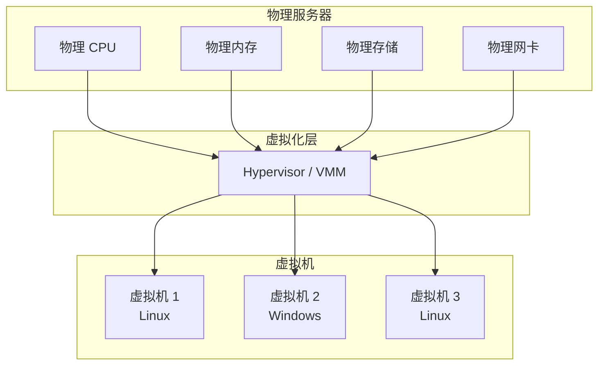

## 虚拟化类型

### Type 1 - 裸金属虚拟化

Hypervisor 直接运行在物理硬件上，无需宿主操作系统。

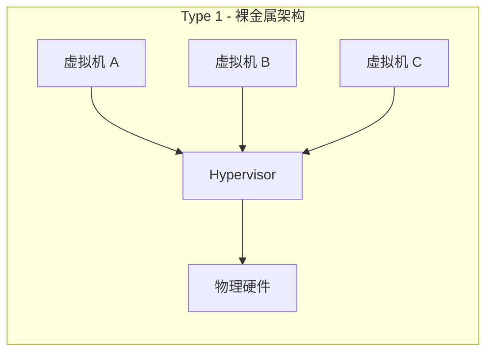

**特点：**
- 性能接近原生硬件
- 安全性高，攻击面小
- 代表：VMware ESXi、Microsoft Hyper-V、Xen

### Type 2 - 宿主型虚拟化

Hypervisor 运行在宿主操作系统之上。

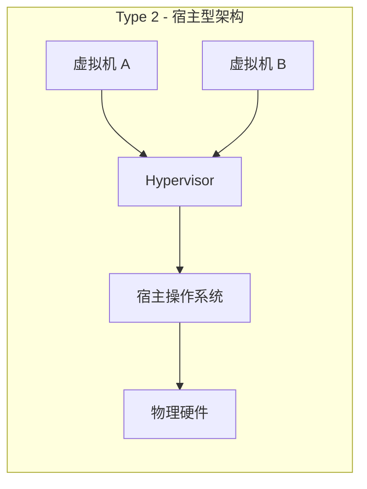

**特点：**
- 安装部署简单
- 依赖宿主操作系统
- 代表：VMware Workstation、VirtualBox、Parallels

## KVM/QEMU 虚拟化架构

KVM（Kernel-based Virtual Machine）和 QEMU 是 Linux 平台下的开源虚拟化解决方案。

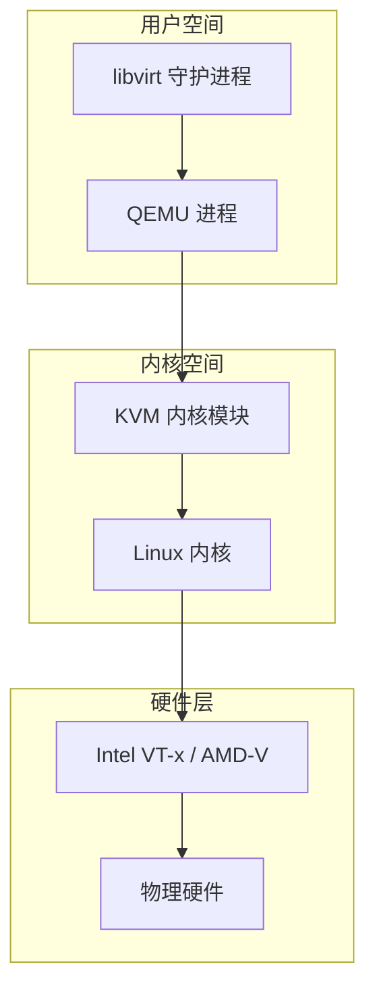

### 核心组件说明

| 组件 | 作用 | 说明 |
|------|------|------|
| **KVM** | 内核虚拟化模块 | 利用 CPU 硬件虚拟化扩展（VT-x/AMD-V）实现虚拟化 |
| **QEMU** | 设备模拟器 | 模拟虚拟机的 I/O 设备（磁盘、网卡、显卡等） |
| **libvirt** | 虚拟化管理 API | 提供统一的虚拟机管理接口 |

### KVM 工作原理

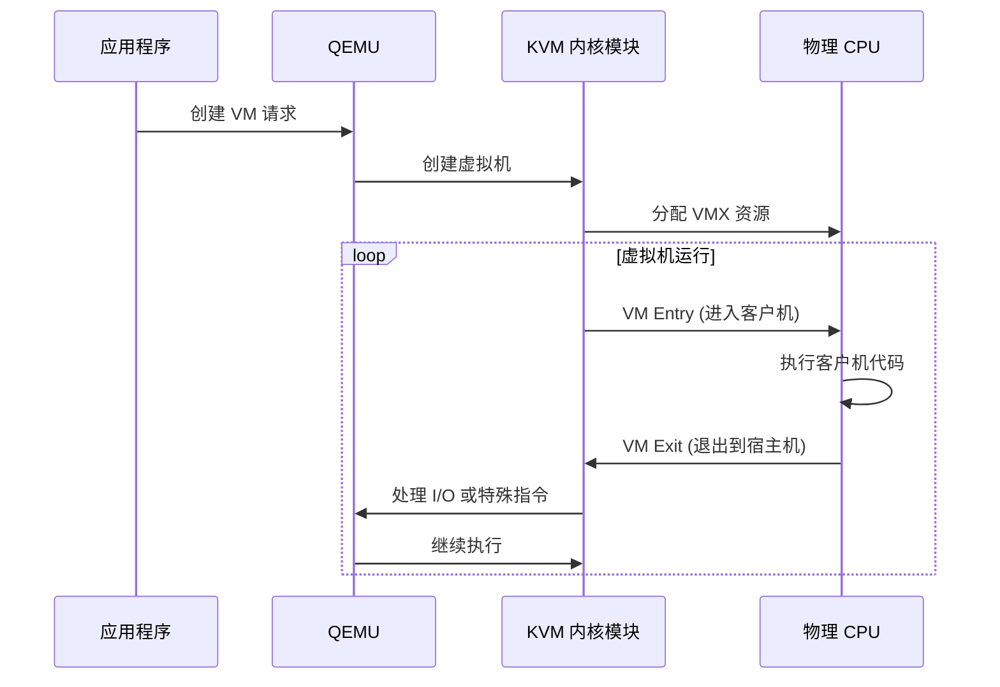

## 虚拟机生命周期

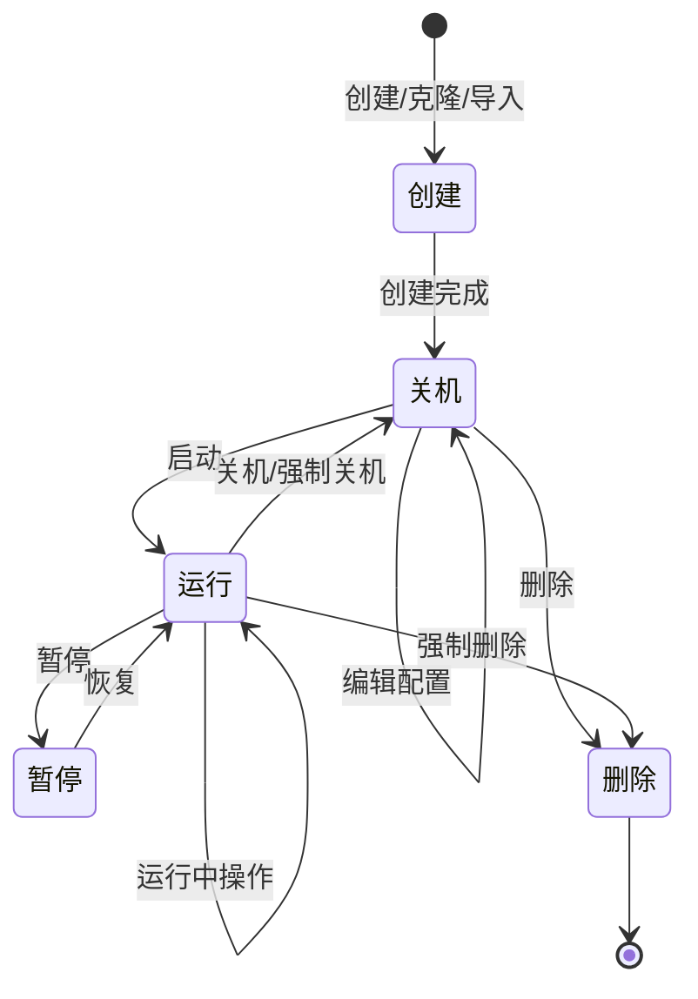

### 状态说明

| 状态 | 说明 | 可执行操作 |
|------|------|-----------|
| **创建中** | 正在通过任务队列创建虚拟机 | 无 |
| **关机** | 虚拟机已停止 | 启动、编辑、删除、克隆 |
| **运行** | 虚拟机正在运行 | 关机、重启、暂停、VNC 连接 |
| **暂停** | 虚拟机已暂停，内存状态保留 | 恢复、强制关机 |

## 网络虚拟化

### Linux Bridge

Linux Bridge 是传统的虚拟网络方案，将虚拟网卡桥接到物理网络。

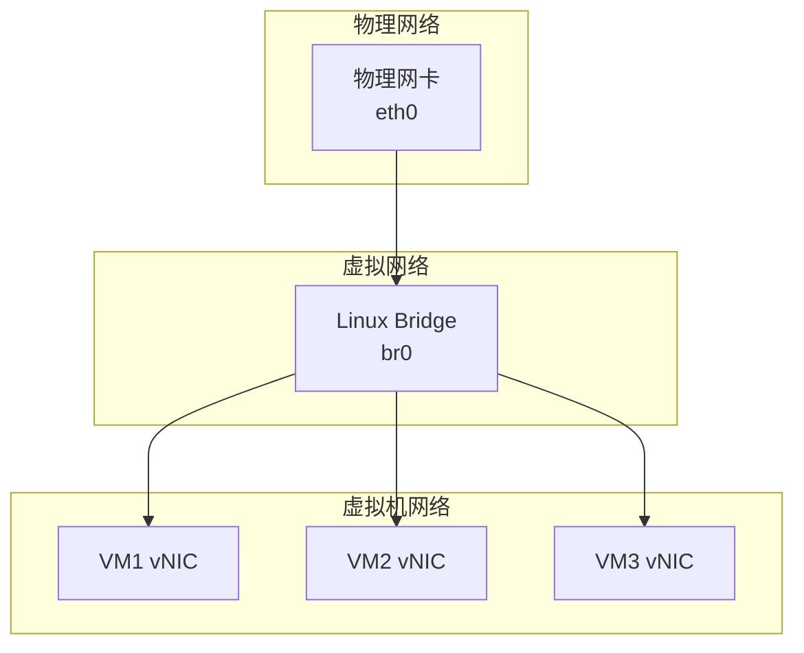

### OVS (Open vSwitch)

OVS 是更高级的虚拟交换机，支持 OpenFlow 协议和 VLAN 隔离。

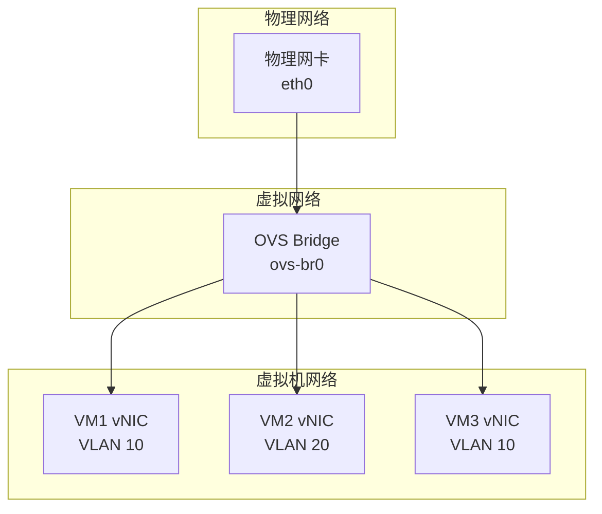

### 网络模式对比

| 模式 | 特点 | 适用场景 |
|------|------|----------|
| **NAT** | 虚拟机通过 NAT 访问外网 | 开发测试环境 |
| **Bridge** | 虚拟机直接接入物理网络 | 生产环境 |
| **VPC** | 虚拟私有云，逻辑隔离 | 多租户环境 |

## 存储虚拟化

### 虚拟磁盘格式

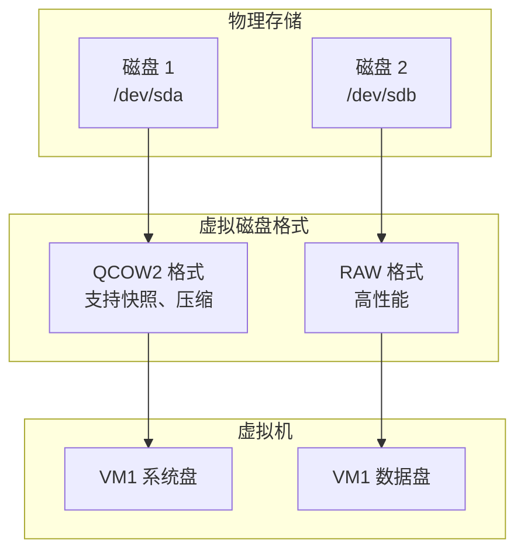

### QCOW2 vs RAW 格式

| 特性 | QCOW2 | RAW |
|------|-------|-----|
| **快照支持** | ✅ 支持 | ❌ 不支持 |
| **磁盘压缩** | ✅ 支持 | ❌ 不支持 |
| **稀疏分配** | ✅ 支持 | ❌ 需预分配 |
| **读写性能** | 中等 | 高 |
| **空间效率** | 高 | 低 |

### QCOW2 内部结构

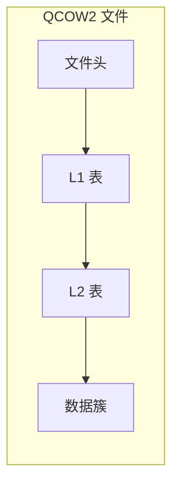

## 快照技术

### 快照类型

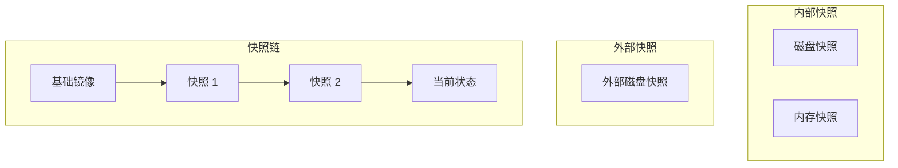

### 快照操作

| 操作 | 说明 |
|------|------|
| **创建** | 保存当前 VM 状态（磁盘 + 可选内存） |
| **恢复** | 回滚到指定快照状态 |
| **删除** | 删除单个快照 |
| **删除全部** | 删除所有快照 |

## 虚拟机迁移

### 在线迁移

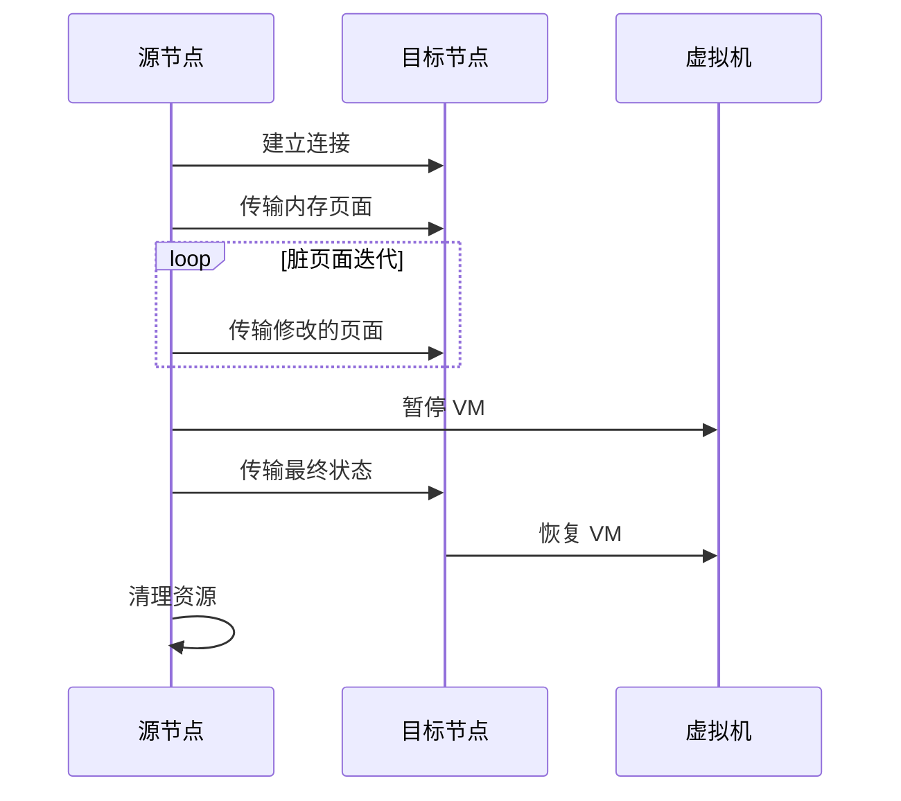

### 迁移类型

| 类型 | 说明 | 停机时间 |
|------|------|----------|
| **在线迁移** | VM 运行时迁移 | 毫秒级 |
| **离线迁移** | VM 关机后迁移 | 无 |
| **存储迁移** | 磁盘文件迁移 | 取决于磁盘大小 |

## 硬件直通

### PCI 直通

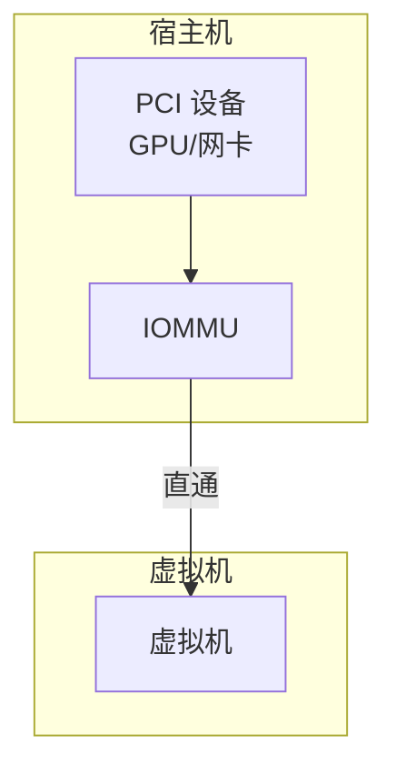

**优势：**
- 接近原生性能
- 虚拟机直接访问硬件

**要求：**
- CPU 支持 VT-d/AMD-Vi
- 主板 BIOS 启用 IOMMU
- 设备支持直通

## 虚拟化性能优化

### CPU 优化

| 技术 | 说明 |
|------|------|
| **CPU 亲和性** | 将 VM 绑定到特定物理 CPU |
| **NUMA 感知** | 优化内存访问路径 |
| **CPU 拓扑** | 模拟真实的 CPU 拓扑结构 |

### 内存优化

| 技术 | 说明 |
|------|------|
| **内存气球** | 动态调整 VM 内存 |
| **KSM** | 内核同页合并，节省内存 |
| **大页** | 使用大页减少 TLB 缺失 |

### I/O 优化

| 技术 | 说明 |
|------|------|
| **VirtIO** | 半虚拟化 I/O 驱动 |
| **IOPS 限制** | 磁盘 I/O 限速 |
| **磁盘缓存** | 控制缓存策略 |

## 下一步

- 了解 [QVMConsole 架构](/docs/tech/feature-analysis/qvmconsole-architecture) 设计
