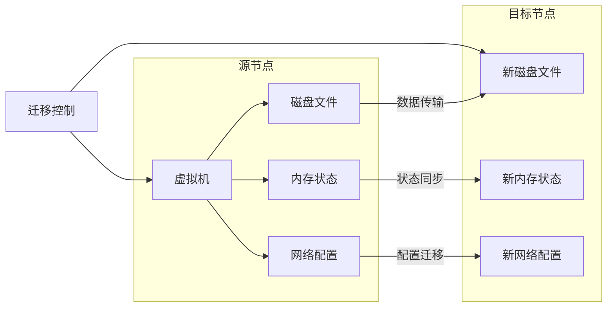
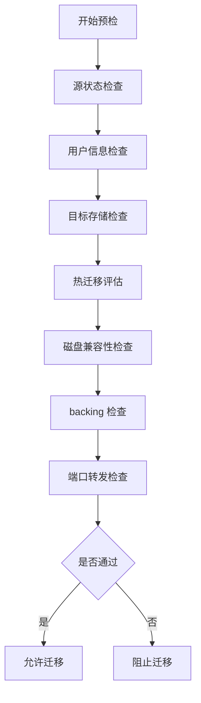
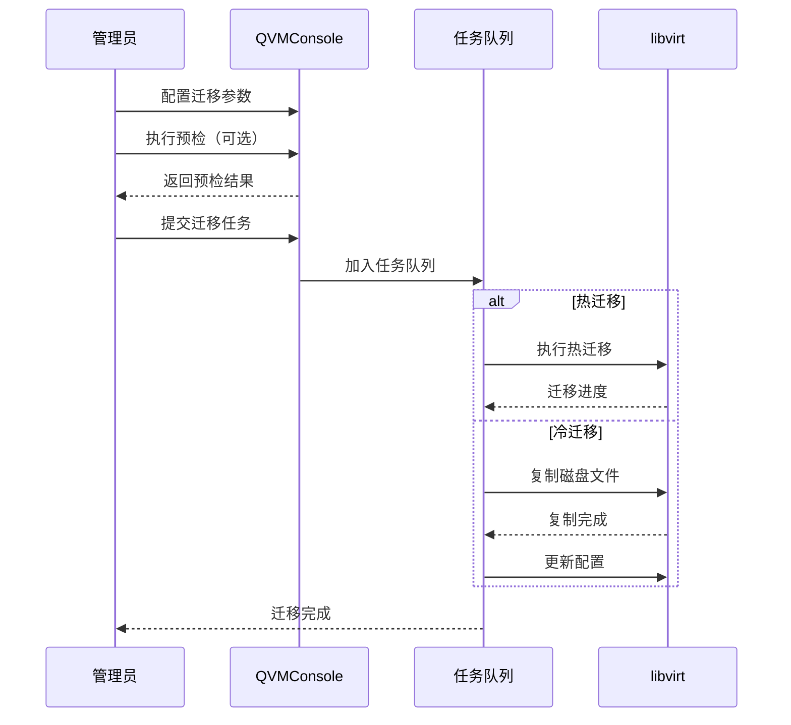
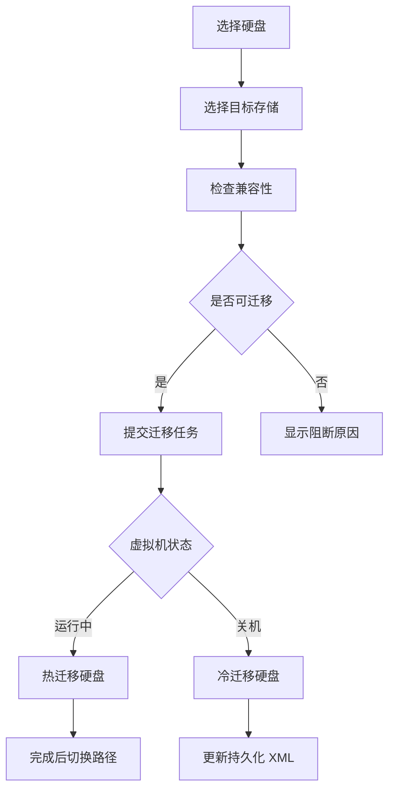

# 虚拟机迁移

虚拟机迁移是 QVMConsole 的核心基础设施能力，支持将虚拟机从一个节点迁移到另一个节点，实现资源调度、负载均衡和高可用部署。迁移功能与节点管理紧密协作，通过预检机制和任务队列确保迁移的安全性和可靠性。

:::info[管理员专属]
虚拟机迁移操作仅对管理员角色开放，从虚拟机列表的操作菜单中触发。
:::

## 迁移架构

## 迁移方式

QVMConsole 支持两种迁移方式，系统会根据虚拟机的运行状态自动识别：

| 迁移方式 | 适用场景 | 特点 |
|---------|---------|------|
| **热迁移** | 虚拟机运行中 | 业务不中断，需要共享存储或块迁移支持 |
| **冷迁移** | 虚拟机关机 | 直接复制磁盘文件，简单可靠 |

:::info[自动识别]
系统会自动检测虚拟机的运行状态，无需手动选择迁移方式。运行中的虚拟机将自动采用热迁移，关机的虚拟机将自动采用冷迁移。
:::

## 整机迁移

整机迁移（VmMigrationDialog）支持将虚拟机的完整配置和数据迁移到目标节点。

### 迁移配置项

| 配置项 | 说明 | 必填 |
|--------|------|------|
| **目标节点** | 选择已启用的目标节点 | 是 |
| **目标存储** | 选择带可用容量的存储池 | 是 |
| **硬盘目标存储** | 多块硬盘时可单独选择目标存储 | 否 |
| **轻量云 VPC** | 轻量云模式下的网络配置 | 按需 |
| **目标 VPC** | 标准模式下的目标网络 | 按需 |
| **目标安全组** | 迁移后的安全组配置 | 否 |
| **预检策略** | 是否跳过完整预检 | 否 |
| **迁移 CPU 限制** | 热迁移时的 CPU 使用限制 | 否 |

### 硬盘目标存储

当虚拟机拥有多块硬盘时，可以为每块硬盘单独选择目标存储位置：

| 字段 | 说明 |
|------|------|
| **设备** | 硬盘设备标识（如 vda、vdb） |
| **容量** | 硬盘容量大小 |
| **源路径** | 当前硬盘文件路径 |
| **对端存储** | 选择目标存储池 |

### 预检机制

迁移预检是确保迁移成功的重要环节，会在迁移前进行全面的兼容性检查：

### 预检结果展示

预检结果包含以下信息：

#### 基本信息

| 字段 | 说明 |
|------|------|
| **源状态** | 虚拟机当前运行状态 |
| **用户信息** | 虚拟机所属用户和云类型 |
| **目标用户** | 是否自动注册新用户或绑定已有用户 |
| **目标存储目录** | 迁移后的存储路径 |
| **所需容量** | 迁移所需的总存储空间 |
| **VM 凭据** | 是否同步虚拟机登录凭据 |

#### 热迁移评估

对于运行中的虚拟机，预检会进行热迁移可行性评估：

| 指标 | 说明 | 影响 |
|------|------|------|
| **平均带宽** | 迁移数据传输带宽 | 影响迁移速度 |
| **脏页速率** | 内存页面变更速率 | 速率过高可能导致迁移失败 |
| **脏页占比** | 脏页占总内存的比例 | 占比过高会阻止热迁移 |
| **CPU 限制** | 迁移时的 CPU 使用限制 | 可配置限制百分比 |
| **评估结论** | 热迁移是否可行 | 允许热迁移 / 阻止热迁移 |

:::warning[热迁移限制]
当脏页速率达到平均带宽的 20%-50% 时，后端会强制启用 CPU 限制；达到 50% 时会阻止热迁移，建议改用冷迁移。
:::

#### 磁盘检查

| 字段 | 说明 |
|------|------|
| **磁盘** | 磁盘设备标识 |
| **目标存储** | 目标存储池名称 |
| **源 overlay** | 源磁盘文件路径 |
| **目标 overlay** | 目标磁盘文件路径 |
| **backing** | 基础镜像路径 |

#### backing 检查

| 状态 | 说明 |
|------|------|
| **通过** | backing 文件在目标节点存在且兼容 |
| **失败** | backing 文件缺失或不兼容，需要先处理 |

#### 端口转发

| 字段 | 说明 |
|------|------|
| **协议** | 端口转发协议（TCP/UDP） |
| **源端口** | 当前端口转发的主机端口 |
| **目标端口** | 迁移后的目标主机端口（自动分配） |
| **VM 端口** | 虚拟机内部端口 |

### CPU 限制配置

热迁移时可以配置 CPU 使用限制，避免迁移过程影响业务性能：

| 配置项 | 说明 | 范围 |
|--------|------|------|
| **启用 CPU 限制** | 是否限制迁移时的 CPU 使用率 | 开/关 |
| **限制百分比** | CPU 使用率上限 | 10%-100%，步长 5% |

### 提交流程

## 单硬盘迁移

单硬盘迁移支持将虚拟机的单个硬盘迁移到其他存储池，适用于存储扩容、存储池迁移等场景。

### 硬盘列表

| 字段 | 说明 |
|------|------|
| **设备** | 硬盘设备标识（如 vda、vdb） |
| **容量** | 硬盘容量大小 |
| **格式** | 磁盘格式（qcow2、raw 等） |
| **驱动** | 磁盘驱动类型（virtio、ide 等） |
| **当前路径** | 硬盘文件当前路径 |
| **backing** | 基础镜像路径（链式存储） |
| **状态** | 是否可迁移（可迁移/不可迁移） |

### 迁移流程

:::tip[链式存储]
对于使用链式存储的硬盘（有 backing 文件），仅迁移活动的 overlay 文件，backing 文件保持不变。
:::

## 实现原理

### 热迁移原理

热迁移通过 libvirt 的迁移 API 实现，核心流程：

1. **预检阶段**：检查源和目标的兼容性
2. **内存传输**：将虚拟机内存页面传输到目标节点
3. **脏页同步**：持续同步变更的内存页面
4. **最终切换**：当脏页数量足够少时，暂停虚拟机并完成最终同步
5. **恢复运行**：在目标节点恢复虚拟机运行

### 冷迁移原理

冷迁移在虚拟机关机状态下进行：

1. **停止虚拟机**：确保虚拟机完全停止
2. **复制磁盘**：将磁盘文件复制到目标节点
3. **传输配置**：复制虚拟机 XML 配置
4. **更新定义**：在目标节点定义虚拟机
5. **清理源节点**：删除源节点的虚拟机文件（可选）

## API 接口

| 方法 | 路径 | 说明 | 超时 |
|------|------|------|------|
| `GET` | `/nodes/{id}/migration-options` | 获取节点迁移选项 | - |
| `POST` | `/vm/{name}/migration/preview` | 迁移预检 | 300s |
| `POST` | `/vm/{name}/migrate` | 提交整机迁移 | 60s |
| `POST` | `/vm/{name}/disk/{dev}/migrate` | 提交硬盘迁移 | 60s |

## 最佳实践

### 迁移策略

- **预检优先**：迁移前务必执行预检，避免迁移失败
- **错峰迁移**：在业务低峰期执行迁移，减少对业务的影响
- **监控迁移**：迁移过程中密切关注脏页速率和迁移进度

### 故障处理

- **迁移失败**：查看任务详情中的错误信息，常见原因包括存储空间不足、网络中断等
- **回滚操作**：迁移失败时，虚拟机通常会保留在源节点，可继续使用

:::warning[注意事项]
1. 热迁移需要源和目标节点的 CPU 兼容，建议使用同型号 CPU
2. 迁移过程中请勿对虚拟机进行其他操作
3. 确保目标节点有足够的存储空间容纳迁移的虚拟机
:::
