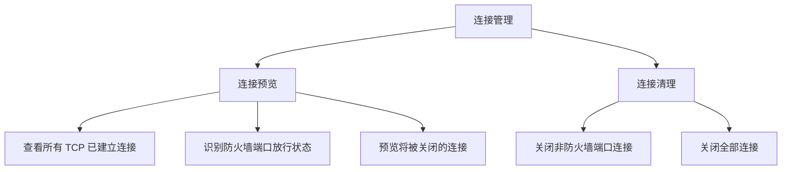
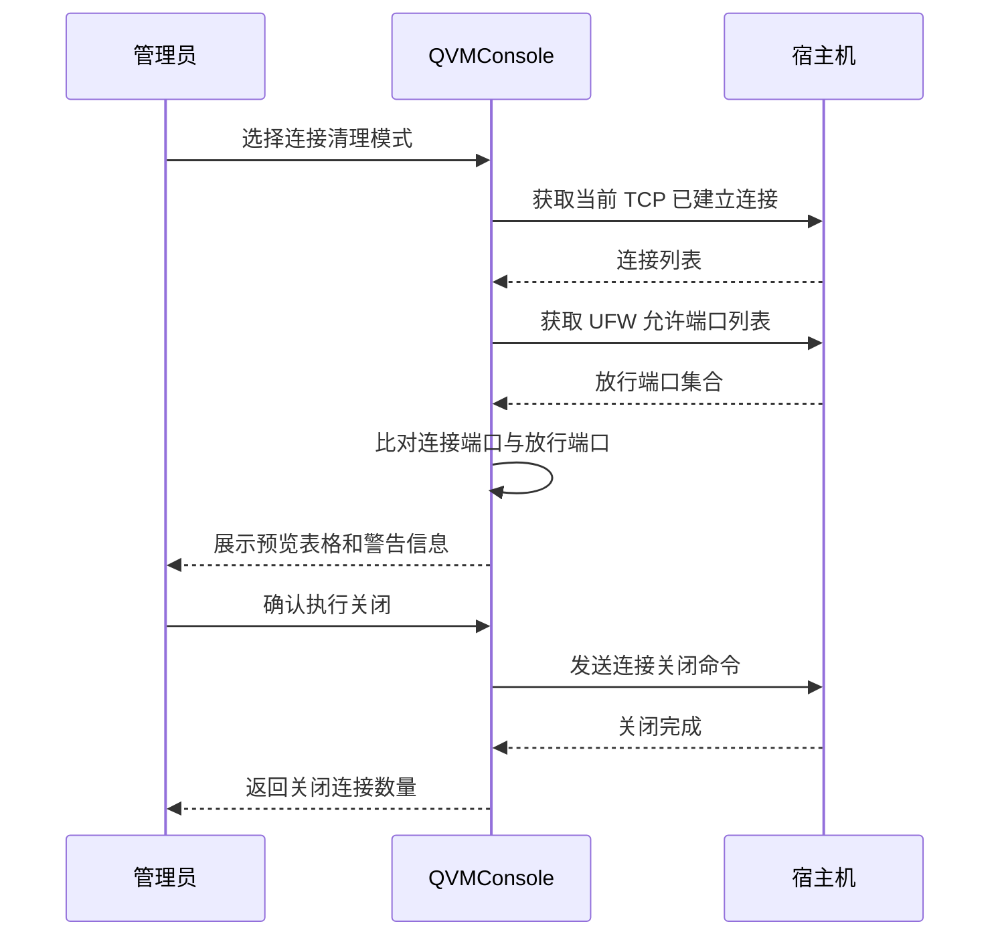
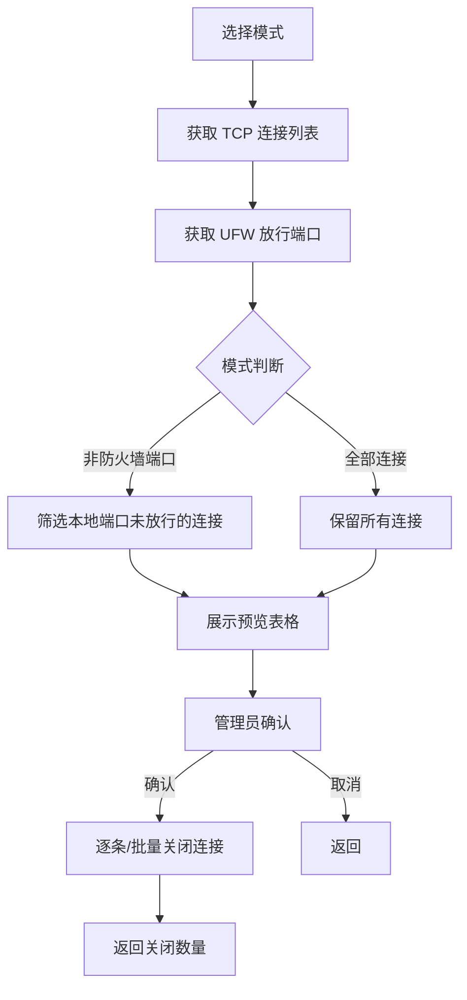

# 连接管理

连接管理功能用于监控和清理宿主机上的 TCP 已建立连接。它与宿主机防火墙紧密配合，能够在防火墙规则变更后快速切断不再符合策略的连接，帮助管理员实现网络访问策略的即时生效。

## 功能概述

:::danger[高风险操作警告]
关闭全部连接会立即断开所有 TCP 已建立连接，包括当前的 SSH 会话和面板 Web 连接。执行此操作后，当前会话可能立即断开，需要通过其他途径重新建立连接。请务必在操作前确认已准备好替代的访问方式。
:::

## 连接控制模式

系统提供两种连接清理模式，覆盖不同的运维场景：

| 模式 | 说明 | 影响范围 | 风险等级 |
|------|------|----------|----------|
| **非防火墙端口连接** | 仅关闭本地端口不在 UFW 允许规则内的 TCP 已建立连接 | 仅影响未被防火墙放行的端口连接 | 中等 |
| **全部连接** | 关闭所有 TCP 已建立连接 | 包括 SSH、面板在内的所有连接 | 高危 |

### 非防火墙端口连接

此模式适用于防火墙规则变更后的连接清理场景。当管理员新增了端口拒绝规则或修改了端口放通策略后，已建立的连接不会自动断开（因为 TCP 连接是在规则变更前建立的）。通过此模式可以精确切断那些本地端口已不再被防火墙放行的连接。

### 全部连接

此模式适用于紧急安全响应场景，例如发现服务器遭受攻击需要立即切断所有外部连接时。执行后宿主机上的所有 TCP 已建立连接都会被强制关闭。

:::warning[会话中断]
使用"全部连接"模式时，当前的 SSH 会话和面板 Web 连接都会被断开。如果面板是唯一的远程访问方式，请确保有其他途径（如物理控制台、IPMI）可以重新连接服务器。
:::

## 操作流程

连接管理遵循"先预览、再确认"的安全操作流程，避免误操作：

## 连接预览表格

在执行关闭操作前，系统会展示预览表格，列出所有将被关闭的连接详情：

| 列 | 说明 |
|----|------|
| **协议** | 连接使用的协议，当前仅支持 TCP |
| **本地地址** | 本机监听的 IP 地址和端口 |
| **对端地址** | 远程客户端的 IP 地址和端口 |
| **防火墙端口状态** | 该连接本地端口在 UFW 中的放行状态 |

### 防火墙端口状态

| 状态 | 含义 | 在"非防火墙端口"模式下的处理 |
|------|------|------------------------------|
| **已放行** | 本地端口匹配 UFW 的 allow 规则 | 不会被关闭 |
| **未放行** | 本地端口不匹配任何 UFW allow 规则 | 将被关闭 |

:::tip[状态判断逻辑]
防火墙端口状态的判断基于当前 UFW 中所有 allow 规则的端口集合。如果某条连接的本地端口落在任何 allow 规则的端口范围内（包括端口范围规则），则标记为"已放行"，否则标记为"未放行"。该判断不区分协议和来源 CIDR，仅以端口为依据。
:::

## 实现原理

连接管理功能基于 Linux 系统的 `ss` 命令行工具和 UFW 规则信息实现。

### 连接获取

系统通过 `ss -Htn state established` 命令获取宿主机上所有当前已建立的 TCP 连接，解析每条连接的本地地址、本地端口、对端地址和对端端口信息。

### 端口放行判断

系统遍历当前 UFW 的所有 allow 规则，提取放行的端口和端口范围，构建放行端口集合。然后将每条连接的本地端口与该集合进行比对，判断是否已被防火墙放行。

### 连接关闭

| 模式 | 实现方式 |
|------|----------|
| **非防火墙端口连接** | 针对每条目标连接，使用 `ss -K` 命令精确匹配本地端口、对端端口和对端地址进行关闭 |
| **全部连接** | 使用 `ss -K -t state established` 一次性关闭所有 TCP 已建立连接 |

### 操作时序

## 典型使用场景

### 场景一：防火墙规则收紧后清理残留连接

管理员新增了端口拒绝规则，但已建立的连接仍然活跃：

1. 点击"连接管理"标签页
2. 选择"非防火墙端口连接"模式
3. 系统展示预览，列出所有本地端口未被放行的连接
4. 确认后关闭这些残留连接，新规则即时生效

### 场景二：紧急安全响应

发现异常连接或遭受网络攻击时：

1. 先在宿主机防火墙中调整放行规则
2. 选择"非防火墙端口连接"模式清理异常连接
3. 或选择"全部连接"模式进行紧急断网处理

:::info[建议]
在执行任何连接清理操作前，建议先通过预览功能查看将被影响的连接数量和类型，确保不会误伤正常业务连接。对于生产环境，优先使用"非防火墙端口连接"模式进行精细化清理。
:::
