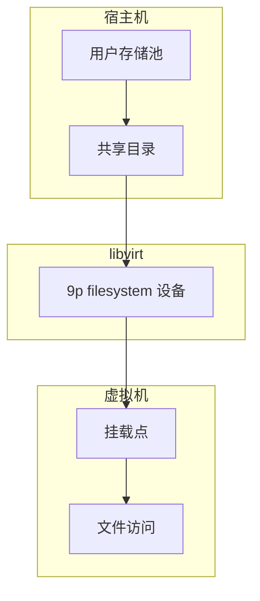
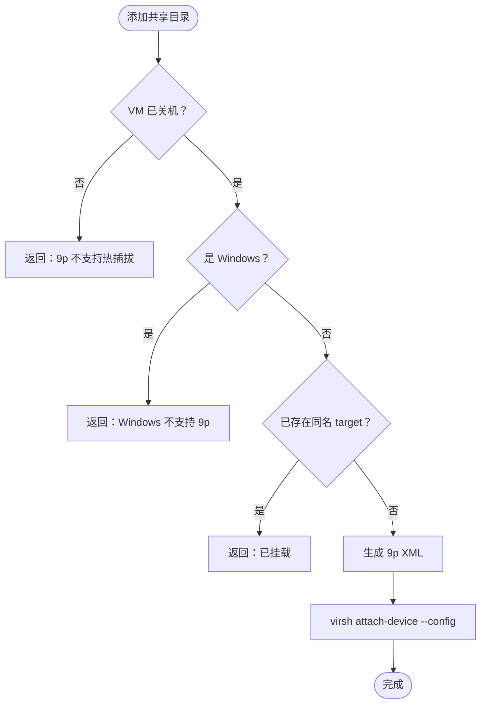

# 文件共享

文件共享功能允许用户将宿主机目录挂载到虚拟机内部，实现宿主机与虚拟机之间的文件交换。系统基于 libvirt 的 9p filesystem（Plan 9 文件系统协议）实现，通过 `virsh attach-device` 将共享目录以 virtio 设备形式注入虚拟机 XML 配置。

## 功能概述



### 核心能力

| 功能 | 说明 |
|------|------|
| **共享目录管理** | 添加、删除、列出虚拟机的共享目录 |
| **访问模式控制** | 支持只读（readonly）和读写（readwrite）两种模式 |
| **安全模型** | 支持 mapped 和 passthrough 两种安全模型，默认使用 mapped |
| **用户存储集成** | 用户存储池的 ISO 和共享目录通过相同机制挂载到 VM |

## 9p filesystem 技术说明

9p filesystem 是基于 Plan 9 文件系统协议（9P2000.L）的虚拟化文件共享方案：

### 协议特性

| 特性 | 说明 |
|------|------|
| **协议版本** | 9P2000.L，支持 Linux 文件语义 |
| **传输层** | 通过 virtio 传输，性能优于传统网络文件系统 |
| **安全模型** | mapped（权限映射）/ passthrough（直接透传） |
| **热插拔** | 不支持，添加/删除共享目录需要 VM 关机 |

### 安全模型对比

| 模型 | 权限处理 | 适用场景 | 安全性 |
|------|----------|----------|--------|
| **mapped** | QEMU 映射文件权限，以 libvirt-qemu 用户身份访问 | 多租户环境 | 高 |
| **passthrough** | 直接透传宿主机文件权限 | 受控环境 | 中 |

## 共享目录管理

### 添加共享目录

添加共享目录需要虚拟机处于关机状态，系统会自动完成以下操作：



### XML 配置格式

共享目录使用以下 XML 格式配置：

```xml
<filesystem type='mount' accessmode='mapped'>
  <source dir='/path/on/host'/>
  <target dir='share_tag'/>
  <security_model model='mapped'/>
  <readonly/>  <!-- 可选，只读模式 -->
</filesystem>
```

### 删除共享目录

删除共享目录通过以下步骤实现：

1. 检查 VM 是否处于关机状态
2. 从 VM XML 中移除对应的 `<filesystem>` 节
3. 使用 `virsh define` 重新定义 VM 配置

## 使用限制

| 限制项 | 说明 | 解决方案 |
|--------|------|----------|
| **热插拔** | 不支持运行中添加/卸载 | 先关机再操作 |
| **Windows 支持** | Windows 客户机不支持 9p | 使用其他文件交换方式 |
| **性能** | IO 性能低于本地文件系统 | 仅用于轻量文件交换 |

## 故障排查

### 常见问题

| 问题 | 原因 | 解决方案 |
|------|------|----------|
| 添加失败："虚拟机正在运行中" | 9p 不支持热插拔 | 先关机再操作 |
| 添加失败："Windows 虚拟机不支持" | Windows 缺少 9p 驱动 | 使用其他文件交换方式 |
| VM 内无法看到共享目录 | 未在 VM 内挂载 | 执行挂载命令 |

### VM 内挂载命令

在虚拟机内部执行以下命令挂载共享目录：

```bash
# 创建挂载点
sudo mkdir -p /mnt/shared

# 挂载共享目录
sudo mount -t 9p -o trans=virtio,version=9p2000.L <tag> /mnt/shared

# 示例
sudo mount -t 9p -o trans=virtio,version=9p2000.L user_test_share /mnt/shared
```

### 检查 9p 内核模块

如果挂载失败，检查内核是否加载了 9p 模块：

```bash
# 检查模块
lsmod | grep 9p

# 加载模块（如果未加载）
sudo modprobe 9pnet_virtio
```

## 最佳实践

1. **命名规范**：使用有意义的标签名，如 `user_<username>_share`
2. **权限控制**：生产环境建议使用只读模式，避免意外修改
3. **目录选择**：避免共享系统关键目录，使用专用的共享目录
4. **Windows 替代方案**：对于 Windows VM，考虑使用 SMB/CIFS 共享
