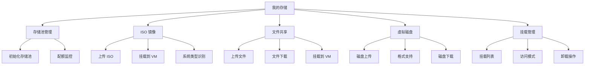
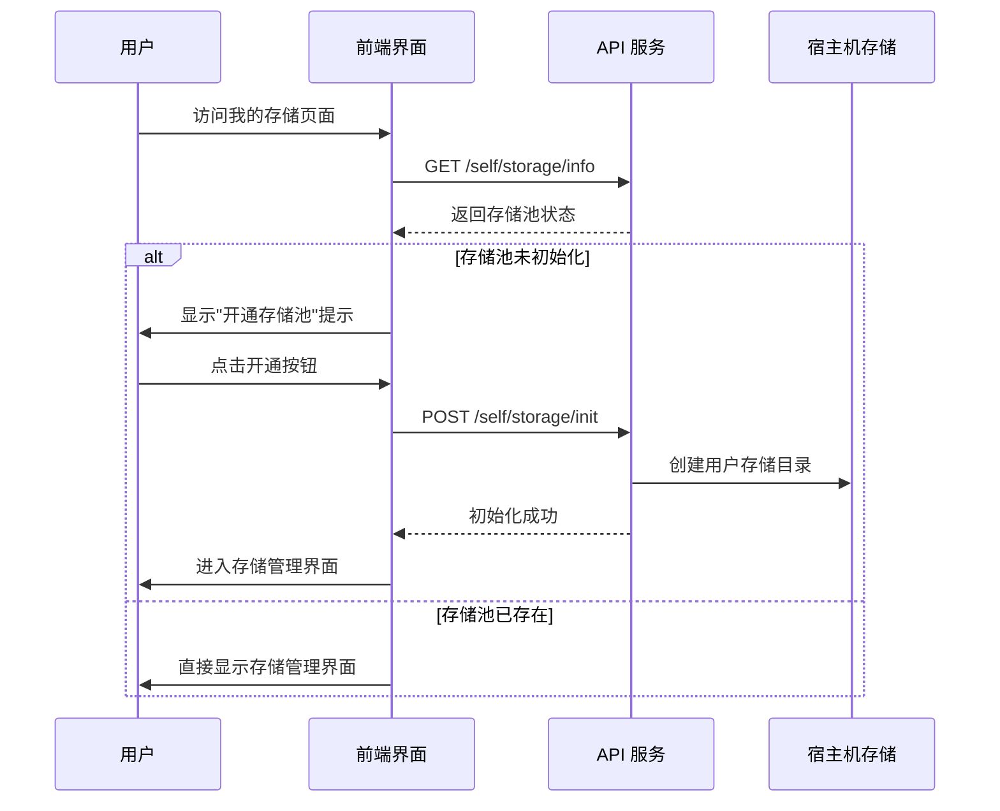
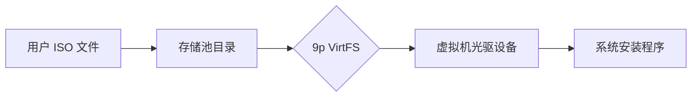
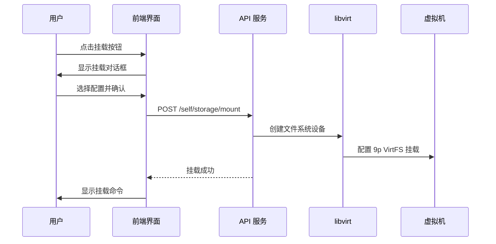
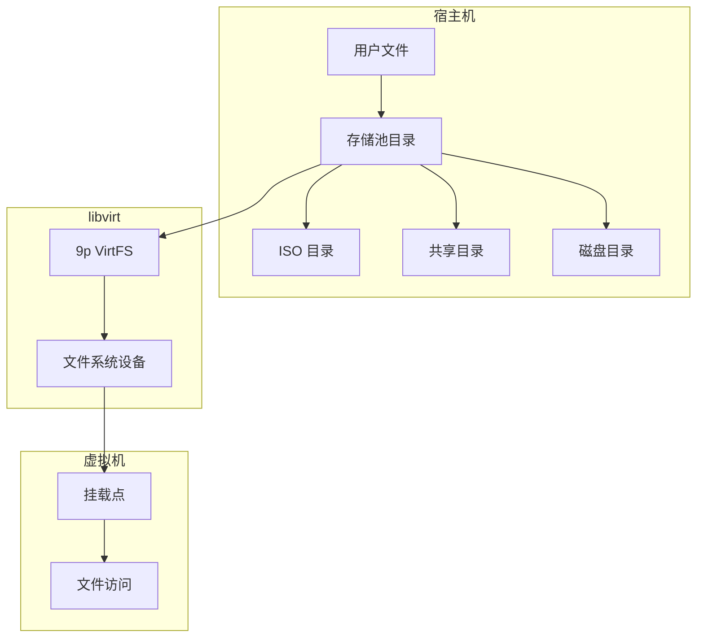
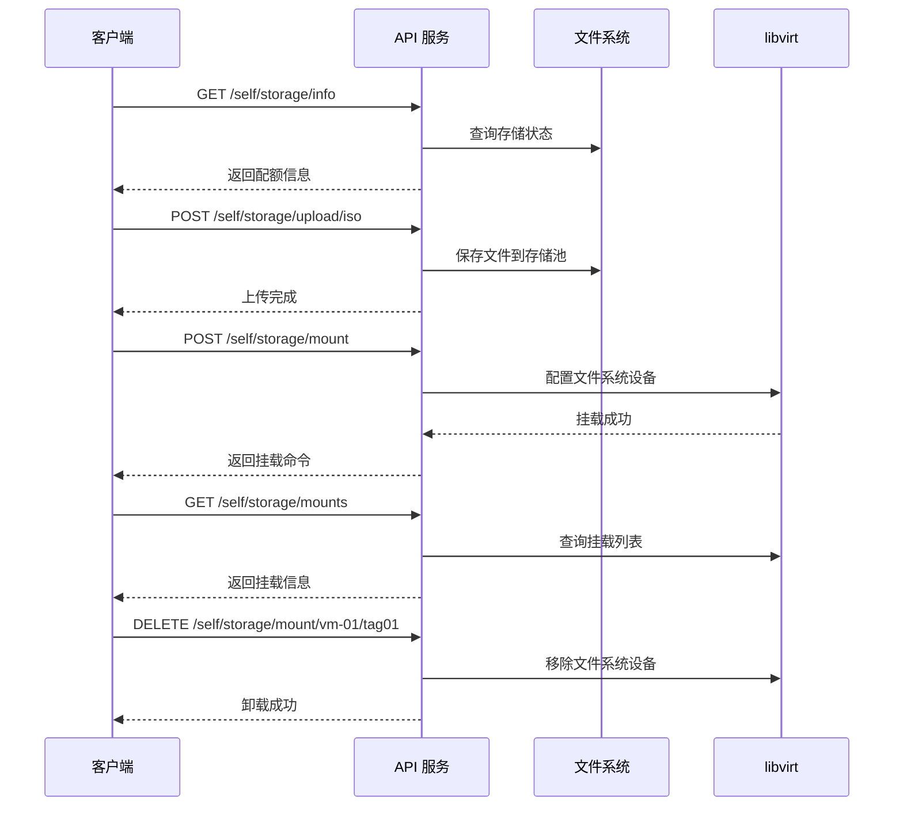

# 我的存储

我的存储是 QVMConsole 面向用户的个人存储管理中心，提供了 ISO 镜像、共享文件和虚拟磁盘的全生命周期管理能力。用户可以通过统一的界面完成文件上传、存储监控、挂载配置等操作，并借助 9p VirtFS 协议将存储资源无缝对接到虚拟机实例中。

## 功能概述



### 访问权限

| 特性 | 说明 |
|------|------|
| **路由** | `/my-storage` |
| **访问范围** | 所有用户（轻量云用户除外） |
| **存储隔离** | 每个用户拥有独立的存储空间 |

## 存储池初始化

存储池是用户个人存储空间的基础设施，首次使用"我的存储"功能时，系统会引导用户完成存储池的开通流程。

### 初始化流程



:::info[初始化说明]
存储池初始化是一次性操作，完成后用户即可使用所有文件管理功能。初始化过程会自动为用户创建独立的存储目录，确保数据隔离。
:::

## 配额监控

配额监控系统实时追踪用户的存储使用情况，帮助用户合理规划存储资源。

### 配额卡片信息

| 信息项 | 说明 |
|--------|------|
| **已用空间** | 当前存储池中所有文件占用的总空间 |
| **配额上限** | 系统分配给用户的最大存储容量（GB） |
| **使用率** | 已用空间与配额上限的百分比 |

### 使用率状态指示

| 使用率范围 | 状态颜色 | 系统行为 |
|-----------|----------|----------|
| 0% - 70% | 绿色 | 正常使用 |
| 70% - 90% | 黄色 | 警告提示，建议清理空间 |
| 90% - 100% | 红色 | 危险警告，上传功能受限 |
| 超过 100% | 红色 | 只读模式，无法上传新文件 |

:::warning[只读模式]
当存储配额超限时，系统将自动切换到只读模式。在此模式下，用户无法上传新的文件，但可以继续管理现有文件（删除、下载、挂载等操作不受影响）。
:::

## ISO 镜像管理

ISO 镜像管理功能专注于操作系统安装镜像的存储与分发，支持将 ISO 文件高效挂载到虚拟机中进行系统安装。

### 功能特性

| 功能 | 说明 |
|------|------|
| **文件上传** | 支持上传 `.iso` 格式的镜像文件 |
| **系统识别** | 自动识别 ISO 文件的系统类型（Windows/Linux） |
| **挂载管理** | 将 ISO 镜像挂载到虚拟机的虚拟光驱 |
| **批量操作** | 支持批量删除多个 ISO 文件 |

### ISO 列表字段

| 字段 | 说明 |
|------|------|
| **文件名** | ISO 文件的原始名称 |
| **系统类型** | 自动识别的操作系统类型 |
| **文件大小** | ISO 文件占用的存储空间 |
| **上传时间** | 文件上传到存储池的时间 |

### ISO 挂载原理



ISO 镜像通过 9p VirtFS 协议挂载到虚拟机中，虚拟机将其识别为光驱设备（CD-ROM），用户可以在虚拟机内部直接访问 ISO 文件内容，主要用于操作系统安装和软件部署场景。

## 文件共享管理

文件共享功能提供了一个灵活的文件交换通道，允许用户在宿主机与虚拟机之间高效传输文件。

### 功能特性

| 功能 | 说明 |
|------|------|
| **文件上传** | 支持上传任意格式的文件 |
| **文件下载** | 将虚拟机中的文件下载到本地 |
| **挂载管理** | 将共享目录挂载到虚拟机 |
| **访问控制** | 支持只读和读写两种访问模式 |

### 共享文件列表字段

| 字段 | 说明 |
|------|------|
| **文件名** | 文件的原始名称 |
| **文件大小** | 文件占用的存储空间 |
| **上传时间** | 文件上传到存储池的时间 |

### 访问模式对比

| 模式 | 读取权限 | 写入权限 | 典型场景 |
|------|----------|----------|----------|
| **只读** | 允许 | 禁止 | 分发软件包、配置文件模板 |
| **读写** | 允许 | 允许 | 开发环境文件同步、数据备份 |

## 虚拟磁盘管理

虚拟磁盘管理功能支持多种主流虚拟化磁盘格式的上传与管理，这些磁盘文件可用于创建新虚拟机或作为数据盘挂载到现有虚拟机。

### 支持的磁盘格式

| 格式 | 扩展名 | 来源平台 | 说明 |
|------|--------|----------|------|
| **QCOW2** | `.qcow2` | QEMU/KVM | QEMU 原生格式，支持快照和压缩 |
| **RAW** | `.raw` | 通用 | 原始磁盘映像，性能最优 |
| **VMDK** | `.vmdk` | VMware | VMware 虚拟磁盘格式 |
| **VHD** | `.vhd` | Hyper-V | 虚拟硬盘格式（旧版） |
| **VHDX** | `.vhdx` | Hyper-V | 虚拟硬盘格式（新版，支持更大容量） |
| **IMG** | `.img` | 通用 | 通用磁盘映像格式 |

### 磁盘文件列表字段

| 字段 | 说明 |
|------|------|
| **文件名** | 磁盘文件的原始名称 |
| **文件大小** | 磁盘文件占用的存储空间 |
| **上传时间** | 文件上传到存储池的时间 |

:::tip[格式转换]
如果您的虚拟磁盘文件格式不在支持列表中，可以使用 `qemu-img convert` 工具进行格式转换。例如，将 VDI 格式转换为 QCOW2 格式。
:::

## 挂载管理

挂载管理提供了虚拟机与存储资源之间连接关系的全局视图，用户可以在此查看和管理所有挂载实例。

### 挂载列表字段

| 字段 | 说明 |
|------|------|
| **虚拟机名称** | 挂载目标虚拟机的名称 |
| **挂载标签** | 挂载设备的唯一标识标签 |
| **源目录** | 存储池中的源文件路径 |
| **访问模式** | 只读（RO）或读写（RW） |
| **挂载命令** | 虚拟机内挂载该目录的命令 |

### 挂载命令说明

挂载命令是 9p VirtFS 协议在虚拟机内部执行的 Linux 挂载命令，格式如下：

```bash
mount -t 9p -o trans=virtio,version=9p2000.L <tag> <mountpoint>
```

| 参数 | 说明 |
|------|------|
| `-t 9p` | 指定文件系统类型为 9p |
| `trans=virtio` | 使用 VirtIO 传输层 |
| `version=9p2000.L` | 使用 9p2000.L 协议版本 |
| `<tag>` | 挂载标签，由系统自动生成 |
| `<mountpoint>` | 虚拟机内的挂载点目录 |

:::info[一键复制]
挂载管理界面提供了一键复制功能，用户可以直接复制挂载命令并在虚拟机终端中执行，无需手动输入复杂的挂载参数。
:::

## 挂载对话框

当用户需要将存储资源挂载到虚拟机时，系统会弹出挂载对话框，引导用户完成挂载配置。

### 配置选项

| 配置项 | 类型 | 说明 |
|--------|------|------|
| **虚拟机选择** | 下拉选择 | 从用户拥有的虚拟机列表中选择目标实例 |
| **存储类别** | 单选 | ISO 镜像或文件共享 |
| **访问模式** | 开关控件 | 只读模式或读写模式 |

### 挂载流程



## 实现原理

### 存储架构



### 核心技术要点

| 技术 | 说明 |
|------|------|
| **存储池** | 基于宿主机文件系统，每个用户拥有独立的存储目录 |
| **文件上传** | 通过 HTTP multipart 上传，支持进度回调 |
| **挂载协议** | 使用 9p VirtFS 协议，通过 libvirt 文件系统设备实现 |
| **访问控制** | 只读模式下虚拟机只能读取，读写模式下可读写 |

### 9p VirtFS 协议详解

9p VirtFS 是一种轻量级的网络文件系统协议，专为虚拟化环境设计：

- **协议版本**：使用 9p2000.L 扩展，支持 Linux 文件语义
- **传输层**：通过 VirtIO 虚拟化传输层实现高效的宿主机与虚拟机通信
- **性能特点**：相比网络文件系统（NFS/SMB），9p VirtFS 在虚拟化场景下具有更低的开销
- **访问模式**：
  - **只读模式**：虚拟机只能读取挂载目录中的文件，适用于分发软件和配置文件
  - **读写模式**：虚拟机可以读写挂载目录中的文件，适用于文件同步和数据交换

## API 接口

### 存储池管理

| 接口 | 方法 | 说明 |
|------|------|------|
| `/self/storage/info` | GET | 获取存储池信息（配额、使用量） |
| `/self/storage/init` | POST | 初始化存储池 |

### 文件管理

| 接口 | 方法 | 说明 |
|------|------|------|
| `/self/storage/files/{category}` | GET | 获取文件列表（category: iso/share/disk） |
| `/self/storage/upload/{category}` | POST | 上传文件到指定类别 |
| `/self/storage/file/{category}/{filename}` | DELETE | 删除指定文件 |
| `/self/storage/isos` | GET | 获取用户 ISO 列表（用于虚拟机创建） |

### 挂载管理

| 接口 | 方法 | 说明 |
|------|------|------|
| `/self/storage/mount` | POST | 挂载存储到虚拟机 |
| `/self/storage/mount/{vmName}/{tag}` | DELETE | 卸载指定挂载 |
| `/self/storage/mounts` | GET | 获取用户所有虚拟机的挂载列表 |

### API 调用流程

