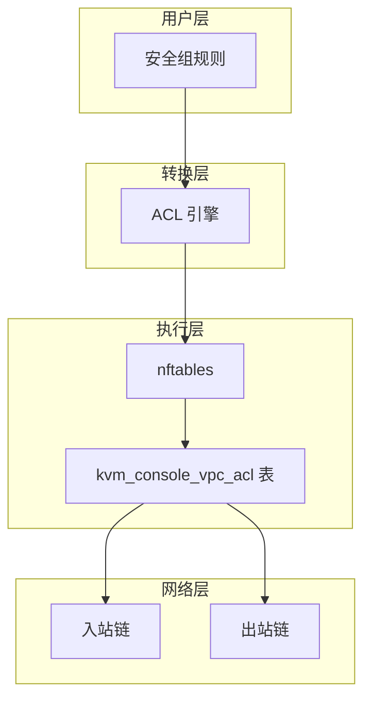
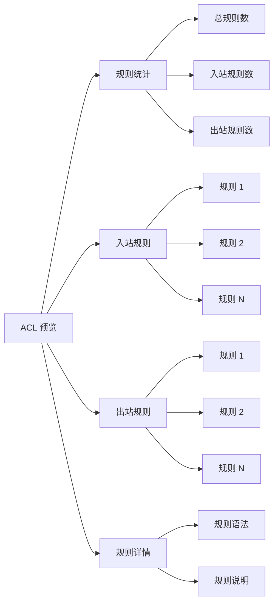
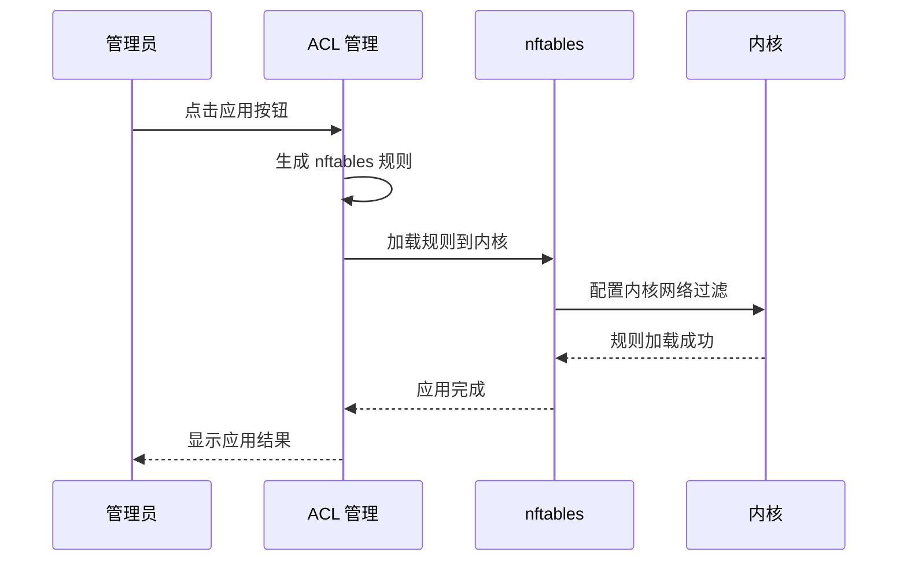
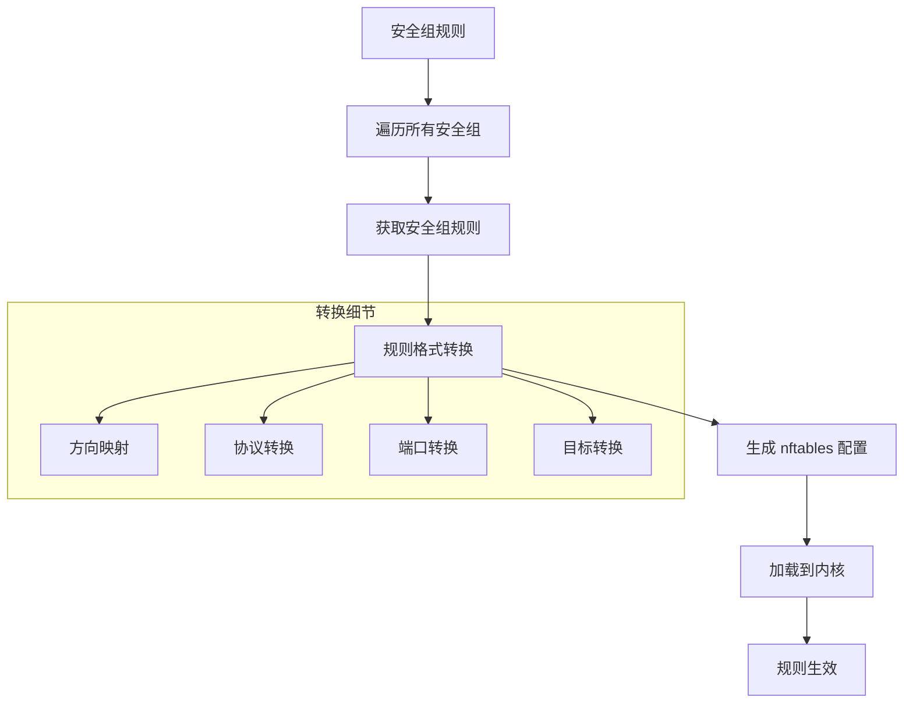
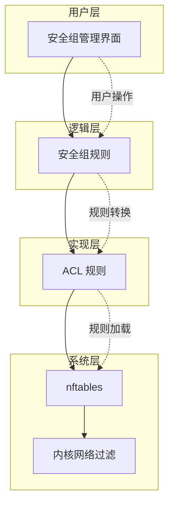
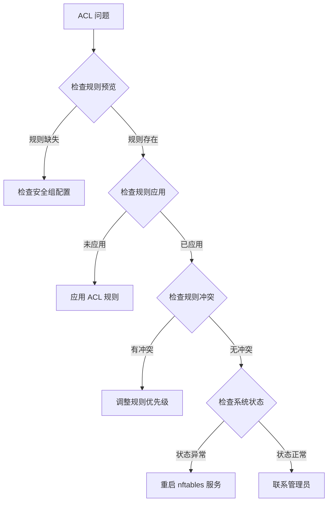

# ACL 管理

ACL（Access Control List）是 QVMConsole VPC 网络的底层访问控制机制，基于 nftables 实现。ACL 管理模块提供了对 VPC 安全组规则生成的 nftables 规则进行预览和应用的功能，是网络安全策略的最终执行层。

## ACL 架构

## ACL 预览

ACL 预览功能用于查看当前所有 VPC 安全组规则生成的 nftables 规则，帮助管理员了解当前的安全策略配置。

### 预览内容

| 内容 | 说明 |
|------|------|
| **规则总数** | 生成的 nftables 规则总数量 |
| **入站规则** | 入站方向的规则列表 |
| **出站规则** | 出站方向的规则列表 |
| **规则格式** | nftables 配置格式 |
| **生成时间** | 规则生成的时间戳 |

### 预览界面说明

### 预览规则格式

ACL 预览显示的规则格式为标准的 nftables 配置语法：

| 元素 | 说明 | 示例 |
|------|------|------|
| **表名** | nftables 表名称 | `kvm_console_vpc_acl` |
| **链名** | 规则所属的链 | `ingress`、`egress` |
| **规则** | 具体的匹配和动作 | `ip daddr 0.0.0.0/0 tcp dport 80 accept` |

:::info[预览用途]
ACL 预览功能主要用于审计和调试。在应用规则前，建议先预览规则内容，确保规则符合预期。
:::

## ACL 应用

ACL 应用功能用于将预览的 nftables 规则应用到系统，使其生效。

### 应用流程

### 应用操作说明

| 操作 | 说明 | 影响 |
|------|------|------|
| **应用规则** | 将预览的规则加载到系统 | 立即生效 |
| **重新应用** | 重新生成并应用规则 | 覆盖现有规则 |
| **清除规则** | 清除所有 ACL 规则 | 移除所有安全策略 |

:::warning[应用影响]
应用 ACL 规则会立即影响所有虚拟机的网络访问。建议在业务低峰期进行操作，并提前通知相关用户。
:::

## 实现原理

### 安全组到 ACL 的转换流程

### 规则生成逻辑

ACL 规则生成遵循以下逻辑：

| 步骤 | 说明 | 处理方式 |
|------|------|----------|
| **1** | 遍历所有安全组 | 获取安全组列表 |
| **2** | 获取安全组规则 | 读取每条规则 |
| **3** | 规则格式转换 | 转换为 nftables 语法 |
| **4** | 生成 nftables 配置 | 生成完整配置 |
| **5** | 加载到内核 | 应用到系统 |

### nftables 表结构

ACL 规则加载到 `kvm_console_vpc_acl` 表中，该表包含以下结构：

| 组件 | 说明 | 用途 |
|------|------|------|
| **表** | kvm_console_vpc_acl | 存储所有 VPC ACL 规则 |
| **链** | ingress | 处理入站流量 |
| **链** | egress | 处理出站流量 |
| **规则** | 具体的匹配规则 | 控制网络访问 |

### 链结构说明

| 链名 | 方向 | 说明 | 优先级 |
|------|------|------|--------|
| **ingress** | 入站 | 处理进入虚拟机的流量 | 高 |
| **egress** | 出站 | 处理从虚拟机发出的流量 | 高 |

### 规则转换示例

| 安全组规则 | nftables 规则 | 说明 |
|------------|---------------|------|
| 入站 TCP 80 允许 0.0.0.0/0 | `ip daddr 0.0.0.0/0 tcp dport 80 accept` | 允许所有 IP 访问 80 端口 |
| 出站 TCP 443 允许 10.0.0.0/8 | `ip saddr 10.0.0.0/8 tcp dport 443 accept` | 允许内网访问 443 端口 |
| 入站 ICMP 允许 192.168.1.0/24 | `ip saddr 192.168.1.0/24 icmp type echo-request accept` | 允许内网 Ping |

## 与安全组的关系

### 关系说明

| 关系 | 说明 |
|------|------|
| **用户界面** | 安全组是用户友好的规则管理界面 |
| **底层实现** | ACL 是安全组规则的底层实现 |
| **规则转换** | 安全组规则转换为 ACL 规则 |
| **双向同步** | 修改安全组规则后需要重新应用 ACL |

### 层次关系图

### 同步机制

| 操作 | 触发条件 | 处理方式 |
|------|----------|----------|
| **规则更新** | 修改安全组规则 | 重新生成 ACL 规则 |
| **规则应用** | 手动应用 ACL | 加载规则到内核 |
| **规则清除** | 清除所有规则 | 移除所有 ACL 规则 |

:::info[同步建议]
每次修改安全组规则后，建议重新预览和应用 ACL 规则，确保安全策略立即生效。
:::

## ACL 规则管理

### 规则查看

ACL 管理模块提供以下查看功能：

| 功能 | 说明 |
|------|------|
| **规则列表** | 查看所有 ACL 规则 |
| **规则详情** | 查看单条规则详情 |
| **规则统计** | 统计规则数量和类型 |
| **规则搜索** | 搜索特定规则 |

### 规则操作

| 操作 | 说明 | 限制 |
|------|------|------|
| **预览** | 预览生成的规则 | 只读操作 |
| **应用** | 应用规则到系统 | 需要管理员权限 |
| **清除** | 清除所有规则 | 需要管理员权限 |
| **导出** | 导出规则配置 | 只读操作 |

### 规则导出

ACL 规则支持导出为 nftables 配置文件，便于备份和迁移：

| 导出格式 | 说明 | 用途 |
|----------|------|------|
| **nftables 配置** | 标准 nftables 配置格式 | 系统备份 |
| **JSON 格式** | JSON 格式的规则数据 | 程序处理 |
| **CSV 格式** | CSV 格式的规则列表 | 数据分析 |

## ACL 最佳实践

### 管理建议

1. **定期预览**：定期预览 ACL 规则，确保规则符合预期
2. **及时应用**：修改安全组规则后及时应用 ACL
3. **备份规则**：定期导出 ACL 规则配置，便于恢复
4. **审计日志**：记录 ACL 规则变更日志，便于追溯

### 规则优化

| 优化项 | 说明 | 预期效果 |
|--------|------|----------|
| **规则合并** | 合并相似规则 | 减少规则数量 |
| **规则排序** | 按优先级排序 | 提升匹配效率 |
| **规则清理** | 删除无用规则 | 减少系统负载 |
| **规则分组** | 按功能分组 | 便于管理维护 |

### 安全建议

| 建议 | 说明 | 重要性 |
|------|------|--------|
| **最小权限** | 只开放必要端口 | 高 |
| **默认拒绝** | 默认拒绝所有访问 | 高 |
| **日志记录** | 记录规则变更日志 | 中 |
| **定期审计** | 定期审计规则配置 | 中 |

:::danger[安全警告]
ACL 规则直接控制网络访问权限，错误的规则配置可能导致安全漏洞或服务中断。建议在测试环境验证后再应用到生产环境。
:::

## 故障排除

### 常见问题

| 问题 | 可能原因 | 解决方案 |
|------|----------|----------|
| **规则不生效** | ACL 未应用 | 应用 ACL 规则 |
| **规则冲突** | 多个安全组规则冲突 | 检查规则优先级 |
| **性能下降** | 规则数量过多 | 优化规则配置 |
| **规则丢失** | 系统重启后规则丢失 | 重新应用规则 |

### 诊断步骤

### 诊断工具

| 工具 | 说明 | 用途 |
|------|------|------|
| **ACL 预览** | 查看当前规则 | 验证规则配置 |
| **nftables 状态** | 检查 nftables 服务状态 | 验证服务运行 |
| **规则计数** | 统计规则数量 | 检查规则完整性 |
| **日志查看** | 查看规则变更日志 | 追溯问题原因 |

:::tip[诊断建议]
遇到 ACL 问题时，建议先使用 ACL 预览功能检查规则配置，然后检查 nftables 服务状态。如果问题仍然存在，可以查看系统日志获取更多信息。
:::

## 高级功能

### 规则模板

ACL 支持规则模板功能，便于快速创建常用规则：

| 模板类型 | 说明 | 适用场景 |
|----------|------|----------|
| **Web 服务器** | HTTP/HTTPS 访问规则 | Web 服务部署 |
| **数据库服务器** | 数据库访问规则 | 数据库服务部署 |
| **SSH 管理** | SSH 远程管理规则 | 服务器管理 |
| **开发测试** | 宽松访问规则 | 开发测试环境 |

### 规则备份与恢复

| 操作 | 说明 | 用途 |
|------|------|------|
| **备份** | 导出当前 ACL 规则配置 | 配置备份 |
| **恢复** | 导入 ACL 规则配置 | 配置恢复 |
| **迁移** | 将规则迁移到其他环境 | 环境迁移 |

### 规则监控

ACL 支持实时监控规则匹配情况：

| 监控项 | 说明 | 用途 |
|--------|------|------|
| **匹配次数** | 规则匹配的数据包数量 | 分析访问模式 |
| **拒绝次数** | 被拒绝的数据包数量 | 发现攻击行为 |
| **流量统计** | 规则匹配的流量统计 | 流量分析 |
| **性能指标** | 规则匹配的性能指标 | 性能优化 |

:::info[监控建议]
建议启用 ACL 监控功能，实时了解网络访问情况。通过监控数据可以及时发现异常访问和潜在的安全威胁。
:::