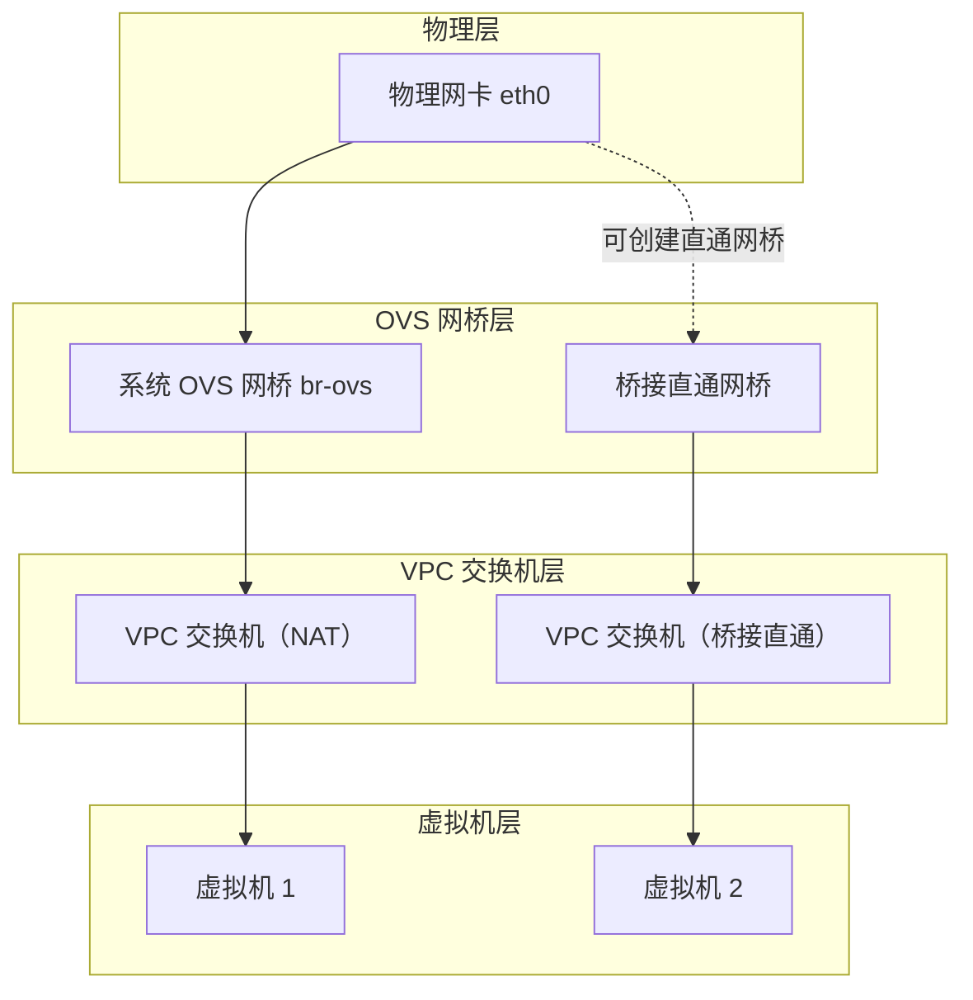

# 网络概览

网络中心是 QVMConsole 的核心网络管理枢纽，为管理员提供全局网络状态监控和配置管理能力。从管理员视角看，这里是"网络中心"；从用户视角看，则是"VPC 网络"。通过统一的网络管理界面（路由 `/network`，普通用户可见交换机与安全组标签页），管理员可以实时掌握 OVS 运行状态、网桥配置、物理网卡状态以及端口信息。

## 网络架构总览

## OVS 状态检测

OVS（Open vSwitch）是 QVMConsole 网络虚拟化的基础组件，其运行状态直接影响整个虚拟网络的稳定性。`GET /ovs/status` 返回以下信息：

### 基础状态信息

| 配置项 | 说明 |
|--------|------|
| **网桥名称** | OVS 网桥标识（默认 `br-ovs`） |
| **网关 IP / 内网 CIDR** | 系统基础网络的网关与网段 |
| **出口网卡** | 连接外部网络的物理网卡（留空自动探测默认路由网卡） |
| **网桥存在 / 网关就绪** | 网桥与网关端口状态 |
| **ip_forward 状态** | 内核 IP 转发是否启用 |
| **NAT / FORWARD 规则** | MASQUERADE、出站与回程 FORWARD 规则是否存在 |

### 服务状态监控

| 服务 | 说明 |
|------|------|
| **openvswitch 服务** | OVS 核心服务运行状态 |
| **dnsmasq 服务** | 系统基础网络的 DHCP/DNS 服务 |
| **出站 / 回程 FORWARD 规则** | 虚拟机访问外部与回包的放行规则 |

:::warning 服务异常处理
如果任何服务状态显示异常（状态接口会附带 issues 与修复建议），请使用"一键检测"进行诊断，或使用"一键修复"（高风险操作，异步任务 `ovs_repair`）尝试自动恢复。
:::

## 端口安全

概览页集成端口安全状态卡：全局开关、健康状态、预检/协调入口、逐端口策略与丢弃统计，详见 [端口安全](/docs/tech/network/port-security)。

## 宿主机网桥管理

网桥是连接物理网络和虚拟网络的桥梁。QVMConsole 管理两类网桥：

| 类型 | 说明 |
|------|------|
| **默认 NAT 网桥** | 系统 OVS 网桥（`br-ovs`），承载系统基础网络与 NAT 交换机，受保护不可删除 |
| **桥接直通网桥** | 管理员创建的 OVS 网桥，绑定物理网卡，供桥接直通模式交换机使用 |

### 创建桥接直通网桥

| 参数 | 说明 |
|------|------|
| **网桥名称** | 不超过 15 个字符，仅允许字母、数字、下划线、点、短横线 |
| **物理网卡** | 绑定的上联网卡（必须为物理网卡且未被其他网桥占用） |
| **迁移宿主机 IP** | 将物理网卡当前的 IP/网关/metric/DNS 迁移到网桥上（默认开启） |

创建流程：捕获物理网卡现有 IP 配置 → 网卡加入 OVS 网桥 → IP 迁移至网桥 → 禁用该网卡的 networkd DHCP → 写开机恢复脚本与 systemd 单元 → 恢复默认 OVS 网络与交换机运行态。

:::warning 网络中断风险
创建/删除桥接直通网桥会短暂中断该物理网卡上的网络连接（尤其是承载宿主机默认路由的网卡），请在维护窗口操作。
:::

### 删除网桥

- 受保护网桥（默认 NAT 网桥）不可删除
- 有交换机正在使用的网桥不可删除
- 开启过 IP 迁移的网桥删除时会把 IP 迁回物理网卡，并清理恢复脚本与 networkd 覆盖配置

### 开机恢复

每个桥接直通网桥会生成恢复脚本（`/etc/kvm-console/bridges/<网桥>.sh`），由 systemd 单元 `kvm-console-bridges.service` 在开机时执行，确保宿主机重启后网桥 IP/DNS 配置自动恢复；面板服务启动时也会按数据库记录重放一次。

## 物理网卡列表

`GET /network/host/interfaces` 返回宿主机物理网卡信息：

| 字段 | 说明 |
|------|------|
| **名称 / MAC / 状态 / MTU** | 网卡基础信息 |
| **IP 地址** | CIDR 地址列表 |
| **默认路由** | 是否为默认路由网卡（承载默认路由的网卡会给出风险提示） |
| **OVS 网桥 / 端口** | 已加入 OVS 时显示所属网桥与端口名 |
| **托管网桥** | 已被面板管理的网桥标识 |

## 接口 IP / DNS 配置

管理员可以在物理网卡或网桥上直接配置 IPv4 地址、网关与 DNS（`GET/PUT /network/interfaces/:name/config`）：

| 配置项 | 说明 |
|--------|------|
| **IP 地址** | 一个或多个 CIDR 地址（换行或逗号分隔） |
| **网关** | 默认网关 IP（合法 IPv4） |
| **metric** | 路由 metric |
| **DNS** | 一个或多个 DNS 服务器（空格或逗号分隔） |
| **清除配置** | 移除地址/DNS 与面板托管的静态配置 |

配置约束：

| 对象 | 是否可配置 |
|------|-----------|
| 默认 NAT 网桥（br-ovs） | 不可配置 |
| VPC 交换机网关端口 | 不可配置（由交换机管理） |
| 未开启 IP 迁移的托管网桥 | 不可配置 |
| 已加入网桥的物理网卡 | 不可配置（需在网桥上配置） |
| 其他网桥 / 独立物理网卡 | 可配置 |

持久化方式：托管网桥更新数据库记录并重写开机恢复脚本；独立物理网卡写入 systemd-networkd 静态配置（`/etc/systemd/network/10-kvm-console-static-<网卡>.network`）并 `networkctl reload`。

## OVS 端口列表

`GET /ovs/ports` 返回 OVS 端口详情：

| 字段 | 说明 |
|------|------|
| **端口名称 / ofport / 类型** | internal、tap、system 等 |
| **关联 VM / MAC** | 端口归属的虚拟机与 MAC |
| **IP 地址 / IP 来源** | 静态绑定优先，其次 DHCP 租约 |
| **异常信息** | ofport 无效、无 VM、无 IP 等问题提示 |

## DHCP 租约

`GET /ovs/leases` 展示系统基础网络的地址分配情况：

| 内容 | 说明 |
|------|------|
| **静态绑定** | VM 名称 / MAC / 固定 IP |
| **DHCP 租约** | 到期时间 / MAC / IP / 主机名 / client-id |
| **冲突检测** | IP 冲突、MAC 冲突列表与说明 |

## 一键检测与修复

| 操作 | 说明 |
|------|------|
| **一键检测**（`POST /ovs/check`） | 聚合状态、端口与租约检查结果，输出 healthy 标记、问题列表与修复建议 |
| **一键修复**（`POST /ovs/repair`） | 高风险操作：确保 OVS 与 dnsmasq 就绪 → 重建网桥与网关 → 恢复 NAT/FORWARD/ip_forward → 重新检查 |

:::tip 使用建议
建议在执行一键修复前先了解当前网络配置；修复以异步任务执行，进度可在任务中心查看。
:::

## 最佳实践

1. **网桥规划**：需要虚拟机直接接入物理网络（获取上级路由 IP）时创建桥接直通网桥，否则优先使用默认 NAT 网桥
2. **IP 管理**：网桥/网卡 IP 变更优先使用面板的接口配置功能，保证开机恢复与面板状态一致
3. **风险提示**：承载默认路由的网卡操作前确认带外访问方式，避免失联
4. **状态巡检**：定期执行一键检测，关注租约冲突与端口异常
