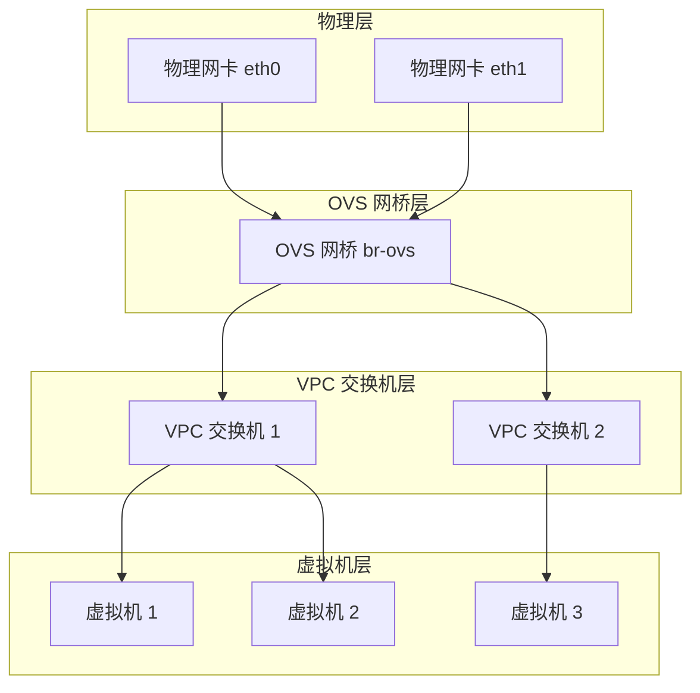
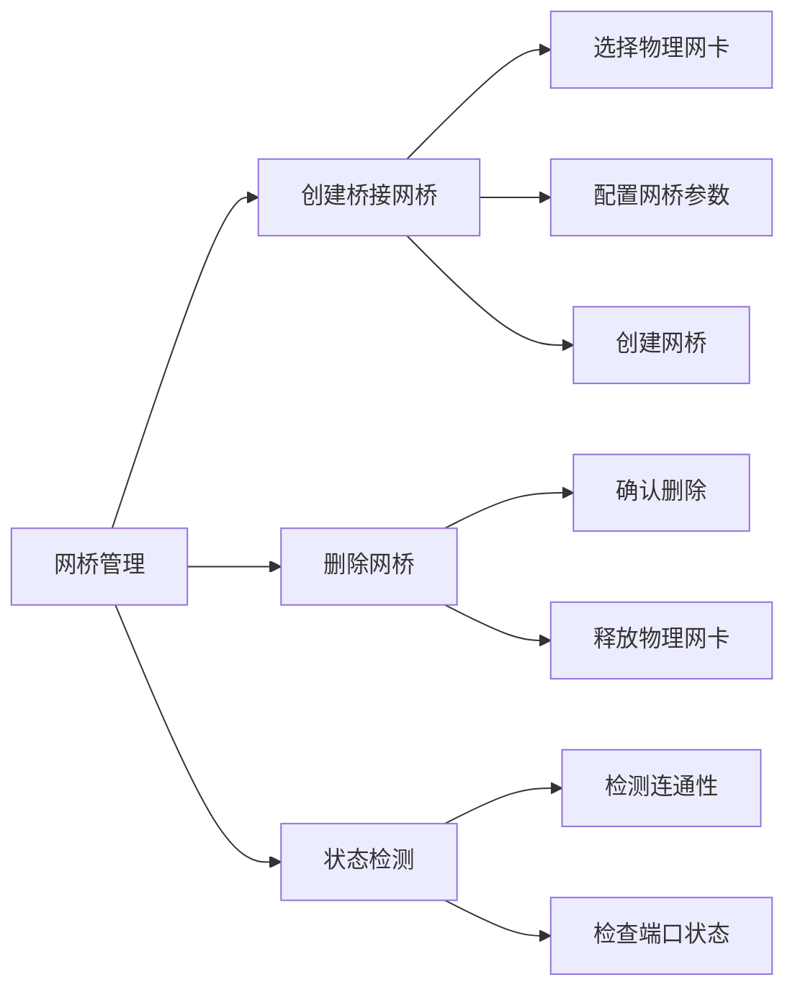
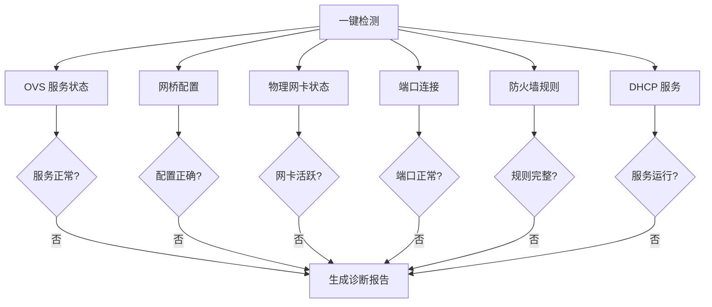

# 网络概览

网络中心是 QVMConsole 的核心网络管理枢纽，为管理员提供全局网络状态监控和配置管理能力。从管理员视角看，这里是"网络中心"；从用户视角看，则是"VPC 网络"。通过统一的网络管理界面，管理员可以实时掌握 OVS 运行状态、网桥配置、物理网卡状态以及端口信息。

## 网络架构总览

## OVS 状态检测

OVS（Open vSwitch）是 QVMConsole 网络虚拟化的基础组件，其运行状态直接影响整个虚拟网络的稳定性。

### 状态指示器

| 状态 | 图标 | 含义 | 处理建议 |
|------|------|------|----------|
| **运行正常** | 绿色 | OVS 服务正常运行，所有功能可用 | 无需操作 |
| **需要关注** | 黄色 | OVS 服务存在异常或配置问题 | 检查服务状态和配置 |

### 基础状态信息

网络概览页面展示以下基础状态信息：

| 配置项 | 说明 | 示例值 |
|--------|------|--------|
| **网桥名称** | OVS 网桥的标识名称 | `br-ovs` |
| **网关 IP** | 虚拟网络的网关地址 | `192.168.100.1` |
| **内网 CIDR** | 内部网络的地址段 | `192.168.100.0/24` |
| **出口网卡** | 连接外部网络的物理网卡 | `eth0` |
| **ip_forward 状态** | 内核 IP 转发功能 | 已启用/已禁用 |
| **NAT 规则** | 网络地址转换规则状态 | 已配置/未配置 |

## 服务状态监控

QVMConsole 监控多个关键服务的运行状态，确保网络功能正常：

### 服务状态列表

| 服务名称 | 说明 | 正常状态 |
|----------|------|----------|
| **openvswitch-switch** | OVS 核心服务 | 运行中 |
| **OVS dnsmasq** | DHCP 和 DNS 服务 | 运行中 |
| **出站 FORWARD 规则** | 允许虚拟机访问外部网络 | 已启用 |
| **回程 FORWARD 规则** | 允许外部网络访问虚拟机 | 已启用 |

:::warning[服务异常处理]
如果任何服务状态显示异常，请使用"一键检测"功能进行诊断，或使用"一键修复"功能尝试自动恢复。
:::

## 宿主机网桥管理

网桥是连接物理网络和虚拟网络的桥梁，QVMConsole 支持管理 OVS 网桥和 Linux 桥接网桥。

### 网桥列表信息

| 字段 | 说明 |
|------|------|
| **网桥名称** | 网桥的唯一标识 |
| **类型** | OVS 网桥或 Linux 桥接 |
| **物理网卡** | 关联的物理网卡名称 |
| **状态** | 活跃/非活跃/异常 |

### 网桥操作

### 创建桥接网桥

创建桥接网桥时需要配置以下参数：

| 参数 | 说明 | 必填 |
|------|------|------|
| **网桥名称** | 自定义网桥名称 | 是 |
| **物理网卡** | 绑定的物理网卡 | 是 |
| **IP 地址** | 网桥 IP 地址 | 否 |
| **子网掩码** | 网络掩码 | 否 |

:::info[网桥类型说明]
OVS 网桥由 Open vSwitch 管理，支持高级网络功能；Linux 桥接是传统桥接方式，兼容性更好。根据实际需求选择合适的网桥类型。
:::

## 物理网卡列表

物理网卡是网络通信的硬件基础，QVMConsole 提供详细的网卡状态监控。

### 网卡信息字段

| 字段 | 说明 | 示例 |
|------|------|------|
| **名称** | 网卡设备名称 | `eth0` |
| **状态** | 网卡运行状态 | 活跃/非活跃 |
| **MAC 地址** | 硬件地址 | `00:11:22:33:44:55` |
| **IP 地址** | 分配的 IP 地址 | `192.168.1.100` |
| **默认路由** | 是否为默认路由网卡 | 是/否 |
| **OVS 网桥** | 关联的 OVS 网桥 | `br-ovs` |
| **风险提示** | 潜在风险警告 | 无/配置异常 |

:::danger[风险提示]
如果物理网卡显示风险提示，请立即检查配置。常见的风险包括：网卡未绑定网桥、IP 地址冲突、MTU 不匹配等。
:::

## OVS 端口列表

OVS 端口是虚拟网络连接的端点，每个端口对应一个虚拟机或内部接口。

### 端口信息字段

| 字段 | 说明 |
|------|------|
| **端口名称** | OVS 端口标识 |
| **ofport** | OpenFlow 端口号 |
| **类型** | 端口类型（internal、tap 等） |
| **关联 VM** | 连接的虚拟机名称 |
| **IP 地址** | 端口分配的 IP 地址 |
| **异常信息** | 端口状态异常提示 |

### 端口类型说明

| 类型 | 说明 | 用途 |
|------|------|------|
| **internal** | OVS 内部端口 | 网桥自身接口 |
| **tap** | TAP 设备端口 | 虚拟机网络接口 |
| **patch** | 补丁端口 | 网桥间连接 |
| **system** | 系统端口 | 物理网卡绑定 |

## 一键检测与修复

QVMConsole 提供智能化的网络诊断和修复功能，帮助管理员快速定位和解决问题。

### 一键检测

一键检测功能会检查以下项目：

### 一键修复

一键修复功能可以自动处理以下常见问题：

| 问题类型 | 修复操作 |
|----------|----------|
| **OVS 服务未运行** | 重启 openvswitch-switch 服务 |
| **网桥配置错误** | 重新配置网桥参数 |
| **端口连接异常** | 重新建立端口连接 |
| **防火墙规则缺失** | 重新生成防火墙规则 |
| **DHCP 服务异常** | 重启 dnsmasq 服务 |

:::tip[使用建议]
建议在执行一键修复前先备份当前网络配置。修复操作会自动记录日志，便于后续排查问题。
:::

## 最佳实践

### 网络规划建议

1. **网桥规划**：为不同用途的虚拟机创建独立的网桥，便于管理和隔离
2. **IP 地址管理**：使用 CIDR 表示法统一管理 IP 地址段，避免地址冲突
3. **物理网卡绑定**：将关键业务绑定到特定物理网卡，确保网络稳定性
4. **监控告警**：定期检查网络状态，设置异常告警机制

### 性能优化

| 优化项 | 说明 | 预期效果 |
|--------|------|----------|
| **巨型帧** | 调整 MTU 值为 9000 | 提升大文件传输效率 |
| **多队列** | 启用网卡多队列 | 提升并发处理能力 |
| **SR-IOV** | 使用 SR-IOV 直通 | 降低网络延迟 |
| **绑定模式** | 配置网卡绑定 | 提升带宽和冗余 |

:::info[性能监控]
QVMConsole 提供实时的网络性能监控，包括带宽使用率、数据包统计、错误计数等指标。通过这些数据可以及时发现性能瓶颈并进行优化。
:::