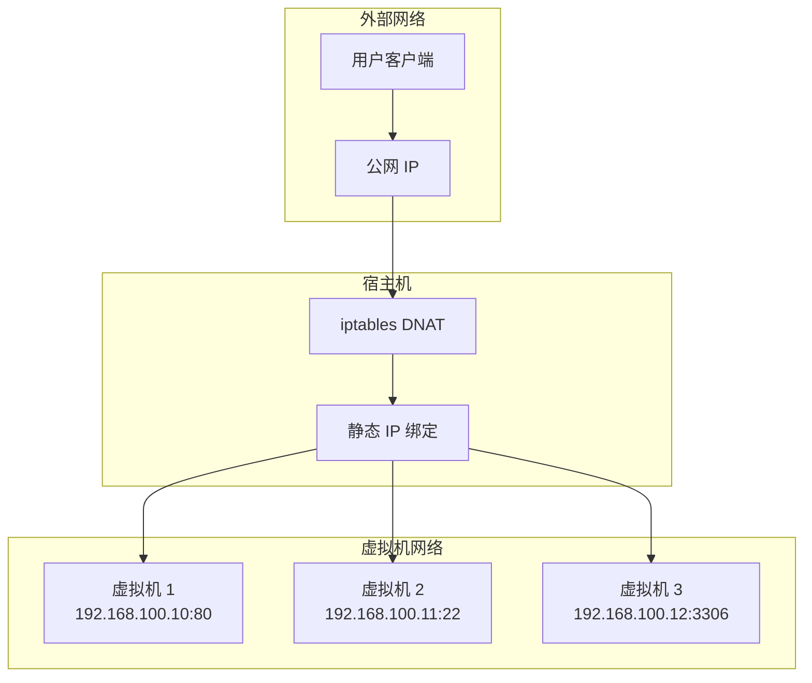
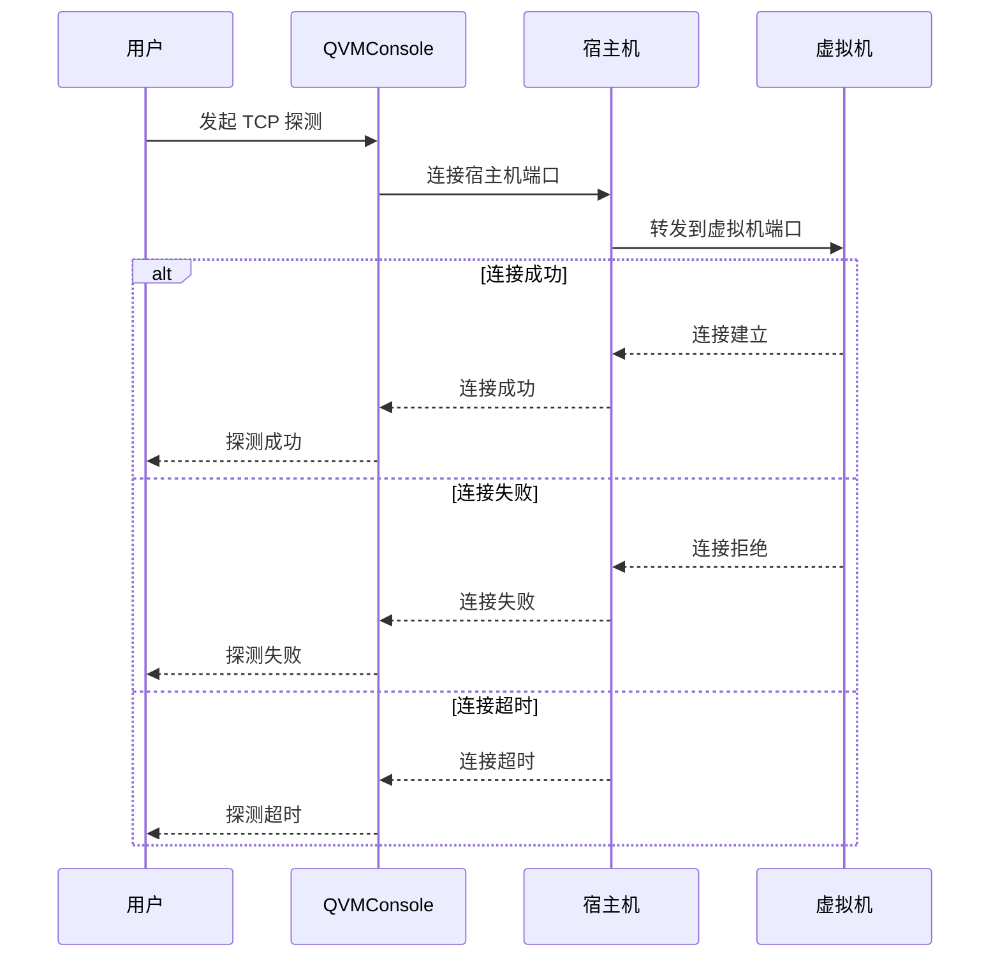
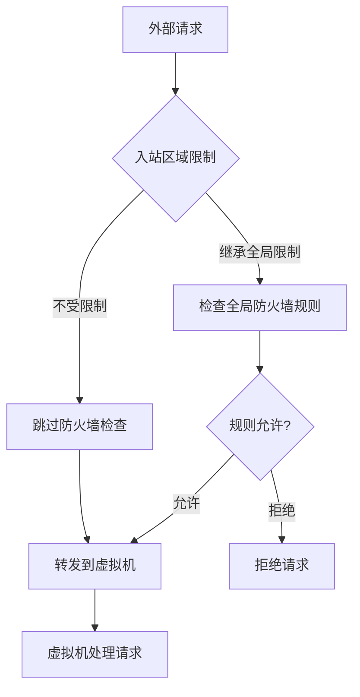
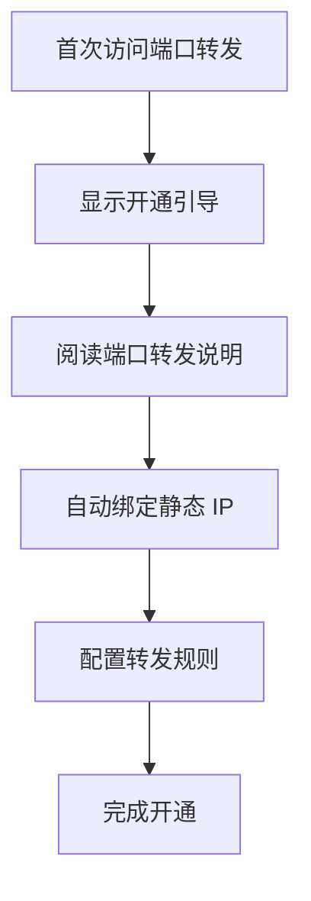
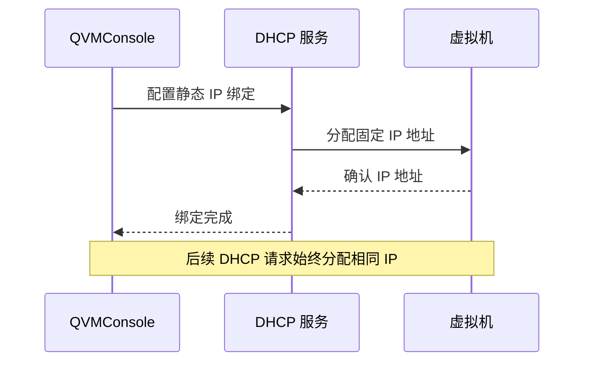
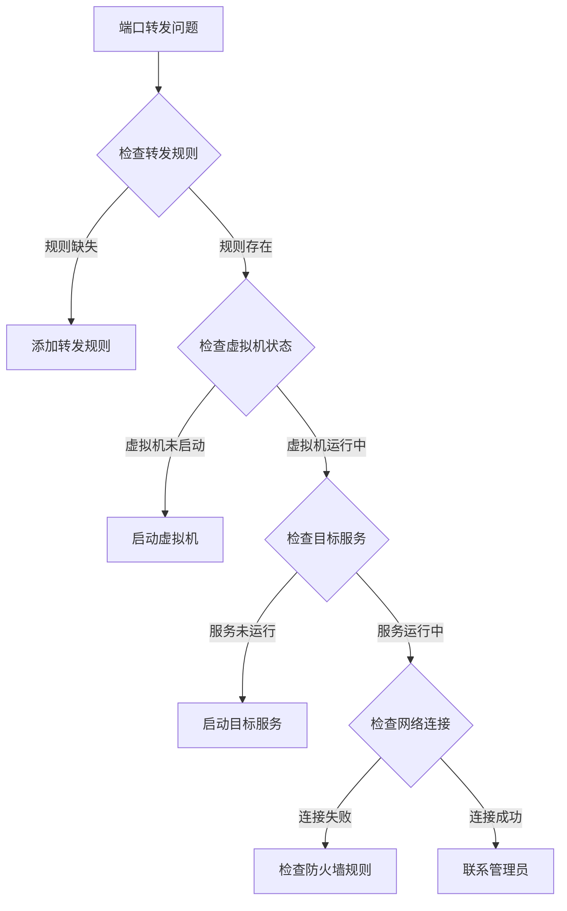

# 端口转发

端口转发是 QVMConsole 网络管理的重要功能，用于将宿主机的公网端口流量转发到虚拟机的内网端口。通过端口转发，用户可以从外部网络访问虚拟机上运行的服务，如 Web 服务器、数据库、SSH 等。

## 端口转发架构



## 端口转发列表

端口转发列表展示所有已配置的转发规则，包含以下信息：

### 列表字段说明

| 字段 | 说明 | 示例 |
|------|------|------|
| **宿主机端口** | 宿主机上监听的端口号 | `8080` |
| **目标 IP** | 虚拟机的内网 IP 地址 | `192.168.100.10` |
| **目标端口** | 虚拟机上服务监听的端口 | `80` |
| **协议** | 网络协议类型 | `TCP`、`UDP`、`both` |
| **状态** | 转发规则状态 | 活跃/非活跃 |
| **完整访问地址** | 系统生成的访问地址 | `tcp://1.2.3.4:8080` |

### 状态说明

| 状态 | 图标 | 含义 | 处理建议 |
|------|------|------|----------|
| **活跃** | 绿色 | 转发规则正常工作 | 无需操作 |
| **非活跃** | 灰色 | 转发规则未启用 | 检查配置或启用规则 |
| **异常** | 红色 | 转发规则配置错误 | 检查目标 IP 和端口 |

## 端口转发操作

### 添加转发规则

添加端口转发规则时需要配置以下参数：

| 配置项 | 说明 | 必填 | 示例 |
|--------|------|------|------|
| **宿主机端口** | 宿主机上监听的端口号 | 是 | `8080` |
| **目标 IP** | 虚拟机的内网 IP 地址 | 是 | `192.168.100.10` |
| **目标端口** | 虚拟机上服务监听的端口 | 是 | `80` |
| **协议** | 网络协议类型 | 是 | `TCP` |

### 协议类型说明

| 协议 | 说明 | 适用场景 |
|------|------|----------|
| **TCP** | 传输控制协议 | Web 服务、数据库、SSH |
| **UDP** | 用户数据报协议 | DNS、游戏服务器、视频流 |
| **both** | TCP 和 UDP | 需要同时支持两种协议的服务 |

### 编辑转发规则

编辑转发规则时可以修改以下配置：

| 可修改项 | 说明 | 限制 |
|----------|------|------|
| **宿主机端口** | 宿主机监听端口 | 需避免端口冲突 |
| **目标 IP** | 虚拟机 IP 地址 | 需为有效内网 IP |
| **目标端口** | 虚拟机服务端口 | 需为有效端口 |
| **协议** | 网络协议 | - |

### 删除转发规则

支持单条删除和批量删除：

| 删除方式 | 说明 | 适用场景 |
|----------|------|----------|
| **单条删除** | 删除单条转发规则 | 删除个别规则 |
| **批量删除** | 选中多条规则批量删除 | 清理大量规则 |

:::warning[删除确认]
删除端口转发规则后，外部网络将无法通过原端口访问虚拟机服务。请确认后再执行删除操作。
:::

## 完整访问地址

系统自动生成完整的访问地址，方便用户快速访问虚拟机服务。

### 地址格式

```
协议://公网IP:宿主机端口
```

### 地址示例

| 协议 | 公网 IP | 宿主机端口 | 完整地址 |
|------|---------|------------|----------|
| **tcp** | `1.2.3.4` | `8080` | `tcp://1.2.3.4:8080` |
| **udp** | `1.2.3.4` | `5353` | `udp://1.2.3.4:5353` |
| **both** | `1.2.3.4` | `8080` | `tcp://1.2.3.4:8080` |

### 一键复制功能

完整访问地址支持一键复制功能，点击复制按钮即可将地址复制到剪贴板。

:::info[复制功能说明]
在 HTTP 环境下，复制功能会自动降级使用兼容方案，确保在各种环境下都能正常工作。
:::

## TCP 探测功能

TCP 探测功能用于自动检测端口转发是否可用，帮助用户快速验证配置是否正确。

### 探测状态

| 状态 | 图标 | 含义 | 处理建议 |
|------|------|------|----------|
| **成功** | 绿色 | 端口转发正常工作 | 无需操作 |
| **失败** | 红色 | 端口转发不可用 | 检查虚拟机服务状态 |
| **超时** | 黄色 | 探测超时 | 检查网络连接和防火墙 |

### 探测流程



### 探测原理

TCP 探测通过以下步骤验证端口转发：

1. **建立连接**：尝试连接宿主机的公网端口
2. **转发验证**：验证 iptables DNAT 规则是否正确转发
3. **服务验证**：验证虚拟机服务是否正常监听
4. **结果返回**：返回探测结果和耗时

## 入站区域限制

入站区域限制功能用于控制端口转发是否继承全局防火墙的入站区域限制。

### 区域限制说明

| 设置 | 说明 | 安全性 |
|------|------|--------|
| **继承全局限制** | 端口转发受全局防火墙规则限制 | 高 |
| **不受限制** | 端口转发不受全局防火墙规则限制 | 低 |

### 区域限制工作原理



:::danger[安全警告]
建议保持"继承全局限制"设置，除非有特殊需求。不受限制的端口转发可能带来安全风险。
:::

## 端口转发白名单

端口转发白名单用于控制哪些用户和虚拟机可以使用端口转发功能。

### 用户白名单

用户白名单控制哪些用户可以使用端口转发：

| 配置项 | 说明 |
|--------|------|
| **白名单用户** | 允许使用端口转发的用户列表 |
| **非白名单用户** | 无法创建端口转发规则 |

### VM 白名单

VM 白名单控制哪些虚拟机可以使用端口转发：

| 配置项 | 说明 |
|--------|------|
| **白名单 VM** | 允许使用端口转发的虚拟机列表 |
| **非白名单 VM** | 无法创建端口转发规则 |

### 建站探测

建站探测功能用于检测非白名单用户的 HTTP 端口是否被用于建站：

| 功能 | 说明 | 处理方式 |
|------|------|----------|
| **HTTP 探测** | 检测 HTTP 端口是否运行 Web 服务 | 自动封禁 |
| **HTTPS 探测** | 检测 HTTPS 端口是否运行 Web 服务 | 自动封禁 |

:::warning[建站探测]
非白名单用户的 HTTP 端口会被自动探测，如果检测到建站行为，系统会自动封禁该端口。建议将需要建站的用户添加到白名单中。
:::

## 开通引导

首次使用端口转发功能时，系统会显示开通引导，帮助用户完成初始配置。

### 开通引导流程



### 开通引导内容

| 步骤 | 说明 | 操作 |
|------|------|------|
| **1** | 阅读端口转发说明 | 了解功能和限制 |
| **2** | 自动绑定静态 IP | 确保 IP 地址稳定 |
| **3** | 配置转发规则 | 添加端口转发规则 |
| **4** | 完成开通 | 开始使用端口转发 |

### 静态 IP 绑定

静态 IP 绑定是端口转发的必要条件，确保虚拟机的 IP 地址不会因 DHCP 变化而改变。

| 绑定方式 | 说明 | 适用场景 |
|----------|------|----------|
| **自动绑定** | 系统自动绑定静态 IP | 首次开通 |
| **手动绑定** | 手动绑定静态 IP | 已有虚拟机 |

:::info[静态 IP 重要性]
端口转发依赖于固定的 IP 地址。如果虚拟机的 IP 地址发生变化，端口转发规则将失效。静态 IP 绑定确保 IP 地址稳定，避免转发规则失效。
:::

## 实现原理

端口转发基于 iptables DNAT 规则实现，通过网络地址转换将外部流量转发到虚拟机。

### iptables DNAT 规则

| 规则类型 | 说明 | 示例 |
|----------|------|------|
| **DNAT** | 目标地址转换 | `-j DNAT --to-destination 192.168.100.10:80` |
| **SNAT** | 源地址转换 | `-j SNAT --to-source 1.2.3.4` |

### 规则生成示例

```bash
# 入站 DNAT 规则
iptables -t nat -A PREROUTING -p tcp --dport 8080 -j DNAT --to-destination 192.168.100.10:80

# 出站 SNAT 规则
iptables -t nat -A POSTROUTING -p tcp -d 192.168.100.10 --dport 80 -j SNAT --to-source 1.2.3.4
```

### 静态 IP 绑定原理



## 端口转发最佳实践

### 规划建议

1. **端口规划**：提前规划宿主机端口分配，避免冲突
2. **IP 绑定**：确保所有转发规则都绑定静态 IP
3. **安全策略**：结合安全组规则，限制访问来源
4. **监控告警**：定期检查端口转发状态，设置异常告警

### 常见应用场景

| 场景 | 宿主机端口 | 目标端口 | 协议 | 说明 |
|------|------------|----------|------|------|
| **Web 服务** | 80, 443 | 80, 443 | TCP | 对外提供 Web 服务 |
| **SSH 管理** | 2222 | 22 | TCP | 远程管理虚拟机 |
| **数据库** | 3306 | 3306 | TCP | 外部访问数据库 |
| **游戏服务器** | 25565 | 25565 | TCP/UDP | 游戏服务器端口 |

### 性能优化

| 优化项 | 说明 | 预期效果 |
|--------|------|----------|
| **端口复用** | 使用不同端口映射同一服务 | 避免端口冲突 |
| **协议选择** | 根据服务选择合适协议 | 提升传输效率 |
| **连接限制** | 配置连接数限制 | 防止资源耗尽 |

:::tip[性能建议]
对于高并发场景，建议使用 TCP 协议并配置连接数限制。UDP 协议适合实时性要求高的场景，但需要注意数据包丢失问题。
:::

## 故障排除

### 常见问题

| 问题 | 可能原因 | 解决方案 |
|------|----------|----------|
| **无法访问** | 端口转发规则未配置 | 添加转发规则 |
| **连接超时** | 目标虚拟机未启动 | 启动虚拟机 |
| **连接拒绝** | 目标服务未运行 | 启动目标服务 |
| **规则不生效** | iptables 规则未加载 | 重新应用规则 |

### 诊断步骤



:::info[诊断工具]
QVMConsole 提供 TCP 探测功能，可以快速验证端口转发是否正常工作。建议使用该功能进行初步诊断。
:::