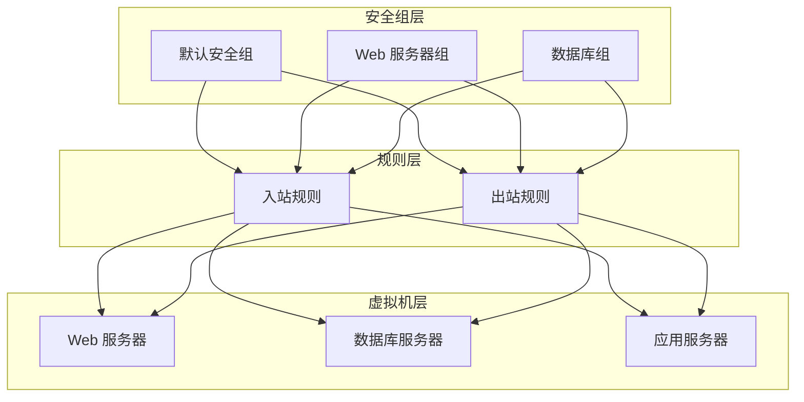
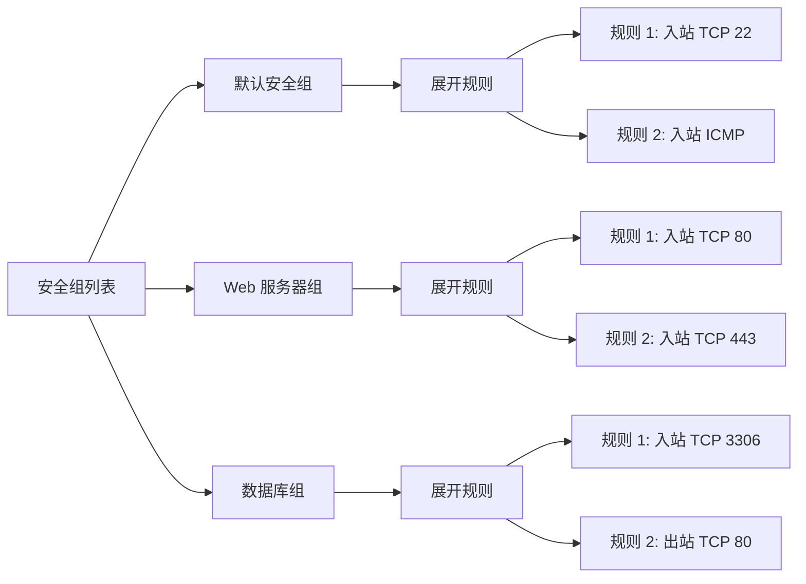
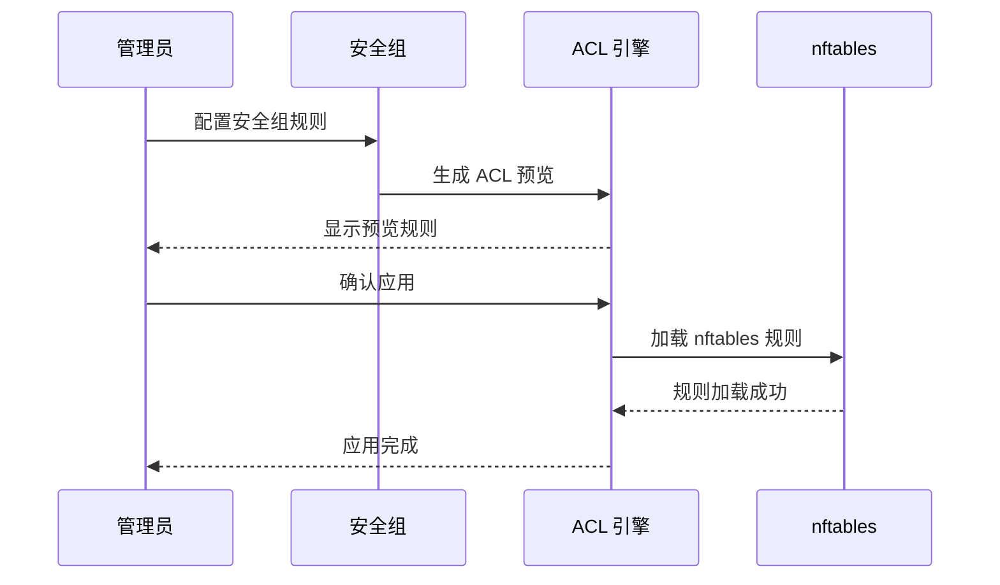
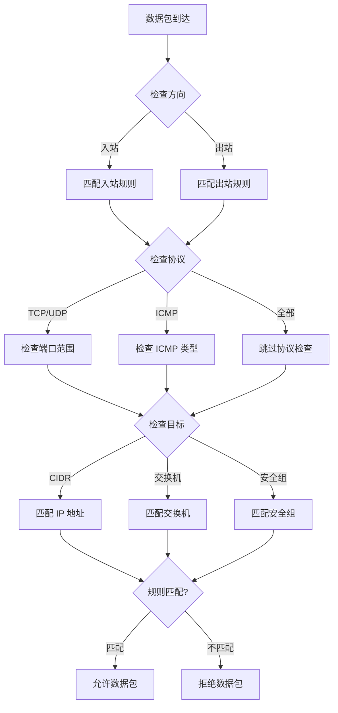
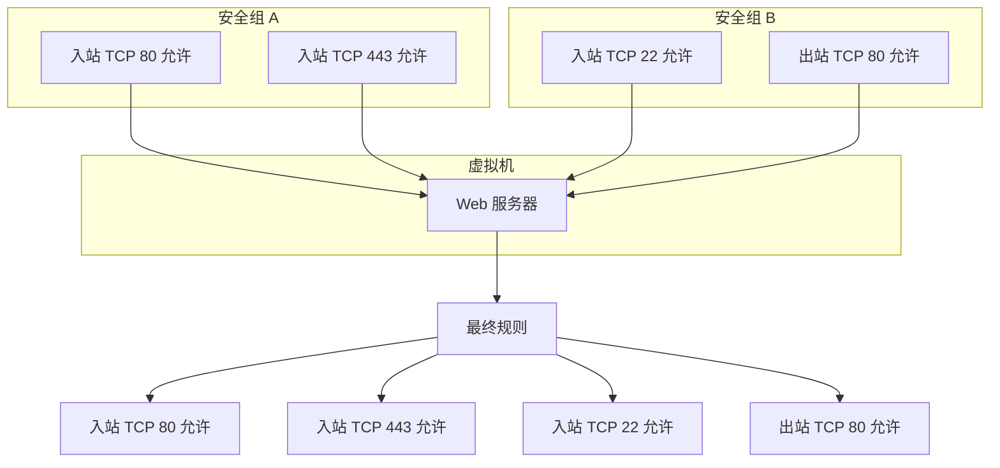
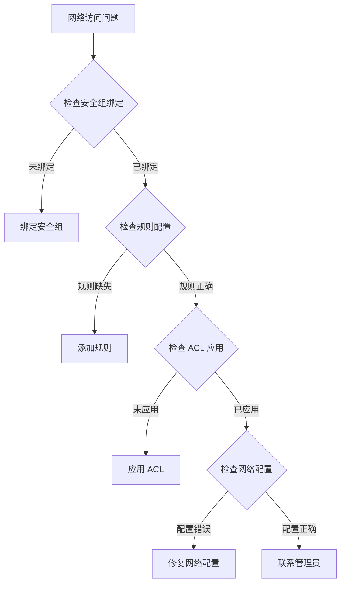

# 安全组策略

安全组是 QVMConsole VPC 网络的访问控制核心，基于 nftables ACL 实现细粒度的网络流量控制。通过安全组策略，管理员可以定义入站和出站规则，精确控制虚拟机的网络访问权限，确保网络安全。

## 安全组架构

## 安全组管理

### 安全组类型

| 类型 | 说明 | 特点 |
|------|------|------|
| **默认组** | 系统预设的安全组 | 基础安全策略，不可删除 |
| **自定义组** | 用户创建的安全组 | 可自由配置规则 |
| **VM 维度组** | 与单台虚拟机关联的安全组记录 | 用于虚拟机详情页的网络管理展示与快速切换 |

### 安全组操作

| 操作 | 说明 | 限制 |
|------|------|------|
| **创建** | 创建新的安全组 | 名称需唯一 |
| **编辑** | 修改安全组名称和描述 | - |
| **删除** | 删除安全组 | 需确保无虚拟机使用 |

:::info[默认安全组]
每个 VPC 网络都包含一个默认安全组，提供基础的安全保护。默认安全组包含必要的入站和出站规则，确保虚拟机可以正常通信。
:::

## 安全组规则配置

### 规则配置项

| 配置项 | 说明 | 必填 | 示例 |
|--------|------|------|------|
| **方向** | 规则应用的方向 | 是 | 入站/出站 |
| **协议** | 网络协议类型 | 是 | TCP/UDP/ICMP/全部 |
| **端口范围** | 目标端口范围 | 是 | 80-80 或 1-65535 |
| **目标类型** | 规则匹配的目标类型 | 是 | CIDR/交换机/安全组 |
| **目标值** | 具体的目标值 | 是 | 192.168.1.0/24 |
| **备注** | 规则说明信息 | 否 | 允许 HTTP 访问 |

### 方向说明

| 方向 | 说明 | 应用场景 |
|------|------|----------|
| **入站（ingress）** | 控制进入虚拟机的流量 | 限制外部访问虚拟机 |
| **出站（egress）** | 控制从虚拟机发出的流量 | 限制虚拟机访问外部 |

### 协议类型

| 协议 | 说明 | 典型应用 |
|------|------|----------|
| **TCP** | 传输控制协议 | Web 服务、数据库、SSH |
| **UDP** | 用户数据报协议 | DNS、DHCP、视频流 |
| **ICMP** | 互联网控制消息协议 | Ping、网络诊断 |
| **全部** | 所有协议 | 通用访问控制 |

### 目标类型

| 类型 | 说明 | 示例 |
|------|------|------|
| **CIDR** | IP 地址段 | `192.168.1.0/24` |
| **交换机** | VPC 交换机 ID | `switch-001` |
| **安全组** | 引用其他安全组 | `sg-web-server` |

:::tip[目标类型选择]
选择合适的目标类型可以简化规则管理。例如，使用"交换机"类型可以自动匹配该交换机下的所有虚拟机，无需手动指定 IP 地址。
:::

## 规则展开查看

安全组支持展开查看所有规则，便于管理和审计：

### 规则列表显示

### 规则详情字段

| 字段 | 说明 |
|------|------|
| **方向** | 入站/出站 |
| **协议** | TCP/UDP/ICMP/全部 |
| **端口范围** | 起始端口-结束端口 |
| **目标类型** | CIDR/交换机/安全组 |
| **目标值** | 具体的目标值 |
| **备注** | 规则说明 |

## ACL 预览与应用

安全组规则最终需要转换为 nftables ACL 规则才能生效。

### ACL 预览

ACL 预览功能展示当前所有安全组规则生成的 nftables 规则：

| 预览内容 | 说明 |
|----------|------|
| **规则总数** | 生成的 nftables 规则数量 |
| **入站规则** | 入站方向的规则列表 |
| **出站规则** | 出站方向的规则列表 |
| **规则格式** | nftables 配置格式 |

### ACL 应用流程

## 安全组规则匹配流程

当网络数据包到达虚拟机时，安全组规则按以下流程进行匹配：

### 匹配流程图

### 匹配规则说明

| 阶段 | 说明 | 处理方式 |
|------|------|----------|
| **方向匹配** | 确定数据包方向 | 匹配对应方向的规则 |
| **协议匹配** | 检查协议类型 | 匹配协议字段 |
| **端口匹配** | 检查端口范围 | 匹配端口范围字段 |
| **目标匹配** | 检查目标地址 | 匹配目标类型和值 |

:::warning[规则顺序]
安全组规则按顺序匹配，一旦匹配成功就停止后续规则的匹配。建议将最严格的规则放在前面，最宽松的规则放在后面。
:::

## 实现原理

安全组规则最终转换为 nftables ACL 规则，加载到 `kvm_console_vpc_acl` 表中。

### nftables 表结构

| 表名 | 说明 |
|------|------|
| **kvm_console_vpc_acl** | VPC 安全组规则表 |

### 链结构

| 链名 | 方向 | 说明 |
|------|------|------|
| **ingress** | 入站 | 处理进入虚拟机的流量 |
| **egress** | 出站 | 处理从虚拟机发出的流量 |

### 规则转换示例

| 安全组规则 | nftables 规则 |
|------------|---------------|
| 入站 TCP 80 允许 0.0.0.0/0 | `ip daddr 0.0.0.0/0 tcp dport 80 accept` |
| 出站 TCP 443 允许 10.0.0.0/8 | `ip saddr 10.0.0.0/8 tcp dport 443 accept` |
| 入站 ICMP 允许 192.168.1.0/24 | `ip saddr 192.168.1.0/24 icmp type echo-request accept` |

## 安全组最佳实践

### 规则设计原则

1. **最小权限原则**：只开放必要的端口和协议
2. **分层防护**：结合网络层和应用层安全策略
3. **定期审计**：定期检查和更新安全组规则
4. **文档记录**：为每条规则添加清晰的备注

### 常见安全组配置

| 场景 | 入站规则 | 出站规则 |
|------|----------|----------|
| **Web 服务器** | TCP 80, 443 允许所有 | TCP 80, 443 允许所有 |
| **数据库服务器** | TCP 3306 允许内网 | 限制出站 |
| **SSH 管理** | TCP 22 允许管理员 IP | 允许所有 |
| **开发测试** | 允许所有 | 允许所有 |

:::danger[安全警告]
避免配置过于宽松的安全组规则，如允许所有 IP 访问所有端口。这会带来严重的安全风险，可能导致未授权访问。
:::

## 安全组与虚拟机关系

### 关系说明

| 关系 | 说明 |
|------|------|
| **绑定关系** | 虚拟机必须绑定至少一个安全组 |
| **多对多** | 一个虚拟机可以绑定多个安全组 |
| **规则叠加** | 多个安全组的规则会叠加生效 |
| **动态更新** | 修改安全组规则后自动应用到绑定的虚拟机 |

### 多安全组规则叠加

:::info[规则叠加规则]
当虚拟机绑定多个安全组时，规则会叠加生效。入站规则取并集（允许任一安全组允许的流量），出站规则同样取并集。
:::

## 故障排除

### 常见问题

| 问题 | 可能原因 | 解决方案 |
|------|----------|----------|
| **无法访问虚拟机** | 安全组规则未配置入站 | 添加相应的入站规则 |
| **虚拟机无法访问外部** | 安全组规则未配置出站 | 添加相应的出站规则 |
| **部分端口无法访问** | 端口规则配置错误 | 检查端口范围和协议 |
| **规则不生效** | ACL 未应用 | 应用 ACL 规则 |

### 诊断步骤

:::tip[诊断建议]
遇到网络访问问题时，建议先检查安全组绑定和规则配置，然后检查 ACL 是否已应用。如果问题仍然存在，可以使用网络诊断工具进一步排查。
:::