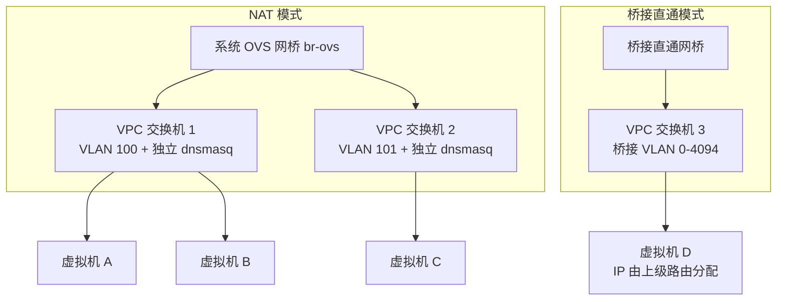
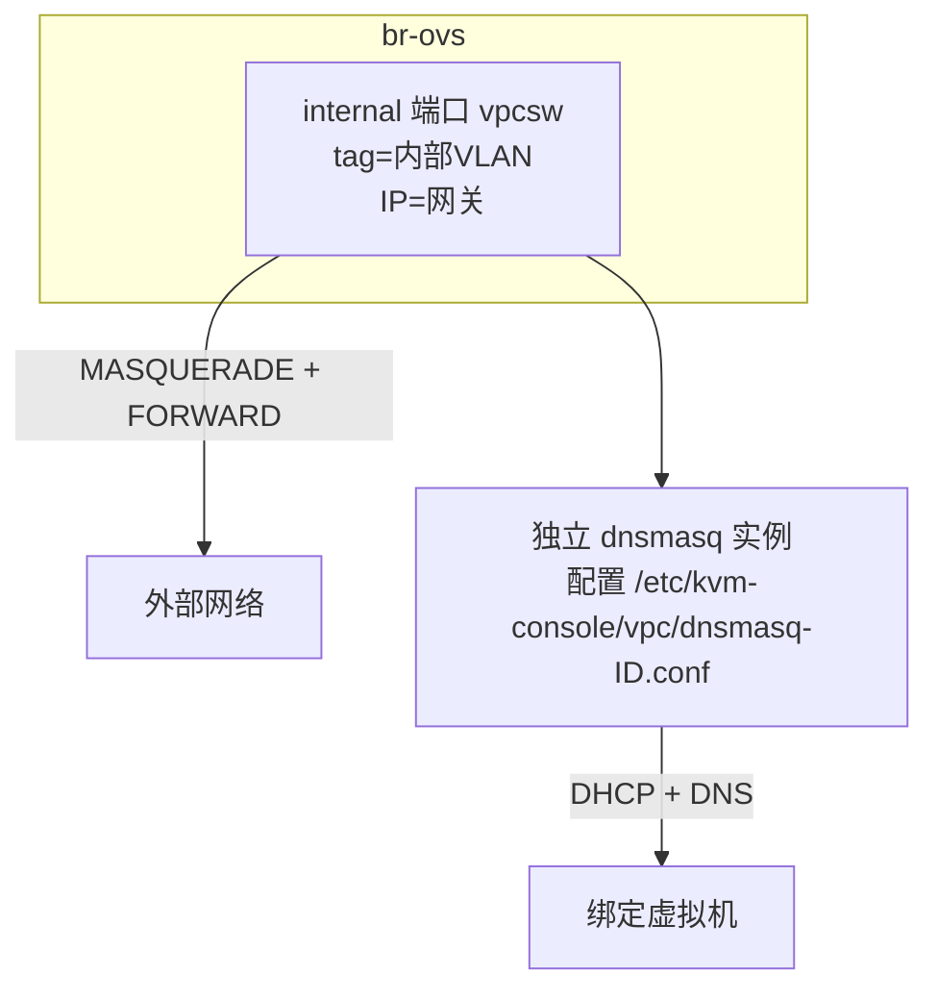

# VPC 交换机

VPC 交换机是 QVMConsole 虚拟网络的核心组件。QVMConsole 提供两类交换机：基于系统 OVS 网桥（默认 `br-ovs`）的 **NAT 模式**交换机，以及绑定到桥接直通网桥的**桥接直通模式**交换机。通过 VPC 交换机，管理员可以为不同的租户或业务创建独立的虚拟网络环境，实现网络资源的精细化管理和流量控制。

## 交换机架构



每个用户的账户激活时会自动获得一个**系统基础网络**（系统交换机，不可编辑删除），作为该用户的缺省接入网络。

## 配额概览

交换机提供流量和带宽两个维度的配额管理，配额来自用户级配额（`max_traffic_down/up`、`max_bandwidth_down/up`）：

| 配额类型 | 说明 | 单位 |
|----------|------|------|
| **下行流量** | 每月下行流量配额 | GB/月 |
| **上行流量** | 每月上行流量配额 | GB/月 |
| **下行带宽** | 下行带宽配额 | Mbps |
| **上行带宽** | 上行带宽配额 | Mbps |

`GET /vpc/quota` 返回用户配额、所有交换机已分配合计与剩余额度（管理员可查询指定用户）：

```
max_traffic_down / allocated_traffic_down / remaining_traffic_down
max_traffic_up   / allocated_traffic_up   / remaining_traffic_up
max_bandwidth_down / allocated_bandwidth_down / remaining_bandwidth_down
max_bandwidth_up   / allocated_bandwidth_up   / remaining_bandwidth_up
```

:::info 分配规则
- 配额值为负数会被拒绝
- 当用户某方向配额为有限值（大于 0）时，交换机该方向配额**必须大于 0**（不允许在有限用户配额下设置"不限"）
- 所有交换机配额合计不得超过用户配额
- 用户配额为 0（不限）时，交换机可自由分配
:::

## 交换机配置项

### NAT 模式交换机

| 配置项 | 说明 | 必填 | 默认行为 |
|--------|------|------|----------|
| **所属用户** | 交换机归属（仅管理员可指定） | 是 | 默认当前操作者 |
| **名称** | 交换机唯一标识（空白自动转为短横线） | 是 | 同一用户内唯一 |
| **目标网桥** | 留空或 `br-ovs` 即为 NAT 模式 | 否 | `br-ovs` |
| **子网 CIDR** | IPv4 子网 | 否 | 自动从子网池分配（默认 `10.200.x.0/24`，`KVM_VPC_SUBNET_PREFIX` 可配置） |
| **网关地址** | 子网网关 | 否 | 自动取子网内第一个 IP |
| **DHCP 范围** | 自动分配 IP 的范围 | 否 | 自动计算（/24 子网即 `.10` ~ `.250`） |
| **月下行/上行流量** | 月流量配额（GB） | 否 | 0=不限（受用户配额约束） |
| **下行/上行带宽** | 带宽配额（Mbps） | 否 | 0=不限（受用户配额约束） |

自定义 CIDR 校验规则：仅支持 IPv4；掩码范围 **/16 ~ /29**；全局唯一且不得与宿主机网段冲突；网关必须位于子网内且不能是网络/广播地址；DHCP 范围必须位于子网内且起始不大于结束。

:::info DNS 与 VLAN
NAT 交换机的 DHCP DNS 使用全局配置 `KVM_VPC_DNS`（默认 `223.5.5.5,223.6.6.6`），每交换机没有独立 DNS 配置。NAT 交换机使用系统自动分配的内部 VLAN ID（`KVM_VPC_VLAN_START`~`KVM_VPC_VLAN_END`，默认 100-4094），不与桥接 VLAN 混用。
:::

### 桥接直通模式交换机

桥接直通交换机将虚拟机直接接入物理二层网络（IP 由上级路由器分配），**仅管理员可创建**：

| 配置项 | 说明 | 必填 | 默认值 |
|--------|------|------|--------|
| **目标网桥** | 已创建的桥接直通网桥（见 [网络概览](/docs/tech/network/overview)） | 是 | - |
| **桥接 VLAN ID** | 0 = 不打 VLAN 标签；1-4094 = 打指定 VLAN 标签 | 否 | 0 |
| **桥接安全** | 混杂模式 / MAC 地址更改 / 伪传输三个开关 | 否 | 全部禁用 |
| **IPv6 端口防护** | `ipv6_security_enabled` + 可信 IPv6 前缀 | 否 | 禁用 |
| **流量/带宽配额** | 同 NAT 模式 | 否 | 0=不限 |

桥接直通模式没有 CIDR/网关/DHCP 配置（置空）。

## 编辑限制

| 规则 | 说明 |
|------|------|
| **系统基础网络** | 不可编辑、不可删除 |
| **目标网桥** | 创建后不可修改 |
| **子网 CIDR / 网关** | 创建后不可修改（需删除重建） |
| **桥接 VLAN / 桥接安全 / IPv6 防护 / 配额** | 可修改（桥接安全字段仅桥接直通模式有效，NAT 模式强制为空） |
| **所属用户** | 仅管理员可变更 |

编辑后系统会重放绑定虚拟机的运行态配置、按新配额重新评估限速状态，并触发端口安全协调。

## 运行态实现原理

### NAT 交换机运行时



- 每个 NAT 交换机在 `br-ovs` 上创建 internal 端口 `vpcsw<ID>` 作为网关
- 每交换机独立运行一个 dnsmasq 实例（DHCP 范围、静态绑定、租约文件相互隔离）
- 出网通过 iptables MASQUERADE 与 FORWARD 规则放行
- 系统基础网络（内部 VLAN 为 0）不创建独立网关与 dnsmasq

### 流量统计与限速

- **流量统计**：按月聚合绑定虚拟机监控记录（`vm_stats_records`）的网络字节增量；每月 1 日自动重置，历史月度记录保留 12 个月
- **超限限速**：当月有效流量达到配额后标记为受限（`is_limited_down/up`），带宽被压到惩罚值 1Mbps，直至重置流量或提高配额
- **带宽实现**：NAT 交换机下行用网关端口 TC 限速、上行用 OVS meter；子网内互访流量（源和目的都在子网内）走快速路径不限速

### OpenFlow 与 meter 细节

| 项 | 说明 |
|------|------|
| **流表 Cookie** | `fnv64a("kvm-console-vpc-switch:<id>")` 前缀，便于按交换机批量清理 |
| **meter ID 空间** | 交换机带宽占用 150000-189999（VM 级带宽为 100000-139999，端口安全为 1000-99999） |
| **流表位置** | 端口安全关闭时使用 table 0；端口安全开启时带宽流落在 table 30（与端口安全的 table 10/20 协同） |
| **源 MAC 限制** | 桥接直通模式下按下文「桥接安全」策略安装 |

## 桥接安全策略

桥接直通交换机提供三个安全开关（界面称「桥接安全」），全部禁用为最严格的多租户安全配置：

### 混杂模式（allow_promiscuous）

控制虚拟机网卡是否可以接收泛洪到它的非单播流量：

| 状态 | OVS 行为 | 安全风险 |
|------|----------|----------|
| **禁用（默认）** | `ovs-ofctl mod-port <bridge> <port> no-flood`，端口不参与泛洪 | 防止嗅探攻击 |
| **启用** | `mod-port ... flood`，端口参与泛洪 | 可用于网络监控，存在嗅探风险 |

### MAC 地址更改与伪传输（allow_mac_change / allow_forged_transmits）

这两个开关共同决定是否为端口安装**源 MAC 严格匹配流表**：

- 只要**任意一个**开关为禁用，系统就会为该端口安装源 MAC 过滤规则：
  - `priority=90`：仅放行源 MAC 与网口 MAC 一致的数据包（可叠加带宽 meter）
  - `priority=85`：丢弃其余源 MAC 的数据包（阻止伪造源 MAC）
- 两个开关都启用时不安装过滤规则，虚拟机可自由更换/伪造 MAC
- 网口允许地址（端口安全的 allowed IPv4/IPv6）与源 MAC 过滤协同工作，详见 [端口安全](/docs/tech/network/port-security)

### IPv6 端口防护

仅桥接直通交换机可配置，且需要全局端口安全功能处于开启状态：

| 配置项 | 说明 |
|--------|------|
| **IPv6 防护开关** | 启用后按可信前缀严格校验该端口的 IPv6 流量 |
| **可信 IPv6 前缀** | 允许该端口使用的 IPv6 前缀列表（开启防护时必填，支持逗号/分号/换行分隔） |

### 安全策略选择建议

| 场景 | 推荐配置 |
|------|----------|
| 多租户生产环境 | 三开关全部禁用 + IPv6 防护按需开启 |
| 网络监控/抓包 | 仅启用混杂模式 |
| 测试开发环境 | 按需放宽，不建议生产使用 |

:::warning 安全风险提示
启用杂模式、MAC 地址更改或伪传输可能带来网络嗅探、ARP 欺骗、MAC 泛洪等风险。除非有明确业务需求，建议保持全部禁用。
:::

## 交换机操作

### 创建交换机

1. 管理员：选择所属用户 → 输入名称
2. 配置配额（月流量 / 带宽）
3. 选择目标网桥与网络配置（NAT：子网；桥接：VLAN 与安全策略）
4. 提交后自动分配 VLAN / 子网，创建交换机并应用运行态

### 重置流量

将交换机的月度流量统计清零并解除超限限速（仅管理员）：

- 重置把当前已统计的原始流量记为基线偏移（offset），流量统计归零
- 若交换机处于超限限速状态，重置后立即恢复正常带宽

### 删除交换机

| 条件 | 说明 |
|------|------|
| **系统基础网络** | 受保护，不可删除 |
| **存在绑定虚拟机** | 需确认强制删除：先解绑并移除虚拟机对应网口，再删除交换机 |
| **删除后** | 清理 ACL 规则与运行态资源（dnsmasq、网关端口、流表等） |

## 交换机与虚拟机

| 关系 | 说明 |
|------|------|
| **连接关系** | 虚拟机网口通过 VPC 绑定记录（`vpc_vm_bindings`）连接到交换机，支持多网口（interface_order） |
| **IP 分配** | NAT 模式由交换机 dnsmasq 分配；桥接直通由上级路由器分配 |
| **可见性** | 非管理员只能看到自己的 NAT 交换机与系统基础网络 |

## 最佳实践

1. **按业务划分**：为不同业务创建独立交换机，便于隔离与配额管理
2. **子网规划**：NAT 子网池默认 `10.200.x.0/24`，如需更大地址空间可自定义 CIDR（不超过 /16）
3. **配额预留**：为关键业务预留流量与带宽配额余量，避免超限触发 1Mbps 惩罚限速
4. **桥接安全**：多租户环境保持三开关全部禁用；监控需求单独建交换机放开
