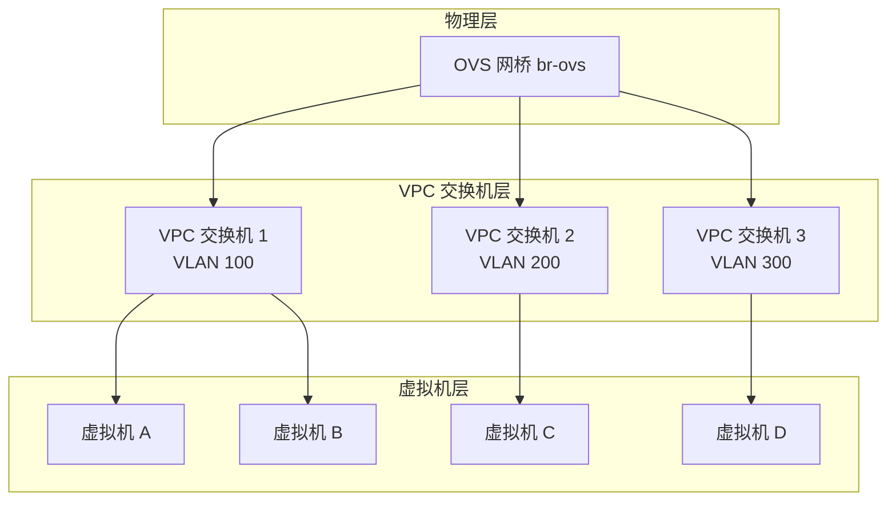
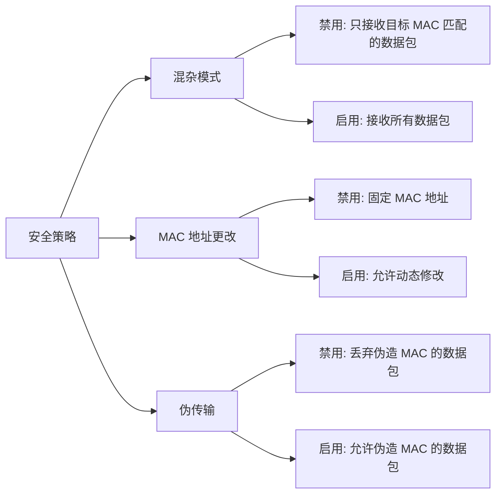
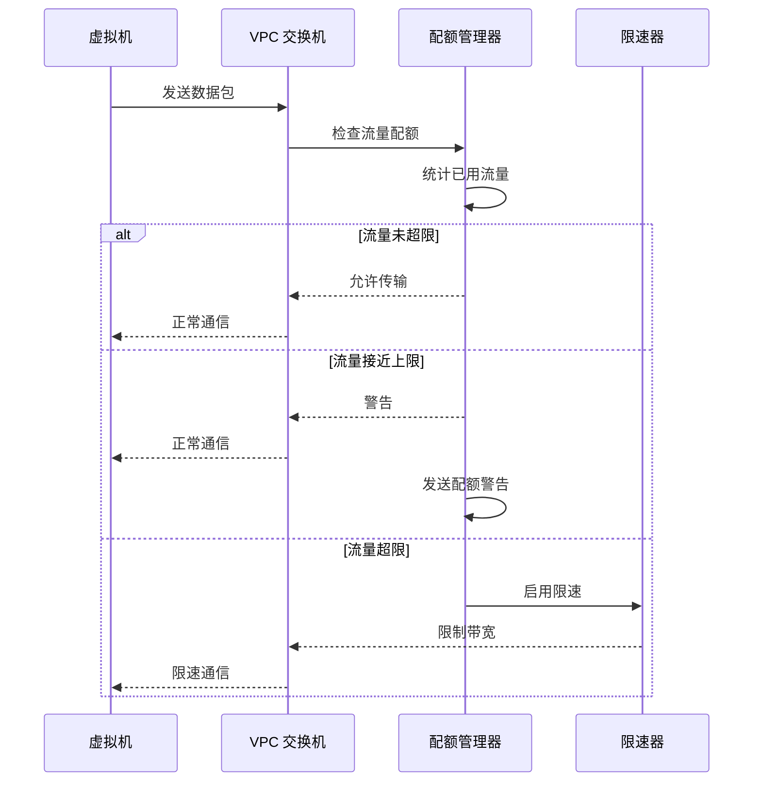
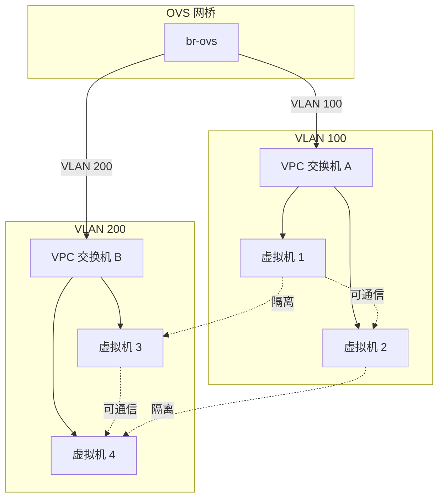

# VPC 交换机

VPC 交换机是 QVMConsole 虚拟网络的核心组件，基于 OVS 网桥实现二层网络隔离。通过 VPC 交换机，管理员可以为不同的租户或业务创建独立的虚拟网络环境，实现网络资源的精细化管理和流量控制。

## 交换机架构

## 配额概览

VPC 交换机提供流量和带宽的配额管理功能，帮助管理员合理分配网络资源。

### 配额统计信息

| 配额类型 | 说明 | 单位 |
|----------|------|------|
| **下行流量** | 从外部网络下载的数据量 | GB/月 |
| **上行流量** | 向外部网络上传的数据量 | GB/月 |
| **下行带宽** | 从外部网络下载的最大速率 | Mbps |
| **上行带宽** | 向外部网络上传的最大速率 | Mbps |

### 配额状态显示

| 状态 | 含义 | 处理建议 |
|------|------|----------|
| **正常** | 已分配配额在限制范围内 | 无需操作 |
| **接近上限** | 已分配配额接近总配额 | 考虑扩容或优化分配 |
| **超限** | 已分配配额超过总配额 | 立即调整配额分配 |

:::warning[配额管理]
合理分配流量和带宽配额是确保网络服务质量的关键。建议为关键业务预留足够的配额余量。
:::

## 交换机配置项

### 基础配置

| 配置项 | 说明 | 必填 | 默认值 |
|--------|------|------|--------|
| **名称** | 交换机的唯一标识名称 | 是 | - |
| **目标网桥** | 绑定的 OVS 网桥 | 是 | `br-ovs` |
| **桥接 VLAN ID** | VLAN 标识，用于网络隔离 | 是 | - |

### VLAN ID 说明

| 范围 | 用途 | 说明 |
|------|------|------|
| **0** | 无 VLAN | 不使用 VLAN 隔离 |
| **1-4094** | 标准 VLAN | 用于租户间网络隔离 |

:::info[VLAN 隔离原理]
每个 VPC 交换机分配独立的 VLAN ID，通过 VLAN 标签实现租户间的网络隔离。不同 VLAN 的虚拟机无法直接通信，确保网络安全。
:::

### 安全策略配置

| 策略 | 说明 | 默认值 |
|------|------|--------|
| **allow_promiscuous** | 混杂模式，允许网卡接收所有数据包 | 禁用 |
| **allow_mac_change** | 允许修改 MAC 地址 | 禁用 |
| **allow_forged_transmits** | 允许伪造源 MAC 地址的数据包 | 禁用 |

### 安全策略说明

:::danger[安全建议]
除非有特殊需求，建议保持所有安全策略为禁用状态。启用这些策略可能带来安全风险，如 ARP 欺骗、中间人攻击等。
:::

## 流量配额管理

### 月度流量配额

| 配置项 | 说明 | 单位 | 范围 |
|--------|------|------|------|
| **月下行流量** | 每月允许的最大下行流量 | GB | 0-无限 |
| **月上行流量** | 每月允许的最大上行流量 | GB | 0-无限 |

### 带宽配额

| 配置项 | 说明 | 单位 | 范围 |
|--------|------|------|------|
| **下行带宽** | 最大下行带宽限制 | Mbps | 0-无限 |
| **上行带宽** | 最大上行带宽限制 | Mbps | 0-无限 |

### 流量配额工作原理

## 交换机操作

### 创建交换机

创建 VPC 交换机时需要配置以下参数：

| 步骤 | 配置项 | 说明 |
|------|--------|------|
| **1** | 名称 | 输入交换机名称 |
| **2** | 目标网桥 | 选择绑定的 OVS 网桥 |
| **3** | VLAN ID | 配置 VLAN 标识 |
| **4** | 安全策略 | 设置安全策略选项 |
| **5** | 流量配额 | 配置月度流量限制 |
| **6** | 带宽配额 | 配置带宽限制 |

### 编辑交换机

编辑交换机时可以修改以下配置：

| 可修改项 | 说明 | 限制 |
|----------|------|------|
| **名称** | 交换机标识 | 需保持唯一 |
| **VLAN ID** | VLAN 标识 | 需避免冲突 |
| **安全策略** | 安全策略选项 | - |
| **流量配额** | 月度流量限制 | - |
| **带宽配额** | 带宽限制 | - |

:::info[修改限制]
修改 VLAN ID 可能导致网络中断，建议在业务低峰期进行操作。已连接的虚拟机需要重新配置网络。
:::

### 删除交换机

删除交换机前需要满足以下条件：

| 条件 | 说明 |
|------|------|
| **无连接的虚拟机** | 交换机上不能有虚拟机连接 |
| **无关联的安全组** | 交换机不能被安全组规则引用 |
| **确认删除** | 需要二次确认删除操作 |

### 重置流量

重置流量功能用于将交换机的流量统计清零：

| 操作 | 说明 | 适用场景 |
|------|------|----------|
| **重置下行流量** | 清零下行流量统计 | 月初重置配额 |
| **重置上行流量** | 清零上行流量统计 | 月初重置配额 |
| **重置全部流量** | 清零所有流量统计 | 配额周期重置 |

## 限速状态检测

当流量或带宽超过配额限制时，系统会自动启用限速机制。

### 限速触发条件

| 条件 | 触发阈值 | 限速方式 |
|------|----------|----------|
| **月流量超限** | 已用流量 ≥ 配额流量 | 限制带宽至最低值 |
| **带宽超限** | 实时带宽 ≥ 配额带宽 | 限制至配额带宽 |

### 限速状态显示

| 状态 | 图标 | 含义 | 处理建议 |
|------|------|------|----------|
| **正常** | 绿色 | 流量和带宽在配额范围内 | 无需操作 |
| **流量限速** | 黄色 | 月流量已超限，正在限速 | 重置流量或增加配额 |
| **带宽限速** | 橙色 | 实时带宽超限，正在限速 | 增加带宽配额 |

:::warning[限速影响]
限速会显著影响虚拟机的网络性能。建议提前规划好流量和带宽配额，避免业务高峰期触发限速。
:::

## VLAN 隔离原理

VPC 交换机通过 VLAN 技术实现租户间的网络隔离：

### VLAN 隔离架构

### VLAN 隔离优势

| 优势 | 说明 |
|------|------|
| **网络隔离** | 不同租户的虚拟机完全隔离 |
| **安全增强** | 防止跨租户的网络攻击 |
| **资源独立** | 每个 VLAN 独立的广播域 |
| **灵活配置** | 可根据需求调整 VLAN 划分 |

## 交换机与网桥关系

VPC 交换机与 OVS 网桥的关系如下：

| 关系 | 说明 |
|------|------|
| **绑定关系** | 每个交换机必须绑定一个 OVS 网桥 |
| **多对一** | 多个交换机可以绑定同一个网桥 |
| **VLAN 隔离** | 通过 VLAN ID 在同一网桥上实现隔离 |
| **资源共享** | 共享同一网桥的物理网络资源 |

### 交换机与虚拟机关系

| 关系 | 说明 |
|------|------|
| **连接关系** | 虚拟机通过虚拟网卡连接到交换机 |
| **一对多** | 一个交换机可以连接多个虚拟机 |
| **网络分配** | 虚拟机从交换机获取 IP 地址和网络配置 |
| **流量统计** | 交换机统计连接虚拟机的网络流量 |

## 最佳实践

### 交换机规划建议

1. **按业务划分**：为不同的业务创建独立的交换机，便于管理和隔离
2. **VLAN 规划**：提前规划 VLAN ID 分配，避免冲突和重复
3. **配额分配**：根据业务需求合理分配流量和带宽配额
4. **安全策略**：保持安全策略为禁用状态，除非有特殊需求

### 性能优化

| 优化项 | 说明 | 预期效果 |
|--------|------|----------|
| **VLAN 优化** | 合理规划 VLAN 数量 | 减少广播域大小 |
| **带宽分配** | 为关键业务分配更高带宽 | 提升业务性能 |
| **流量监控** | 实时监控流量使用情况 | 及时发现异常 |
| **配额调整** | 根据实际使用调整配额 | 避免资源浪费 |

:::info[监控与告警]
QVMConsole 提供实时的流量和带宽监控，支持设置告警阈值。当流量或带宽接近配额限制时，系统会自动发送告警通知。
:::