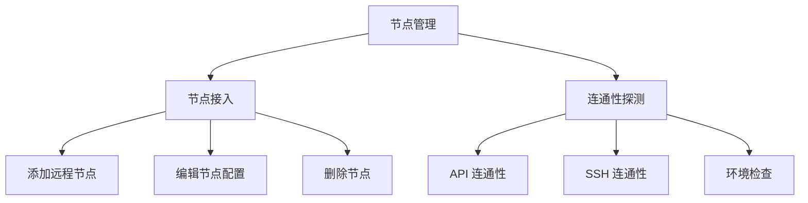
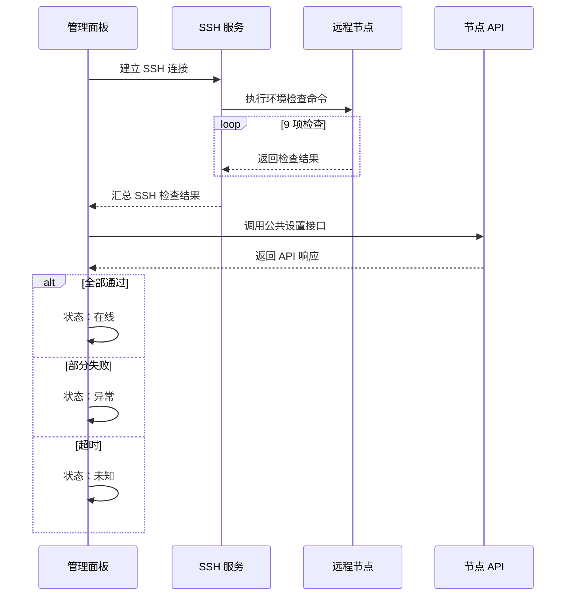
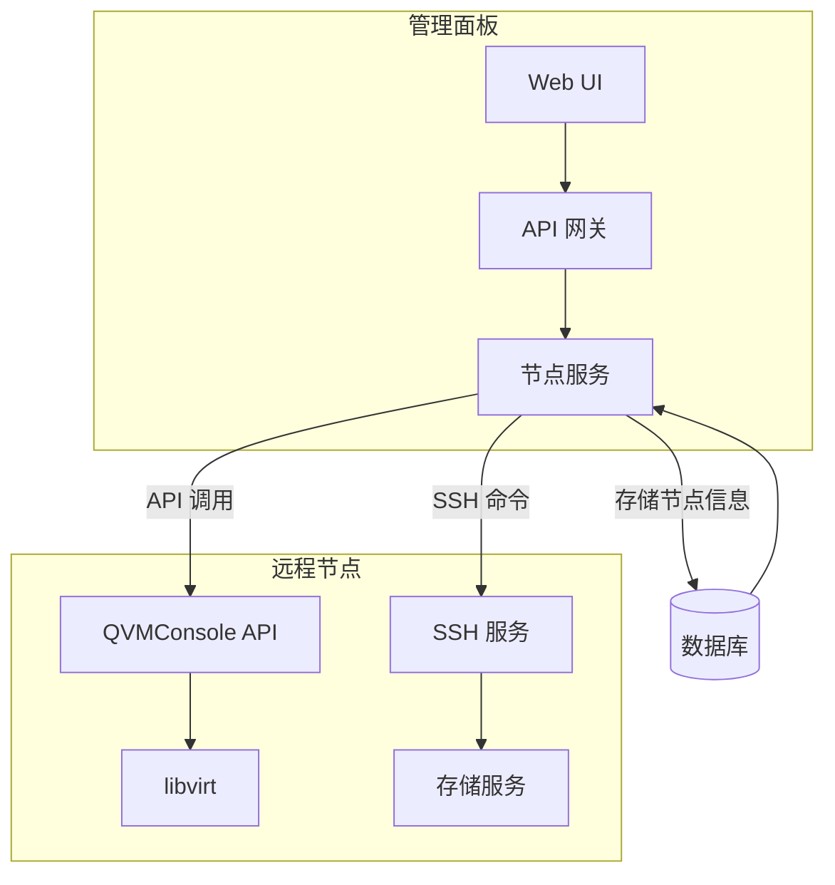

# 节点管理

节点管理是 QVMConsole 的核心基础设施管理功能，专为管理员设计，用于统一管理多个计算节点。通过节点管理，管理员可以轻松实现跨节点的资源调度和高可用部署，构建弹性可扩展的虚拟化集群。

:::info[管理员专属]
节点管理功能仅对管理员角色开放，普通用户无法访问此页面。路由路径：`/nodes`
:::

## 功能概览



:::tip[虚拟机迁移]
虚拟机迁移功能已独立为专门的文档，请参阅 [虚拟机迁移](/docs/tech/feature-analysis/vm-migration) 了解整机迁移、单硬盘迁移和热迁移/冷迁移的详细说明。
:::

## 节点列表

节点列表以表格形式展示所有已接入的计算节点，提供直观的管理界面。

### 列表字段

| 字段 | 说明 | 示例 |
|------|------|------|
| **节点名称** | 节点的唯一标识名称 | `kvm-test2` |
| **面板地址** | 目标节点的 API 访问地址 | `http://192.168.11.19:8080` |
| **SSH 信息** | SSH 连接信息（用户@主机:端口） | `root@192.168.11.19:22` |
| **状态** | 节点当前状态 | 在线 / 异常 / 未知 |
| **最近探测** | 最近一次探测的详细结果 | `节点探测通过` |
| **启用状态** | 节点是否启用 | 启用 / 禁用 |

### 状态说明

| 状态 | 标签颜色 | 含义 |
|------|---------|------|
| **在线** | 绿色 | 节点 API 和 SSH 均正常 |
| **异常** | 红色 | 节点连接失败或检查未通过 |
| **未知** | 灰色 | 尚未进行探测或探测超时 |

### 筛选功能

节点列表支持多维度筛选，帮助管理员快速定位目标节点：

- **名称搜索**：按节点名称进行模糊搜索
- **状态筛选**：按节点状态（在线/异常/未知）筛选
- **启用状态筛选**：按启用状态（启用/禁用）筛选

## 添加与编辑节点

### 表单字段说明

| 字段 | 必填 | 默认值 | 说明 |
|------|------|--------|------|
| **节点名称** | 是 | - | 节点的唯一标识，例如 `kvm-test2` |
| **面板 API 地址** | 是 | - | 目标面板的访问地址，例如 `http://192.168.11.19:8080` |
| **API ID** | 是 | - | 目标面板管理员的 API ID |
| **API Key** | 创建时必填 | - | 目标面板管理员的 API Key，编辑时留空表示不修改 |
| **SSH 地址** | 是 | - | SSH 连接地址，例如 `192.168.11.19` |
| **SSH 端口** | 否 | `22` | SSH 端口号，范围 1-65535 |
| **SSH 用户** | - | `root` | **固定为 root**，表单中不可修改（见下方说明） |
| **root 密码** | 创建时必填 | - | SSH root 密码，编辑时留空表示不修改；接入密码泄露检测 |
| **启用开关** | 否 | 启用 | 是否启用该节点 |

:::warning[SSH 用户固定为 root]
迁移虚拟机需要向目标节点的存储目录（`/var/lib/kvm-storage/.../vm-disks`）写入磁盘文件，并调用 libvirt、OVS 等底层工具，非 root 用户权限不足。因此：

- 节点的 SSH 用户**必须为 root**：保存、探测、迁移选项获取与迁移预检都会校验该条件，非 root 会在对应阶段被阻断并提示
- 编辑历史遗留的非 root 节点时，必须先改回 root 并重新输入 root 密码后才能保存
- root 密码输入框接入统一密码泄露检测（本地弱密码校验 + HIBP k-匿名），检测到泄露时警示确认后方可保存
:::

:::warning[安全提示]
API Key 和 SSH 密码在存储时会进行 AES-GCM 加密，确保敏感信息的安全性。编辑节点时，留空表示保持原有密码不变。
:::

### 配置示例

```
节点名称: kvm-node-02
面板 API 地址: http://192.168.11.19:8080
API ID: admin-api-id
API Key: ********
SSH 地址: 192.168.11.19
SSH 端口: 22
SSH 用户: root
root 密码: ********
启用: 是
```

## 连通性探测

连通性探测功能用于检测远程节点的可用性，确保节点能够正常提供服务。

### 探测流程



### 探测检查项

探测过程会执行以下 9 项环境检查：

| 序号 | 检查命令 | 检查内容 |
|------|---------|---------|
| 1 | `command -v virsh` | virsh 工具是否安装 |
| 2 | `command -v qemu-img` | qemu-img 工具是否安装 |
| 3 | `command -v rsync` | rsync 工具是否安装 |
| 4 | `command -v ssh` | ssh 工具是否安装 |
| 5 | `virsh --version` | virsh 版本信息 |
| 6 | `qemu-img --version` | qemu-img 版本信息 |
| 7 | `test -d /var/lib/libvirt/images` | 镜像存储目录是否存在 |
| 8 | `test -d /var/lib/libvirt/images/templates` | 模板存储目录是否存在 |
| 9 | `ovs-vsctl br-exists br-ovs` | OVS 网桥是否存在 |

### 超时设置

- **单命令超时**：30 秒（每条 SSH 检查命令独立计时）
- 面板 API 探测使用节点间 API 调用默认超时

:::tip[探测建议]
建议在添加节点后立即进行探测，确保节点环境符合要求。如果探测失败，请根据返回的错误信息进行排查。
:::

### 探测结果

| 结果 | 说明 | 后续操作 |
|------|------|---------|
| **节点探测通过** | 所有检查项均通过，API 可访问 | 可正常使用该节点 |
| **节点探测失败** | SSH 连接失败或命令执行错误 | 检查 SSH 配置和网络连通性 |
| **SSH 用户非 root** | 探测前置校验失败：节点 SSH 用户必须是 root | 将节点 SSH 用户改为 root 并重新录入密码 |
| **部分检查未通过** | 部分环境检查未通过 | 根据具体检查项安装缺失组件 |
| **面板 API 探测失败** | API 接口无法访问 | 检查面板地址和 API 配置 |

## 实现原理

### 节点通信架构



### 认证机制

- **API 认证**：使用 API ID + API Key 进行身份验证
- **SSH 认证**：使用用户名 + 密码进行 SSH 连接
- **密钥存储**：敏感信息使用 AES-GCM 加密存储

### 热迁移原理

热迁移通过 libvirt 的迁移 API 实现，核心流程：

1. **预检阶段**：检查源和目标的兼容性
2. **内存传输**：将虚拟机内存页面传输到目标节点
3. **脏页同步**：持续同步变更的内存页面
4. **最终切换**：当脏页数量足够少时，暂停虚拟机并完成最终同步
5. **恢复运行**：在目标节点恢复虚拟机运行

### 冷迁移原理

冷迁移在虚拟机关机状态下进行：

1. **停止虚拟机**：确保虚拟机完全停止
2. **复制磁盘**：将磁盘文件复制到目标节点
3. **传输配置**：复制虚拟机 XML 配置
4. **更新定义**：在目标节点定义虚拟机
5. **清理源节点**：删除源节点的虚拟机文件（可选）

## API 接口

节点管理功能提供以下 REST API 接口：

| 方法 | 路径 | 说明 | 超时 |
|------|------|------|------|
| `GET` | `/nodes` | 获取节点列表 | - |
| `POST` | `/nodes` | 创建节点 | - |
| `PUT` | `/nodes/{id}` | 更新节点 | - |
| `DELETE` | `/nodes/{id}` | 删除节点 | - |
| `POST` | `/nodes/{id}/probe` | 探测节点连通性 | 120s |
| `GET` | `/nodes/{id}/migration-options` | 获取节点迁移选项 | - |

:::tip[迁移接口]
虚拟机迁移相关的 API 接口请参阅 [虚拟机迁移 - API 接口](/docs/tech/feature-analysis/vm-migration#api-接口)。
:::

## 最佳实践

### 节点规划

- **网络规划**：确保节点间网络互通，建议使用专用管理网络
- **存储规划**：使用共享存储（如 NFS、Ceph）简化迁移过程
- **资源预留**：为目标节点预留足够的 CPU、内存和存储空间

### 故障处理

- **探测失败**：检查 SSH 配置、防火墙规则和网络连通性
