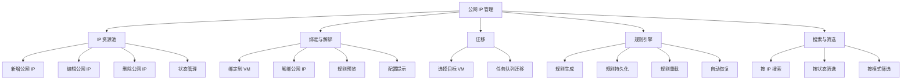
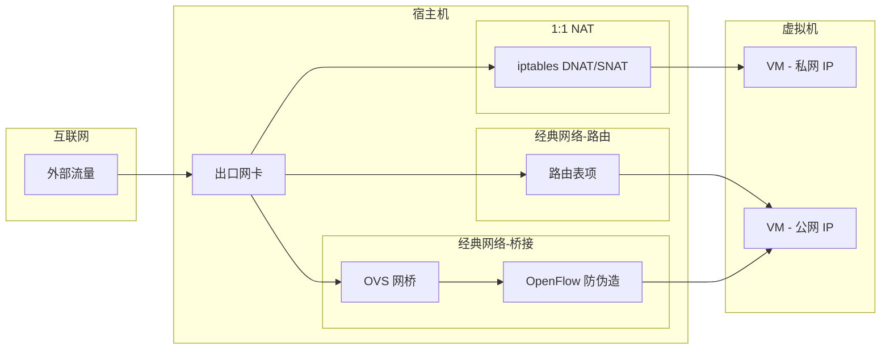
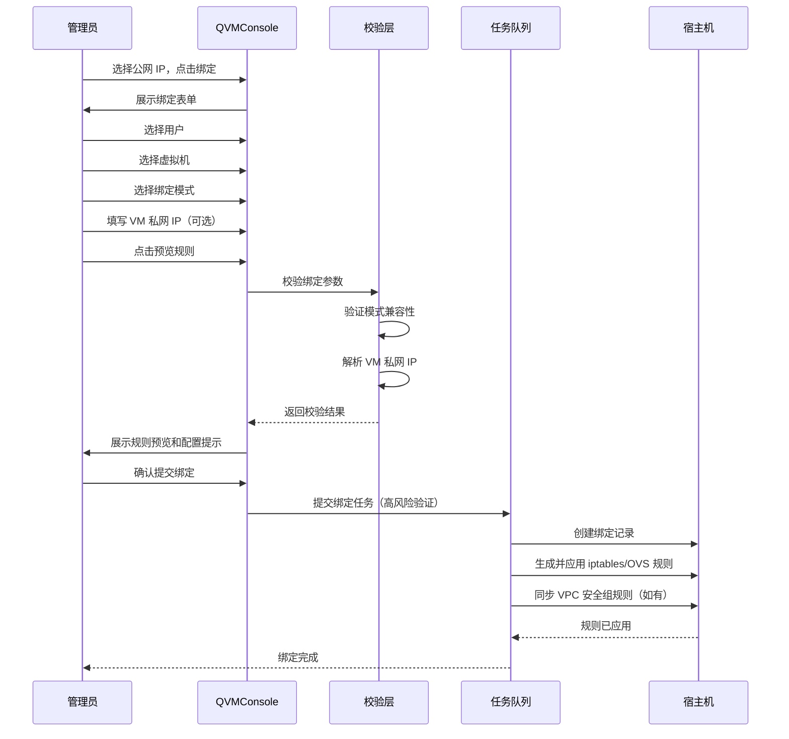
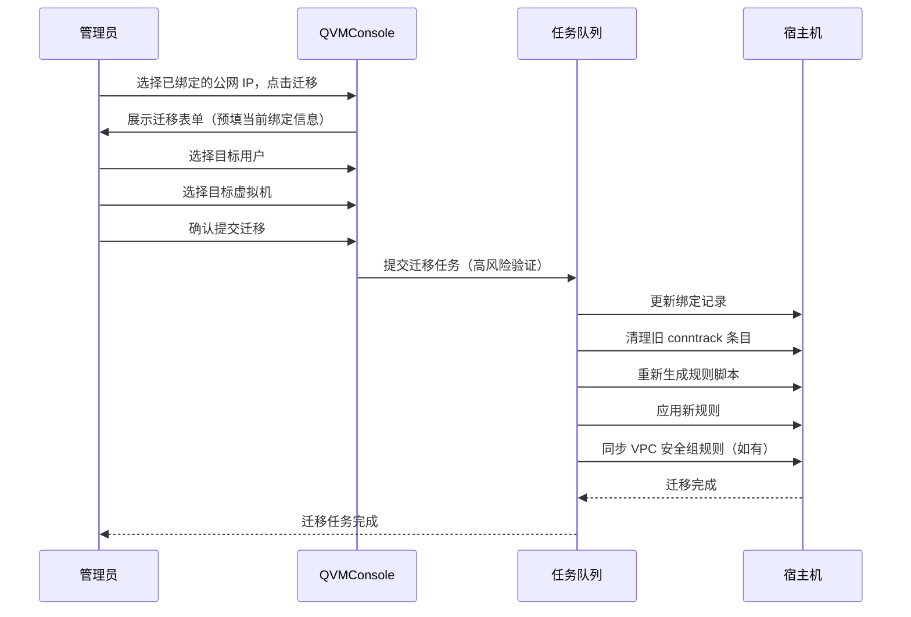
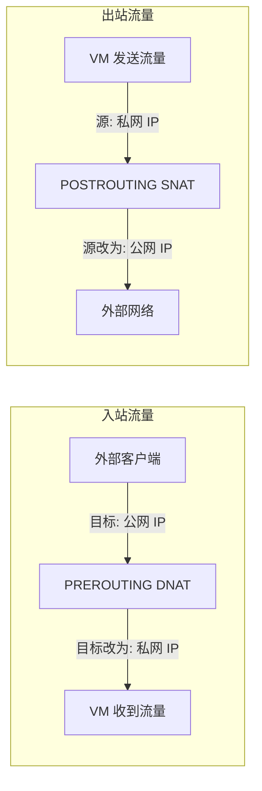
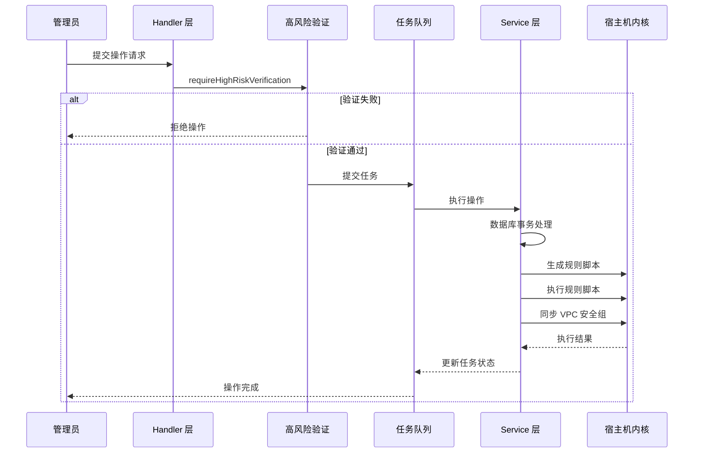

# 公网 IP 管理

公网 IP 管理是 QVMConsole 的核心网络功能之一，为管理员提供了对公网 IP 资源池的全生命周期管理能力。通过将公网 IPv4 地址灵活绑定到指定用户的虚拟机，实现外部网络对 VM 的直接访问——无论是通过 NAT 地址映射、路由直通还是桥接透传，都可以在一个统一的管理界面中完成。

## 功能架构总览

## 三种绑定模式

QVMConsole 支持三种公网 IP 绑定模式，适用于不同的网络架构和业务场景。每种模式在数据包转发路径、VM 内配置要求和上游网络依赖方面各有不同。

### 模式对比

| 特性 | 1:1 NAT | 经典网络-路由 | 经典网络-桥接 |
|------|---------|-------------|-------------|
| **实现方式** | iptables DNAT/SNAT 地址映射 | 路由表项直接路由 | OVS 网桥二层直通 |
| **VM 内配置** | 保持私网 IP，无需配置公网 IP | 需手动配置公网 IP、掩码、网关 | 需手动配置公网 IP、掩码、网关 |
| **上游依赖** | 宿主机能使用该公网 IP | 上游需将公网 IP 路由到宿主机 | 上游交换机需允许 VM MAC 使用公网 IP |
| **兼容性** | 最高，推荐默认使用 | 需上游网络支持 | 需桥接直通网桥和上游交换机配合 |
| **安全组集成** | 自动集成 VPC 安全组规则 | 通过 OVS OpenFlow 防伪造 | 通过 OVS OpenFlow 防伪造 |

:::tip[推荐]
默认推荐使用 **1:1 NAT** 模式。该模式兼容性最高，VM 保留现有 VPC/OVS 私网 IP，公网入站和出站源地址由宿主机 iptables 规则完成映射，用户无需在 VM 内做任何网络配置变更。
:::

## 公网 IP 配置项

新增或编辑公网 IP 时，需要填写以下配置项：

| 配置项 | 说明 | 示例 |
|--------|------|------|
| **公网 IP** | IPv4 地址，作为唯一标识 | `203.0.113.10` |
| **CIDR/掩码** | 支持 CIDR 格式或子网掩码 | `203.0.113.10/32` 或 `203.0.113.0/29` |
| **网关** | 经典网络模式下 VM 使用的网关地址 | `203.0.113.1` |
| **出口网卡** | 绑定的物理网卡，留空时自动检测默认出口 | `ens3` |
| **支持模式** | 该 IP 允许的绑定模式（可多选） | 1:1 NAT、经典网络-路由、经典网络-桥接 |
| **状态** | 空闲（free）或保留（reserved） | `free` |
| **备注** | 用途描述或管理信息 | `Web 服务器集群出口 IP` |

:::info[CIDR 解析]
CIDR 字段支持两种格式：标准 CIDR 表示法（如 `203.0.113.8/29`）和子网掩码格式（如 `255.255.255.248`）。系统会自动解析并提取前缀长度，用于生成宿主机地址配置和 VM 内网络提示。
:::

### 状态说明

| 状态 | 含义 | 可执行操作 |
|------|------|-----------|
| **空闲（free）** | 未绑定到任何 VM | 可绑定、可编辑、可删除 |
| **已绑定（bound）** | 已绑定到指定 VM | 可迁移、可解绑、可预览规则 |
| **保留（reserved）** | 预留但暂不使用 | 仅可编辑，不可绑定、不可删除 |

## 公网 IP 操作

### 新增公网 IP

在公网 IP 管理页面点击「新增公网 IP」按钮，填写配置项后保存。新增的公网 IP 默认状态为空闲，支持模式默认包含全部三种模式。

:::warning[注意事项]
新增公网 IP 时不能直接设置为已绑定状态。需要先创建 IP 记录，再通过绑定操作关联到虚拟机。
:::

### 编辑公网 IP

修改已有公网 IP 的配置项。当公网 IP 已处于绑定状态时，不允许修改 IP 地址本身，其他字段（CIDR、网关、出口网卡、备注等）可正常修改。

### 删除公网 IP

仅空闲状态的公网 IP 可以删除。已绑定的公网 IP 需要先解绑后再删除。删除操作属于高风险操作，需要二次验证确认。

## 绑定与解绑

### 绑定公网 IP

绑定是将公网 IP 关联到指定用户虚拟机的核心操作。完整流程如下：

#### 绑定表单字段

| 字段 | 说明 | 必填 |
|------|------|------|
| **用户** | 选择公网 IP 绑定的目标用户 | 是 |
| **虚拟机** | 选择目标用户的虚拟机 | 是 |
| **绑定模式** | 从该 IP 支持的模式中选择 | 是 |
| **VM 私网 IP** | NAT 模式必填，其他模式可留空自动解析 | 视模式 |

:::info[自动解析 VM 私网 IP]
当 VM 私网 IP 留空时，系统会按以下优先级自动解析：
1. VPC 静态 DHCP 绑定
2. OVS 静态主机绑定
3. VM 运行时网络接口 IP

如果以上均无法解析，NAT 模式会尝试自动绑定静态 IP 地址。
:::

### 解绑公网 IP

解绑操作将移除公网 IP 与 VM 的绑定关系。提交前需二次确认，解绑后现有公网访问将中断。解绑流程会自动清理对应的 conntrack 连接跟踪条目，确保旧连接不会残留。

:::warning[解绑影响]
解绑公网 IP 后，该 VM 的外部网络访问将立即中断。如果有业务依赖该公网 IP，请提前做好流量切换。
:::

## 迁移功能

迁移公网 IP 是将已绑定的公网 IP 从一个 VM 无缝切换到另一个 VM 的操作。典型场景包括 VM 替换、故障切换和业务迁移。

### 迁移流程

### 迁移实现原理

迁移操作在底层等价于一次原子性的绑定关系更新：

1. 校验目标 VM 的合法性和配额
2. 更新数据库中的绑定记录（用户名、VM 名称、私网 IP、绑定模式）
3. 清理旧的 conntrack 连接跟踪条目
4. 按新的绑定关系重新生成并应用全部公网 IP 规则
5. 同步 VPC 安全组规则（如果存在 VPC 绑定）

:::tip[模式继承]
迁移时如果未指定新的绑定模式，系统会自动沿用原绑定的模式。
:::

## 规则预览与重载

### 预览规则

对于已绑定的公网 IP，可以查看当前绑定对应的 iptables 命令和 OVS 流表规则，方便管理员核验规则正确性。

### 试算规则

对于未绑定的公网 IP，可以通过「试算」功能填写目标绑定参数，在不实际执行的情况下预览绑定后的规则效果。试算结果包含：

- 将要执行的系统命令列表
- VM 内需要配置的网络信息提示
- 潜在的警告信息（如上游网络依赖）

### 配置提示

系统会根据绑定模式自动生成 VM 内需要配置的网络信息：

| 模式 | 配置提示内容 |
|------|-------------|
| **1:1 NAT** | 提示 VM 内保持私网 IP 不变，公网 IP 通过 NAT 映射 |
| **经典网络-路由** | 提示 VM 内需配置的公网 IP、子网前缀和默认网关 |
| **经典网络-桥接** | 提示 VM 内需配置的公网 IP、子网前缀和默认网关 |

### 重载规则

重载规则功能按当前数据库中的所有绑定关系，重新生成并应用完整的公网 IP 规则脚本。适用场景包括：

- VM 启动后需要重新应用经典网络防伪造规则
- 宿主机重启后规则丢失需要恢复
- 手动修改 iptables 后需要同步回面板管理状态

## 搜索与筛选

公网 IP 管理页面提供了多维度的搜索和筛选功能，方便快速定位目标 IP：

| 筛选维度 | 说明 |
|----------|------|
| **按 IP 搜索** | 输入 IP 地址关键字，实时过滤列表 |
| **按状态筛选** | 已绑定、空闲、保留 |
| **按模式筛选** | 1:1 NAT、经典网络-路由、经典网络-桥接 |

筛选条件支持组合使用，分页默认每页显示 100 条记录。

## 实现原理

### 1:1 NAT 模式

1:1 NAT 模式通过 iptables 的 DNAT 和 SNAT 规则实现公网地址与私网地址的一对一映射：

- **DNAT 规则**：在 PREROUTING 链中将目标地址为公网 IP 的入站流量重定向到 VM 的私网 IP
- **SNAT 规则**：在 POSTROUTING 链中将源地址为 VM 私网 IP 的出站流量替换为公网 IP，且插入在通用 MASQUERADE 规则之前以确保优先匹配
- **FORWARD 规则**：为非 VPC 管理的 IP 补充基础转发放行规则
- **宿主机地址**：按公网 IP 和 CIDR 前缀将地址添加到出口网卡，确保宿主机能响应 ARP

### 经典网络-路由模式

通过在宿主机路由表中添加路由项，将公网 IP 直接路由到 VM 所在的 OVS 网桥端口：

- 添加 `ip route replace <公网IP>/32 via <VM私网IP> dev <网桥>` 路由表项
- 配合 OVS OpenFlow 防伪造规则，限制 VM 端口只能使用已绑定的公网 IP

### 经典网络-桥接模式

通过 OVS 网桥实现二层直通，VM 直接在二层网络上使用公网 IP：

- 不添加额外的路由表项
- 配合 OVS OpenFlow 防伪造规则，确保 VM 端口只能使用授权的公网 IP

### 防伪造机制

经典网络模式（路由和桥接）会为 VM 的 OVS 端口写入 OpenFlow 流表规则，防止 IP 地址欺骗：

| 流表规则 | 优先级 | 作用 |
|----------|--------|------|
| 允许 VM 端口发送已绑定公网 IP 的 IP 包 | 240 | 放行合法 IP 流量 |
| 允许 VM 端口发送已绑定公网 IP 的 ARP 包 | 240 | 放行合法 ARP 流量 |
| 丢弃 VM 端口的其他 IP 包 | 230 | 阻止 IP 源地址伪造 |
| 丢弃 VM 端口的其他 ARP 包 | 230 | 阻止 ARP 源地址伪造 |

:::info 与端口安全的关系
上述防伪造流表仅在**全局端口安全关闭**时由公网 IP 模块直接生成；开启端口安全后，端口身份校验统一由端口安全流水线负责（见 [端口安全](/docs/tech/network/port-security)）。
:::

:::info[规则生成时机]
防伪造流表规则的生成依赖 VM 的运行态 OVS 端口信息。如果 VM 未运行或无法获取 ofport，规则脚本会保留注释提示，VM 启动后可通过「重载规则」重新应用。
:::

### 规则持久化与恢复

所有公网 IP 规则通过脚本持久化到文件系统，确保宿主机重启后规则不丢失：

| 文件路径 | 用途 |
|----------|------|
| `/etc/kvm-console/public-ip/rules.sh` | 当前生效的规则脚本 |
| `/etc/kvm-console/public-ip/backups/` | 历史规则备份目录 |

每次应用规则前，系统会自动备份当前规则脚本到 backups 目录。服务启动时会根据数据库中的绑定关系重新生成并应用规则，实现规则的自动恢复。

规则脚本的执行流程：

1. 清理面板托管的 iptables 规则（按注释标记匹配删除）
2. 清理面板托管的 OVS OpenFlow 流表规则（按 cookie 匹配删除）
3. 清理面板托管的宿主机公网地址
4. 启用 IP 转发（`net.ipv4.ip_forward=1`）
5. 按绑定关系逐条生成并执行规则

## 配额管理

每个用户的公网 IP 绑定数量受配额限制（`max_public_ips` 字段），防止资源滥用：

| 规则 | 说明 |
|------|------|
| 管理员无限制 | 管理员角色不受配额限制 |
| `max_public_ips` 为 0 | 表示无配额限制 |
| 绑定前检查 | 每次绑定和跨用户迁移前，系统自动检查目标用户的配额 |
| 配额不足提示 | 返回已用数量和上限信息 |

:::warning[配额检查]
配额检查在绑定和迁移操作时执行。如果目标用户的公网 IP 数量已达到上限，操作将被拒绝并提示当前使用情况。
:::

## 任务队列与高风险验证

所有绑定、解绑、迁移和重载规则操作均通过任务队列异步执行，并标记为高风险操作需要二次验证：

| 操作 | 高风险验证标识 | 说明 |
|------|---------------|------|
| 绑定公网 IP | `bind_public_ip` | 将公网 IP 绑定到 VM |
| 解绑公网 IP | `unbind_public_ip` | 移除公网 IP 与 VM 的绑定 |
| 迁移公网 IP | `migrate_public_ip` | 将公网 IP 从一个 VM 迁移到另一个 |
| 重载规则 | `apply_public_ip` | 按当前绑定关系重新应用全部规则 |
| 删除公网 IP | `delete_public_ip` | 从资源池中移除公网 IP |

## 前置条件

使用公网 IP 功能前，请确保宿主机满足以下条件：

| 模式 | 前置条件 |
|------|----------|
| **1:1 NAT** | 宿主机能使用该公网 IP；上游允许该 IP 路由到宿主机，或允许宿主机出口网卡响应该 IP |
| **经典网络-路由** | 上游把公网 IP 或公网段路由到宿主机；VM 内需要手动配置公网 IP、掩码和网关 |
| **经典网络-桥接** | 已创建桥接直通网桥；上游交换机允许多 MAC 或允许 VM MAC 使用该公网 IP；VM 内需要手动配置公网 IP、掩码和网关 |

## 故障排查

| 现象 | 排查方向 |
|------|----------|
| 公网入站不通 | 在页面预览规则，确认 DNAT/SNAT 已生成；检查安全组是否放行 |
| 出站源 IP 不正确 | 确认 SNAT 规则在通用 MASQUERADE 规则之前 |
| 经典网络 VM 无法联网 | 确认上游是否支持对应的路由或桥接条件 |
| VM 启动后防伪造未生效 | 点击「重载规则」，让系统重新识别 VM 的 OVS ofport |
| 解绑后仍能 ping 通公网 IP | 确认解绑任务已完成；若仍通，检查宿主机出口网卡是否残留该公网地址 |
