# 调度事件

调度事件模块是 QVMConsole 的核心运维监控组件，提供全局调度器状态监控、实时事件日志追踪以及虚拟机定时任务管理。通过该模块，管理员可以全面掌握系统调度的运行状态，及时发现并处理异常情况，确保虚拟化平台的稳定运行。

## 模块架构

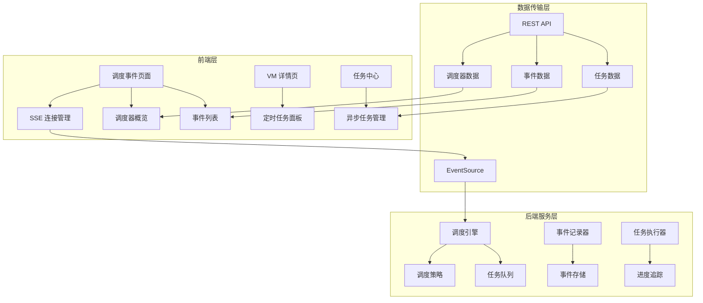

## 路由与权限

| 功能模块 | 路由 | 访问权限 | 说明 |
|---------|------|---------|------|
| **全局调度事件** | `/scheduler/events` | 管理员 | 监控所有调度器运行状态和事件日志 |
| **异步任务中心** | `/task/recent` | 所有用户 | 查看和管理个人异步任务 |
| **VM 定时任务** | 嵌入 VM 详情页 | VM 所有者 | 管理单台虚拟机的定时任务 |

## 调度器概览

调度器概览页面以卡片列表形式展示所有已注册的调度器信息，帮助管理员快速了解系统中各调度器的运行状态。

### 信息展示

| 字段 | 说明 | 示例 |
|------|------|------|
| **调度器名称（name）** | 调度器的显示名称 | `自动快照调度器` |
| **标识（key）** | 调度器的唯一标识符 | `auto_snapshot` |
| **分组（group）** | 调度器所属的功能分组 | `snapshot` |
| **描述（description）** | 调度器的功能描述 | `每日自动创建虚拟机快照` |
| **启用状态（enabled）** | 当前是否启用 | `已启用` / `已停用` |
| **最近事件时间（last_event_at）** | 最后一次触发时间 | `2024-01-15 14:30:00` |

### 操作功能

- **刷新概览**：点击刷新按钮实时更新所有调度器的状态信息
- **状态指示**：通过颜色和图标直观展示调度器的启用状态

:::info[管理员专属]
调度器概览仅对管理员角色可见，普通用户无法访问此页面。
:::

## 调度事件列表

调度事件列表以表格形式展示所有调度器的执行记录，支持实时更新和多维度筛选。

### SSE 实时连接

调度事件通过 SSE（Server-Sent Events）实现数据的实时推送，确保管理员能够第一时间获取调度状态变化。

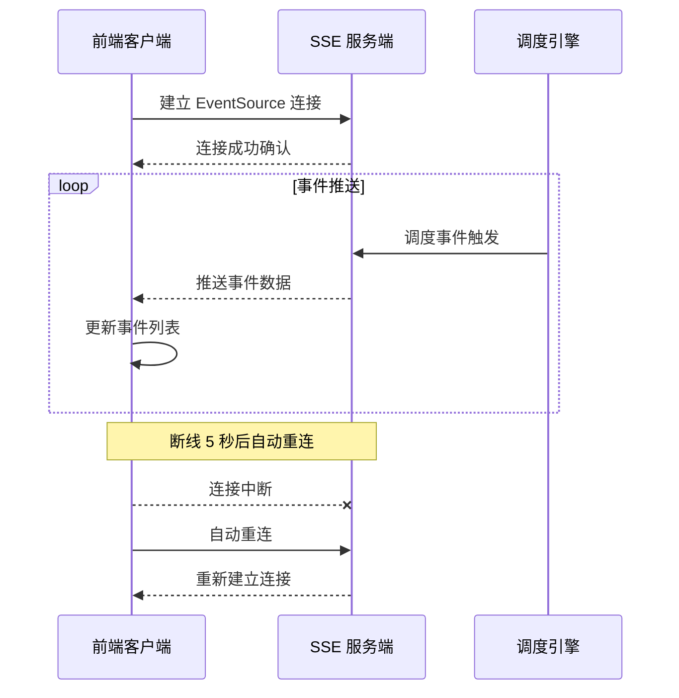

**连接状态管理**：

- 右上角显示 SSE 连接状态标签
- 状态类型：`已连接`（绿色）、`连接中`（黄色）、`已断开`（红色）
- 断线后 5 秒自动尝试重连

### 事件列表字段

| 字段 | 说明 | 格式 |
|------|------|------|
| **触发时间（created_at）** | 调度事件的触发时间 | `YYYY-MM-DD HH:mm:ss` |
| **虚拟机名称（vm_name）** | 关联的虚拟机名称 | `web-server-01` |
| **调度器类型（scheduler_name）** | 触发事件的调度器类型 | `自动快照` |
| **调度状态（status）** | 事件执行状态 | `running` / `success` / `failed` |
| **调度原因（trigger_reason）** | 触发调度的原因描述 | `定时触发` / `手动触发` |
| **执行结果（result_message）** | 成功执行的结果信息 | `快照创建成功` |
| **失败原因（error_message）** | 执行失败的错误信息 | `磁盘空间不足` |
| **完成时间（finished_at）** | 事件执行完成的时间 | `YYYY-MM-DD HH:mm:ss` |

### 状态说明

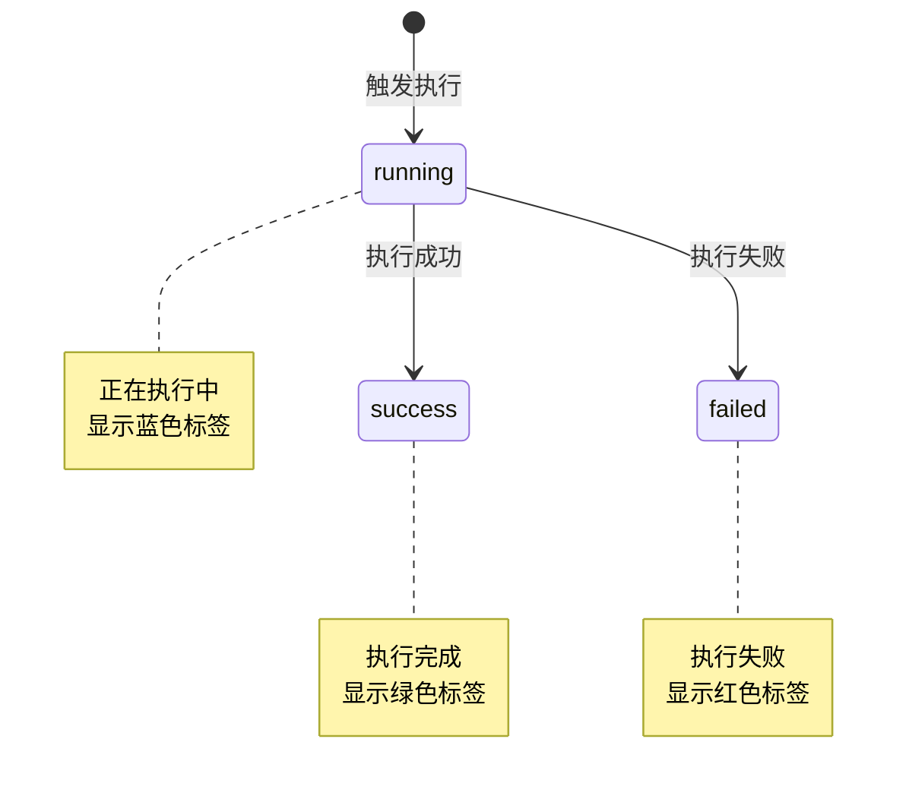

### 筛选功能

支持多维度筛选，帮助快速定位目标事件：

| 筛选维度 | 说明 | 操作方式 |
|---------|------|---------|
| **调度器类型** | 按调度器类型筛选 | 下拉选择 |
| **状态** | 按执行状态筛选 | 下拉选择 |
| **虚拟机名称** | 按虚拟机名称筛选 | 文本输入 |
| **时间范围** | 按触发时间范围筛选 | 日期时间选择器 |

### 分页设置

| 每页条数 | 说明 |
|---------|------|
| **10 条** | 默认分页大小 |
| **20 条** | 中等分页大小 |
| **50 条** | 大分页大小，适合查看大量数据 |

## VM 定时任务（VmSchedulePanel）

VM 定时任务面板嵌入在虚拟机详情页中，允许用户为单台虚拟机配置定时执行的任务。

### 定时任务列表

列表展示当前虚拟机的所有定时任务信息：

| 字段 | 说明 | 示例 |
|------|------|------|
| **事件类型** | 任务所属的事件类别 | `电源事件` / `虚拟机事件` |
| **执行动作** | 任务触发时执行的操作 | `定时开机` / `定时关机` / `删除虚拟机` |
| **执行计划** | 任务的执行频率 | `一次性` / `每天` / `每周` |
| **时区** | 任务使用的时区 | `Asia/Shanghai` |
| **下次执行时间** | 任务的下一次执行时间 | `2024-01-16 08:00:00` |
| **最近执行时间** | 任务的最近一次执行时间 | `2024-01-15 08:00:00` |
| **最近结果** | 最近一次执行的结果 | `成功` / `失败` |
| **启用开关** | 任务的启用/停用状态 | 开启 / 关闭 |

### 新增/编辑定时任务

创建或编辑定时任务时，需要配置以下参数：

#### 事件类型与执行动作

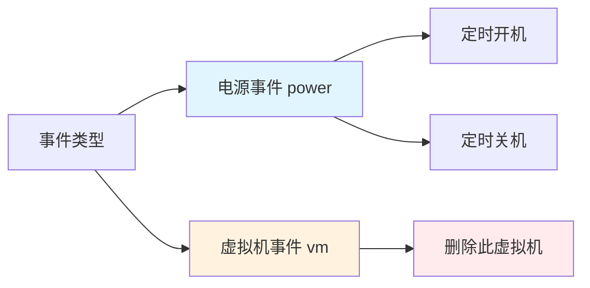

| 事件类型 | 可选动作 | 说明 |
|---------|---------|------|
| **电源事件（power）** | 定时开机、定时关机 | 控制虚拟机的电源状态 |
| **虚拟机事件（vm）** | 删除此虚拟机 | 执行虚拟机删除操作 |

:::warning[删除警告]
当执行动作选择"删除此虚拟机"时，系统会显示醒目的警告提示，提醒用户此操作不可逆，请谨慎操作。
:::

#### 执行计划配置

| 计划类型 | 说明 | 时间配置 | 日期配置 |
|---------|------|---------|---------|
| **一次性（once）** | 仅执行一次 | 日期时间选择器 | - |
| **每天（daily）** | 每天定时执行 | 时间选择器 | - |
| **每周（weekly）** | 每周定时执行 | 时间选择器 | 周一到周日复选框 |

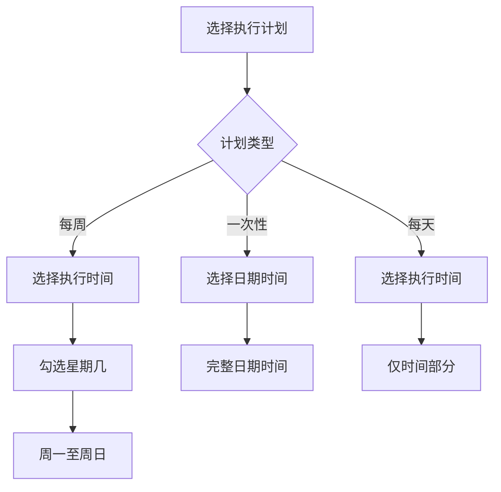

#### 配置参数说明

| 参数 | 说明 | 备注 |
|------|------|------|
| **事件类型** | 电源事件或虚拟机事件 | 必填 |
| **执行动作** | 根据事件类型动态显示可选项 | 必填 |
| **执行计划** | 一次性/每天/每周 | 必填 |
| **执行时间** | 一次性：完整日期时间；其他：仅时间 | 必填 |
| **执行日期** | 每周计划时可勾选周一到周日 | 每周计划必填 |
| **浏览器时区** | 自动检测并只读展示 | 系统自动填充 |
| **启用状态** | 启用/停用开关 | 默认启用 |

## 异步任务中心

异步任务中心提供统一的任务管理界面，用户可以查看、追踪和管理所有异步执行的任务。

### 任务类型

系统支持 20+ 种异步任务类型，涵盖虚拟机管理的各个方面：

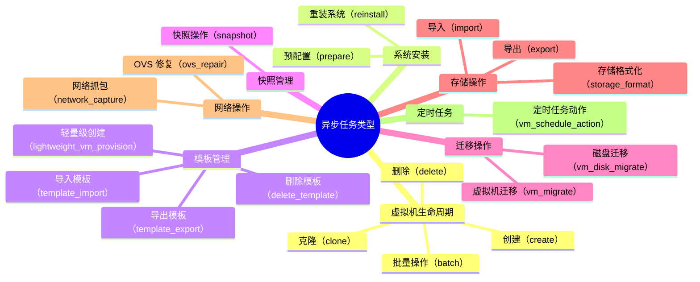

### 任务状态

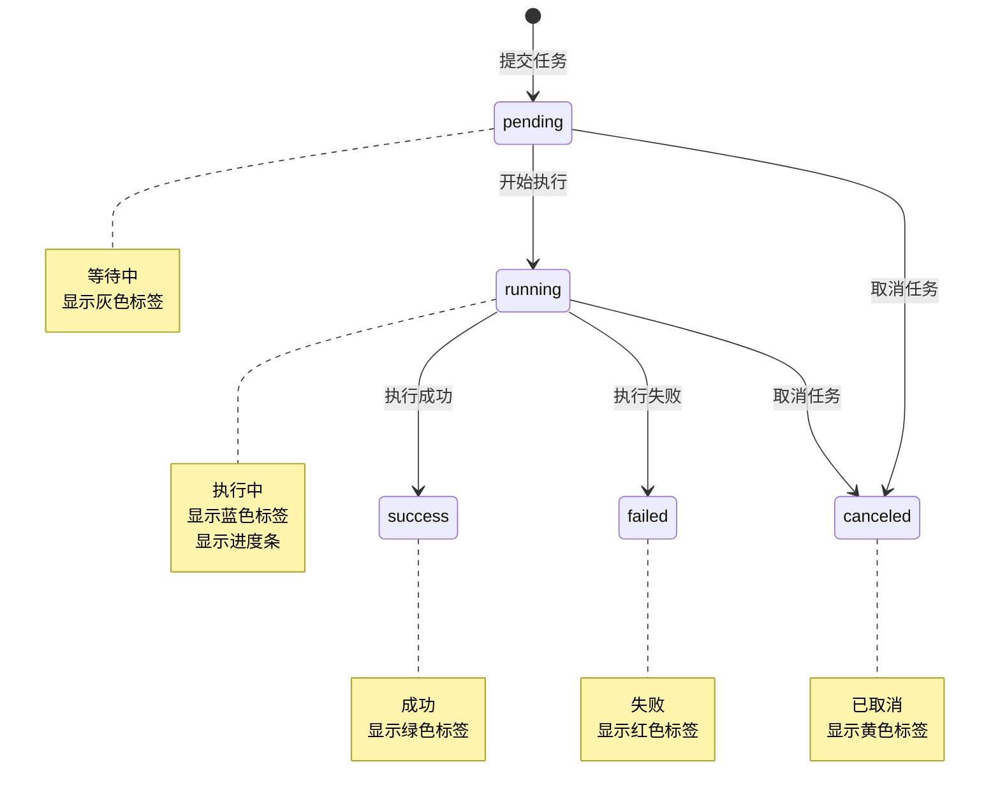

| 状态 | 说明 | 可执行操作 |
|------|------|-----------|
| **pending** | 等待中，任务已提交但尚未开始执行 | 取消 |
| **running** | 执行中，任务正在处理 | 查看详情、取消 |
| **success** | 成功，任务已成功完成 | 查看详情、清理 |
| **failed** | 失败，任务执行过程中发生错误 | 查看详情、清理 |
| **canceled** | 已取消，任务被用户手动取消 | 查看详情、清理 |

### SSE 实时更新

异步任务通过 SSE 实时推送任务进度和状态变化：

- **连接地址**：`/task/sse`
- **推送内容**：任务状态变更、进度更新、执行结果
- **自动重连**：断线后自动尝试重新连接

### 任务列表字段

| 字段 | 说明 | 示例 |
|------|------|------|
| **ID** | 任务的唯一标识符 | `task_20240115_001` |
| **类型** | 任务类型 | `创建虚拟机` |
| **状态** | 当前任务状态 | `执行中` |
| **进度条** | 任务执行进度 | `65%` |
| **状态消息** | 当前执行状态描述 | `正在创建磁盘镜像` |
| **创建人** | 提交任务的用户 | `admin` |
| **创建时间** | 任务提交时间 | `2024-01-15 14:30:00` |
| **操作** | 可执行的操作 | `详情` / `取消` |

### 任务详情抽屉

点击"详情"按钮打开任务详情抽屉，展示任务的完整信息：

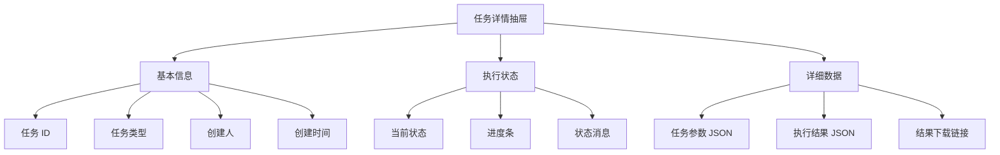

| 信息类别 | 字段 | 说明 |
|---------|------|------|
| **基本信息** | 任务 ID | 任务的唯一标识符 |
| | 任务类型 | 异步任务的类型 |
| | 创建人 | 提交任务的用户 |
| | 创建时间 | 任务提交的时间 |
| **执行状态** | 当前状态 | pending/running/success/failed/canceled |
| | 进度条 | 任务执行的百分比进度 |
| | 状态消息 | 当前执行状态的详细描述 |
| **详细数据** | 任务参数 | JSON 格式的任务输入参数 |
| | 执行结果 | JSON 格式的任务执行结果 |
| | 结果下载链接 | 可下载的结果文件链接（如有） |

### 操作功能

| 操作 | 说明 | 适用状态 |
|------|------|---------|
| **刷新** | 刷新任务列表，获取最新状态 | 所有状态 |
| **取消** | 取消正在执行的任务 | pending、running |
| **清理已完成** | 批量清除 success/failed/canceled 状态的任务 | success、failed、canceled |
| **详情** | 查看任务详细信息 | 所有状态 |

## 全局底部任务面板（RecentTaskPanel）

全局底部任务面板是一个固定在页面底部的可折叠面板，提供快速访问运行中任务的入口。

### 面板特性

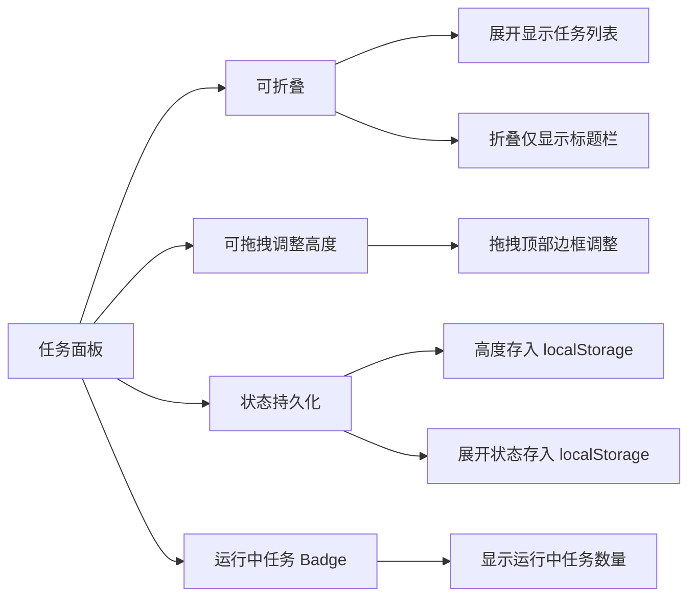

| 特性 | 说明 |
|------|------|
| **可折叠** | 支持展开/折叠，展开时显示任务列表，折叠时仅显示标题栏 |
| **可拖拽调整高度** | 拖拽面板顶部边框可自由调整面板高度 |
| **状态持久化** | 面板高度和展开/折叠状态自动保存到 localStorage |
| **运行中任务 Badge** | 标题栏显示运行中任务的数量徽章 |

## 实现原理

### 调度器架构

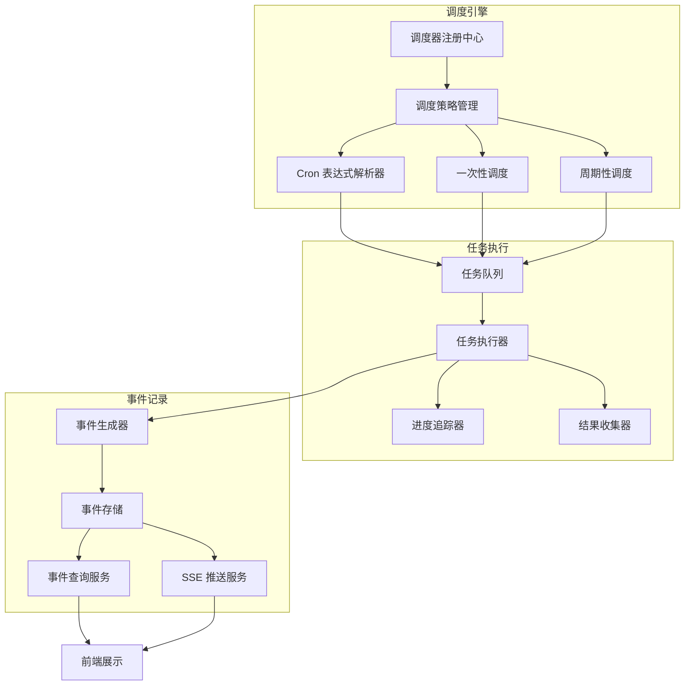

### 核心组件说明

| 组件 | 职责 | 说明 |
|------|------|------|
| **调度器注册中心** | 管理所有调度器的注册和生命周期 | 维护调度器元数据和状态 |
| **调度策略管理** | 管理不同类型调度策略 | 支持 Cron、一次性、周期性等策略 |
| **Cron 表达式解析器** | 解析和执行 Cron 表达式 | 支持标准 Cron 语法 |
| **任务队列** | 缓存待执行的任务 | 支持优先级和并发控制 |
| **任务执行器** | 实际执行调度任务 | 支持超时、重试、取消 |
| **事件记录器** | 记录所有调度事件 | 用于监控和故障排查 |
| **SSE 推送服务** | 实时推送事件和任务状态 | 基于 Server-Sent Events 协议 |

### VM 定时任务实现

VM 定时任务基于 Cron 表达式实现，支持以下计划类型：

| 计划类型 | Cron 表达式示例 | 说明 |
|---------|----------------|------|
| **一次性** | - | 使用绝对时间戳，不使用 Cron 表达式 |
| **每天** | `0 8 * * *` | 每天 08:00 执行 |
| **每周** | `0 8 * * 1,3,5` | 每周一、三、五 08:00 执行 |

:::tip[时区处理]
定时任务使用浏览器检测的时区进行展示，后端存储和执行时会进行时区转换，确保任务在用户预期的时间执行。
:::

### 异步任务实现

异步任务通过任务队列实现，支持以下特性：

- **进度跟踪**：任务执行过程中实时更新进度百分比
- **状态管理**：完整的任务生命周期管理（pending → running → success/failed/canceled）
- **取消支持**：支持在任务执行前或执行中取消任务
- **结果存储**：任务执行结果以 JSON 格式存储，支持文件下载

### SSE 通信机制

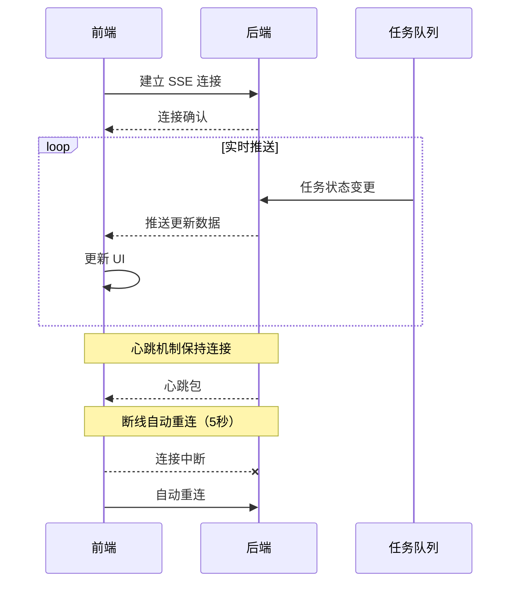

## API 接口

### 调度器相关接口

| 接口 | 方法 | 说明 | 参数 |
|------|------|------|------|
| `/scheduler/list` | GET | 获取调度器概览列表 | - |
| `/scheduler/events` | GET | 获取调度事件列表 | 筛选条件、分页参数 |
| `/scheduler/events/sse` | EventSource | SSE 实时接收调度事件 | - |

### VM 定时任务接口

| 接口 | 方法 | 说明 | 参数 |
|------|------|------|------|
| `/vm/{name}/schedules` | GET | 获取 VM 定时任务列表 | vm_name（路径参数） |
| `/vm/{name}/schedules` | POST | 创建 VM 定时任务 | vm_name、任务配置 |
| `/vm/{name}/schedules/{id}` | PUT | 更新 VM 定时任务 | vm_name、task_id、任务配置 |
| `/vm/{name}/schedules/{id}` | DELETE | 删除 VM 定时任务 | vm_name、task_id |

### 异步任务接口

| 接口 | 方法 | 说明 | 参数 |
|------|------|------|------|
| `/task/list` | GET | 获取任务列表 | 筛选条件、分页参数 |
| `/task/{id}` | GET | 获取任务详情 | task_id |
| `/task/{id}/cancel` | POST | 取消任务 | task_id |
| `/task/clear` | DELETE | 清理已完成任务 | - |

:::warning[接口鉴权]
所有接口均需要进行身份认证，部分接口（如调度器概览）需要管理员权限。请确保在请求中携带有效的认证令牌。
:::
