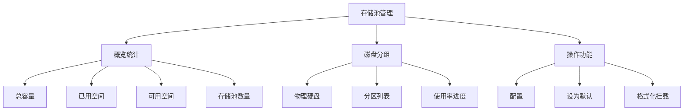
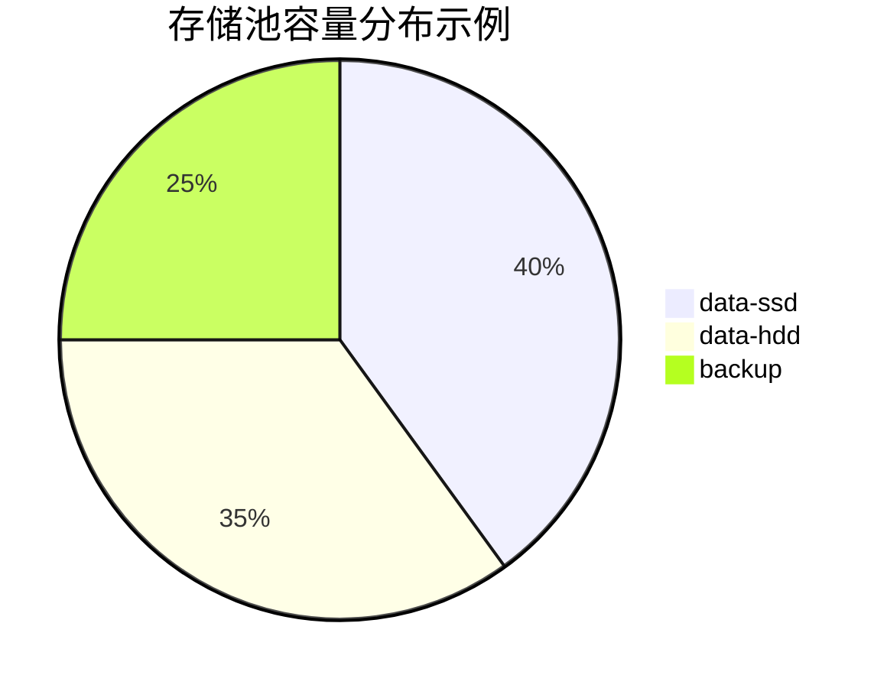
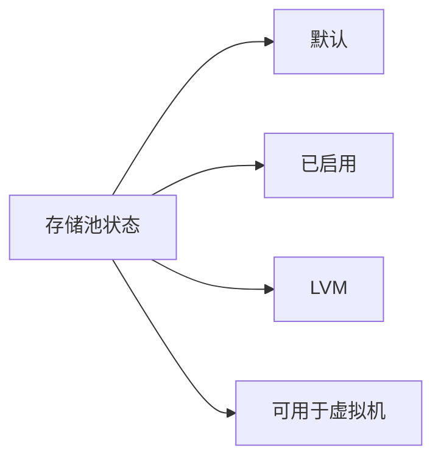
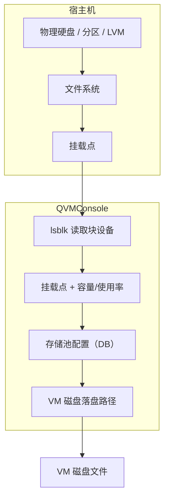
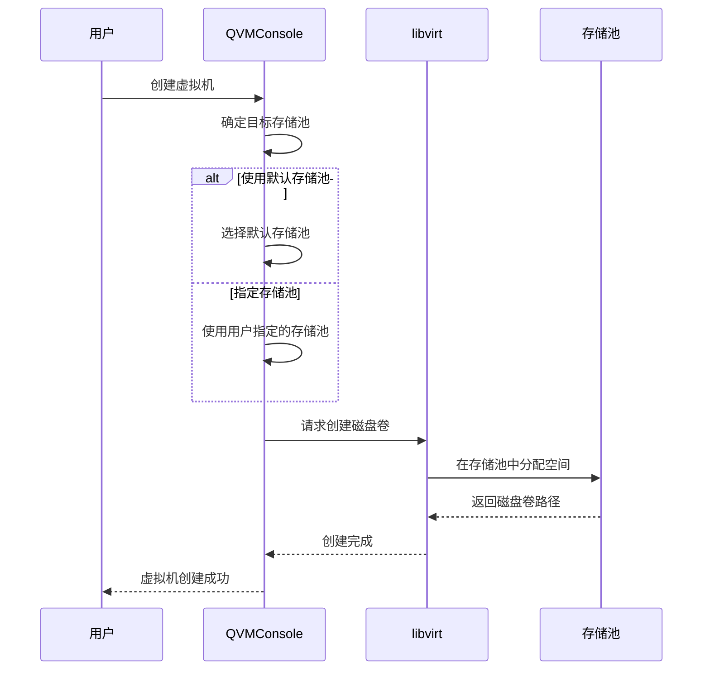

# 存储池管理

存储池管理是管理员专属功能，用于管理宿主机上的物理硬盘和分区。存储池决定了虚拟机磁盘文件的落盘位置，是虚拟化基础设施的存储基石。通过合理的存储池规划，可以实现性能优化、容量管理和数据隔离。

## 功能概述

:::info[访问权限]
存储池管理功能仅限管理员访问，路由路径为 `/storage-pool/list`。普通用户无法查看或操作存储池配置。
:::

## 概览统计

概览统计区域提供存储资源的整体视图，帮助管理员快速掌握存储使用情况。

### 统计卡片

| 卡片名称 | 数据来源 | 说明 |
|----------|----------|------|
| **总容量** | 物理硬盘数量 | 系统识别的所有物理硬盘总数 |
| **已用空间** | 已挂载分区数 | 当前已挂载并使用的分区数量 |
| **可用空间** | 剩余容量 | 尚未分配或可扩展的存储空间 |
| **存储池数量** | 活跃存储池 | 已配置并激活的存储池总数 |

### 存储池容量分布

使用 ECharts 饼图展示各存储池的容量占比，直观显示存储资源分配情况：

### 存储池容量对比

使用 ECharts 堆叠柱状图对比各存储池的已用和可用空间：

| 特性 | 说明 |
|------|------|
| **堆叠展示** | 已用空间与可用空间上下堆叠 |
| **暗黑模式** | 自动适配系统暗黑主题 |
| **交互提示** | 鼠标悬停显示详细数值 |
| **动态更新** | 数据变化时图表实时刷新 |

## 磁盘分组卡片

磁盘分组以卡片形式展示每块物理硬盘及其分区，提供清晰的层级结构。

### 物理硬盘信息

每个磁盘卡片显示以下核心信息：

| 字段 | 说明 | 示例 |
|------|------|------|
| **device_path** | 设备路径 | `/dev/sda`、`/dev/nvme0n1` |
| **type** | 设备类型 | `disk`（物理磁盘）、`part`（分区）、`lvm`（逻辑卷）、`loop`（回环设备）、`rom`（只读介质） |
| **model** | 设备型号 | `Samsung SSD 970 EVO` |
| **size** | 设备容量 | `500GB`、`2TB` |

### 状态标签

每个存储池可显示以下状态标签：

| 标签 | 含义 |
|------|------|
| **默认** | 作为虚拟机创建时的默认存储位置 |
| **已启用** | 存储池处于激活状态，可正常使用 |
| **LVM** | 使用逻辑卷管理，支持动态扩展 |
| **可用于虚拟机** | 已配置为可接受虚拟机磁盘文件 |

### 子分区/子设备列表

每个物理硬盘下以树形结构展示其子分区和子设备：

| 展示项 | 说明 |
|--------|------|
| **设备路径** | 如 `/dev/sda1`、`/dev/sda2` |
| **文件系统（fstype）** | `ext4`、`xfs`、`ntfs` 等 |
| **挂载点** | 分区挂载的目录路径 |
| **使用率进度条** | 可视化显示空间使用百分比 |
| **可用/总容量** | 格式如 `120GB / 500GB` |

## 操作功能

### 配置

点击"配置"按钮打开配置对话框，可设置以下参数：

| 配置项 | 说明 |
|--------|------|
| **display_name** | 存储池的显示名称，便于识别和管理 |
| **enabled** | 启用状态开关，控制存储池是否可用于虚拟机 |

### 设为默认

将指定存储池设为默认虚拟机存储位置：

- 新创建的虚拟机默认落盘到此存储池
- 每次操作只能有一个默认存储池
- 设置新默认会自动取消之前的默认标记

### 格式化挂载

:::danger[危险操作]
格式化挂载会**清空磁盘上所有数据**，此操作不可逆。请务必确认数据已备份后再执行。
:::

格式化挂载的操作流程：

1. 点击"格式化挂载"按钮
2. 系统弹出确认对话框
3. 必须勾选确认复选框
4. 点击提交执行操作

## 实现原理

### 存储池架构

### 核心机制

| 组件 | 功能说明 |
|------|----------|
| **块设备探测** | 通过 `lsblk -J` 获取硬盘、分区、LVM 卷组/逻辑卷的层级信息，运行时始终从系统命令读取，不依赖数据库 |
| **配置持久化** | 存储池的 `display_name` / `enabled` / `is_default` / `mount_path` 等管理配置保存在 `host_storage_pools` 表，硬盘容量等运行时信息不落库 |
| **VM 落盘路径** | 每个存储池对应一个挂载点下的 `vm_dir` 目录，VM 磁盘直接落盘到该路径；未使用 libvirt storage pool 概念 |
| **格式化操作** | 通过 `mkfs` + `mount` 将目标分区格式化为 ext4 并挂载到指定目录 |
| **LVM 支持** | 支持识别 PV/VG/LV 结构，并允许在 LV 节点上启用存储池 |

### 存储池与虚拟机的关系

## 最佳实践

### 存储池规划建议

| 场景 | 推荐配置 | 说明 |
|------|----------|------|
| **生产环境** | SSD 存储池 + 独立备份池 | 高性能存储保障业务，独立备份池保障数据安全 |
| **开发测试** | 单一大容量存储池 | 简化管理，满足开发测试需求 |
| **混合负载** | SSD + HDD 双存储池 | 热数据放 SSD，冷数据放 HDD |

### 容量管理

- 定期检查存储池使用率，避免空间不足影响虚拟机运行
- 建议保持至少 20% 的可用空间作为缓冲
- 使用 LVM 存储池可实现动态扩展，应对突发容量需求
