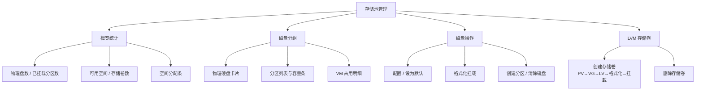
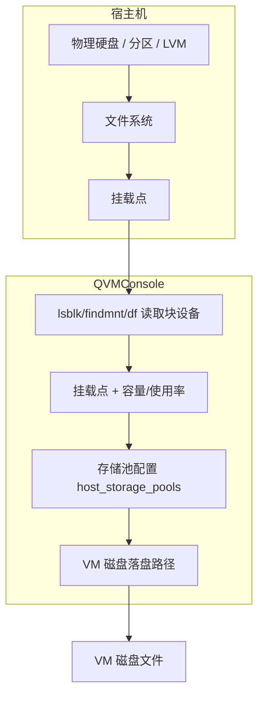
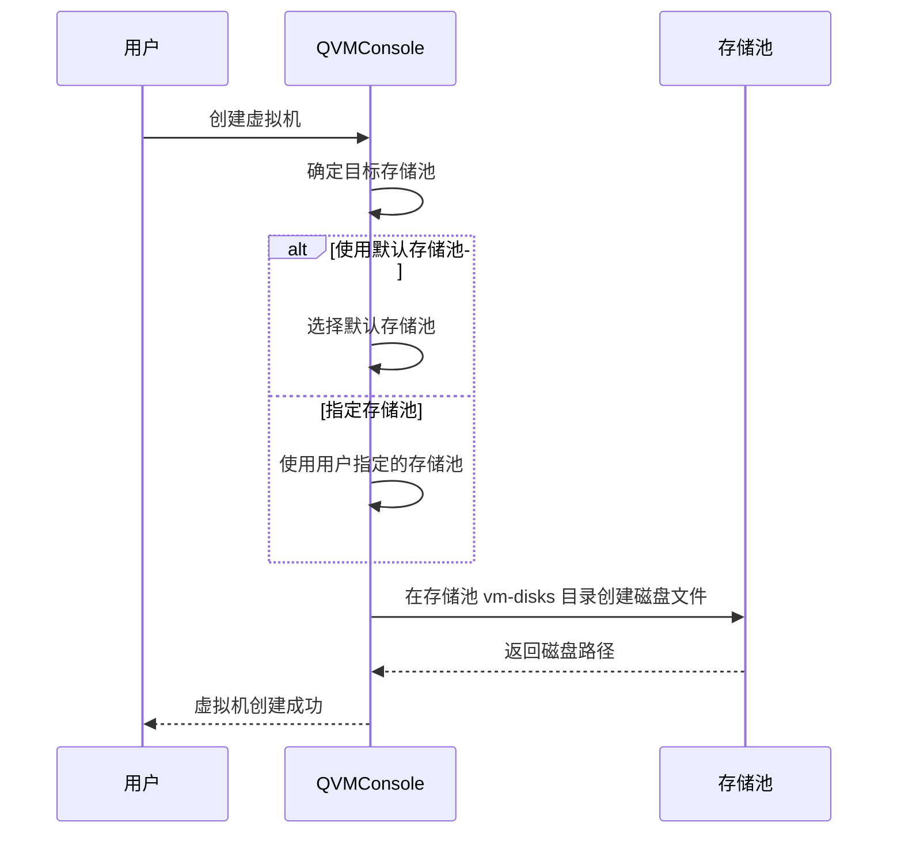

# 存储池管理

存储池管理是管理员专属功能（路由 `/storage-pool`），用于管理宿主机上的物理硬盘、分区与 LVM 存储卷。存储池决定了虚拟机磁盘文件的落盘位置，是虚拟化基础设施的存储基石。通过合理的存储池规划，可以实现性能优化、容量管理和数据隔离。

:::info[访问权限]
存储池列表、详情、配置、默认设置、格式化、分区与 LVM 卷操作均需管理员权限；`all-isos`（全局 ISO 列表）与 `vm-targets`（创建 VM 可选存储目标）对普通用户开放。格式化、分区、清盘、建卷、删卷为高风险操作，需要二次验证并以异步任务执行。
:::

## 功能概览

## 概览统计

| 统计项 | 数据来源 |
|--------|----------|
| **总容量** | 系统识别的物理硬盘数量 |
| **已用空间** | 已挂载并使用的分区数量 |
| **可用空间** | 尚未分配或可扩展的存储空间 |
| **存储卷** | LVM 卷组（VG）列表 |

概览区还提供统一的**空间分配条**：已用 / 可用 / 未挂载 / 未分配四段展示（使用率超过 70% / 90% 时变色提醒）。页面支持按「全部 / 待初始化 / 使用中 / 存储卷」筛选磁盘卡片。

## 磁盘分组卡片

磁盘分组以卡片形式展示每块物理硬盘及其分区，提供清晰的层级结构。

### 物理硬盘信息

| 字段 | 说明 | 示例 |
|------|------|------|
| **device_path** | 设备路径 | `/dev/sda`、`/dev/nvme0n1` |
| **type** | 设备类型 | `disk`（物理磁盘）、`part`（分区）、`lvm`（逻辑卷）等（loop/rom/ram/zram 设备会被过滤） |
| **model / serial** | 设备型号与序列号 | `Samsung SSD 970 EVO` |
| **size** | 设备容量 | `500GB`、`2TB` |
| **rota** | 是否机械盘（用于磁盘图标区分 HDD/SSD/NVMe） | - |

### 状态标签

| 标签 | 含义 |
|------|------|
| **默认** | 虚拟机创建时的默认存储位置 |
| **已启用** | 存储池处于激活状态，可正常使用 |
| **待初始化** | 可格式化但尚未配置 |
| **系统盘** | 挂载了 `/`、`/boot`、`/usr`、`/var`、`/home` 等系统目录，禁止格式化 |
| **LVM / PV** | LVM 逻辑卷或物理卷引用 |
| **只读 / 可移除** | 设备属性 |
| **存在数据** | 可格式化设备上检测到已有分区或文件系统，操作前会给出警告 |

### 子分区列表

每个物理硬盘下以树形结构展示其子分区和子设备：

| 展示项 | 说明 |
|--------|------|
| **设备路径** | 如 `/dev/sda1`、`/dev/nvme0n1p2` |
| **文件系统（fstype）** | `ext4`、`xfs`、`btrfs`、`ntfs` 等 |
| **挂载点** | 分区挂载的目录路径 |
| **使用率进度条** | 空间使用百分比（≥70% 橙色、≥90% 红色） |
| **可用/总容量** | 格式如 `120GB / 500GB` |

### VM 占用明细

启用状态的存储池卡片展示 VM 磁盘占用（默认折叠）：扫描所有虚拟机的磁盘定义，通过 `qemu-img info` 读取虚拟大小与实际占用，按挂载点前缀归属到存储池，汇总「共 N 台虚拟机 · 实际占用 / 虚拟总配」，展开可见各 VM 明细。

## 磁盘操作

### 配置

| 配置项 | 说明 |
|--------|------|
| **显示名称** | 存储池的显示名称，便于识别和管理 |
| **启用状态** | 控制存储池是否可用于虚拟机（设备不可用时禁用并提示原因） |

### 设为默认

- 新创建的虚拟机默认落盘到此存储池
- 每次操作只能有一个默认存储池，设置新默认会自动取消之前的默认标记
- 仅「可用于虚拟机」（已启用且有挂载点）的存储池可设为默认

### 格式化挂载

:::danger[危险操作]
格式化挂载会**清空磁盘上所有数据**，此操作不可逆。请务必确认数据已备份后再执行。
:::

| 项 | 说明 |
|------|------|
| **目标** | 整盘或独立分区/LV（以存储池条目为准） |
| **文件系统** | ext4（默认）/ xfs / btrfs |
| **挂载目录** | 固定为 `/var/lib/kvm-storage/{设备ID}` |
| **持久化** | 写入 fstab（`UUID=... defaults,nofail 0 2`），开机自动挂载；自动创建 `vm-disks` 子目录并授权 `libvirt-qemu` |

格式化流程：卸载（含占用进程处理）→ `wipefs -a` 清除签名 → `mkfs` 格式化 → 读 UUID → 挂载 → 写 fstab → 保存配置。操作以异步任务执行（`storage_format`）。

### 创建分区

| 项 | 说明 |
|------|------|
| **目标** | 仅整盘（`disk` 类型） |
| **分区大小** | GB；填 0 表示使用全部剩余空间 |
| **行为** | 无分区表时自动创建 GPT；新分区按 1MiB 对齐追加在末尾（`parted mkpart`） |

:::info 新分区不会自动格式化
创建分区后需对该分区再执行「格式化挂载」才能用作存储池。操作以异步任务执行（`storage_create_partition`）。
:::

### 清除磁盘

清除磁盘（`storage_delete_partitions`）按目标状态执行不同语义：

| 目标状态 | 行为 |
|----------|------|
| **有分区的整盘** | 递归卸载所有分区 → 清理 fstab 与数据库配置 → `wipefs -a` 清除全部分区与签名 |
| **已挂载的整盘/分区** | 卸载并清理 fstab 与数据库配置（「清除磁盘挂载」） |

## LVM 存储卷

存储池页支持完整的 LVM 存储卷生命周期管理（创建向导 + 删除确认，均为高风险异步任务）。

### 创建存储卷（两步向导）

| 步骤 | 配置项 | 说明 |
|------|--------|------|
| **1. 选择 PV** | 物理卷磁盘列表 | 从可用整盘/分区中勾选（自动排除系统盘、已挂载、LVM/RAID/ZFS 成员等） |
| **2. 配置 VG/LV** | 卷组名、PE 大小（4M-64M）、逻辑卷名、逻辑卷大小 | 大小支持 `10G` 或百分比格式（`50%VG` / `100%FREE`） |
| | LV 类型 | linear（线性）/ striped（条带，需指定条带数）/ mirrored（镜像，需指定镜像数） |
| | 文件系统 | ext4 / xfs / btrfs / none（不格式化） |
| | 挂载路径、开机自动挂载 | 可选写入 fstab |

执行顺序：`pvcreate` → `vgcreate`（失败回滚 pvremove）→ `lvcreate` → 格式化（如选择）→ 挂载并可选写 fstab → 创建 `vm-disks` 目录 → 保存存储池配置（设备 ID 为 VG-LV 归一化结果）。

### 删除存储卷

确认对话框展示卷组名、总容量、逻辑卷数与物理卷数；执行流程：安全校验（挂载在系统目录的 LV 拒绝删除）→ 强制卸载 LV → 清理 fstab 与数据库配置 → `vgchange -an` → `lvremove` → `vgremove` → `pvremove`。

## 实现原理

### 存储池架构

### 核心机制

| 组件 | 功能说明 |
|------|----------|
| **块设备探测** | `lsblk -J` 获取硬盘、分区、LVM 层级信息，`findmnt`/`df` 补充挂载与容量；运行时始终从系统命令读取，不依赖数据库 |
| **配置持久化** | 存储池的 `display_name` / `enabled` / `is_default` / `mount_path` 等管理配置保存在 `host_storage_pools` 表（主键为归一化设备 ID），容量等运行时信息不落库 |
| **VM 落盘路径** | 每个存储池对应挂载点下的 `vm-disks` 目录，VM 磁盘直接落盘到该路径；未使用 libvirt storage pool 概念 |
| **格式化操作** | `wipefs` + `mkfs` + `mount` 并写 fstab 持久化 |
| **LVM 支持** | 识别 PV/VG/LV 结构并合成展示节点，提供建卷/删卷全流程管理 |

### 存储池与虚拟机的关系

创建虚拟机时的存储目标列表（`vm-targets`）只包含「可用于虚拟机」（已启用、有挂载点、有可用空间）的存储池，按「默认 → 启用 → 名称」排序。

## 最佳实践

### 存储池规划建议

| 场景 | 推荐配置 | 说明 |
|------|----------|------|
| **生产环境** | SSD 存储池 + 独立存储池分离系统盘与数据盘 | 高性能保障业务，隔离降低风险 |
| **开发测试** | 单一大容量存储池 | 简化管理，快速分配 |
| **混合负载** | SSD + HDD 双存储池 | 热数据放 SSD，冷数据放 HDD |
| **弹性容量** | LVM 存储卷 | 支持条带/镜像与后续扩展 |

### 容量管理

- 定期检查存储池使用率（页面使用率进度条与空间分配条），避免空间不足影响虚拟机运行
- 建议保持至少 20% 的可用空间作为缓冲
- 待初始化磁盘优先「创建分区」再格式化，便于后续灵活划分；整盘独占场景可直接格式化挂载
- 存在历史数据的磁盘操作前务必确认备份
