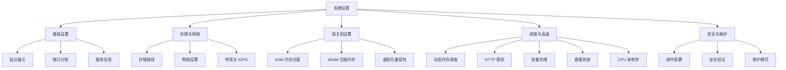
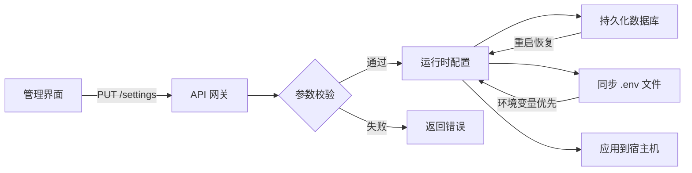
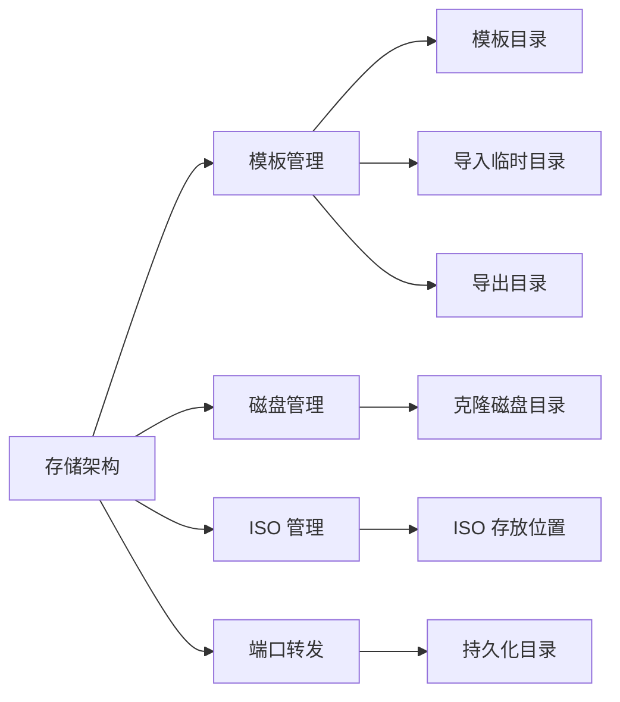
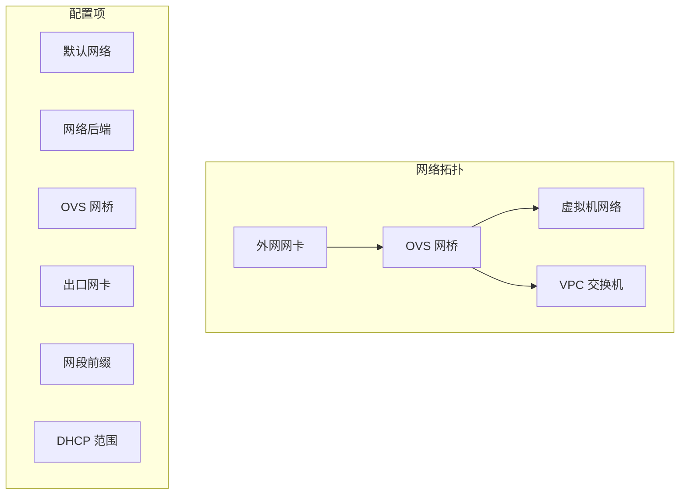
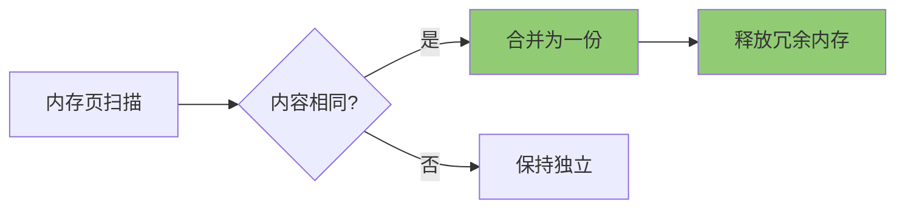
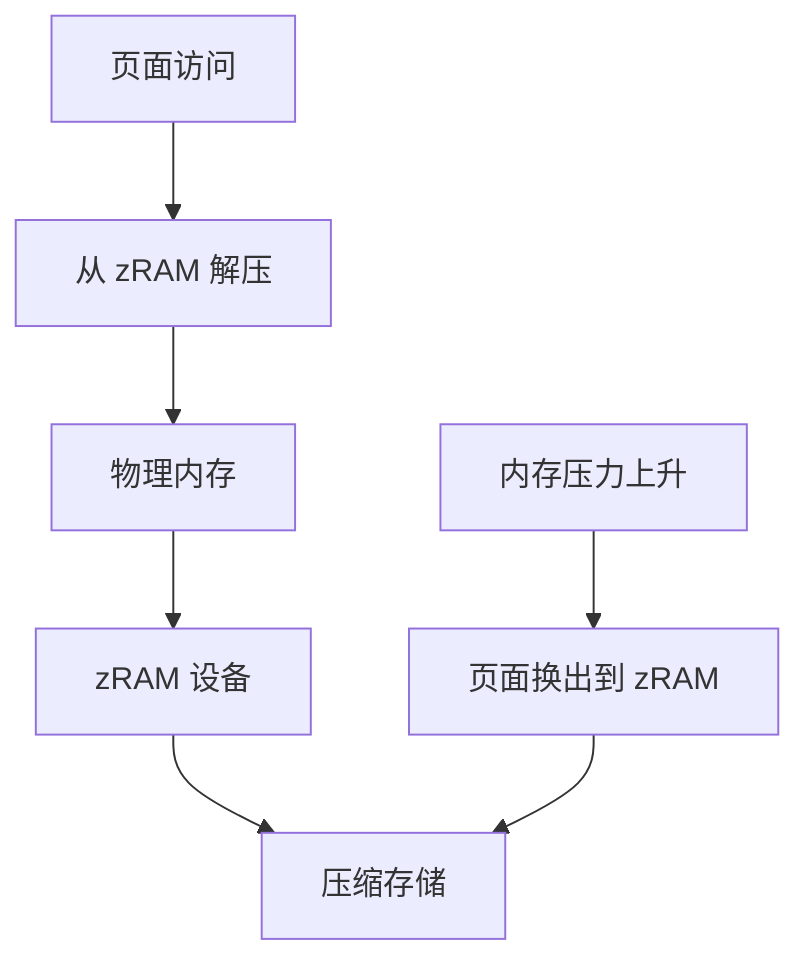
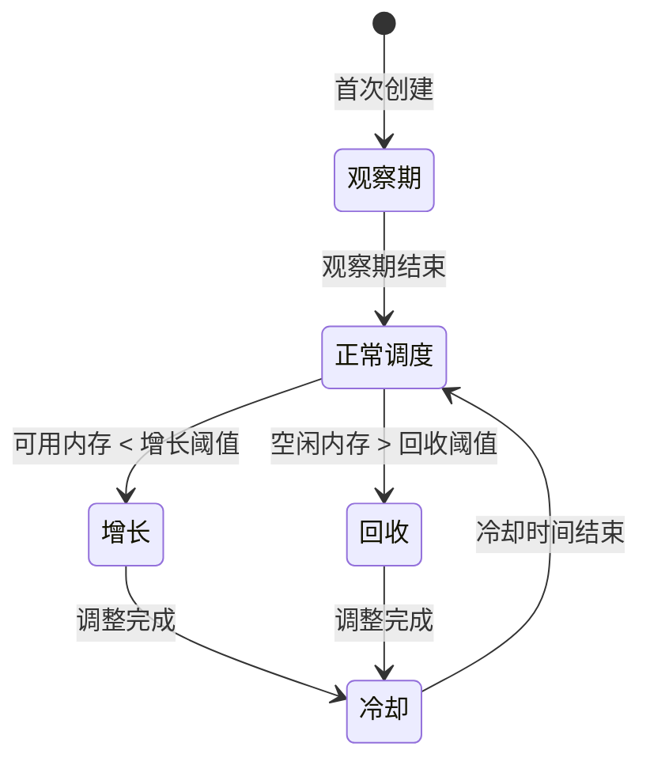
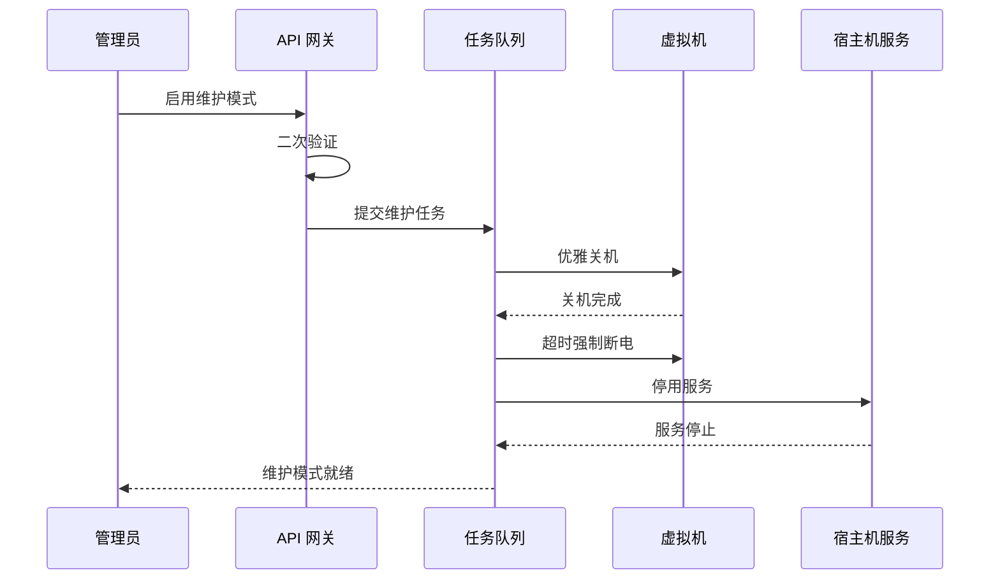
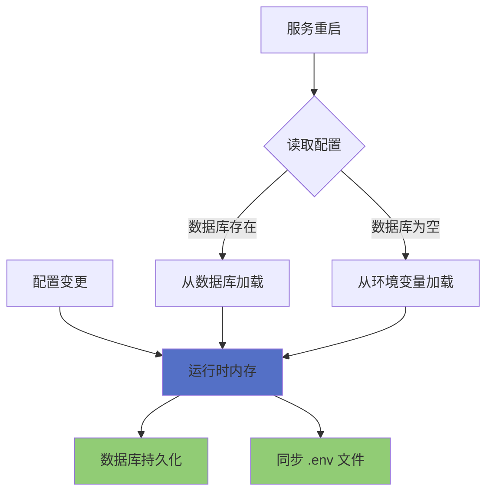

# 系统设置

系统设置是管理员专属的全局配置中心，负责平台运行参数、宿主机资源调优和安全维护策略的统一管理。通过科学的配置分层，管理员可以精准控制平台的每一个运行细节。

## 功能架构

## 配置流向

:::info[访问权限]
系统设置页面路由为 `/settings`，仅管理员角色可访问。所有配置保存后立即生效并持久化到数据库，重启后自动恢复。
:::

## 基础设置

基础设置涵盖站点展示、端口分配和服务信息三个核心模块，是平台运行的基石配置。

### 站点展示

| 配置项 | 字段名 | 限制 | 环境变量 | 说明 |
|--------|--------|------|----------|------|
| 网站标题 | site_title | 最大 60 字符 | KVM_SITE_TITLE | 用于登录页、侧边栏和浏览器标签页 |
| 访问链接 | public_base_url | - | KVM_PUBLIC_BASE_URL | 邮件跳转链接的基准地址 |

:::tip[环境变量覆盖]
当环境变量 `KVM_SITE_TITLE` 存在时，会覆盖数据库中的配置值。建议在生产环境中通过环境变量统一管理关键配置。
:::

### 端口自动分配

端口转发功能在自动分配端口时，会从配置的范围内选取可用端口。

| 配置项 | 字段名 | 范围 | 环境变量 |
|--------|--------|------|----------|
| 起始端口 | auto_port_start | 1024-65535 | KVM_AUTO_PORT_START |
| 结束端口 | auto_port_end | 1024-65535 | KVM_AUTO_PORT_END |

### 服务信息

| 配置项 | 字段名 | 环境变量 | 说明 |
|--------|--------|----------|------|
| 服务端口 | port | KVM_PORT | 只读显示，需通过环境变量修改后重启生效 |

## 存储与网络

存储与网络配置定义了平台的存储架构和网络拓扑，是虚拟机运行的基础设施层。

### 存储路径

| 配置项 | 字段名 | 环境变量 | 说明 |
|--------|--------|----------|------|
| 模板目录 | template_dir | KVM_TEMPLATE_DIR | 存储虚拟机模板文件 |
| 模板导入临时目录 | template_import_dir | KVM_TEMPLATE_IMPORT_DIR | 建议与模板目录同盘，避免占满 /tmp |
| 模板导出目录 | template_export_dir | KVM_TEMPLATE_EXPORT_DIR | 建议与模板目录同盘 |
| 克隆磁盘目录 | clone_dir | KVM_CLONE_DIR | 虚拟机磁盘克隆的目标位置 |
| ISO 存放位置 | iso_dir | KVM_ISO_DIR | 创建 VM 和救援系统时读取此目录 |
| 端口转发持久化目录 | port_forward_dir | KVM_PORTFORWARD_DIR | 只读，仅通过环境变量修改 |

### 网络设置

| 配置项 | 字段名 | 环境变量 | 说明 |
|--------|--------|----------|------|
| 默认网络 | default_network | KVM_DEFAULT_NETWORK | 保留给历史配置，新平台默认 OVS |
| 网络后端 | network_backend | KVM_NETWORK_BACKEND | 只读，当前仅支持 OVS |
| OVS 网桥 | ovs_bridge | KVM_OVS_BRIDGE | VM 接入的网桥名称 |
| OVS 出口网卡 | ovs_uplink | KVM_OVS_UPLINK | 留空自动检测默认路由网卡 |
| 网段前缀 | subnet_prefix | KVM_SUBNET_PREFIX | 子网地址前缀，如 192.168.122 |
| DHCP 起始 | ovs_dhcp_start | KVM_OVS_DHCP_START | 留空时按网段前缀使用 .2 |
| DHCP 结束 | ovs_dhcp_end | KVM_OVS_DHCP_END | 留空时按网段前缀使用 .254 |
| 外网网卡 | external_nic | KVM_EXTERNAL_NIC | 端口转发使用的外网网卡 |
| 公网 IP | host_ip | KVM_HOST_IP | 留空自动检测，可手动固定 |

### 全局带宽限制

全局带宽限制应用于所有非轻量云虚拟机及 VPC 交换机，所有运行中的 VM 均分总带宽。

| 配置项 | 字段名 | 范围 | 环境变量 |
|--------|--------|------|----------|
| 下行总带宽 | max_burst_inbound | 0-100000 Mbps | KVM_MAX_BURST_INBOUND |
| 上行总带宽 | max_burst_outbound | 0-100000 Mbps | KVM_MAX_BURST_OUTBOUND |

:::warning[带宽计算]
有效带宽 = 配置值 - 5Mbps（保留缓冲）。配置 0 表示不限制。保存后立即生效，每台运行中 VM 设置全量有效带宽为上限。
:::

### 默认磁盘 IOPS 限制

此设置仅作为新建虚拟机时的默认值，已存在的 VM 需在编辑页面单独配置。

| 配置项 | 字段名 | 环境变量 |
|--------|--------|----------|
| 默认总 IOPS | default_disk_iops_total | KVM_DEFAULT_DISK_IOPS_TOTAL |
| 默认读 IOPS | default_disk_iops_read | KVM_DEFAULT_DISK_IOPS_READ |
| 默认写 IOPS | default_disk_iops_write | KVM_DEFAULT_DISK_IOPS_WRITE |

## 宿主机设置

宿主机设置是针对底层虚拟化平台的深度调优，涵盖内存优化和虚拟化兼容性两大领域。

### KSM 内存去重

KSM（Kernel Same-page Merging）是 Linux 内核级别的内存页去重技术，通过扫描匿名内存页，将内容完全相同的页面合并为同一份物理内存。

#### 挡位说明

| 挡位 | 代码 | 扫描策略 | 适用场景 |
|------|------|----------|----------|
| 关闭 | off | 不扫描 | 临时排障或 CPU 压力优先 |
| 保守 | conservative | 低频扫描 | 内存压力不高的虚拟化宿主机 |
| 均衡 | balanced | 中频扫描 | 推荐挡位，平衡内存节省与 CPU 开销 |
| 积极 | aggressive | 高频扫描 | VM 密度较高，希望快速释放内存 |
| 极致 | extreme | 最大化扫描 | 内存非常紧张的纯虚拟化宿主机 |

#### 运行参数

| 参数 | 说明 |
|------|------|
| run | KSM 运行状态（0/1） |
| pages_to_scan | 每次扫描的页面数 |
| sleep_millisecs | 扫描间隔（毫秒） |
| merge_across_nodes | 是否跨 NUMA 节点合并 |
| use_zero_pages | 是否启用零页合并 |
| smart_scan | 是否启用智能扫描 |

#### 去重统计

| 指标 | 说明 |
|------|------|
| pages_shared | 已共享的物理页面数 |
| pages_sharing | 正在共享的页面数（节省的内存） |
| pages_unshared | 未共享的页面数 |
| pages_scanned | 已扫描的页面数 |
| full_scans | 完整扫描次数 |

:::info[持久化机制]
KSM 配置持久化文件路径为 `/etc/kvm-console/ksm.env`，通过 `kvm-console-ksm.service` 在宿主机重启后自动恢复。
:::

### zRAM 压缩内存

zRAM 是基于压缩的虚拟内存交换设备，将不常用的内存页压缩存储在 RAM 中，避免磁盘 I/O 开销。

#### 挡位说明

| 挡位 | 代码 | 容量比例 | 最大容量 | 适用场景 |
|------|------|----------|----------|----------|
| 关闭 | off | - | - | 排障或内存压力很低 |
| 保守 | conservative | 10% | 16 GiB | 优先降低压缩开销 |
| 均衡 | balanced | 20% | 32 GiB | 推荐挡位，纯虚拟化宿主机默认 |
| 积极 | aggressive | 35% | 64 GiB | VM 密度高，优先压缩内存 |
| 极致 | extreme | 50% | 128 GiB | 内存非常紧张，接受更多 CPU 开销 |

#### 运行参数

| 参数 | 说明 |
|------|------|
| 设备 | zRAM 块设备名称 |
| 容量 | 逻辑容量（MB） |
| 已用 | 已使用的压缩空间（MB） |
| 算法 | 压缩算法（如 lzo、lz4、zstd） |
| 优先级 | swap 优先级 |

:::info[持久化机制]
zRAM 配置持久化文件路径为 `/etc/kvm-console/zram.env`，通过 `kvm-console-zram.service` 在宿主机重启后自动恢复。
:::

### KVM Unrestricted Guest

KVM Unrestricted Guest 是 Intel KVM 的硬件辅助能力，允许虚拟机更直接地运行早期启动阶段代码。

:::warning[VMware 嵌套虚拟化]
在部分 VMware/ESXi 嵌套虚拟化环境中，该能力可能触发 QEMU 启动报错 `KVM: entry failed, hardware error 0x7`。遇到此问题时，可临时禁用此参数作为兼容性绕过。
:::

| 状态 | 说明 |
|------|------|
| 运行时状态 | 当前 KVM 模块的实际配置 |
| 持久配置 | 写入配置文件的值 |
| 待重载 | 配置已保存但需重载模块或重启生效 |

## 调度与高级

调度与高级设置提供了智能化的资源调度和运维辅助功能，是平台自动化能力的核心。

### 动态内存调度

动态内存调度器根据 VM 的内存使用率自动调整 balloon 内存分配，实现内存资源的动态平衡。

| 配置项 | 字段名 | 范围 | 说明 |
|--------|--------|------|------|
| 启用自动调度 | dynamic_memory_scheduler_enabled | 布尔 | 仅对已启用动态内存的 VM 生效 |
| 调度间隔 | dynamic_memory_interval_seconds | 10-3600 秒 | 调度器执行周期 |
| 调整冷却 | dynamic_memory_cooldown_seconds | 30-7200 秒 | 同一 VM 两次调整的最短间隔 |
| 宿主保留内存 | dynamic_memory_host_reserve_mb | 512-1048576 MB | 宿主机保留的固定内存量 |
| 宿主保留比例 | dynamic_memory_host_reserve_percent | 5-80% | 宿主机保留的内存比例 |
| 增长阈值 | dynamic_memory_increase_threshold_percent | 5-50% | 可用内存低于此值时尝试增长 |
| 回收阈值 | dynamic_memory_reclaim_threshold_percent | 10-90% | 空闲内存高于此值时考虑回收 |
| 首次观察期 | dynamic_memory_observation_hours | 0-168 小时 | 观察期内不自动回收到启动内存以下 |
| 事件保留时长 | scheduler_event_retention_hours | 1-2160 小时 | 调度事件的历史保留时间 |

:::tip[最终保留值]
宿主机最终保留内存取固定值与比例值中的较大者，确保宿主机始终有足够的内存余量。
:::

### 端口转发 HTTP 探测

HTTP 探测功能自动检测端口转发规则中的明文 HTTP 服务，发现未命中白名单的服务时自动封禁，提升安全性。

| 配置项 | 字段名 | 范围 | 环境变量 |
|--------|--------|------|----------|
| 启用探测 | port_forward_http_probe_enabled | 布尔 | KVM_PORT_FORWARD_HTTP_PROBE_ENABLED |
| 探测间隔 | port_forward_http_probe_interval_minutes | 5-1440 分钟 | KVM_PORT_FORWARD_HTTP_PROBE_INTERVAL_MINUTES |
| 连接超时 | port_forward_http_probe_timeout_seconds | 1-30 秒 | KVM_PORT_FORWARD_HTTP_PROBE_TIMEOUT_SECONDS |

### 批量克隆

| 配置项 | 字段名 | 范围 | 环境变量 | 说明 |
|--------|--------|------|----------|------|
| 最大同时克隆数 | batch_clone_max_concurrency | 1-100 | KVM_BATCH_CLONE_MAX_CONCURRENCY | 设为 1 时退化为顺序克隆 |

### 救援系统

救援系统 ISO 用于虚拟机无法正常启动时的紧急恢复，支持从 ISO 存放位置中选择。

| 配置项 | 字段名 | 环境变量 | 说明 |
|--------|--------|----------|------|
| 救援系统 ISO | rescue_iso | KVM_RESCUE_ISO | 支持模糊搜索的下拉选择 |

### CPU 亲和性预设

CPU 亲和性预设允许管理员定义常用的 CPU 核心绑定方案，方便在虚拟机配置中快速选择。

| 操作 | 说明 |
|------|------|
| 添加预设 | 点击"添加预设"按钮，输入名称和核心值（如 0-3） |
| 保存预设 | 点击"保存预设"按钮，仅管理员可操作 |
| 重置预设 | 点击"重置"按钮，恢复到上次保存的状态 |

## 安全与维护

安全与维护模块提供了邮件配置、安全验证和系统维护的完整解决方案。

### 邮件配置

SMTP 配置用于平台的邮件发送功能，包括邮箱绑定、邀请注册和密码找回等场景。

| 配置项 | 字段名 | 环境变量 | 说明 |
|--------|--------|----------|------|
| SMTP 主机 | smtp_host | KVM_SMTP_HOST | 如 smtp.qq.com |
| SMTP 端口 | smtp_port | KVM_SMTP_PORT | 范围 1-65535 |
| SMTP 用户名 | smtp_username | KVM_SMTP_USERNAME | 通常为发件邮箱账号 |
| SMTP 密码 | smtp_password | KVM_SMTP_PASSWORD_ENC | 留空保持当前密码不变 |
| 发件人名称 | smtp_from_name | KVM_SMTP_FROM_NAME | 邮件中显示的发件人名称 |
| 发件邮箱 | smtp_from_address | KVM_SMTP_FROM_ADDRESS | 如 no-reply@example.com |
| 加密方式 | smtp_security | KVM_SMTP_SECURITY | none / ssl / starttls |
| 超时秒数 | smtp_timeout_seconds | KVM_SMTP_TIMEOUT_SECONDS | 范围 5-120 秒 |

:::info[密码安全]
SMTP 密码采用加密存储，界面显示为已配置状态。留空不会覆盖现有密码，环境变量 `KVM_SMTP_PASSWORD_ENC` 存储的是加密后的密文。
:::

### 安全验证

| 配置项 | 字段名 | 环境变量 | 说明 |
|--------|--------|----------|------|
| 开发环境模式 | development_mode | KVM_DEVELOPMENT_MODE | 绕过二段验证、首次强制绑定和高风险操作验证 |

:::danger[安全警告]
开发环境模式仅建议在开发调试环境使用，生产环境务必关闭。启用后会降低平台的整体安全性。
:::

### 维护模式

维护模式用于系统升级、硬件维护等场景，启用后会自动执行一系列安全操作。

| 配置项 | 字段名 | 范围 | 环境变量 | 说明 |
|--------|--------|------|----------|------|
| 启用维护模式 | maintenance_mode | 布尔 | KVM_MAINTENANCE_MODE | 启用后需二次验证 |
| 关机等待时间 | maintenance_vm_shutdown_timeout_seconds | 5-3600 秒 | KVM_MAINTENANCE_VM_SHUTDOWN_TIMEOUT | 优雅关机超时后强制断电 |
| 维护服务列表 | maintenance_service_units | 文本 | KVM_MAINTENANCE_SERVICE_UNITS | 每行一个 systemd unit |

:::warning[维护模式影响]
启用维护模式后，系统会异步关闭所有运行中的虚拟机，并停用配置中的宿主机服务。维护模式期间将阻止虚拟机启动。`kvm-console.service` 即使加入列表也会被自动跳过，确保面板可用。
:::

## 实现原理

### 配置持久化

- **运行时生效**：所有配置保存后立即应用到运行中的服务
- **数据库优先**：配置优先从数据库读取，确保持久化
- **环境变量兜底**：当数据库配置为空时，从环境变量加载
- **自动同步**：配置变更后自动同步到 `.env` 文件，确保重启一致性

### API 接口

| 接口 | 方法 | 说明 |
|------|------|------|
| /settings | GET | 获取系统设置 |
| /settings | PUT | 更新系统设置 |
| /settings/smtp/test | POST | 测试 SMTP 发信 |
| /host/ksm | GET | 获取 KSM 状态 |
| /host/ksm | PUT | 更新 KSM 配置 |
| /host/zram | GET | 获取 zRAM 状态 |
| /host/zram | PUT | 更新 zRAM 配置 |
| /host/kvm-intel-unrestricted-guest | GET | 获取 KVM Unrestricted Guest 状态 |
| /host/kvm-intel-unrestricted-guest | PUT | 更新 KVM Unrestricted Guest 配置 |
| /cpu-affinity-presets | GET | 获取 CPU 亲和性预设 |
| /settings/cpu-affinity-presets | PUT | 保存 CPU 亲和性预设 |
