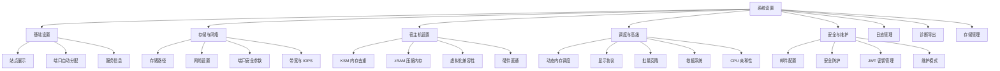
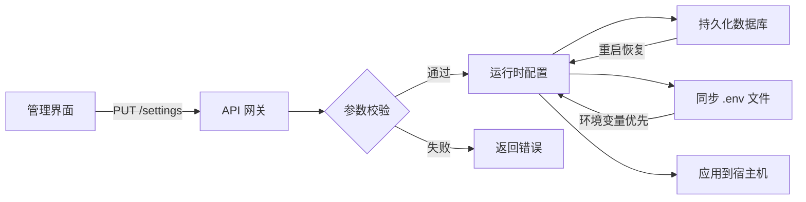
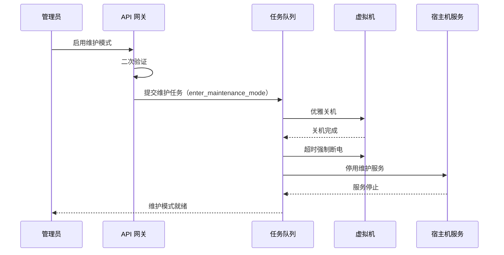
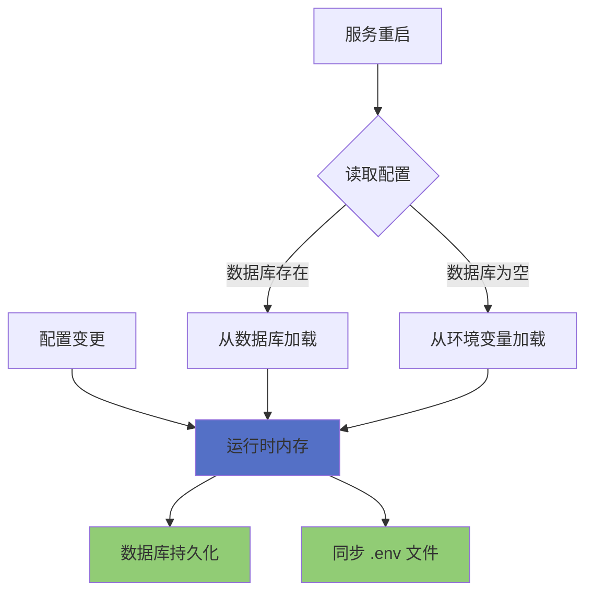

# 系统设置

系统设置是管理员专属的全局配置中心（路由 `/settings`），负责平台运行参数、宿主机资源调优和安全维护策略的统一管理。通过科学的配置分层，管理员可以精准控制平台的每一个运行细节。

## 功能架构

## 配置流向

:::info[访问权限]
系统设置页面仅管理员角色可访问。所有配置保存后立即生效并持久化到数据库（`system_settings` 表），重启后自动恢复；**环境变量优先级高于数据库配置**。
:::

## 基础设置

### 站点展示

| 配置项 | 字段名 | 限制 | 环境变量 | 说明 |
|--------|--------|------|----------|------|
| 网站标题 | `site_title` | 最大 60 字符 | `KVM_SITE_TITLE` | 用于登录页、侧边栏和浏览器标签页 |
| 访问链接 | `public_base_url` | - | `KVM_PUBLIC_BASE_URL` | 邮件跳转链接的基准地址 |

### 端口自动分配

端口转发功能在自动分配端口时，会从配置的范围内选取可用端口。

| 配置项 | 字段名 | 范围 | 默认值 | 环境变量 |
|--------|--------|------|--------|----------|
| 起始端口 | `auto_port_start` | 1024-65535 | 10000 | `KVM_AUTO_PORT_START` |
| 结束端口 | `auto_port_end` | 1024-65535 | 20000 | `KVM_AUTO_PORT_END` |

### 服务信息

| 配置项 | 字段名 | 环境变量 | 说明 |
|--------|--------|----------|------|
| 服务端口 | `port` | `KVM_PORT` | 只读显示，需通过环境变量修改后重启生效（默认 8080） |

## 存储与网络

### 存储路径

| 配置项 | 字段名 | 环境变量 | 说明 |
|--------|--------|----------|------|
| 模板目录 | `template_dir` | `KVM_TEMPLATE_DIR` | 存储虚拟机模板文件 |
| 模板导入临时目录 | `template_import_dir` | `KVM_TEMPLATE_IMPORT_DIR` | 建议与模板目录同盘，避免占满 /tmp |
| 模板导出目录 | `template_export_dir` | `KVM_TEMPLATE_EXPORT_DIR` | 建议与模板目录同盘 |
| 虚拟机包临时目录 | `appliance_temp_dir` | `KVM_APPLIANCE_TEMP_DIR` | OVF/OVA 解包临时目录 |
| 克隆磁盘目录 | `clone_dir` | `KVM_CLONE_DIR` | 虚拟机磁盘克隆的目标位置 |
| ISO 存放位置 | `iso_dir` | `KVM_ISO_DIR` | 创建 VM 和救援系统时读取此目录 |
| 端口转发持久化目录 | `port_forward_dir` | `KVM_PORTFORWARD_DIR` | 只读，仅通过环境变量修改 |

### 网络设置

| 配置项 | 字段名 | 环境变量 | 说明 |
|--------|--------|----------|------|
| 默认网络 | `default_network` | `KVM_DEFAULT_NETWORK` | 保留给历史配置，新平台默认 OVS |
| 网络后端 | `network_backend` | `KVM_NETWORK_BACKEND` | 只读，当前仅支持 OVS |
| OVS 网桥 | `ovs_bridge` | `KVM_OVS_BRIDGE` | VM 接入的网桥名称 |
| OVS 出口网卡 | `ovs_uplink` | `KVM_OVS_UPLINK` | 留空自动检测默认路由网卡 |
| 网段前缀 | `subnet_prefix` | `KVM_SUBNET_PREFIX` | 子网地址前缀，如 192.168.122 |
| DHCP 起始 / 结束 | `ovs_dhcp_start` / `ovs_dhcp_end` | `KVM_OVS_DHCP_START/END` | 留空时按网段前缀使用 .2 / .254 |
| 外网网卡 | `external_nic` | `KVM_EXTERNAL_NIC` | 端口转发使用的外网网卡 |
| 公网 IP | `host_ip` | `KVM_HOST_IP` | 留空自动检测，可手动固定 |
| 公网 IPv6 前缀检测周期 | `public_ipv6_sync_interval_seconds` | `KVM_PUBLIC_IPV6_SYNC_INTERVAL_SECONDS` | 范围 10-3600 秒，默认 60；定期检查上联网卡的动态公网 IPv6 前缀，前缀变化后保留每个绑定 VM 的主机位并自动重写 Proxy NDP 与 /128 路由 |
| 网络等待就绪检测 | `network_wait_online_disabled` | `KVM_NETWORK_WAIT_ONLINE_DISABLED` | 关闭后启动时不再等待网络在线 |

### 端口安全参数

端口安全的全局参数在此配置（详见 [端口安全](/docs/tech/network/port-security)）：

| 配置项 | 字段名 | 默认值 |
|--------|--------|--------|
| 启用端口安全 | `port_security_enabled` | 关闭 |
| 端口总速率（kpps / 突发） | `port_security_total_kpps` / `port_security_total_burst_kpackets` | 50 / 40 |
| 邻居协议速率（pps / 突发） | `port_security_neighbor_pps` / `port_security_neighbor_burst_packets` | 200 / 400 |
| 广播速率（pps / 突发） | `port_security_broadcast_pps` / `port_security_broadcast_burst_packets` | 1000 / 2000 |
| 协调间隔 | `port_security_reconcile_interval_seconds` | 60 秒 |

### 全局带宽限制

全局带宽限制应用于所有非轻量云虚拟机及 VPC 交换机。

| 配置项 | 字段名 | 范围 | 环境变量 |
|--------|--------|------|----------|
| 下行总带宽 | `max_burst_inbound` | ≥0 Mbps | `KVM_MAX_BURST_INBOUND` |
| 上行总带宽 | `max_burst_outbound` | ≥0 Mbps | `KVM_MAX_BURST_OUTBOUND` |

:::warning 带宽计算
有效带宽 = `max(1, 配置值 - 5)` Mbps（保留 5Mbps 缓冲），配置 0 表示不限制。保存后立即生效：**每台运行中的非轻量云虚拟机均以全量有效带宽作为上限**（不在虚拟机之间均分，实际共享由 TCP 拥塞控制完成）；VPC 虚拟机按交换机聚合限速。
:::

### 默认磁盘 IOPS 限制

此设置仅作为新建虚拟机时的默认值，已存在的 VM 需在编辑页面单独配置。

| 配置项 | 字段名 | 环境变量 |
|--------|--------|----------|
| 默认总 IOPS | `default_disk_iops_total` | `KVM_DEFAULT_DISK_IOPS_TOTAL` |
| 默认读 IOPS | `default_disk_iops_read` | `KVM_DEFAULT_DISK_IOPS_READ` |
| 默认写 IOPS | `default_disk_iops_write` | `KVM_DEFAULT_DISK_IOPS_WRITE` |

## 宿主机设置

宿主机设置是针对底层虚拟化平台的深度调优，涵盖内存优化和虚拟化兼容性两大领域。

### KSM 内存去重

KSM（Kernel Same-page Merging）是 Linux 内核级别的内存页去重技术，通过扫描匿名内存页，将内容完全相同的页面合并为同一份物理内存。

| 挡位 | 代码 | 适用场景 |
|------|------|----------|
| 关闭 | off | 临时排障或 CPU 压力优先 |
| 保守 | conservative | 内存压力不高的虚拟化宿主机 |
| 均衡 | balanced | 推荐挡位，平衡内存节省与 CPU 开销 |
| 积极 | aggressive | VM 密度较高，希望快速释放内存 |
| 极致 | extreme | 内存非常紧张的纯虚拟化宿主机 |

运行参数包括 run、pages_to_scan、sleep_millisecs、merge_across_nodes、use_zero_pages、smart_scan；去重统计展示 pages_shared、pages_sharing、pages_unshared、pages_scanned、full_scans。

:::info[持久化机制]
KSM 配置持久化文件路径为 `/etc/kvm-console/ksm.env`，通过 `kvm-console-ksm.service` 在宿主机重启后自动恢复。
:::

### zRAM 压缩内存

zRAM 是基于压缩的虚拟内存交换设备，将不常用的内存页压缩存储在 RAM 中，避免磁盘 I/O 开销。

| 挡位 | 代码 | 容量比例 | 最大容量 | 适用场景 |
|------|------|----------|----------|----------|
| 关闭 | off | - | - | 排障或内存压力很低 |
| 保守 | conservative | 10% | 16 GiB | 优先降低压缩开销 |
| 均衡 | balanced | 20% | 32 GiB | 推荐挡位 |
| 积极 | aggressive | 35% | 64 GiB | VM 密度高，优先压缩内存 |
| 极致 | extreme | 50% | 128 GiB | 内存非常紧张，接受更多 CPU 开销 |

:::info[持久化机制]
zRAM 配置持久化文件路径为 `/etc/kvm-console/zram.env`，通过 `kvm-console-zram.service` 在宿主机重启后自动恢复（面板启动前的 `host-zram-apply` 子命令负责应用）。
:::

### KVM Unrestricted Guest

KVM Unrestricted Guest 是 Intel KVM 的硬件辅助能力，允许虚拟机更直接地运行早期启动阶段代码。

:::warning[VMware 嵌套虚拟化]
在部分 VMware/ESXi 嵌套虚拟化环境中，该能力可能触发 QEMU 启动报错 `KVM: entry failed, hardware error 0x7`。遇到此问题时，可临时禁用此参数作为兼容性绕过。
:::

| 状态 | 说明 |
|------|------|
| 运行时状态 | 当前 KVM 模块的实际配置 |
| 持久配置 | 写入配置文件的值 |
| 待重载 | 配置已保存但需重载模块或重启生效 |

### 硬件直通

宿主机设置中集成了硬件直通能力（IOMMU 状态检测、启用 IOMMU、加载 vfio-pci 模块、直通设备绑定/解绑），详见 [硬件直通](/docs/tech/virtual-machine/hardware-passthrough)。硬件直通受 `hardware_passthrough_enabled` 开关控制（默认关闭）。

## 调度与高级

### 动态内存调度

动态内存调度器根据 VM 的内存使用率自动调整 balloon / virtio-mem 内存分配，实现内存资源的动态平衡。

| 配置项 | 字段名 | 范围 | 默认值 | 说明 |
|--------|--------|------|--------|------|
| 启用自动调度 | `dynamic_memory_scheduler_enabled` | 布尔 | 启用 | 仅对已启用动态内存的 VM 生效 |
| 调度间隔 | `dynamic_memory_interval_seconds` | ≥10 秒 | 30 | 调度器执行周期 |
| 调整冷却 | `dynamic_memory_cooldown_seconds` | ≥30 秒 | 120 | 同一 VM 两次调整的最短间隔 |
| 宿主保留内存 | `dynamic_memory_host_reserve_mb` | ≥512 MB | 2048 | 宿主机保留的固定内存量 |
| 宿主保留比例 | `dynamic_memory_host_reserve_percent` | 5-80% | 20 | 宿主机保留的内存比例 |
| 增长阈值 | `dynamic_memory_increase_threshold_percent` | 5-50% | 15 | 可用内存低于此值时尝试增长 |
| 回收阈值 | `dynamic_memory_reclaim_threshold_percent` | 10-90% | 35 | 空闲内存高于此值时考虑回收 |
| 首次观察期 | `dynamic_memory_observation_hours` | 0-168 小时 | 24 | 观察期内不自动回收到启动内存以下 |
| 事件保留时长 | `scheduler_event_retention_hours` | 1-2160 小时 | 168 | 调度事件的历史保留时间 |

:::tip[最终保留值]
宿主机最终保留内存取固定值与比例值中的较大者，确保宿主机始终有足够的内存余量。
:::

### 显示协议

| 配置项 | 字段名 | 说明 |
|--------|--------|------|
| SPICE 默认开启 | `spice_enabled_by_default` | 新建虚拟机时默认启用 SPICE 控制台（默认关闭） |

### 批量克隆

| 配置项 | 字段名 | 范围 | 环境变量 | 说明 |
|--------|--------|------|----------|------|
| 最大同时克隆数 | `batch_clone_max_concurrency` | 1-100 | `KVM_BATCH_CLONE_MAX_CONCURRENCY` | 默认 10，设为 1 时退化为顺序克隆 |

### 救援系统

救援系统 ISO 用于虚拟机无法正常启动时的紧急恢复，支持从 ISO 存放位置中选择（模糊搜索）。

| 配置项 | 字段名 | 环境变量 | 说明 |
|--------|--------|----------|------|
| 救援系统 ISO | `rescue_iso` | `KVM_RESCUE_ISO` | 救援模式引导的 ISO 文件名 |

### CPU 亲和性预设

CPU 亲和性预设允许管理员定义常用的 CPU 核心绑定方案，方便在虚拟机配置中快速选择。

| 操作 | 说明 |
|------|------|
| 添加预设 | 点击"添加预设"按钮，输入名称和核心值（如 0-3） |
| 保存预设 | 点击"保存预设"按钮，仅管理员可操作 |
| 重置预设 | 点击"重置"按钮，恢复到上次保存的状态 |

预设对所有登录用户可读（`GET /cpu-affinity-presets`），保存仅管理员。

## 安全与维护

### 邮件配置

SMTP 配置用于平台的邮件发送功能，包括邮箱绑定、邀请注册和密码找回等场景。

| 配置项 | 字段名 | 环境变量 | 说明 |
|--------|--------|----------|------|
| SMTP 主机 | `smtp_host` | `KVM_SMTP_HOST` | 如 smtp.qq.com |
| SMTP 端口 | `smtp_port` | `KVM_SMTP_PORT` | 范围 1-65535，默认 587 |
| SMTP 用户名 | `smtp_username` | `KVM_SMTP_USERNAME` | 通常为发件邮箱账号 |
| SMTP 密码 | `smtp_password` | `KVM_SMTP_PASSWORD_ENC` | 留空保持当前密码不变（加密存储） |
| 发件人名称 | `smtp_from_name` | `KVM_SMTP_FROM_NAME` | 邮件中显示的发件人名称 |
| 发件邮箱 | `smtp_from_address` | `KVM_SMTP_FROM_ADDRESS` | 如 no-reply@example.com |
| 加密方式 | `smtp_security` | `KVM_SMTP_SECURITY` | none / ssl / starttls（默认 starttls） |
| 超时秒数 | `smtp_timeout_seconds` | `KVM_SMTP_TIMEOUT_SECONDS` | 范围 >0，默认 15 |

测试发信支持填写临时 SMTP 参数验证（不保存），或使用已保存配置直接发送测试邮件。

### 安全防护

| 配置项 | 字段名 | 说明 |
|--------|--------|------|
| 会话指纹绑定 | `session_fingerprint_enabled` | JWT 与会话指纹（IP 前缀 + User-Agent 哈希）绑定，默认启用 |
| 请求过滤 | `request_filter_enabled` | 危险路径/请求内容过滤中间件开关，默认启用 |
| 泄露密码检测 | `password_breach_check_enabled` | 密码输入时执行 HIBP k-匿名泄露检测，默认启用 |
| 定时泄露扫描 | `scheduled_password_breach_check_enabled` | 每日 00:00 自动提交泄露密码扫描任务，默认启用；支持手动「立即执行」（高风险） |
| 安全组默认全放通 | `security_group_default_allow_all` | 默认关闭；开启后新建安全组自动添加 IPv4（0.0.0.0/0）与 IPv6（::/0）全放通入站规则，开启时需二次确认，详见[安全组策略](/docs/tech/network/security-group) |
| 开发环境模式 | `development_mode` | 绕过二段验证、首次强制绑定与高风险操作验证 |

:::danger[安全警告]
开发环境模式仅建议在开发调试环境使用，生产环境务必关闭。启用后会降低平台的整体安全性。
:::

### JWT 密钥管理

| 配置项 | 说明 |
|--------|------|
| **自动轮换间隔** | `jwt_secret_rotate_hours`（0-720 小时，默认 24；设为 0 关闭自动轮换） |
| **上次轮换时间** | 展示最近一次轮换时间 |
| **手动轮换** | 高风险操作（`rotate_jwt_secret`），轮换后所有旧令牌失效并回写 `.env` |

### 维护模式

维护模式用于系统升级、硬件维护等场景，启用后会自动执行一系列安全操作。

| 配置项 | 字段名 | 范围 | 环境变量 | 说明 |
|--------|--------|------|----------|------|
| 启用维护模式 | `maintenance_mode` | 布尔 | `KVM_MAINTENANCE_MODE` | 启用/关闭均需二次验证并提交异步任务 |
| 关机等待时间 | `maintenance_vm_shutdown_timeout_seconds` | 5-3600 秒 | `KVM_MAINTENANCE_VM_SHUTDOWN_TIMEOUT` | 优雅关机超时后强制断电（默认 40） |
| 维护服务列表 | `maintenance_service_units` | 文本 | `KVM_MAINTENANCE_SERVICE_UNITS` | 每行一个 systemd unit（默认包含 kvm-console.service、libvirtd.service 及 libvirtd socket） |

:::warning[维护模式影响]
启用维护模式后，系统会异步关闭所有运行中的虚拟机，并停用配置中的宿主机服务。维护模式期间将阻止虚拟机启动与多数变更操作。`kvm-console.service` 即使加入列表也会被自动跳过，确保面板可用。
:::

## 日志管理

| 能力 | 说明 |
|------|------|
| **日志备份数** | `log_max_backups`（0-10000，0 表示不限制），控制轮转日志文件保留数量 |
| **磁盘占用** | 展示全部日志文件（app/request/cmd/libvirt 四类，含 `.log.gz` 归档）总占用与文件列表 |
| **文件删除** | 多选删除历史日志文件（当日正在写入的文件不可删） |
| **日志导出** | 打包导出为 `qvmconsole-logs-<时间戳>.zip` |

:::info[请求日志脱敏]
请求日志（`request.log`）记录请求路径、状态码、耗时、来源地址和已认证用户。当路径携带查询参数时，令牌（含 `token`）、密码（含 `password` / `passwd`）、密钥与 API Key（`key` / `api_key` / `apikey` / `_key` 后缀）、密钥材料（含 `secret`）、授权头与一次性验证码（`authorization` / `code`）等敏感参数的值会替换为 `[REDACTED]`；无法解析的查询串不写入日志，避免通过非法编码绕过脱敏。历史日志中已记录的敏感内容不会自动改写，发现泄露应及时轮换对应令牌或密钥。
:::

## 诊断导出

诊断导出用于一键收集排障信息，支持勾选类别后打包导出（`qvmconsole-diagnostics-<时间戳>.zip`）：

| 类别 | 内容 |
|------|------|
| `system` | 系统信息（版本/内核/资源等） |
| `vm` | 虚拟机清单与状态 |
| `ovs` | OVS 网络状态 |
| `network` | 网络配置（接口/路由/规则） |
| `storage` | 存储池信息 |
| `logs` | 应用日志 |
| `panel` | 面板配置 |

## 存储管理

| 项 | 说明 |
|------|------|
| **存储镜像文件** | 展示用户存储（我的存储）的镜像文件与挂载点 |
| **存储回收** | 执行存储回收（`fstrim` + `fallocate --dig-holes`），回收已删除文件占用的稀疏空间 |

## 实现原理

### 配置持久化

- **运行时生效**：所有配置保存后立即应用到运行中的服务
- **环境变量优先**：环境变量已设置时，数据库配置不会覆盖环境变量
- **自动同步**：配置变更后自动同步到 `.env` 文件，确保重启一致性

### API 接口

| 接口 | 方法 | 说明 |
|------|------|------|
| `/settings` | GET | 获取系统设置 |
| `/settings` | PUT | 更新系统设置 |
| `/settings/smtp/test` | POST | 测试 SMTP 发信 |
| `/settings/cpu-affinity-presets` | PUT | 保存 CPU 亲和性预设 |
| `/settings/jwt-secret/rotate` | POST | 手动轮换 JWT 密钥（高风险） |
| `/settings/log/status` | GET | 日志文件状态与占用 |
| `/settings/log/delete` | POST | 删除日志文件 |
| `/settings/log/export` | POST | 导出日志压缩包 |
| `/settings/diagnostics/categories` | GET | 诊断类别列表 |
| `/settings/diagnostics/export` | POST | 导出诊断压缩包 |
| `/settings/storage/trim` | POST | 执行用户存储回收 |
| `/settings/user-storage-iso-path` | GET | 查询指定用户 ISO 目录路径 |
| `/cpu-affinity-presets` | GET | 获取 CPU 亲和性预设（所有登录用户） |
| `/host/ksm` | GET / PUT | 获取 / 更新 KSM 配置 |
| `/host/zram` | GET / PUT | 获取 / 更新 zRAM 配置 |
| `/host/kvm-intel-unrestricted-guest` | GET / PUT | 获取 / 更新 KVM Unrestricted Guest |
