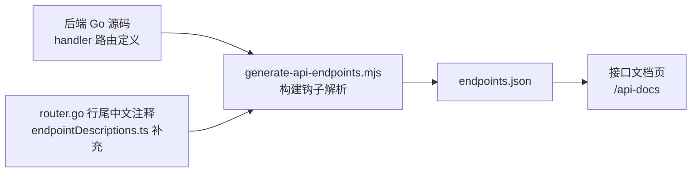
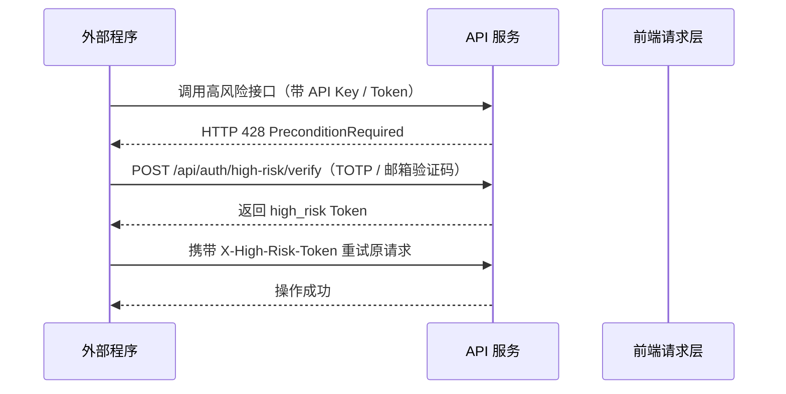

# API 接口与安全调用

QVMConsole 提供一体化的 RESTful API 能力，供外部程序与自动化脚本集成。面板内置「接口文档」页（路由 `/api-docs`），接口清单在**构建阶段从后端源码自动解析生成**，后端新增接口后重新构建即自动同步，无需手动维护。

## 接口文档中心

### 自动生成机制



接口清单由 `web/scripts/generate-api-endpoints.mjs` 在构建时（`predev` / `prebuild` 钩子）从后端源码自动解析生成，汇聚为 `src/views/api-docs/generated/endpoints.json`。中文描述文案来自 `endpointDescriptions.ts`，`router.go` 行尾的中文注释作为摘要兜底。

### 检索能力

| 功能 | 说明 |
|------|------|
| **关键字搜索** | 匹配路径、方法、说明、请求/响应字段、二次验证标记等 |
| **模块筛选** | 按路由分组（如 VM、网络、VPC、防火墙等）筛选 |
| **只看二次验证** | 快速筛选出所有要求高风险二次验证的接口 |
| **接口标记** | 二次验证（橙色）/ 管理员（紫色）/ 轻量云不可用（青色）/ 待补充文案（灰色） |

每个接口详情展示：方法、路径、摘要、路径/查询参数、请求体、响应结构、备注及 cURL 示例。

## 认证方式

### API Key 认证

账户安全中心可生成 API 凭证（API ID + API Key）。推荐使用独立请求头传递凭证，避免将 Key 放入 URL：

```bash
curl -H "X-API-Key-ID: kvm_id_xxx" \
  -H "X-API-Key: kvm_sk_xxx" \
  "${你的域名}/api/vm/list"
```

也支持 `Authorization: ApiKey id:secret` 的携带方式。密钥以 SHA-256 哈希 + 前缀形式存储，支持密钥轮换与撤销。

:::warning[不支持 API Key 的流程]
登录、注册、邀请、找回密码、安全初始化、邮箱与 2FA 等**账户安全流程**不接受 API Key，仅支持 JWT。其余业务接口均默认兼容 API Key 调用。
:::

### Token 认证

通过登录流程获取 JWT，在请求头中携带：

```bash
curl -H "Authorization: Bearer <token>" "${你的域名}/api/vm/list"
```

## 统一响应结构

所有接口返回统一 JSON 结构：

```json
{
  "code": 200,
  "message": "ok",
  "data": {}
}
```

- `code` 为 `200` 或 `0` 表示成功，其他值表示失败
- `message` 为提示信息
- `data` 承载具体业务数据

## 高风险操作二次验证

删除虚拟机、重置密码、修改防火墙、生成/撤销 API 凭证等接口即使通过 API Key 调用，**仍会要求二次验证**。



```bash
curl -X POST "${你的域名}/api/auth/high-risk/verify" \
  -H "X-API-Key-ID: kvm_id_xxx" \
  -H "X-API-Key: kvm_sk_xxx" \
  -H "Content-Type: application/json" \
  -d '{"method":"totp","code":"123456","operation":"delete_vm"}'
```

收到 `428` 后，先完成 `/api/auth/high-risk/verify`，再在原请求携带返回的 `X-High-Risk-Token`（有效期 5 分钟，带操作范围）。

:::info[业务接口第二次验证]
面板前端对 HTTP 428 的处理是自动的：收到 428 后弹出验证框，获取 `high_risk` 令牌后自动重试原请求，对用户无感。外部程序需按上述两步流程自行实现。
:::

## 分组与模块

接口按功能分为多组，常见分组及对应页面：

| 模块分组 | 说明 |
|---------|------|
| **vm** | 虚拟机生命周期、磁盘、网络、快照、定时任务、VNC/SPICE 等 |
| **auth** | 登录、邀请、密码、2FA、高风险验证 |
| **settings** | 系统设置、SMTP、JWT 轮换、日志、诊断 |
| **network / vpc** | 端口转发、静态 IP、公网 IP、VPC 交换机与安全组、ACL |
| **firewall** | KVM 防火墙策略、宿主机防火墙、连接管理 |
| **storage-pool** | 存储池、分区、LVM 卷 |
| **user** | 用户、配额、SSH、轻量云 |
| **task / scheduler** | 异步任务、调度事件 |
| **host** | 宿主机统计、KSM、zRAM、硬件直通 |
| **api-key** | API 凭证管理 |

分组与模块映射维护在 `endpointDescriptions.ts` 的 `moduleGroups` 中。

## 安全最佳实践

- **善用「只看二次验证」**：了解哪些接口属于敏感操作，实现外部程序的验证流程
- **最小权限**：API Key 仅为需要的接口使用，勿暴露高危接口的 Key
- **定期轮换**：定期在安全中心轮换 API Key
- **HTTPS**：生产环境务必通过 HTTPS 提供服务，防止凭证明文传输

## 相关文档

- [安全中心](/docs/tech/user-manage/security-center) — API 凭证的生成、轮换与撤销
- [用户管理](/docs/tech/user-manage/user-management) — 问题答疑与账户管理