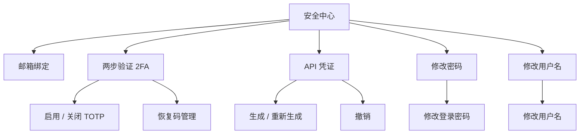
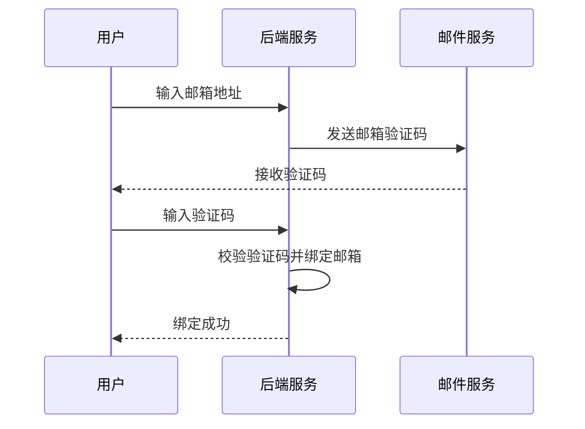
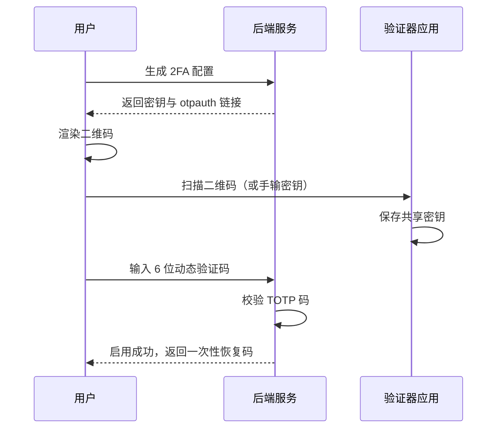
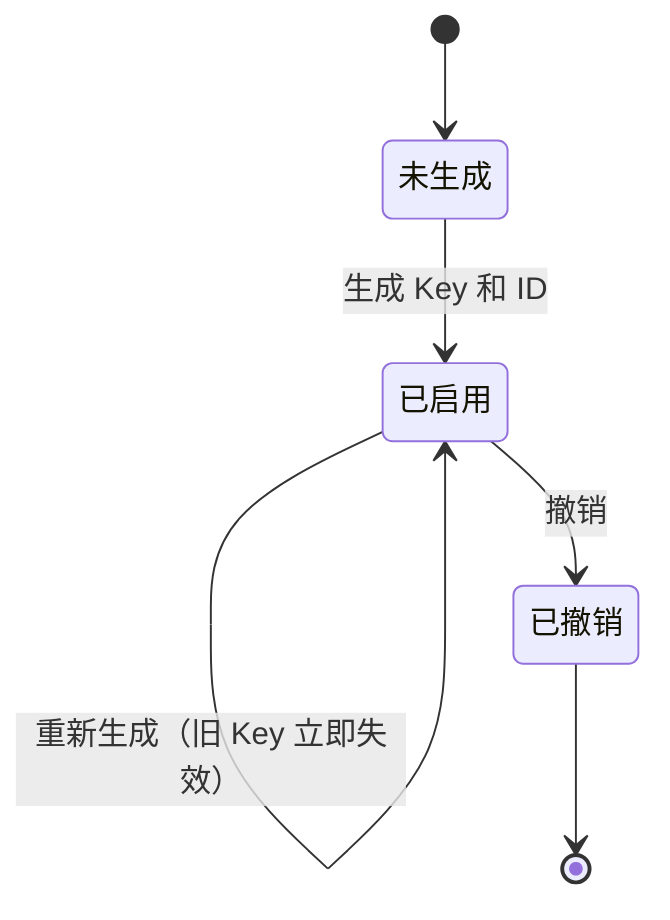
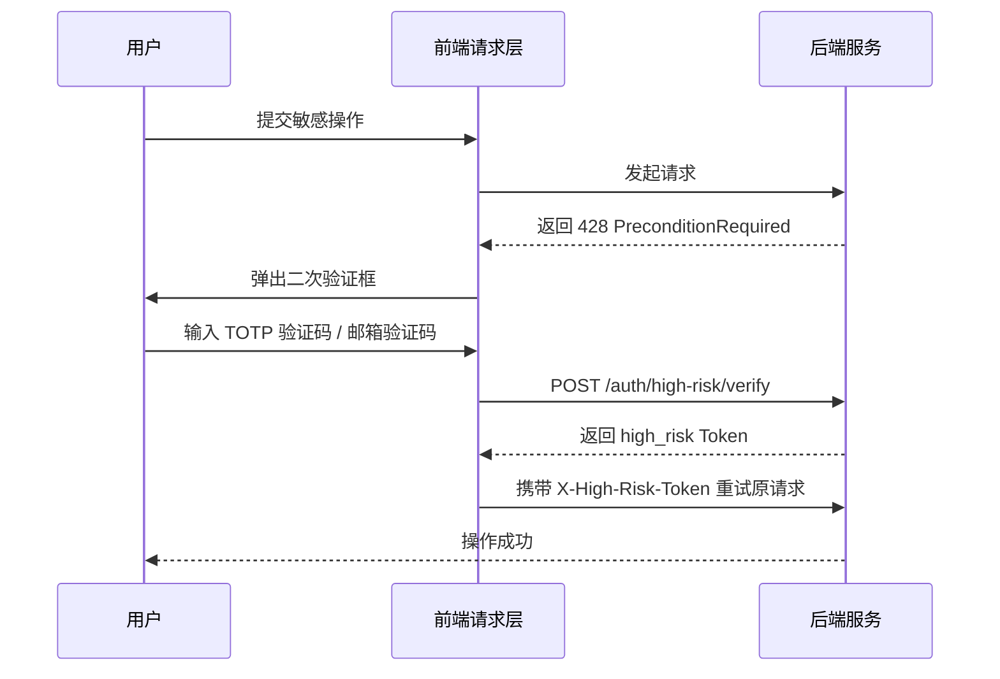

# 安全中心

安全中心是面向**所有登录用户**的个人账户安全自助管理模块，与管理员视角的用户管理（`/user`）相互独立。用户可在此管理登录邮箱、两步验证（2FA）、API 凭证、登录密码与用户名。涉及敏感操作时会自动触发高风险二次验证，确保关键变更的安全性。

## 访问方式与路由

安全中心可通过顶部导航栏的用户下拉菜单进入，路由为 `/security`。

| 项目 | 说明 |
|------|------|
| **路由** | `/security` |
| **访问范围** | 所有已登录用户（包含管理员、弹性云用户、轻量云用户） |
| **Tab 定位** | 支持 `?tab=email` / `?tab=totp` / `?tab=api` / `?tab=password` / `?tab=username` 直接定位到对应分区 |

## 功能结构

## 邮箱绑定

邮箱是账户安全体系的基础，用于接收验证码和重要通知。绑定流程如下：

### 绑定规则

| 规则 | 说明 |
|------|------|
| **首次登录强制绑定** | 首次登录的安全初始化流程中，系统会强制要求绑定邮箱（管理员还需先配置 SMTP） |
| **邮箱唯一性** | 一个邮箱只能绑定一个账户，重复绑定时会提示冲突 |
| **验证码有效期** | 验证码 10 分钟内有效，一次性使用，过期需重新发送 |
| **换绑支持** | 支持绑定与换绑到新邮箱，不支持解绑为未绑定状态 |

### 相关 API

| 接口 | 方法 | 说明 |
|------|------|------|
| `/auth/email/code/send` | POST | 发送邮箱验证码 |
| `/auth/email/bind` | POST | 绑定邮箱 |

## 两步验证（TOTP 2FA）

两步验证基于时间的一次性密码（TOTP）算法，为账户提供额外的安全保护层。

### 启用流程

### 启用参数

| 参数 | 说明 |
|------|------|
| **密钥** | 服务器生成的 TOTP 共享密钥种子 |
| **验证码** | 验证器应用生成的 6 位动态验证码 |
| **恢复码** | 启用成功后一次性返回的 10 个恢复码，需妥善保存 |

### 关闭 2FA 与恢复码管理

关闭 2FA 被视作**危险操作**，需要同时提供**当前密码**和 **2FA 动态验证码** 进行身份确认，并二次确认后才可执行（恢复码不能用于关闭 2FA）。恢复码重新生成同样需要当前密码 + 动态验证码，重新生成后旧恢复码立即失效。恢复码共 10 个、每个 16 位（字符集避开易混淆的 0/O/1/I），支持一键复制或下载文本文件保存。

:::warning[恢复码重要提示]
恢复码用于在 2FA 验证器不可用时登录账户。启用 2FA 后请立即保存恢复码，重新生成会将旧恢复码全部作废。
:::

### 相关 API

| 接口 | 方法 | 说明 |
|------|------|------|
| `/auth/2fa/setup` | POST | 生成 2FA 配置（密钥 + otpauth URL） |
| `/auth/2fa/enable` | POST | 校验验证码并启用 2FA |
| `/auth/2fa/disable` | POST | 关闭 2FA（需密码 + 验证码） |
| `/auth/2fa/recovery/regen` | POST | 重新生成恢复码（需密码 + 验证码） |

## API 凭证

API 凭证（API Key）供外部程序以编程方式调用 QVMConsole 的接口，适用于自动化脚本与第三方集成。

### 凭证信息

| 字段 | 说明 |
|------|------|
| **状态** | 已启用 / 未生成 |
| **API ID** | 凭证的唯一标识，用于身份识别 |
| **Key 标识** | 明文密钥的脱敏前缀 |
| **创建时间** | 凭证的创建时间 |
| **最后使用** | 最近一次成功调用接口的时间 |

### 生命周期

| 操作 | 说明 | 高风险验证 |
|------|------|-----------|
| **生成 Key 和 ID** | 首次创建 API 凭证 | 是 |
| **重新生成 Key 和 ID** | 轮换凭证，旧 Key 立即失效 | 是 |
| **撤销** | 注销凭证，外部程序立即失去访问权限 | 是 |

:::danger[明文密钥仅显示一次]
API Key 的明文仅在**生成 / 重新生成**的响应后保留在当前页面内存中。刷新页面或离开安全中心后无法再次查看明文，请生成后立即复制并妥善保存。
:::

:::tip[密钥安全建议]
- 仅将 API Key 保存在可信环境，勿硬编码到代码或提交到版本库
- 定期轮换 API Key 以降低泄露风险
- 疑似泄露时立即撤销并重新生成
- 可点击「查看接口文档」跳转 `/api-docs` 了解可调用的接口
:::

### 凭证格式

| 项 | 格式 |
|------|------|
| **API ID** | `kvm_id_` 前缀 + 随机字符串 |
| **API Key** | `kvm_sk_` 前缀 + 随机字符串 |
| **存储方式** | 仅存 SHA-256 哈希与脱敏前缀（前 10 + `...` + 后 4），明文不落库 |

每个用户仅有一份 API 凭证；轮换会同时更换 ID 与 Key，旧凭证立即失效。

### 相关 API

| 接口 | 方法 | 说明 |
|------|------|------|
| `/auth/api-key` | GET | 获取当前 API 凭证信息 |
| `/auth/api-key` | POST | 生成 / 轮换 API Key |
| `/auth/api-key` | DELETE | 撤销 API Key |

## 修改密码

修改登录密码用于规避长期使用同一密码带来的风险，或处理疑似泄露的情况。

### 修改要求

| 项目 | 说明 |
|------|------|
| **密码强度** | 修改时需符合强密码校验规则（长度、字符组合等），并经过密码泄露检测 |
| **旧密码** | 提交时需要提供当前密码以完成身份确认 |
| **高风险验证** | 改密操作会被标记为高风险，触发二次验证 |

:::info[密码泄露检测]
所有输入密码的环节（含改密）都会接入 HIBP（Have I Been Pwned）密码泄露检测。若判断为高风险措施启用，泄露的密码将被拒绝，并提示更换。
:::

### 相关 API

| 接口 | 方法 | 说明 |
|------|------|------|
| `/auth/password` | PUT | 修改登录密码 |

## 修改用户名

修改用户名允许用户调整自己的登录账号名称。

| 项目 | 说明 |
|------|------|
| **命名规范** | 需符合平台的用户名格式要求 |
| **唯一性** | 新用户名不能与已有用户名冲突 |
| **高风险验证** | 修改用户名同样属于敏感操作，触发二次验证 |

### 相关 API

| 接口 | 方法 | 说明 |
|------|------|------|
| `/auth/username` | PUT | 修改用户名 |

## 高风险操作统一二次验证

安全中心中的**生成/撤销 API 凭证、关闭 2FA、重新生成恢复码、修改密码、修改用户名、绑定邮箱**等敏感操作在提交时，后端统一通过 HTTP 428 挑战流程要求二次验证：

| 验证方式 | 优先级 | 适用场景 |
|---------|--------|---------|
| **TOTP** | 优先 | 已启用 2FA |
| **邮箱验证码** | 备选 | 未启用 2FA |

验证通过后会签发带操作范围的 `high_risk` 令牌（有效期 5 分钟），在有效窗口内可免重复验证执行同范围操作。这与虚拟机创建/删除、防火墙应用、公网 IP 绑定等操作共享同一套二次验证机制。

## 相关文档

- [用户管理](/docs/tech/user-manage/user-management) — 管理员视角的用户生命周期、配额与账户安全
- [API 接口与安全调用](/docs/tech/user-manage/api-console-auth) — API Key 调用约定与二次验证机制详解