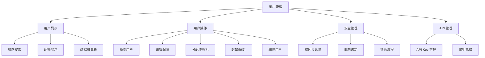
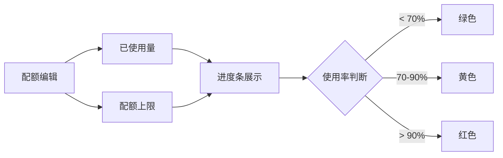
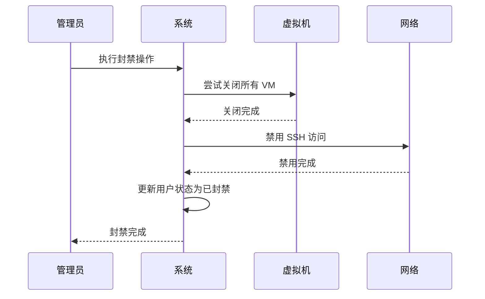
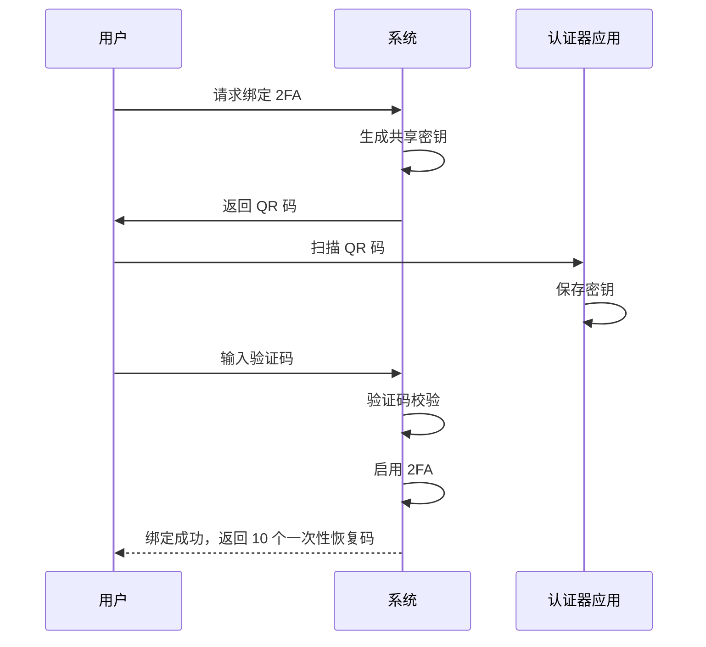
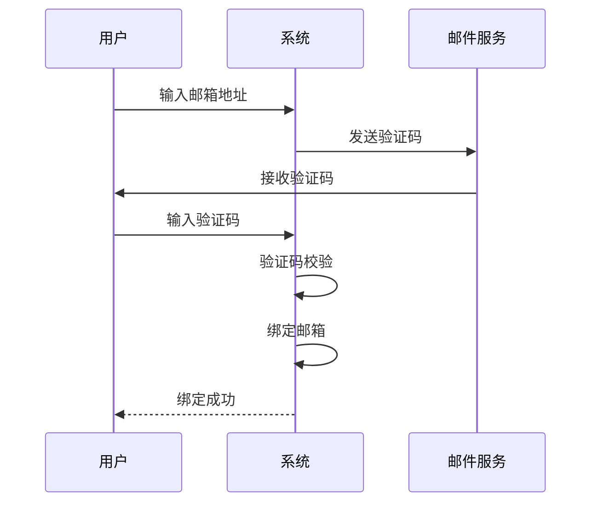
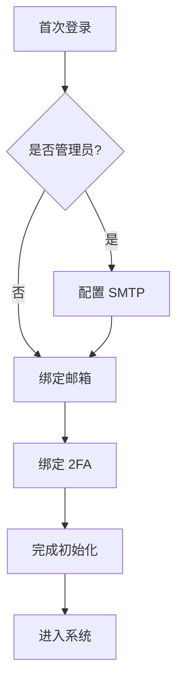
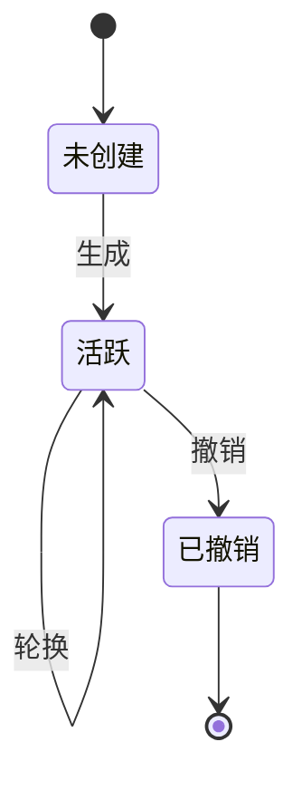
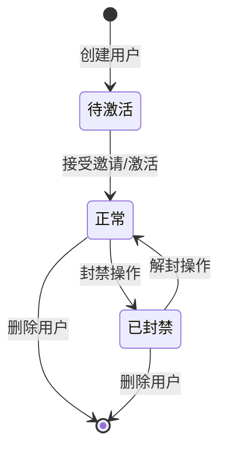
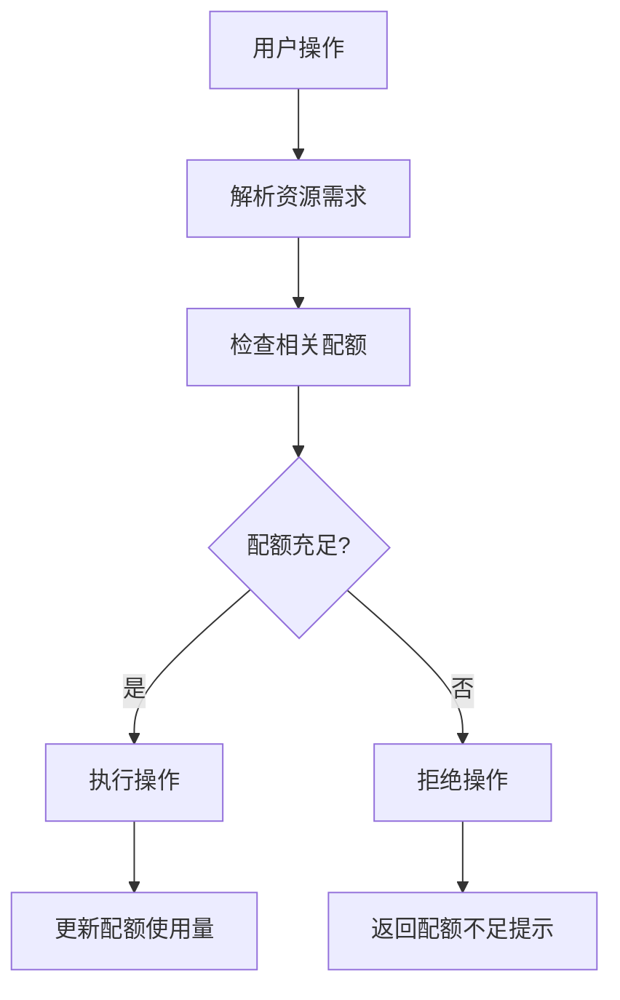

# 用户管理

用户管理是 QVMConsole 平台的核心管理功能，专为管理员设计，用于全面掌控平台用户体系和资源分配策略。通过精细化的用户生命周期管理和灵活的配额系统，管理员可以高效地管理不同类型的云服务用户。

## 功能概述

用户管理模块位于 `/user/list` 路由，仅管理员可访问，提供了从用户创建到删除的完整生命周期管理能力。

### 用户类型体系

QVMConsole 支持两种用户类型，满足不同场景下的资源管理需求：

| 用户类型 | 标识 | 特点 | 适用场景 |
|---------|------|------|---------|
| **弹性云用户** | elastic | 可分配多台虚拟机，资源灵活调度 | 开发测试、多环境部署 |
| **轻量云用户** | lightweight | 单台虚拟机专属，资源独立隔离 | 个人使用、轻量应用 |

### 功能架构

## 用户列表

用户列表页面提供了全面的用户信息展示和强大的筛选功能，帮助管理员快速定位和管理目标用户。

### 筛选栏功能

筛选栏支持多维度的用户筛选，提升管理效率：

| 筛选项 | 类型 | 说明 |
|-------|------|------|
| **用户名搜索** | 文本输入 | 模糊匹配用户名 |
| **邮箱搜索** | 文本输入 | 精确或模糊匹配邮箱 |
| **角色筛选** | 下拉选择 | 管理员 / 普通用户 |
| **状态筛选** | 下拉选择 | 正常 / 待激活 / 已封禁 |
| **用户类型** | 下拉选择 | 弹性云 / 轻量云 |

### 表格列说明

用户列表表格展示了用户的核心信息：

| 列名 | 说明 | 特殊显示 |
|------|------|---------|
| **ID** | 用户唯一标识 | - |
| **用户名** | 登录账号 | - |
| **邮箱** | 绑定邮箱 | - |
| **角色** | 用户权限角色 | 管理员（红色标签）/ 普通用户（绿色标签） |
| **用户类型** | 云服务类型 | 弹性云（绿色标签）/ 轻量云（黄色标签） |
| **状态** | 账户状态 | 正常（绿色）/ 待激活（黄色）/ 已封禁（红色） |

### 配额进度条

配额信息以直观的进度条形式展示，帮助管理员快速了解资源使用情况：

| 配额项 | 单位 | 说明 |
|-------|------|------|
| **CPU 配额** | 核 | 分配的 CPU 核心数上限，0 表示不限制 |
| **内存配额** | GB | 分配的内存容量上限，0 表示不限制 |
| **磁盘配额** | GB | 分配的磁盘空间上限，0 表示不限制 |
| **VM 数量** | 台 | 允许创建的虚拟机数量，0 表示不限制 |
| **快照数量** | 个 | 允许创建的快照数量（默认 5），0 表示不限制 |
| **端口转发** | 个 | 端口转发规则数量上限（默认 10），0 表示不限制 |
| **公网 IP** | 个 | 可绑定的公网 IP 数量，0 表示不限制 |
| **存储配额** | GB | 用户存储空间上限，0 表示不限制 |
| **运行时长** | 小时 | 总累计运行时长配额（达到上限后停止运行中 VM），0 表示不限制 |
| **下行流量** | GB/日 | 下行日流量配额，0 表示不限制 |
| **上行流量** | GB/日 | 上行日流量配额，0 表示不限制 |
| **下行带宽** | Mbps | 下行带宽上限，0 表示不限制 |
| **上行带宽** | Mbps | 上行带宽上限，0 表示不限制 |

:::tip[配额显示]
配额值为 0 表示不限制该资源，进度条会显示为"无限制"状态。
:::

### 虚拟机标签列表

用户列表中还会展示用户名下关联的虚拟机标签，点击标签可快速跳转到对应的虚拟机详情页面，便于管理员快速定位和管理用户资源。

## 新增用户

新增用户功能支持创建不同类型的云服务用户，并为其配置初始资源配额。

### 基本信息表单

| 字段 | 类型 | 必填 | 说明 |
|------|------|------|------|
| **用户名** | 文本 | 是 | 登录账号，需符合命名规范 |
| **邮箱** | 文本 | 是 | 用于接收邀请和验证码 |
| **角色** | 下拉选择 | 是 | 管理员 / 普通用户 |
| **用户类型** | 下拉选择 | 是 | 弹性云 / 轻量云 |

### 轻量云 VM 配置

当选择轻量云用户类型时，需要额外配置虚拟机来源：

| 配置项 | 说明 |
|-------|------|
| **选择已有 VM** | 从现有虚拟机列表中选择分配 |
| **注册新 VM** | 通过 SSH 连接注册新的虚拟机 |
| **专用 VPC** | 为用户分配独立的虚拟私有云网络 |

### 配额表单（QuotaForm）

配额表单用于精细化控制用户的资源使用上限：

| 配额项 | 单位 | 说明 | 为 0 时含义 |
|-------|------|------|-----------|
| **CPU 核心数** | 核 | CPU 资源上限 | 不限制 |
| **内存** | GB | 内存资源上限 | 不限制 |
| **VM 数量** | 台 | 虚拟机数量上限 | 不限制 |
| **磁盘** | GB | 磁盘空间上限 | 不限制 |
| **存储配额** | GB | 对象存储上限 | 不限制 |
| **运行时长** | 小时/月 | 每月运行时长上限 | 不限制 |
| **端口转发** | 开关+上限 | 端口转发功能开关和规则数量 | 关闭功能 |
| **公网 IP** | 个 | 可绑定公网 IP 数量 | 不限制 |
| **快照数量** | 个 | 快照数量上限 | 不限制 |
| **下行带宽** | Mbps | 网络下行带宽上限 | 不限制 |
| **上行带宽** | Mbps | 网络上行带宽上限 | 不限制 |
| **下行流量** | GB/月 | 每月下行流量上限 | 不限制 |
| **上行流量** | GB/月 | 每月上行流量上限 | 不限制 |

:::warning[配额设置]
配额设置为 0 表示不限制该资源，但请谨慎使用，避免资源滥用。建议根据用户实际需求设置合理的配额上限。
:::

## 编辑用户配置

编辑用户配置功能允许管理员调整现有用户的类型、网络和资源配额。

### 用户类型切换

管理员可以在弹性云和轻量云之间切换用户类型，切换后用户的可用功能和资源访问权限会相应调整。

### 专用 VPC 配置

为用户配置专用的虚拟私有云网络，实现网络层面的资源隔离：

- **网络隔离**：用户虚拟机运行在独立的 VPC 中
- **安全控制**：通过 VPC 配置控制网络访问策略
- **灵活调整**：支持随时调整 VPC 配置

### 配额编辑

编辑配额时，表单会同时展示已使用量和总量，通过进度条直观显示资源使用比例：

## 分配虚拟机

根据用户类型的不同，虚拟机分配方式也有所区别。

### 弹性云用户

弹性云用户支持分配多台虚拟机，采用多选下拉方式操作：

- **多选分配**：可同时选择多台虚拟机分配给用户
- **资源池**：从可用虚拟机池中选择
- **动态调整**：支持随时增减分配的虚拟机

### 轻量云用户

轻量云用户采用单台虚拟机专属模式，支持两种注册方式：

| 注册方式 | 说明 | 适用场景 |
|---------|------|---------|
| **注册已有 VM** | 将现有虚拟机分配给用户 | 迁移场景 |
| **注册新 VM** | 通过 SSH 连接注册新虚拟机 | 全新部署 |

### 轻量云 VM 配额

轻量云用户需要单独配置虚拟机级别的配额：

| 配额项 | 单位 | 说明 |
|-------|------|------|
| **流量限制** | GB/月 | 每月网络流量上限 |
| **带宽限制** | Mbps | 网络带宽上限 |
| **端口转发** | 个 | 端口转发规则数量上限 |
| **快照数量** | 个 | 快照数量上限 |
| **运行时长** | 小时/月 | 每月允许运行时长 |

## 用户操作

管理员可以对用户执行多种管理操作，全面控制用户账户状态和资源访问。

### 操作列表

| 操作 | 说明 | 前置条件 |
|------|------|---------|
| **配置** | 编辑用户配额和资源限制 | - |
| **分配 VM** | 为弹性云用户分配虚拟机 | 用户类型为弹性云 |
| **注册 VM** | 为轻量云用户注册虚拟机 | 用户类型为轻量云 |
| **重发邀请** | 重新发送邀请邮件 | 用户状态为待激活 |
| **封禁** | 封禁用户账户 | 用户状态为正常 |
| **解封** | 解除用户封禁状态 | 用户状态为已封禁 |
| **重置流量** | 重置本月流量配额 | - |
| **删除用户** | 永久删除用户及相关资源 | 需二次确认 |

### 封禁操作

封禁用户是一项高风险操作，系统会执行以下级联操作：

### 删除用户

删除用户是一项不可逆的危险操作，系统会级联删除以下资源：

- **所有虚拟机**：用户名下的所有虚拟机实例
- **所有磁盘**：虚拟机挂载的所有磁盘
- **所有快照**：用户创建的所有快照
- **存储池**：用户的对象存储池

:::danger[删除警告]
删除用户操作不可逆，所有关联资源将被永久删除。建议在删除前备份重要数据，并与用户确认。
:::

## 邀请注册与密码找回

### 邀请注册

管理员创建邀请用户后，用户会收到邀请邮件（邀请链接 72 小时有效）：

- 邀请页展示该用户的角色、云类型、配额信息（轻量云用户还会展示待确认的轻量云注册列表）
- 待激活用户登录会被拒绝，管理员可「重发邀请」
- 激活后进入首次登录安全初始化流程（绑定邮箱/2FA）

### 密码找回

支持两种找回方式（`/reset-password` 页面）：

| 方式 | 适用场景 | 流程 |
|------|----------|------|
| **邮件链接** | 邮箱唯一对应一个账户 | 发送重置链接（1 小时有效）→ 打开链接设置新密码 |
| **邮箱验证码** | 邮箱对应多个账户 | 发送验证码 → 验证后展示账户列表 → 选择账户获取重置令牌（15 分钟）→ 设置新密码 |

## 安全认证

QVMConsole 提供了多层次的安全认证机制，确保用户账户和操作的安全性。

### 双因素认证（2FA）

双因素认证为用户账户提供额外的安全保护层：

#### TOTP 2FA

基于时间的一次性密码（Time-based One-Time Password），使用 Google Authenticator 等应用生成动态验证码。

**技术原理：**

| 组件 | 说明 |
|------|------|
| **共享密钥** | 服务器和客户端共享的密钥种子 |
| **时间窗口** | 通常为 30 秒的验证码有效期 |
| **算法** | HMAC-SHA1 算法生成 6 位数字验证码 |

#### 邮箱验证码

作为 TOTP 2FA 的备选方式，通过邮箱接收一次性验证码。

**使用场景：**

- 用户未安装 TOTP 应用
- TOTP 设备丢失或不可用
- 作为 2FA 的降级方案

#### 绑定流程

:::info 恢复码
启用 2FA 成功后会一次性返回 10 个恢复码（16 位，哈希存储），用于验证器丢失时登录。恢复码可通过安全中心重新生成（旧码立即失效）。
:::

#### 相关 API

| 接口 | 方法 | 说明 |
|------|------|------|
| `/auth/2fa/setup` | POST | 初始化 2FA 绑定，返回 QR 码 |
| `/auth/2fa/enable` | POST | 启用 2FA，验证并激活 |
| `/auth/2fa/disable` | POST | 禁用 2FA |

### 邮箱绑定

邮箱绑定是用户安全体系的基础，用于接收验证码和重要通知。

#### 绑定流程

#### 相关 API

| 接口 | 方法 | 说明 |
|------|------|------|
| `/auth/email/code/send` | POST | 发送邮箱验证码 |
| `/auth/email/bind` | POST | 绑定邮箱 |

### 登录流程

QVMConsole 的登录流程采用分阶段验证机制，确保账户安全：

#### 阶段 1：身份验证

用户提供用户名和密码进行基础身份验证。登录接口受限流保护：**同一 IP 5 次失败锁定 5 分钟，同一用户 10 次失败锁定 15 分钟**。

#### 阶段 2：二段验证

身份验证通过后，根据账户状态返回不同阶段（stage）：

| stage | 说明 | 令牌 |
|-------|------|------|
| `success` | 直接进入系统（首次强制改密时携带标记，登录后弹出改密框） | 访问令牌 |
| `login_verify` | 需要二段验证（TOTP / 恢复码 / 邮箱验证码，管理员不支持邮箱方式） | 15 分钟 login 令牌 |
| `bootstrap_security` | 首次登录安全初始化（管理员配置 SMTP、绑定邮箱、绑定 2FA） | 30 分钟 bootstrap 令牌 |

二段验证方式：

| 验证方式 | 说明 | 优先级 |
|---------|------|-------|
| **TOTP 2FA** | 使用认证器应用生成验证码 | 优先 |
| **恢复码** | 使用一次性恢复码（10 个） | 验证器不可用时 |
| **邮箱验证码** | 发送验证码到绑定邮箱（仅普通用户） | 备选 |

#### 首次登录安全初始化

新用户首次登录时，系统会强制要求完成安全初始化：

**初始化顺序：**

1. **SMTP 配置**（仅管理员）：配置邮件服务，用于发送验证码和通知
2. **绑定邮箱**：验证并绑定用户邮箱
3. **绑定 2FA**：配置双因素认证

:::info[安全策略]
首次登录的安全初始化是强制性的，未完成初始化的用户无法访问系统功能。这是保障平台安全的重要措施。
:::

### 高风险操作验证

对于敏感操作，系统会要求进行二次验证，防止误操作或未授权访问：

| 操作类型 | 验证方式 | 说明 |
|---------|---------|------|
| **绑定/解绑/迁移公网 IP** | TOTP/邮箱验证码 | 防止未授权网络暴露或服务中断 |
| **虚拟机迁移 / 重装 / 删除** | TOTP/邮箱验证码 | 防止数据丢失 |
| **防火墙启用/应用/禁用** | TOTP/邮箱验证码 | 网络策略变更 |
| **删除用户 / 封禁用户** | TOTP/邮箱验证码 | 账户安全 |
| **维护模式 / JWT 密钥轮换** | TOTP/邮箱验证码 | 平台级变更 |

:::info 验证信任机制
- 验证成功后会获得信任窗口：会话方式（JWT）下 1 小时内同类操作免重复验证
- API Key 调用需先通过 `POST /auth/high-risk/verify` 获取 5 分钟有效的 `high_risk` 令牌，并在原请求携带 `X-High-Risk-Token`
- 开发环境模式开启时会跳过二次验证（仅限开发环境）
:::

## API Key 管理

API Key 为用户提供程序化访问 QVMConsole 的能力，适用于自动化脚本和第三方集成。

### API 接口

| 接口 | 方法 | 说明 |
|------|------|------|
| `/auth/api-key` | GET | 获取当前 API Key 信息 |
| `/auth/api-key` | POST | 轮换 API Key，生成新密钥 |
| `/auth/api-key` | DELETE | 撤销 API Key |

### API Key 生命周期

### 安全建议

:::warning[API Key 安全]
- 请妥善保管 API Key，不要将其硬编码在代码中或提交到版本控制系统
- 建议定期轮换 API Key，降低泄露风险
- 发现 API Key 泄露时，应立即撤销并重新生成
- 为 API Key 设置最小必要权限
:::

## 实现原理

### 用户状态机

用户账户遵循严格的状态流转规则，确保账户管理的规范性：

**状态说明：**

| 状态 | 说明 | 可执行操作 |
|------|------|-----------|
| **待激活** | 用户已创建但未激活 | 重发邀请、删除 |
| **正常** | 用户正常使用状态 | 所有操作 |
| **已封禁** | 用户被管理员封禁 | 解封、删除 |

### 配额系统

配额系统是资源管理的核心，通过预设的资源上限控制用户资源使用：

**配额规则：**

- **值为 0**：表示不限制该资源，用户可自由使用
- **值大于 0**：表示资源上限，超过限制的操作将被拒绝
- **实时计算**：配额使用量实时计算，确保准确性
- **级联检查**：创建资源时会检查所有相关配额

**配额检查流程：**

### 轻量云用户限制

轻量云用户相比弹性云用户有功能限制：

| 功能 | 弹性云用户 | 轻量云用户 |
|------|-----------|-----------|
| **虚拟机列表** | 完整访问 | 仅查看自己的 VM |
| **虚拟机详情** | 完整访问 | 仅查看自己的 VM |
| **创建虚拟机** | 支持 | 不支持 |
| **网络管理** | 完整访问 | 受限访问 |
| **存储管理** | 完整访问 | 受限访问 |

### 虚拟机访问清单

用户的虚拟机归属以**文件清单**形式保存在宿主机的 VM 访问配置目录（`vm_access_dir`）下，每个用户一个与用户名同名的文件，内容为每行一个虚拟机名称：

| 要点 | 说明 |
|------|------|
| **读写方式** | 面板通过 Go 文件 API 读取、覆盖、追加与清空清单，不再依赖 shell 拼接命令 |
| **路径校验** | 用户名经过严格校验（拒绝 `.`、`..`、路径分隔符等目录穿越输入），清单文件必须位于配置目录内 |
| **原子写入** | 写入采用临时文件 + 原子替换，避免并发读取到半写入内容 |
| **去重与空值** | 读写均自动去除空行与重复虚拟机名；未初始化（文件不存在）的清单按无分配 VM 处理，不视为错误 |
| **用途** | 用户 VM 列表展示、分配/移除虚拟机、polkit 权限规则生成、系统用户创建与删除时的清单初始化/清理 |

清单变更后系统会重新生成 polkit 规则，使普通系统用户只能访问自己被分配的虚拟机资源。

### 封禁操作的级联效应

封禁用户时，系统会执行一系列级联操作，确保安全隔离：

**级联操作：**

1. **关闭虚拟机**：尝试关闭用户所有运行中的虚拟机
2. **禁用 SSH**：通过防火墙规则禁用用户的 SSH 访问
3. **更新状态**：将用户状态更新为"已封禁"
4. **记录日志**：记录封禁操作的详细日志

**容错机制：**

- 虚拟机关闭失败不会阻断封禁流程
- SSH 禁用失败会记录警告日志
- 所有操作均有详细的错误记录

:::info[设计原则]
封禁操作采用"尽力而为"策略，即使部分级联操作失败，也会完成用户封禁，确保安全策略的执行。
:::
