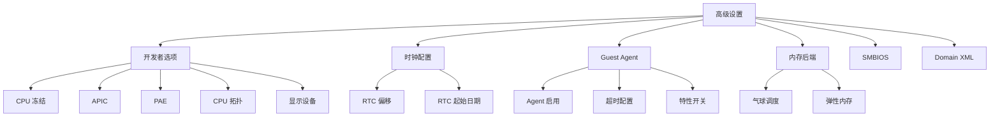
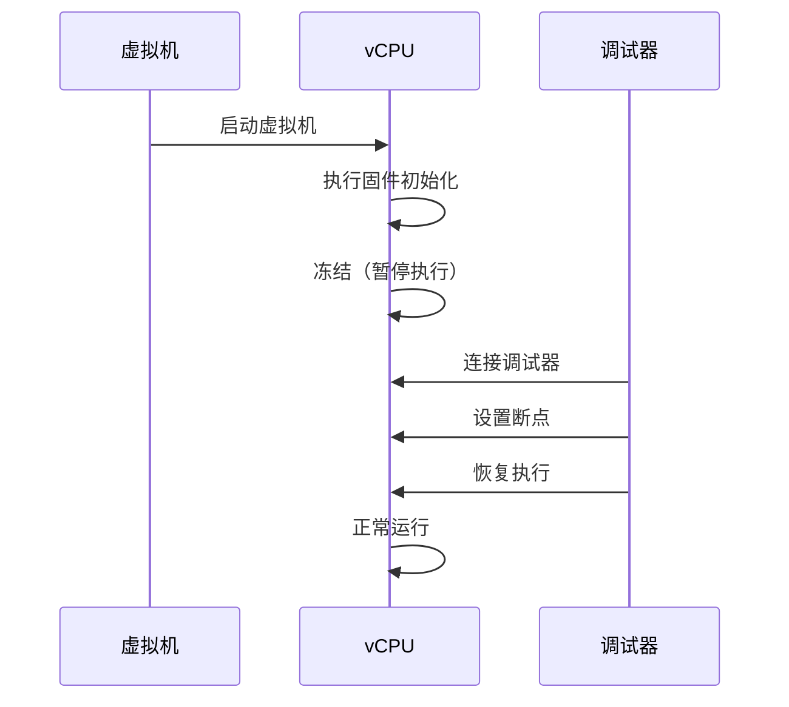
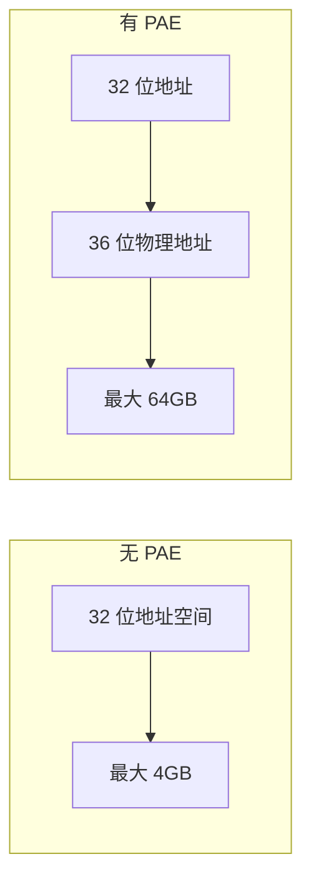
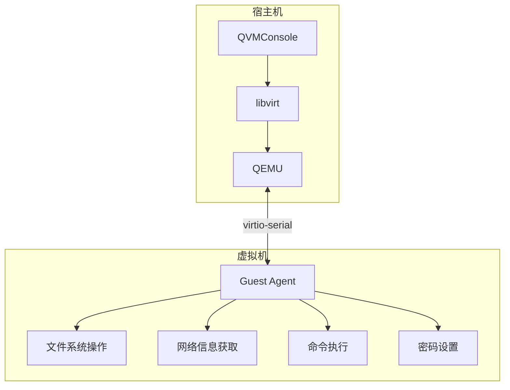
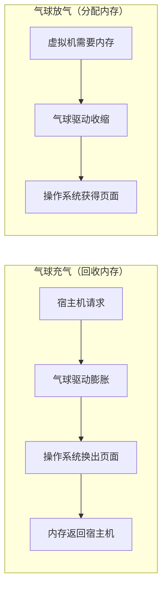
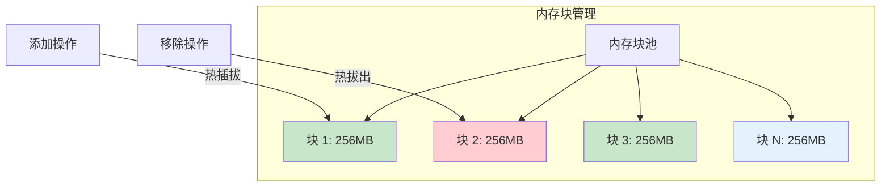
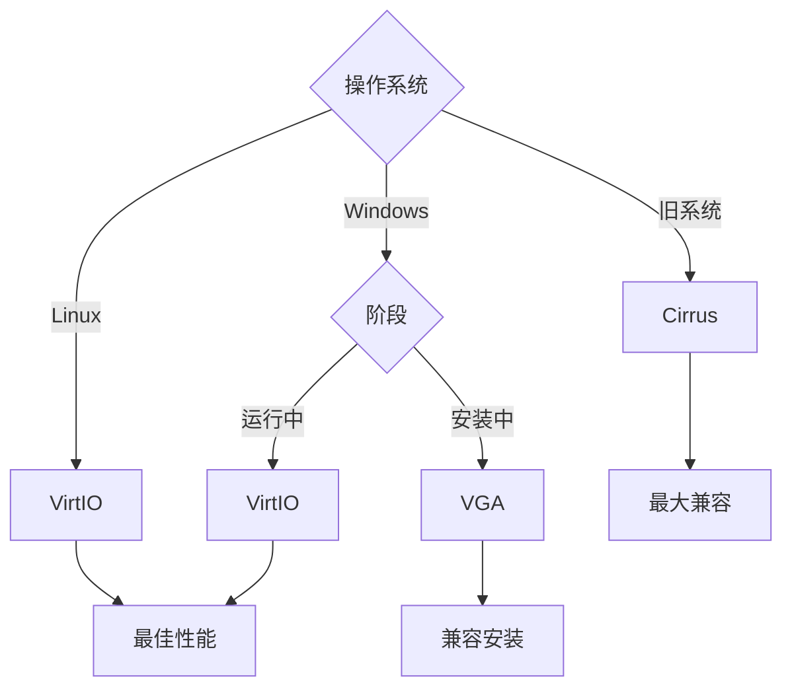

# 高级设置

高级设置包含了虚拟机的底层调优参数和开发者选项，这些配置通常用于解决特定的兼容性问题或满足特殊的性能需求。普通用户建议保持默认配置，仅在明确了解这些选项的用途及可能影响时再进行修改。

:::warning[谨慎操作]
高级设置仅建议在调试或排查启动问题时使用，普通情况下请保持默认配置。错误的配置可能导致虚拟机无法启动或运行异常。
:::

## 配置概览



## 开发者选项

### 启动时冻结 CPU

CPU 冻结功能使虚拟机在启动后立即将 vCPU 置于暂停状态，等待调试器连接后再继续执行。

**工作原理**：



**适用场景**：

- 内核开发调试
- 固件启动问题排查
- 引导过程分析
- 低级别问题诊断

### APIC（高级可编程中断控制器）

APIC 是现代处理器中的中断管理组件，负责处理硬件中断和处理器间通信。

| 状态 | 说明 | 适用场景 |
|------|------|---------|
| **启用** | 使用 APIC 中断控制器 | 默认推荐，所有现代系统 |
| **禁用** | 使用传统 PIC 中断控制器 | 仅用于排查非常早期的启动兼容性问题 |

:::tip[建议]
常规虚拟机建议保持启用 APIC。仅在排查非常早期的启动兼容性问题时再尝试关闭。
:::

### PAE（物理地址扩展）

PAE 允许 32 位处理器访问超过 4GB 的物理内存空间。

| 状态 | 说明 | 适用场景 |
|------|------|---------|
| **启用** | 启用 PAE 支持 | 32 位系统需要访问大内存 |
| **禁用** | 禁用 PAE 支持 | 64 位系统或小内存场景 |

**技术原理**：



:::info[说明]
主要用于 x86 老系统或 32 位来宾的大内存兼容场景。非 x86 架构会自动忽略该设置。
:::

## RTC 时钟配置

RTC（Real-Time Clock）配置控制虚拟机的实时时钟行为，包括时区偏移和起始日期。

### RTC 偏移

RTC 偏移用于调整虚拟机时钟与宿主机时钟的差异，常用于需要特定时区的场景。

| 偏移类型 | 说明 | 示例 |
|---------|------|------|
| **UTC** | 使用协调世界时 | Linux 系统默认 |
| **本地时间** | 使用宿主机本地时间 | Windows 系统默认 |
| **自定义偏移** | 手动设置偏移量 | 特殊时区需求 |

### RTC 起始日期

RTC 起始日期设置虚拟机时钟的初始值，某些旧版操作系统或软件可能需要特定的日期范围。

**使用场景**：

- 旧版软件的日期兼容性测试
- 特定时区的环境模拟
- 时间敏感型应用的调试

## QEMU Guest Agent

QEMU Guest Agent 是运行在虚拟机内部的守护进程，提供宿主机与虚拟机之间的通信通道。

### 功能概览



### 核心特性

| 特性 | 说明 | 用途 |
|------|------|------|
| **文件系统冻结** | 冻结虚拟机文件系统 | 创建一致性快照 |
| **文件系统解冻** | 解冻虚拟机文件系统 | 快照完成后恢复 |
| **网络信息** | 获取虚拟机 IP 地址 | 显示真实网络配置 |
| **用户密码** | 设置虚拟机用户密码 | 密码重置功能 |
| **关机/重启** | 优雅关闭或重启虚拟机 | 安全的系统操作 |

### 配置选项

| 选项 | 说明 | 默认值 |
|------|------|--------|
| **启用 Agent** | 是否使用 Guest Agent | 禁用 |
| **超时时间** | Agent 响应超时 | 30 秒 |
| **特性开关** | 控制可用的 Agent 功能 | 按需启用 |

### 安装要求

- **Linux**：安装 `qemu-guest-agent` 包
- **Windows**：安装 VirtIO 驱动中的 Guest Agent 组件

:::info[注意]
Guest Agent 需要在虚拟机内部安装并运行相应的服务才能正常工作。未安装 Agent 的虚拟机将回退到传统方式执行操作。
:::

## 动态内存后端

动态内存后端控制虚拟机内存动态调整的实现方式，不同后端在性能和兼容性上各有特点。

### 后端对比

| 后端 | 原理 | 粒度 | 兼容性 | 性能 |
|------|------|------|--------|------|
| **气球调度** | 页面级别的内存回收 | 4KB 页 | 广泛 | 略有开销 |
| **弹性内存** | 块级别的内存管理 | 128-512MB | 较新系统 | 更高效 |

### 气球调度详解



### 弹性内存详解



### 配置参数

| 参数 | 说明 | 范围 |
|------|------|------|
| **最大内存** | 动态内存上限 | 基础内存 ~ 64GB |
| **最小内存** | 动态内存下限 | 512MB ~ 基础内存 |
| **调整步长** | 每次调整的内存大小 | 由后端决定 |

## SMBIOS 配置

SMBIOS（System Management BIOS）是主板和系统信息的标准接口，某些软件会根据 SMBIOS 信息进行授权或功能判断。

### Type 1 信息

SMBIOS Type 1 包含系统制造商、产品名称、版本和序列号等信息。

| 字段 | 说明 | 用途 |
|------|------|------|
| **制造商** | 系统制造商名称 | 软件授权识别 |
| **产品名称** | 系统产品名称 | 硬件识别 |
| **版本** | 系统版本号 | 版本判断 |
| **序列号** | 系统序列号 | 唯一标识 |
| **UUID** | 通用唯一标识符 | 软件授权绑定 |

### 使用场景

- **软件授权**：某些软件根据 SMBIOS 信息进行授权验证
- **虚拟化检测**：部分软件会检测是否运行在虚拟化环境中
- **品牌定制**：为虚拟机设置特定的品牌信息

:::tip[建议]
除非有特殊需求，建议保持 SMBIOS 默认配置。修改 SMBIOS 信息可能影响某些软件的正常运行。
:::

## Domain XML 编辑

Domain XML 是 libvirt 定义虚拟机的 XML 配置文件，包含了虚拟机的所有硬件和配置信息。

### XML 结构

```xml
<domain type='kvm'>
  <name>vm-name</name>
  <memory unit='GiB'>4</memory>
  <vcpu placement='static'>2</vcpu>
  <os>
    <type arch='x86_64'>hvm</type>
  </os>
  <devices>
    <disk type='file' device='disk'>
      <!-- 磁盘配置 -->
    </disk>
    <interface type='network'>
      <!-- 网络配置 -->
    </interface>
  </devices>
</domain>
```

### 编辑权限

| 用户类型 | 权限 | 说明 |
|---------|------|------|
| **管理员** | 完全编辑权限 | 可直接修改 XML |
| **普通用户** | 无编辑权限 | 仅可查看 |

:::danger[风险警告]
直接编辑 Domain XML 可能导致：
- 虚拟机无法启动
- 配置不一致
- 数据丢失

仅建议高级用户在充分了解 libvirt XML 规范的情况下使用此功能。
:::

## 显示设备配置

显示设备决定了虚拟机的图形输出能力和性能，不同设备适用于不同的使用场景。

### 设备类型

| 设备 | 性能 | 兼容性 | 适用场景 |
|------|------|--------|---------|
| **VirtIO** | 最佳 | 需要驱动 | Linux 系统推荐 |
| **VGA** | 良好 | 广泛兼容 | Windows 安装阶段 |
| **VMVGA** | 良好 | VMware 兼容 | 嵌套虚拟化 |
| **QXL** | 优秀 | SPICE 协议 | SPICE 连接 |
| **Cirrus** | 一般 | 最佳兼容 | 旧系统 |

### 选择建议



## 首次重启模式

首次重启模式控制 Windows 模板克隆后首次重启的行为，用于解决某些模板的兼容性问题。

### 模式选项

| 模式 | 说明 | 适用场景 |
|------|------|---------|
| **正常重启** | 由虚拟机内部触发重启 | 默认模式 |
| **宿主冷启动** | 由宿主机强制重启虚拟机 | Sysprep/OOBE 黑屏问题 |

:::info[LTSC 模板]
Windows LTSC 等模板在 Sysprep/OOBE 自动重启后可能出现黑屏，此时可选择"宿主冷启动"模式解决此问题。
:::
