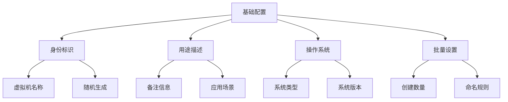
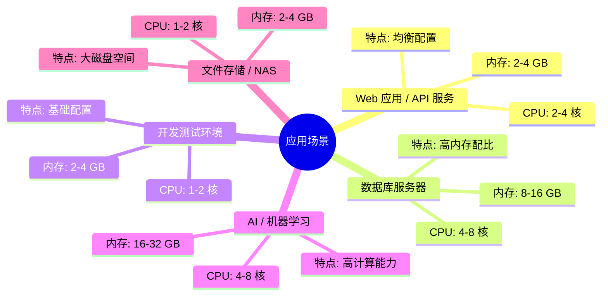
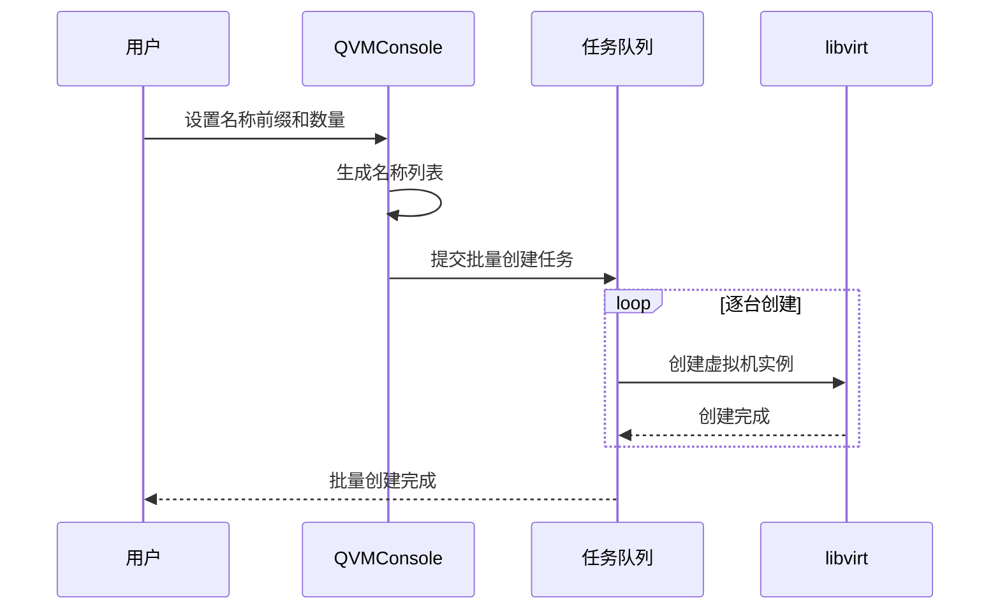

# 基础配置

基础配置是虚拟机创建过程中的首要环节，涵盖了虚拟机的身份标识、用途描述和操作系统选择等核心信息。合理的命名规范和场景选择能够为后续的运维管理奠定良好基础。

## 配置项概览



## 虚拟机名称

虚拟机名称是实例的唯一标识符，用于在管理界面和命令行中区分不同的虚拟机实例。

### 命名规则

| 规则 | 说明 | 示例 |
|------|------|------|
| **字符限制** | 仅支持字母、数字和短横线 | `web-server-01` |
| **首尾限制** | 不能以短横线开头或结尾 | `vm-2024`（正确）、`-vm`（错误） |
| **长度限制** | 最大 63 个字符 | - |
| **唯一性** | 同一主机上名称必须唯一 | - |

### 智能命名

QVMConsole 提供了智能命名功能，帮助用户快速生成符合规范的虚拟机名称：

- **随机生成**：点击"随机生成"按钮，系统自动生成类似 `vm-a3b2` 的随机名称
- **批量命名**：批量创建时，名称作为前缀，系统自动添加数字后缀
  - 例如：输入 `web`，批量创建 3 台 → `web-01`、`web-02`、`web-03`

## 备注信息

备注字段用于记录虚拟机的用途、环境或业务信息，方便后续管理和识别。

### 最佳实践

```
用途: 生产环境 Web 服务器
业务: 用户中心 API
负责人: 运维团队
创建时间: 2024-01-15
```

:::tip[建议]
建议建立统一的备注规范，包含环境类型、业务名称、负责人等关键信息，便于批量管理和资产盘点。
:::

## 应用场景

应用场景选择是一个可选但推荐的功能，它能够根据不同的业务需求自动推荐最优的硬件配置方案。

### 支持的场景类型



### 智能推荐

选择应用场景后，系统会在硬件规格配置步骤中提供智能推荐方案：

- **Web 应用**：推荐均衡的 CPU 和内存配置，适合处理并发请求
- **数据库**：推荐高内存配比，优化查询缓存性能
- **AI/机器学习**：推荐高计算能力配置，支持 GPU 直通
- **文件存储**：推荐大磁盘空间配置，可能包含多块数据盘

## 系统类型

系统类型选择决定了虚拟机的基础架构配置，QVMConsole 会根据此选择自动优化底层参数。

### 系统类型选项

| 类型 | 图标 | 包含系统 | 典型配置 |
|------|------|---------|---------|
| **Linux** | Tux | Ubuntu、CentOS、Debian、Fedora 等 | VirtIO 驱动、virt 机型 |
| **Windows** | Windows | Windows Server、Windows 10/11 等 | VGA 显示、i440FX 机型 |
| **macOS** | Apple | macOS（需要特殊配置） | 特定机型和固件 |
| **其他** | - | FreeBSD、OpenBSD 等 | 基础配置 |

### 系统版本

选择系统类型后，可以进一步选择具体的系统版本。QVMConsole 内置了 osinfo 数据库，包含数百种操作系统的详细信息：

- **自动匹配**：根据选择的版本自动配置最优的虚拟化参数
- **版本搜索**：支持模糊搜索，快速定位目标版本
- **分类展示**：按发行版和版本号分类，清晰直观

## 批量创建

当需要创建多台配置相同的虚拟机时，批量创建功能可以显著提升效率。

### 批量创建流程



### 资源计算

批量创建时，系统会自动计算总资源需求：

```
示例：创建 5 台虚拟机，每台 4GB 内存、50GB 磁盘

总内存需求: 5 × 4GB = 20GB
总磁盘需求: 5 × 50GB = 250GB
```

:::warning[配额检查]
批量创建前，系统会检查用户配额是否满足总资源需求。如果配额不足，将无法提交创建任务。
:::

## 模板克隆的凭据配置

当使用模板克隆方式创建虚拟机时，需要配置登录凭据以实现开箱即用。

### 凭据配置项

| 配置项 | 说明 | 示例 |
|--------|------|------|
| **主机名** | 虚拟机的网络主机名 | `web-server-01` |
| **用户名** | 系统登录用户名 | `admin` |
| **密码** | 系统登录密码 | 建议使用强密码生成器 |

### 密码安全

QVMConsole 提供了密码安全功能：

- **强密码生成**：点击"生成强密码"自动生成符合安全标准的密码
- **密码强度检查**：实时检查密码强度，给出安全建议
- **批量密码**：批量创建时可为每台虚拟机生成独立的随机密码

### Windows 模板特殊处理

对于 Windows 模板，用户名字段通常预设为 `Administrator`，不可修改。密码设置需要符合 Windows 的复杂度要求：

- 至少 8 个字符
- 包含大写字母、小写字母、数字和特殊字符中的至少三种

## FnOS 模板配置

当使用 FnOS（飞牛OS）模板时，会出现额外的设备 ID 配置选项：

### 设备 ID 模式

| 模式 | 说明 | 适用场景 |
|------|------|---------|
| **重新生成** | 自动生成新的设备 ID | 默认推荐，每台虚拟机独立 |
| **保留设备 ID** | 使用模板中的原始设备 ID | 需要保持授权的场景 |
| **指定设备 ID** | 手动输入特定的设备 ID | 特殊授权需求 |

:::info[授权场景]
某些软件授权与设备 ID 绑定，在这些场景下可能需要保留或指定特定的设备 ID。
:::
