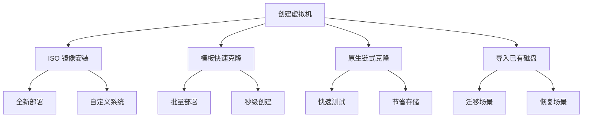
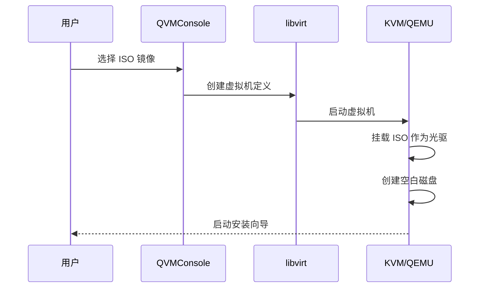
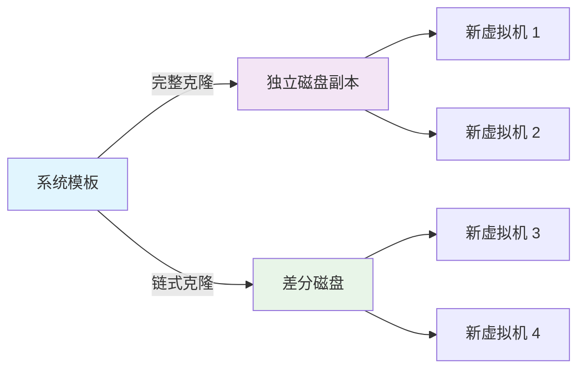
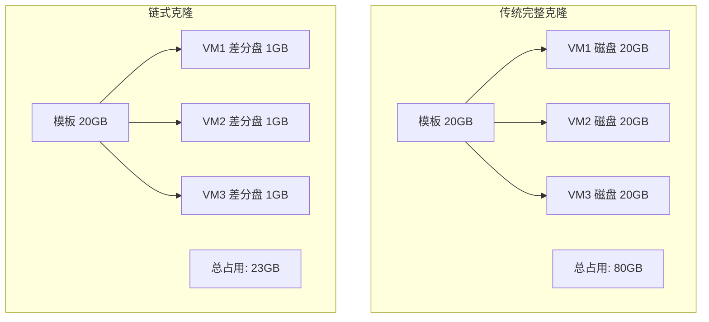
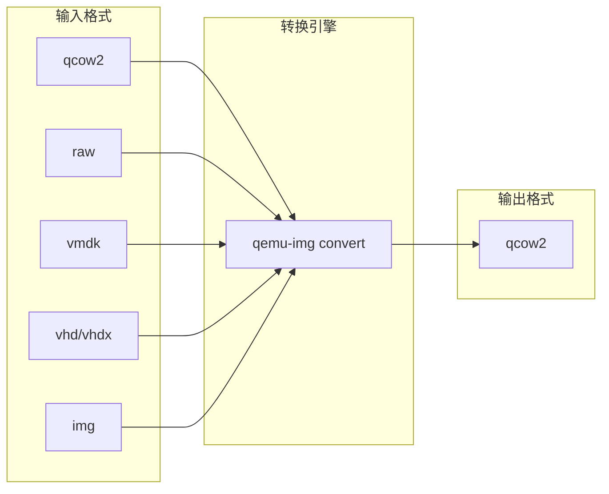
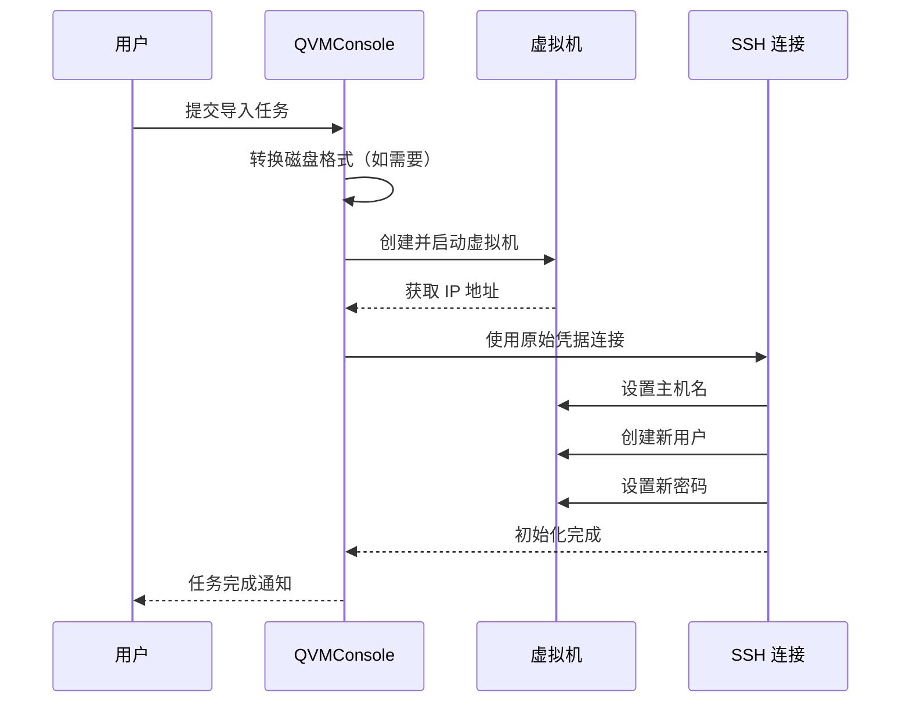

# 创建方式

QVMConsole 提供了四种灵活多样的虚拟机创建方式，以满足不同场景下的部署需求。每种方式都经过精心设计，在易用性与专业性之间取得平衡，让您能够根据实际业务需求选择最合适的创建路径。

## 创建方式概览

## ISO 镜像安装

**适用场景**：全新部署、需要自定义操作系统安装过程

ISO 镜像安装是最传统的虚拟机创建方式，通过挂载操作系统安装光盘（ISO 文件）来完成系统的全新安装。这种方式给予用户最大的自由度，可以完全控制操作系统的安装过程和初始配置。

### 工作原理

### 核心特性

| 特性 | 说明 |
|------|------|
| **多 ISO 支持** | 可同时挂载多个 ISO 文件，首个作为主安装盘，其余作为额外驱动或工具盘 |
| **智能识别** | 自动识别 ISO 中的操作系统类型和版本，简化配置流程 |
| **系统版本匹配** | 内置 osinfo 数据库，自动匹配最佳虚拟化配置 |
| **灵活磁盘配置** | 支持自定义磁盘大小、格式（QCOW2/RAW）和驱动类型 |

### 操作流程

1. **选择 ISO 镜像**：从存储池中选择已上传的 ISO 文件，支持搜索和分类筛选
2. **配置系统信息**：设置操作系统类型和版本，系统会自动推荐最优配置
3. **设置硬件规格**：配置 CPU、内存、磁盘等硬件参数
4. **配置网络**：选择网卡类型和 VPC 网络
5. **完成创建**：提交任务后系统自动完成虚拟机创建并启动安装

## 模板快速克隆

**适用场景**：批量部署、快速创建相同配置的虚拟机

模板克隆是基于预配置的系统模板快速创建虚拟机的方式。通过预先制作好的系统镜像，可以在数秒内完成虚拟机的创建，极大提升部署效率。

### 工作原理

### 克隆模式对比

| 模式 | 原理 | 优势 | 劣势 |
|------|------|------|------|
| **完整克隆** | 将模板数据完整复制到独立磁盘 | 独立运行，不依赖模板 | 创建较慢，占用完整存储空间 |
| **链式克隆** | 基于模板创建差分磁盘（backing file） | 创建极快，节省存储空间 | 依赖模板存在，模板损坏影响所有克隆 |

### 核心特性

- **批量创建**：支持一次创建多台虚拟机，自动编号命名
- **凭据注入**：自动注入主机名、用户名和密码，实现开箱即用
- **磁盘扩展**：可在克隆时扩展磁盘大小，满足更大存储需求
- **智能驱动匹配**：根据模板自动选择最佳磁盘驱动类型

### 链式克隆的存储优化

## 原生链式克隆

**适用场景**：快速测试、临时环境、需要最大化存储效率

原生链式克隆是一种特殊的克隆模式，直接基于模板生成 backing 磁盘并启动虚拟机，不修改模板内的任何配置（包括主机名、用户名、密码、网络配置等）。

### 与普通链式克隆的区别

| 特性 | 普通链式克隆 | 原生链式克隆 |
|------|-------------|-------------|
| **配置注入** | 修改主机名、密码等 | 保持模板原始配置 |
| **适用场景** | 生产环境批量部署 | 快速测试、更新模板 |
| **启动后状态** | 独立身份 | 与模板完全一致 |
| **权限要求** | 普通用户可用 | 仅管理员可用 |

### 工作流程

1. 选择目标模板
2. 系统直接创建基于模板的 backing 磁盘
3. 定义虚拟机并启动
4. 保留模板内的所有原始配置

## 导入已有磁盘

**适用场景**：虚拟机迁移、系统恢复、使用现有磁盘文件

导入已有磁盘方式允许用户使用已存在的虚拟机磁盘文件（如从其他平台导出的磁盘）来创建虚拟机，支持多种磁盘格式的自动转换。

### 支持的磁盘格式

### 核心特性

- **多格式支持**：自动识别并转换 qcow2、raw、vmdk、vhd/vhdx、img 等格式
- **灵活的磁盘来源**：支持从用户存储空间选择或输入服务器绝对路径（管理员）
- **初始化配置**：支持 Linux 系统的 SSH 初始化（设置主机名、用户名、密码）
- **导入后控制**：可选择导入完成后自动启动或仅创建不启动
- **额外磁盘**：支持同时导入多个额外磁盘

### Linux 初始化流程

## 选择建议

| 场景 | 推荐方式 | 原因 |
|------|---------|------|
| 全新部署生产环境 | ISO 镜像安装 | 完全控制安装过程，确保系统纯净 |
| 批量部署相同配置 | 模板快速克隆 | 秒级创建，统一配置管理 |
| 快速测试/开发 | 原生链式克隆 | 最快速度，最小存储占用 |
| 虚拟机迁移 | 导入已有磁盘 | 直接使用现有磁盘，无需重新安装 |
| 灾难恢复 | 导入已有磁盘 | 快速恢复备份的虚拟机 |
| 教学/演示环境 | 模板快速克隆 | 统一环境，快速重置 |
