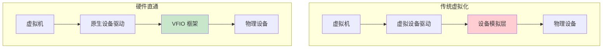
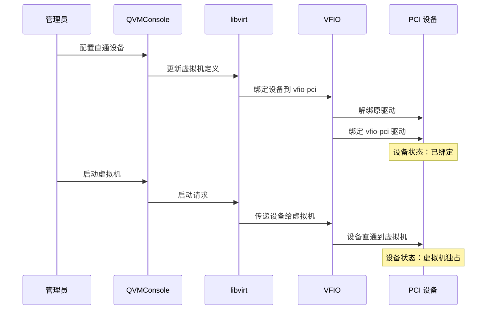
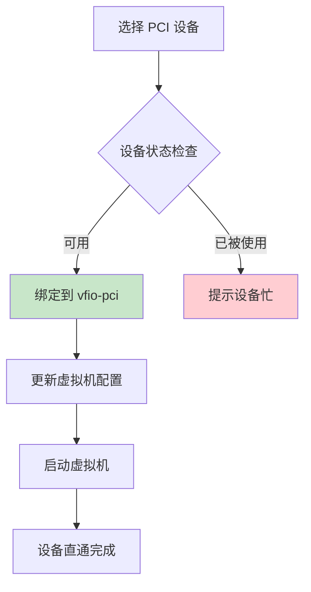
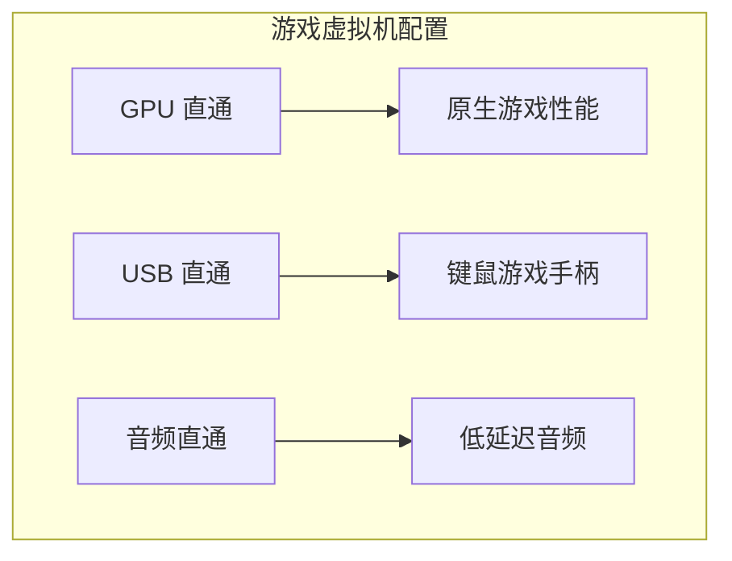

# 硬件直通

硬件直通（PCI Passthrough）是一项高级虚拟化技术，允许将宿主机的物理 PCI 设备直接分配给虚拟机使用，绕过虚拟化层的模拟，获得接近原生的设备性能。

:::info[权限要求]
硬件直通功能仅对管理员开放，需要管理员权限才能配置直通设备。
:::

## 技术原理

### 设备直通架构

### 工作流程

## 支持的设备类型

### GPU 直通

GPU 直通是最常见的硬件直通场景，将物理显卡直接分配给虚拟机，实现接近原生的图形性能。

| GPU 类型 | 用途 | 性能 |
|---------|------|------|
| **消费级 GPU** | 游戏、图形渲染 | 接近原生 |
| **专业 GPU** | CAD、3D 建模 | 接近原生 |
| **计算 GPU** | AI 训练、科学计算 | 接近原生 |

**GPU 直通优势**：

- **原生驱动支持**：虚拟机直接使用官方驱动
- **完整功能**：支持 GPU 的所有特性
- **高性能**：无虚拟化开销

### NVMe 硬盘直通

NVMe 直通将 NVMe SSD 控制器直接分配给虚拟机，提供最高的存储性能。

| 特性 | 说明 |
|------|------|
| **延迟** | 接近原生延迟 |
| **IOPS** | 接近原生 IOPS |
| **带宽** | 接近原生带宽 |

### 网卡直通

网卡直通将物理网卡直接分配给虚拟机，适用于对网络性能要求极高的场景。

**适用场景**：

- 高频交易系统
- 网络功能虚拟化（NFV）
- 高性能计算集群

## VFIO 配置

VFIO（Virtual Function I/O）是 Linux 内核提供的设备直通框架，提供安全的设备访问机制。

### VFIO 绑定状态

| 状态 | 说明 | 图标 |
|------|------|------|
| **已绑定** | 设备已绑定到 vfio-pci 驱动 | 绿色标签 |
| **待绑定** | 设备尚未绑定，等待虚拟机启动 | 黄色标签 |

### 绑定流程

### 前置条件

使用硬件直通需要满足以下条件：

| 条件 | 说明 | 检查方法 |
|------|------|---------|
| **IOMMU 支持** | CPU 和主板支持 IOMMU | BIOS 设置中启用 VT-d/AMD-Vi |
| **IOMMU 分组** | 设备在独立的 IOMMU 组中 | `lspci -nnk` 查看 |
| **内核支持** | 内核编译时启用 VFIO | `lsmod \| grep vfio` |
| **BIOS 设置** | 启用 VT-d 或 AMD-Vi | 进入 BIOS 检查 |

## 配置直通设备

### 添加设备

1. **查看可用设备**：系统列出宿主机上所有可用的 PCI 设备
2. **选择目标设备**：选择要直通的设备
3. **确认绑定状态**：检查设备是否已被其他虚拟机占用
4. **保存配置**：将直通配置保存到虚拟机定义

### 设备信息

| 信息 | 说明 | 示例 |
|------|------|------|
| **PCI 地址** | 设备在 PCI 总线上的位置 | `0000:01:00.0` |
| **设备名称** | 设备的型号名称 | `NVIDIA GeForce RTX 3080` |
| **厂商 ID** | 设备制造商标识 | `10de` |
| **设备 ID** | 设备型号标识 | `2206` |
| **绑定状态** | 当前 VFIO 绑定状态 | 已绑定/待绑定 |

### 移除设备

移除直通设备时：

1. 虚拟机必须处于关机状态
2. 设备会从虚拟机配置中移除
3. 设备的 vfio-pci 绑定会在下次启动时释放

## 常见直通场景

### 游戏虚拟机

**推荐配置**：

- **GPU**：消费级显卡（NVIDIA/AMD）
- **USB**：USB 控制器直通
- **内存**：大内存分配（16GB+）
- **CPU**：多核心分配

### AI 训练环境

| 组件 | 配置建议 |
|------|---------|
| **GPU** | 计算卡（NVIDIA Tesla/A100） |
| **NVMe** | NVMe 直通用于数据集 |
| **网卡** | 高速网卡直通用于分布式训练 |
| **CPU** | 多核心 + CPU 亲和性优化 |

### 开发测试环境

- **GPU**：用于图形开发测试
- **串口**：用于嵌入式开发调试
- **专用网卡**：用于网络协议测试

## 常见问题

### 设备无法直通

| 问题 | 原因 | 解决方案 |
|------|------|---------|
| IOMMU 未启用 | BIOS 未开启 VT-d/AMD-Vi | 进入 BIOS 启用 |
| 设备在错误的 IOMMU 组 | 与其他设备共享 IOMMU 组 | 使用 ACS 补丁或更换插槽 |
| 驱动冲突 | 宿主机驱动占用设备 | 解绑宿主机驱动 |
| 设备被其他 VM 使用 | 设备已分配给其他虚拟机 | 先从其他虚拟机移除 |

### 性能问题

| 问题 | 可能原因 | 解决方案 |
|------|---------|---------|
| GPU 性能低下 | 未安装正确驱动 | 安装官方驱动 |
| 中断延迟高 | CPU 亲和性配置不当 | 优化 CPU 亲和性 |
| 内存带宽不足 | NUMA 跨节点访问 | 确保设备和 VM 在同一 NUMA 节点 |

### NVIDIA GPU 特殊处理

NVIDIA 消费级 GPU 在虚拟机中使用时可能遇到错误 43，需要额外配置：

| 配置项 | 说明 |
|--------|------|
| **隐藏虚拟化** | 在 SMBIOS 中隐藏虚拟化特征 |
| **vendor_id** | 设置为非 KVM 标识 |
| **kvm hidden** | 启用 KVM 隐藏模式 |

:::tip[提示]
QVMConsole 会自动为 NVIDIA GPU 配置必要的隐藏参数，大多数情况下无需手动处理。
:::

## 安全考虑

### 设备隔离

硬件直通提供了强大的设备隔离保证：

- **内存隔离**：设备只能访问虚拟机的内存空间
- **DMA 保护**：IOMMU 防止设备进行恶意 DMA 操作
- **中断隔离**：设备中断只传递给拥有该设备的虚拟机

### 风险提示

| 风险 | 说明 | 缓解措施 |
|------|------|---------|
| **设备固件漏洞** | 恶意固件可能攻击宿主机 | 仅使用可信设备 |
| **DMA 攻击** | 设备可能尝试访问其他内存 | 依赖 IOMMU 保护 |
| **资源独占** | 直通设备无法共享 | 合理规划设备分配 |

:::warning[注意]
硬件直通将物理设备的完全控制权交给虚拟机，如果虚拟机被入侵，直通设备可能成为攻击向量。请确保虚拟机的安全性。
:::
