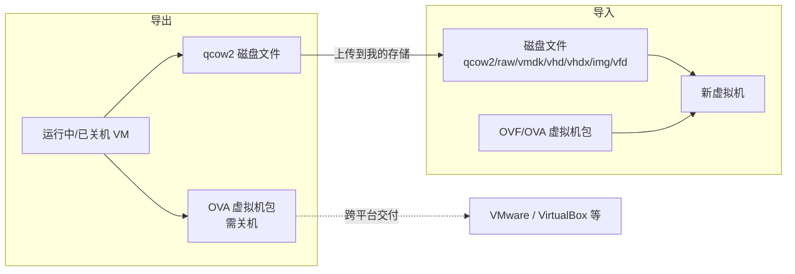
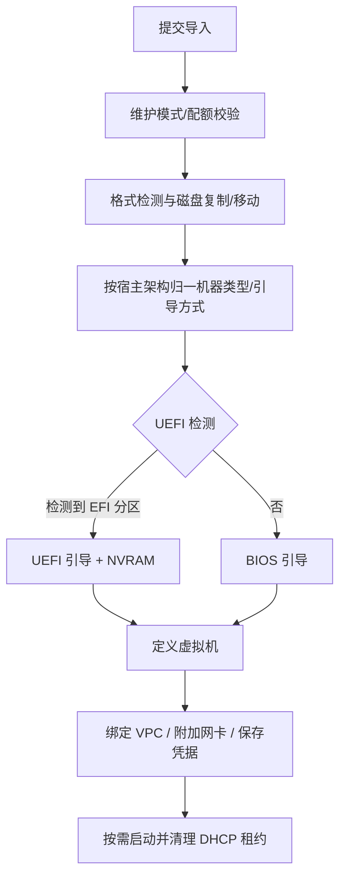

# 导入与导出

QVMConsole 支持将虚拟机导出为通用格式（qcow2 磁盘或 OVA 包），也支持从磁盘文件或 OVF/OVA 虚拟机包导入虚拟机。导出结果写入「我的存储」的磁盘目录，与导入共用同一套存储与配额机制。

## 导出虚拟机

入口：虚拟机列表「更多」菜单 → 导出虚拟机。

### 导出格式

| 格式 | 内容 | 要求 |
|------|------|------|
| **qcow2** | 仅系统盘（链式盘自动 `qemu-img convert` 展平 backing 链；非链式盘稀疏复制） | 无状态要求 |
| **OVA** | OVF 1.0 描述文件 + SHA-256 清单 + 所选磁盘转换的 streamOptimized VMDK | **必须关机**；必须包含系统盘 |

:::warning 不写入导出包的内容
ISO/软盘介质、快照、NVRAM、保存态（suspend 状态）、直通设备配置均不会写入导出文件。
:::

### 导出选项表单

- **格式选择**：qcow2（只导系统盘）/ OVA（描述 + 清单 + 所选磁盘）
- **磁盘多选**：OVA 模式下可勾选要导出的磁盘，系统盘固定勾选；非本地文件磁盘标记为不可导出
- **容量预估**：按系统盘大小 ×110% 预估，导出前校验「我的存储」剩余配额

### 导出任务

导出为异步任务（`export`），产物输出到用户的磁盘目录：

- qcow2：`vm-export-<时间戳>.qcow2`
- OVA：`.ova` 单文件（打包前校验临时目录空间）

导出完成后文件计入用户存储配额，可在「我的存储 → 虚拟磁盘」中下载、再次导入或挂载管理。

## 导入虚拟机

入口：创建向导 → 导入虚拟机包 / 我的存储磁盘文件导入；管理员也可通过 API 以服务器绝对路径导入。

### 支持的来源

| 来源 | 权限 | 说明 |
|------|------|------|
| 我的存储文件 | 所有用户（需已开通存储） | 支持 `.qcow2/.raw/.vmdk/.vhd/.vhdx/.img/.vfd/.ova/.ovf/.mf` |
| 服务器绝对路径 | 仅管理员 | 直接指定宿主机上的磁盘或包文件 |

普通磁盘导入会拒绝 `.ova/.ovf/.mf`（这些文件需走虚拟机包导入流程）。

### 导入配置

除磁盘来源外，导入表单包含完整的硬件配置：vCPU、内存、系统盘 IOPS、引导方式、机器类型、网卡模型、显示设备、CPU 拓扑、CPU 限制与亲和性、RTC、SMBIOS、动态内存、VPC 交换机与安全组、开机自启、启动时冻结等；可选「复制磁盘」（否则直接使用源文件）与「导入后自动启动」（默认开启）。

### 导入流程

- Windows/Linux 走各自的定义路径（详见 [系统初始化原理](/docs/tech/feature-analysis/system-initialization)）
- 管理员绝对路径导入磁盘支持两种任务：直接创建新虚拟机（`import_disk`）或附加到已有虚拟机（`import_disk_attach`）

## 导入虚拟机包（OVF/OVA）

虚拟机包导入是创建向导的独立入口，支持解析 VMware / VirtualBox 等平台的 OVF 描述与 OVA 打包：

### 检查（inspect）

提交包文件后先执行检查任务：

- **OVA 安全解包**：限制条目数量、校验大小膨胀比例、拒绝链接文件与路径穿越、要求单一 OVF 描述
- **清单校验**：按 `.mf` 文件校验磁盘哈希（支持 SHA-1 / SHA-256）
- **OVF 解析**：提取 vCPU、内存、磁盘（含控制器总线映射）、网卡、架构、引导方式、机型与 OS 类型；缺失项使用默认值（vCPU 2 / 内存 2GB）并输出警告

### 导入

| 配置方式 | 说明 |
|----------|------|
| **跟随 OVF 配置** | 使用包内的 vCPU/内存/固件/机型/网卡型号（网络仅复用映射关系，MAC 重新生成） |
| **自定义配置** | 在表单中覆盖硬件配置后导入 |

导入为异步任务（`import_appliance`）：

1. 架构一致性校验（包架构必须与宿主一致）
2. 主盘创建 + 数据盘逐个挂载
3. 绑定 VPC、附加额外网卡、设置 IOPS
4. 按「导入后启动」开关启动虚拟机
5. 「不保留源包」时清理源文件
6. 任一步骤失败自动回滚（清理已创建的磁盘与虚拟机定义）

## API 摘要

| 接口 | 说明 |
|------|------|
| `GET /self/vm/{name}/export-options` | 可导出磁盘列表与容量预估 |
| `POST /self/vm/export` | 提交导出任务（qcow2 / OVA） |
| `POST /self/vm/import` | 从磁盘文件导入虚拟机 |
| `POST /self/vm/import-appliance/inspect` | 检查 OVF/OVA 包 |
| `POST /self/vm/import-appliance` | 导入 OVF/OVA 包（二次验证） |
| `POST /vm/import-disk` | 管理员绝对路径导入磁盘建机 |
| `POST /vm/import-appliance/inspect`、`POST /vm/import-appliance` | 管理员侧包检查 / 导入 |
