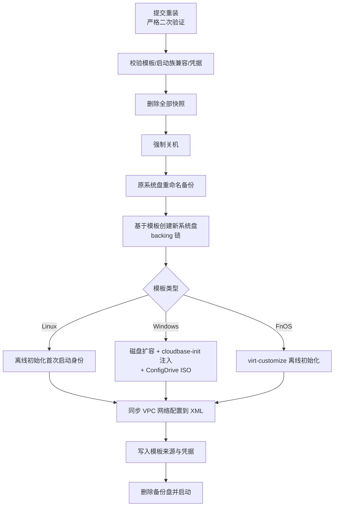
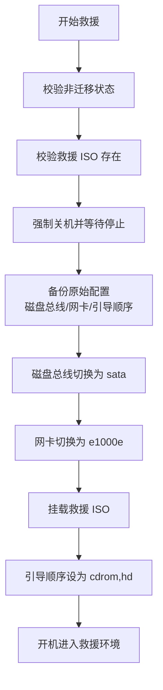

# 重装与救援

除创建与克隆外，QVMConsole 还提供三项恢复类能力：**重装系统**（用模板替换系统盘）、**救援模式**（从救援 ISO 引导修复）与**来宾密码重置**（在线/离线修改虚拟机内账户密码）。

## 重装系统

重装会使用所选模板重建系统盘，**保留虚机的 CPU、内存、网络配置与额外数据盘**，适用于系统损坏、更换发行版等场景。

### 重装表单

| 字段 | 说明 |
|------|------|
| **模板** | 选择要重装到的模板（仅可选择与当前虚机启动族兼容的模板：同为 BIOS 或同为 UEFI） |
| **系统盘大小** | 默认沿用当前系统盘大小，不得小于模板最小磁盘 |
| **主机名 / 用户名 / 密码** | 首次启动身份（Windows 固定 `administrator`；密码需通过强度与泄露检测） |
| **FnOS 设备 ID** | 仅 FnOS 模板：重新生成 / 保留原 ID / 自定义 32-40 位十六进制 ID |

:::warning 重装影响
重装开始时会**自动强制关机**、**删除该虚机全部快照**并用新系统盘替换原系统盘。原系统盘先重命名备份，重装失败时自动回滚恢复。
:::

### 重装流程

- 重装为异步任务（`reinstall`），提交要求**严格的高风险二次验证**，且同一虚机不允许并发重装
- 维护模式下禁止重装
- Windows 重装继承「首次重启模式」（宿主冷启动）等模板配置，ConfigDrive ISO 会在初始化完成后自动弹出
- 任一步骤失败：自动强制关机 → 恢复原 XML → 恢复原系统盘

## 救援模式

救援模式用于虚机无法正常启动时的紧急修复：从系统配置的救援 ISO 引导，进入 Live 环境手动处理磁盘与分区。

:::info 救援 ISO 来源
救援 ISO 在「系统设置 → 调度与高级 → 救援系统」中配置（`rescue_iso`），面板从 ISO 存放位置读取可选列表；救援请求本身不携带 ISO 参数。
:::

### 进入救援（start）

### 退出救援（stop）

强制关机 → 弹出救援 ISO → 按备份恢复磁盘总线、网卡型号与引导顺序 → 开机 → 清理临时配置。

- 救援为异步任务（`rescue`）；虚机列表与详情中会展示「救援中」状态（`in_rescue`）
- 退出救援后虚机恢复到进入救援前的硬件配置

## 来宾密码重置

在不知道虚机内密码时，可通过面板重置来宾系统账户密码。入口：详情页「重置密码」对话框（`POST /vm/{name}/password/reset`，高风险操作）。

### 重置模式

| 模式 | 要求 | 实现 |
|------|------|------|
| **auto（默认）** | 自动选择 | 运行中走 online，关机走 offline |
| **online** | 虚机运行中且已安装 QEMU Guest Agent（支持 `guest-set-user-password`） | 通过 Guest Agent 在线改密 |
| **offline** | 虚机关机 | Linux / FnOS：`virt-customize --password --selinux-relabel` 离线改密；Windows：注入一次性改密脚本（注册表触发首次启动执行，完成后写标记并自动关机） |

### 用户名校验

| 系统 | 规则 |
|------|------|
| **Linux** | `^[a-z_][a-z0-9_-]+` |
| **Windows** | 长度 ≤64，不得包含 `"/` `\` `[` `]` `:` `;` `|` `=` `,` `+` `*` `?` 与尖括号等字符 |

新密码需通过强密码与泄露检测；重置成功后新凭据会被保存（加密存储），可在详情页系统信息中查看。

:::tip 使用建议
- 无法确认 Guest Agent 状态时优先使用 auto 模式
- Windows offline 重置需要一次完整开机执行脚本（执行完成后虚机会自动关机）
- 若虚机既不能开机又未安装 Guest Agent，可先进入[救援模式](#救援模式)手动处理
:::

## API 摘要

| 接口 | 说明 |
|------|------|
| `POST /vm/{name}/reinstall` | 重装系统（严格二次验证，异步任务 `reinstall`） |
| `POST /vm/{name}/rescue` | 进入/退出救援模式（`action=start\|stop`，异步任务 `rescue`） |
| `POST /vm/{name}/password/reset` | 重置来宾密码（二次验证，异步任务 `reset_vm_password`） |
