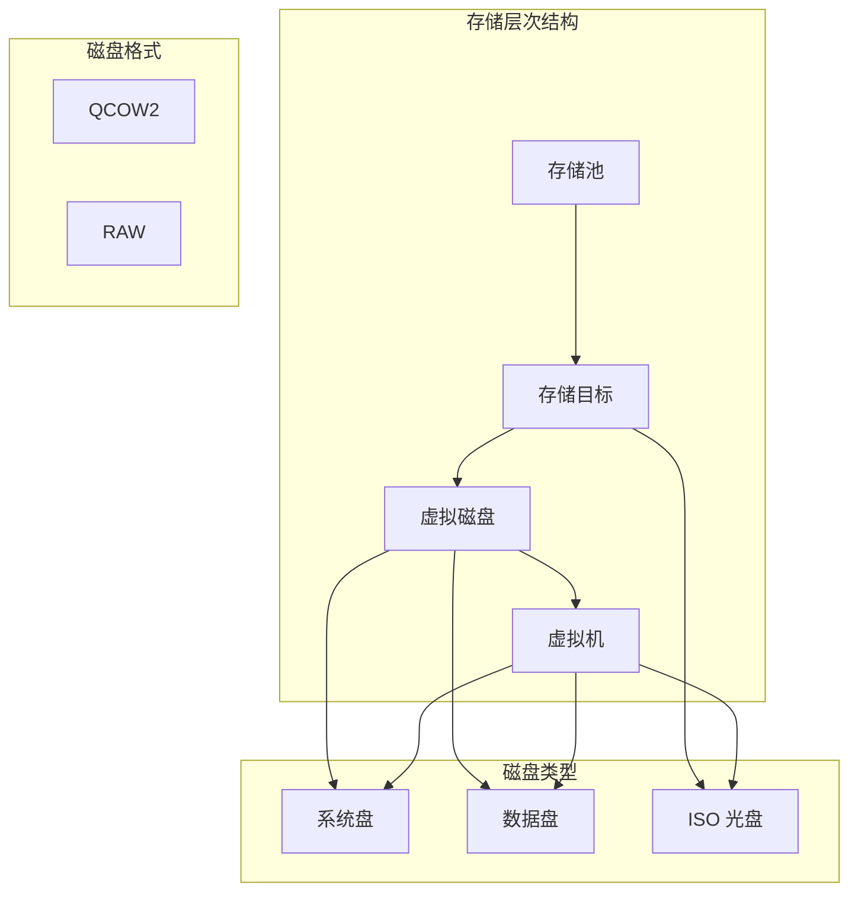
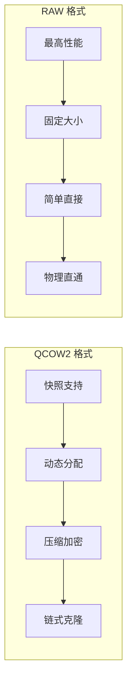
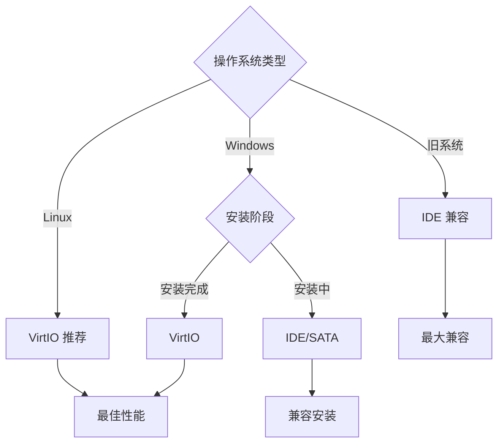
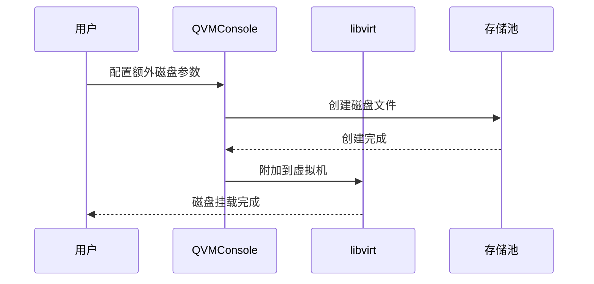
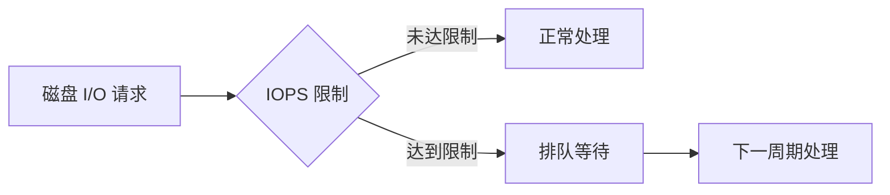
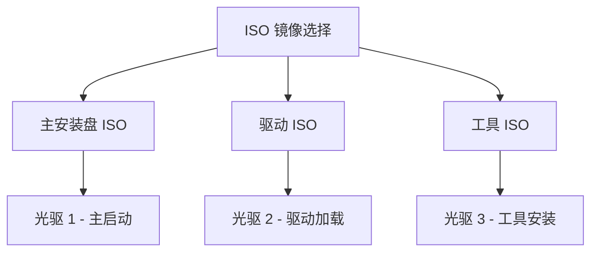
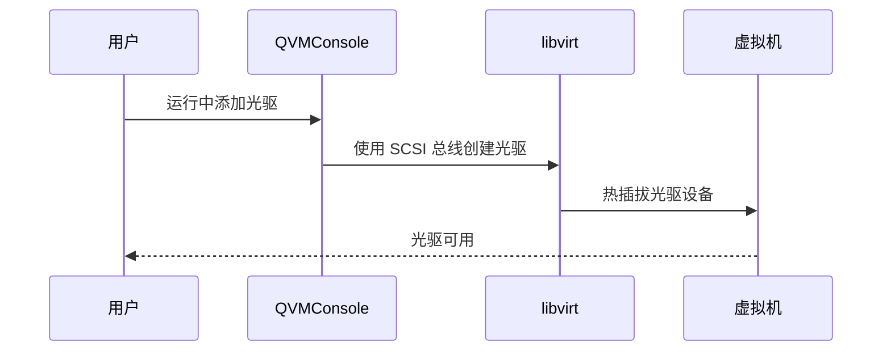
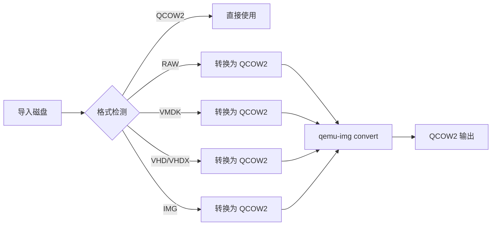

# 存储配置

存储配置是虚拟机管理中的关键环节，直接影响数据的读写性能、存储效率和数据安全。QVMConsole 提供了完善的存储管理功能，从磁盘格式选择到 IOPS 限速，为不同业务场景提供灵活的存储解决方案。

## 存储架构概览

## 存储位置

存储位置决定了虚拟机磁盘文件的存放位置，合理选择存储位置可以优化性能和管理效率。

### 存储目标选择

| 选项 | 说明 | 适用场景 |
|------|------|---------|
| **默认存储** | 使用管理员设置的默认存储位置 | 通用场景，简化配置 |
| **指定存储池** | 手动选择特定的存储池 | 需要隔离存储或使用高性能存储 |

### 存储目标信息

选择存储目标时，系统会显示以下关键信息：

- **显示名称**：存储目标的友好名称
- **可用空间**：当前剩余的存储容量
- **默认标识**：是否为系统默认存储位置

:::tip[最佳实践]
- 将系统盘和数据盘分离到不同的存储目标，便于管理和备份
- 高性能应用建议使用 SSD 存储池
- 大容量存储需求可使用 HDD 存储池
:::

## 磁盘格式

磁盘格式定义了虚拟磁盘文件的存储方式，不同格式在性能、功能和存储效率上各有特点。

### 格式对比

| 特性 | QCOW2 | RAW |
|------|-------|-----|
| **存储方式** | 动态分配，按需增长 | 预分配，固定大小 |
| **快照支持** | 原生支持多层快照 | 不支持原生快照 |
| **性能** | 略有开销 | 接近原生性能 |
| **压缩** | 支持透明压缩 | 不支持 |
| **加密** | 支持 AES 加密 | 不支持 |
| **稀疏文件** | 天然支持 | 需要文件系统支持 |
| **链式克隆** | 支持 backing file | 不支持 |
| **适用场景** | 通用场景，开发测试 | 高性能生产环境 |

### QCOW2 动态分配原理

QCOW2 格式的动态分配特性意味着：
- 创建时只占用少量元数据空间
- 随着数据写入，磁盘文件逐渐增大
- 删除数据不会自动释放空间（需要压缩操作）
- 节省存储空间，但可能产生磁盘碎片

## 磁盘驱动类型

磁盘驱动类型决定了虚拟机与虚拟磁盘之间的通信方式，直接影响 I/O 性能。

### 驱动类型对比

| 驱动类型 | 性能 | 兼容性 | 说明 |
|---------|------|--------|------|
| **VirtIO** | 最佳 | 需要驱动 | 半虚拟化驱动，性能最优 |
| **SCSI** | 优秀 | 广泛支持 | 支持高级特性，如多队列 |
| **SATA** | 良好 | 通用兼容 | 模拟 AHCI 控制器 |
| **IDE** | 一般 | 最佳兼容 | 传统 IDE 控制器 |

### 选择建议

**VirtIO 驱动**：
- Linux 系统默认包含 VirtIO 驱动
- Windows 需要在安装时加载 VirtIO 驱动（可从 ISO 挂载）
- 提供最高的 I/O 性能，推荐作为首选

**SCSI 驱动**：
- 支持高级特性，如多队列、TRIM 等
- 适合需要精细控制的存储场景
- Windows Server 系统通常原生支持

## 系统盘配置

系统盘是虚拟机的主磁盘，包含操作系统和核心应用程序。

### 配置参数

| 参数 | 说明 | 范围 |
|------|------|------|
| **磁盘大小** | 系统盘容量 | 10GB - 2000GB |
| **磁盘格式** | 存储格式 | QCOW2 / RAW |
| **驱动类型** | 磁盘驱动 | VirtIO / SCSI / SATA / IDE |
| **存储位置** | 存储目标 | 默认或指定存储池 |

### 大小建议

| 操作系统 | 最小空间 | 推荐空间 | 说明 |
|---------|---------|---------|------|
| **Ubuntu/Debian** | 10GB | 25GB | 服务器版最小化安装 |
| **CentOS/RHEL** | 10GB | 20GB | 最小化安装 |
| **Windows Server** | 32GB | 60GB | 包含系统更新空间 |
| **Windows 10/11** | 64GB | 100GB | 桌面环境需求较大 |

## 额外磁盘

额外磁盘用于扩展存储容量，可以将数据与系统分离，便于管理和备份。

### 创建额外磁盘

### 配置参数

每个额外磁盘可以独立配置以下参数：

| 参数 | 说明 | 选项 |
|------|------|------|
| **大小** | 磁盘容量（GB） | 1 - 2000GB |
| **格式** | 存储格式 | QCOW2 / RAW |
| **驱动类型** | 磁盘驱动 | VirtIO / SCSI / SATA / IDE |
| **存储位置** | 存储目标 | 默认或指定存储池 |
| **IOPS 限制** | 性能限制 | 0 表示不限制 |

### 最佳实践

- **数据分离**：将应用数据存放在独立的数据盘，便于备份和迁移
- **性能分层**：热数据使用 SSD 存储，冷数据使用 HDD 存储
- **容量规划**：预留 20-30% 的空间用于增长

## IOPS 限制

IOPS（Input/Output Operations Per Second）限制功能允许管理员对虚拟机磁盘的 I/O 性能进行精细化控制，防止单个虚拟机占用过多存储带宽。

### IOPS 概念

### 配置参数

| 参数 | 说明 | 互斥关系 |
|------|------|---------|
| **总 IOPS** | 读写总 IOPS 限制 | 与读/写 IOPS 互斥 |
| **读 IOPS** | 读操作 IOPS 限制 | 与总 IOPS 互斥 |
| **写 IOPS** | 写操作 IOPS 限制 | 与总 IOPS 互斥 |

:::warning[互斥规则]
- 设置"总 IOPS"后，"读 IOPS"和"写 IOPS"将被禁用
- "读 IOPS"和"写 IOPS"可以同时设置，实现读写分离限制
- 所有值设为 0 表示不限制
:::

### 实现原理

IOPS 限制基于 QEMU 的 throttle 机制实现：

1. **令牌桶算法**：使用令牌桶控制 I/O 请求速率
2. **精细化控制**：可分别限制读和写操作
3. **平滑限速**：避免突发 I/O 造成的性能波动

### 应用场景

| 场景 | 配置建议 | 说明 |
|------|---------|------|
| **多租户环境** | 设置合理的 IOPS 上限 | 防止资源争抢 |
| **QoS 保证** | 为关键业务预留 IOPS | 保证服务质量 |
| **成本控制** | 按需分配 IOPS | 避免过度配置 |

## ISO 镜像管理

ISO 镜像是操作系统安装和驱动加载的重要介质，QVMConsole 支持灵活的 ISO 管理功能。

### ISO 来源

- **存储池 ISO**：从预配置的存储池中选择已上传的 ISO 文件
- **多 ISO 挂载**：支持同时挂载多个 ISO，满足复杂安装需求

### 多 ISO 挂载

**多 ISO 使用场景**：

- **Windows 安装**：系统 ISO + VirtIO 驱动 ISO
- **Linux 安装**：系统 ISO + 第三方驱动 ISO
- **离线安装**：系统 ISO + 补丁 ISO

### ISO 挂载顺序

当挂载多个 ISO 时，系统会自动处理：

1. **首个 ISO**：作为主安装盘，设置为启动设备
2. **额外 ISO**：作为额外光驱挂载，可在系统中访问
3. **自动识别**：根据首个 ISO 自动识别操作系统类型和版本

## 光驱管理

在虚拟机运行过程中，可以动态管理光驱设备，实现 ISO 的热插拔。

### 光驱操作

| 操作 | 说明 | 运行状态要求 |
|------|------|-------------|
| **添加光驱** | 新增一个光驱设备并挂载 ISO | 支持热插拔 |
| **插入/更换 ISO** | 向光驱中插入或更换 ISO 文件 | 支持热插拔 |
| **弹出 ISO** | 从光驱中移除 ISO 文件 | 支持热插拔 |
| **修改驱动类型** | 切换光驱总线（如 SATA/IDE/SCSI），用于兼容不识别光驱的系统 | 需要关机 |
| **移除光驱** | 完全移除光驱设备 | 需要关机 |

### 热插拔支持

运行中添加光驱时，系统会自动使用 SCSI 总线以支持热插拔：

## 软驱管理

QVMConsole 支持为虚拟机配置软驱（floppy），用于加载 `.vfd` 等软盘镜像（例如老旧系统的驱动盘）：

| 操作 | 说明 |
|------|------|
| **插入/更换软盘** | 将软盘镜像挂载到软驱 |
| **弹出软盘** | 从软驱中移除镜像 |
| **移除软驱** | 完全移除软驱设备 |

创建虚拟机时也可在存储配置中直接指定软盘镜像（`floppy_image`）。

## 来宾磁盘挂载与文件系统扩容

对于额外磁盘，QVMConsole 可以借助 QEMU Guest Agent 在来宾系统内自动完成分区/文件系统层面的处理：

| 能力 | 说明 |
|------|------|
| **来宾状态查询** | 查询磁盘在来宾内的设备映射与文件系统状态（`guest-status`） |
| **来宾磁盘挂载** | 配置或重试来宾内磁盘挂载（`guest-mount`），失败时可重试 |
| **来宾分区扩容** | 重试 Linux 系统分区/文件系统扩容（`guest-grow`） |

:::info 前提条件
来宾内必须安装并运行 QEMU Guest Agent；相关操作以异步任务执行（`vm_disk_guest_mount` / `vm_disk_provision`），进度可在任务中心查看。
:::

## 导入磁盘配置

当使用导入已有磁盘方式创建虚拟机时，需要额外的存储相关配置。

### 磁盘来源

| 来源 | 说明 | 权限要求 |
|------|------|---------|
| **从存储选择** | 从用户存储空间中选择磁盘文件 | 所有用户 |
| **绝对路径** | 输入服务器上的磁盘文件路径 | 仅管理员 |

### 磁盘处理选项

| 选项 | 说明 | 适用场景 |
|------|------|---------|
| **不保留原文件** | 导入后删除原始磁盘文件 | 节省空间，推荐 |
| **保留原文件** | 导入后保留原始磁盘文件 | 需要保留备份 |

### 格式自动转换

导入磁盘时，非 QCOW2 格式的磁盘会自动转换：

### Linux 初始化配置

导入 Linux 磁盘时，可选择通过 SSH 进行初始化配置：

| 配置项 | 说明 |
|--------|------|
| **主机名** | 设置虚拟机的网络主机名 |
| **原系统用户名** | 磁盘中已有的普通用户名 |
| **原系统 root 密码** | 用于 SSH 连接的 root 密码 |
| **新用户名** | 要创建的新用户名 |
| **新密码** | 新用户的密码 |

:::info[初始化流程]
1. 虚拟机启动并获取 IP 地址
2. 使用原始凭据通过 SSH 连接
3. 设置主机名
4. 创建新用户并设置密码
5. 完成初始化
:::
