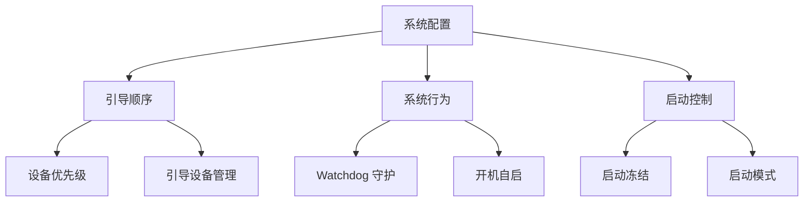
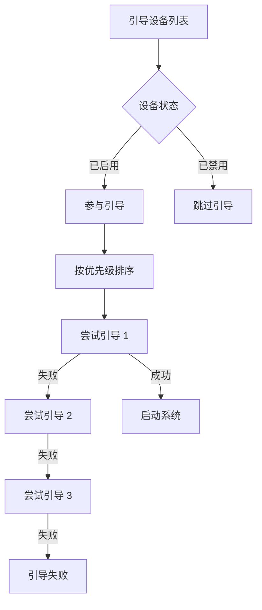
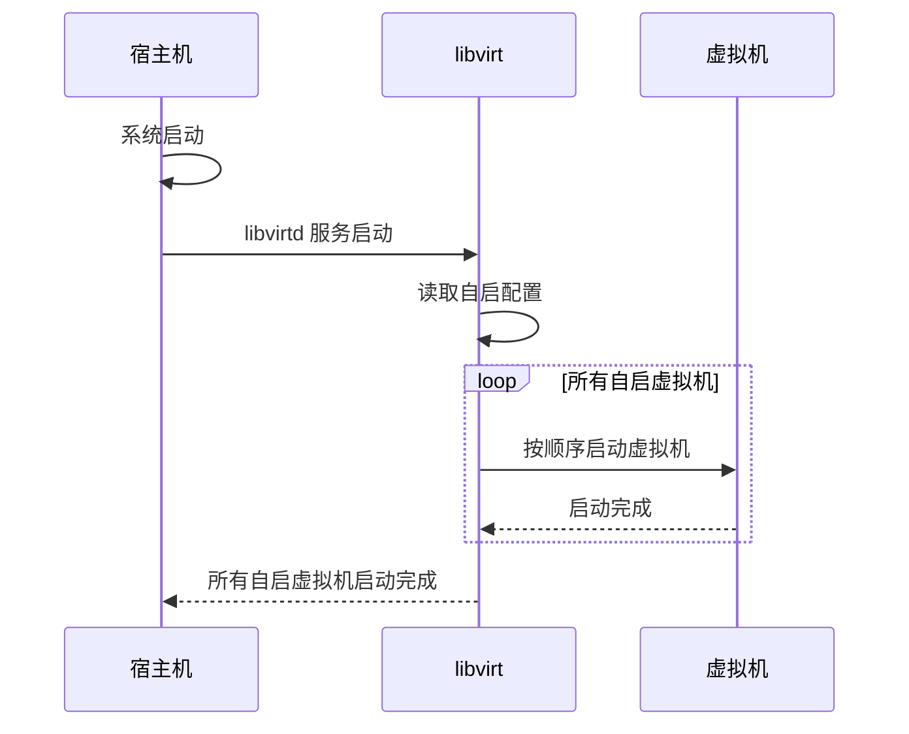
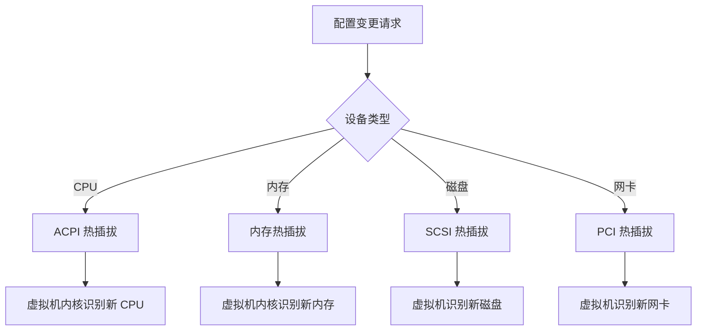
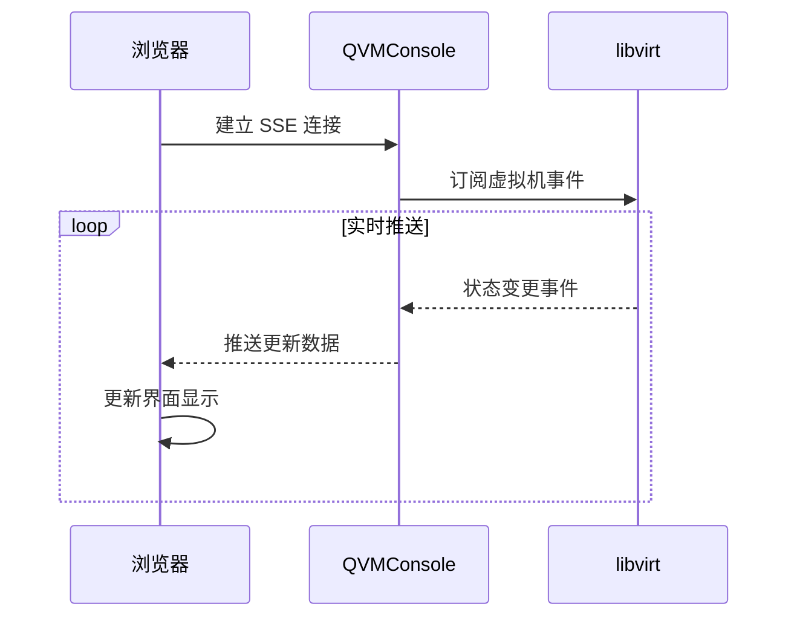

# 系统配置

系统配置决定了虚拟机的启动行为和运行时特性，包括引导设备顺序、开机自启策略和系统守护机制。合理的系统配置能够确保虚拟机按照预期方式启动和运行，提高服务的可靠性和可用性。

## 配置概览

## 引导顺序

引导顺序定义了虚拟机启动时尝试从各个设备加载操作系统的优先级。合理的引导顺序能够确保系统按照预期方式启动。

### 引导设备类型

| 设备类型 | 图标 | 说明 | 典型用途 |
|---------|------|------|---------|
| **硬盘** | HardDrive | 虚拟磁盘设备 | 操作系统安装后的主要引导设备 |
| **光驱** | Disc | CD/DVD 光驱设备 | 从 ISO 镜像引导安装系统 |
| **网络** | Network | PXE 网络引导 | 无盘启动、网络安装 |
| **USB** | USB | USB 设备 | 从 USB 启动盘引导 |

### 引导顺序管理

### 配置操作

QVMConsole 提供了直观的引导顺序管理界面：

| 操作 | 说明 | 限制 |
|------|------|------|
| **上移** | 提高设备引导优先级 | 不能移过第一个位置 |
| **下移** | 降低设备引导优先级 | 不能移过最后一个位置 |
| **启用/禁用** | 控制设备是否参与引导 | 至少保留一个启用设备 |
| **添加** | 添加新的引导设备 | 需要有可用设备 |
| **移除** | 从引导列表移除设备 | 至少保留一个设备 |

### 引导顺序建议

| 场景 | 推荐顺序 | 说明 |
|------|---------|------|
| **日常运行** | 硬盘 → 网络 | 优先从本地系统启动 |
| **系统安装** | 光驱 → 硬盘 | 优先从 ISO 安装 |
| **网络部署** | 网络 → 硬盘 | 优先 PXE 启动 |
| **故障恢复** | 光驱 → USB → 硬盘 | 优先从恢复介质启动 |

:::tip[运行时修改]
在虚拟机运行状态下修改引导顺序，需要关机后重启才能生效。系统会在界面上显示相应的提示信息。
:::

## 开机自启

开机自启功能使虚拟机在宿主机启动时自动启动，确保关键服务的连续性和可用性。

### 工作原理

### 配置说明

| 选项 | 说明 | 适用场景 |
|------|------|---------|
| **启用** | 宿主机启动时自动启动该虚拟机 | 生产环境、关键服务 |
| **关闭** | 需要手动启动虚拟机 | 测试环境、临时虚拟机 |

### 启动顺序控制

当多个虚拟机启用开机自启时，可以通过引导顺序来控制启动的先后顺序：

**最佳实践**：

- **依赖关系**：确保被依赖的服务先启动（如数据库先于应用服务）
- **资源考虑**：避免所有虚拟机同时启动造成资源争抢
- **关键服务**：为关键业务虚拟机启用开机自启
- **测试环境**：测试环境建议关闭自启，节省资源

### 使用场景

| 场景 | 是否启用 | 原因 |
|------|---------|------|
| 生产数据库 | 启用 | 业务核心依赖 |
| Web 应用服务 | 启用 | 对外服务入口 |
| 开发测试环境 | 关闭 | 按需使用，节省资源 |
| 临时任务虚拟机 | 关闭 | 任务完成即销毁 |
| 备份服务器 | 启用 | 定时任务需要运行 |

## 运行时修改

在虚拟机运行过程中，某些配置支持热修改，无需关机即可生效。

### 热修改支持

| 配置项 | 运行时可修改 | 说明 |
|--------|-------------|------|
| **CPU 核心数** | 支持热插拔 | 可在线增加 vCPU |
| **内存大小** | 支持热插拔 | 可在线调整内存（需驱动支持） |
| **磁盘驱动类型** | 不支持 | 需要关机修改 |
| **网卡类型** | 不支持 | 需要关机修改 |
| **引导顺序** | 不支持 | 需要关机重启生效 |
| **引导方式** | 不支持 | 需要关机修改 |

### 热插拔原理

:::warning[注意事项]
- 热插拔需要虚拟机操作系统和驱动的支持
- 某些配置的热修改可能需要重启才能完全生效
- 运行中修改会在界面上显示相应的警告提示
:::

## 系统行为监控

QVMConsole 提供了完善的系统行为监控功能，帮助用户了解虚拟机的运行状态。

### 监控指标

| 指标 | 说明 | 采集方式 |
|------|------|---------|
| **CPU 使用率** | 虚拟机 CPU 使用百分比 | libvirt 统计 |
| **内存使用率** | 虚拟机内存使用百分比 | libvirt 统计 |
| **磁盘 I/O** | 磁盘读写速率 | libvirt 块设备统计 |
| **网络流量** | 网络收发速率 | libvirt 网络统计 |
| **运行时间** | 虚拟机连续运行时长 | 内部计时器 |

### 实时推送

QVMConsole 使用 SSE（Server-Sent Events）技术实现实时状态推送：

**SSE 优势**：

- **实时性**：状态变更立即推送，无需轮询
- **低延迟**：毫秒级的更新延迟
- **低开销**：相比轮询方式，减少不必要的网络请求
- **自动重连**：连接断开后自动尝试重连
