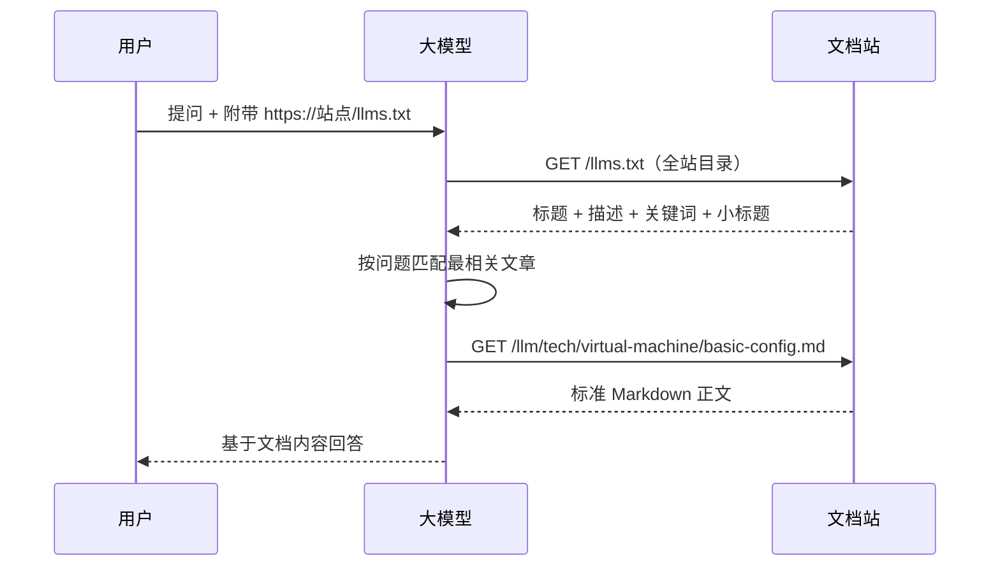
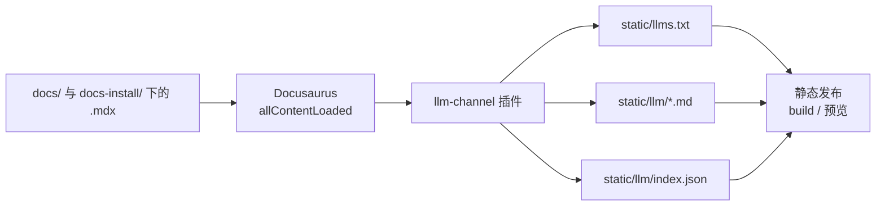

# 大模型阅读通道

QVMConsole 文档站内置了一条**专供大模型阅读的通道**：站点会为每一篇文档自动生成一个返回**标准 Markdown** 的 URL，并提供一个全站目录地址。使用时，只需在向大模型提问时**统一附加一个目录地址**，大模型就会先读取目录，再根据问题内容精确请求对应的文章并给出答案。

导航栏的「大模型阅读」按钮会弹出使用介绍弹窗，可一键复制访问地址与提问模板。

## 使用方法

### 第一步：获取访问地址

在任意页面点击导航栏右侧的\*\*「大模型阅读」**按钮，在弹窗中点击**复制地址\*\*（或直接复制下方地址）。

访问地址（生产环境）：

```text
https://qvmcdocs.xiaozhuhouses.asia/llms.txt
```

本地开发预览时为：

```text
http://localhost:3000/llms.txt
```

### 第二步：提问时附加该地址

把地址附在提问中即可，例如：

> 请先访问 [https://qvmcdocs.xiaozhuhouses.asia/llms.txt](https://qvmcdocs.xiaozhuhouses.asia/llms.txt) 获取文档目录，然后根据我的问题「如何配置端口转发？」选择最相关的文章阅读，再基于文档内容回答。

弹窗中还提供了可直接复制的**提问模板**，替换为你的问题即可。

### 第三步：大模型按问题精确检索



## 地址规范

| 类型   | 地址格式                  | 说明                                                             |
| ---- | --------------------- | -------------------------------------------------------------- |
| 全站目录 | `/llms.txt`           | 用户统一附加的地址；列出全部文章及标题、描述、关键词、小标题                                 |
| 机器索引 | `/llm/index.json`     | 与目录等价的 JSON 结构，便于程序化使用                                         |
| 文章正文 | `/llm/<实例>/<文档id>.md` | 单篇文章的纯净 Markdown，如 `/llm/tech/virtual-machine/basic-config.md` |

两个文档实例的路径前缀：

* `install` 实例 → `/llm/install/...`（对应 `docs-install/` 目录）
* `tech` 实例 → `/llm/tech/...`（对应 `docs/` 目录）

**Markdown 规范**：文章剥离了 frontmatter 与 MDX 语法（如 `import`、`<Tabs>` 已按标签展平），保留标题、表格、代码块、mermaid 图，`:::提示` 块转为引用块，是标准且纯净的 Markdown，便于大模型直接阅读。

## 自动生成与同步

你**不需要任何额外操作**：继续按原有方式在 `docs/` 与 `docs-install/` 下编写 `.mdx` 即可。

* **每次编译自动生成**：`pnpm build`（或 `build.ps1`）编译时，插件会在静态文件拷贝前自动生成 `llms.txt` 与 `llm/*.md` 并随产物发布。
* **开发预览实时同步**：`pnpm start` 开发模式下，保存文档后目录与文章会立即重新生成，无需重启。
* **自动清理**：删除或重命名文档后，旧的 `.md` 文件会被自动清理。
* **草稿排除**：标记 `draft` 的文档不会被收录；`unlisted` 文档仍会收录（内容依然有效）。

实现原理：



### 涉及文件

| 文件                                       | 作用                               |
| ---------------------------------------- | -------------------------------- |
| `plugins/llm-channel/index.js`           | 插件入口，在 `allContentLoaded` 阶段触发生成 |
| `plugins/llm-channel/mdx-to-md.js`       | MDX → 标准 Markdown 转换器            |
| `plugins/llm-channel/generate.js`        | 目录/文章/索引生成与幂等写入、孤儿清理             |
| `src/theme/NavbarItem/LLMDocsButton.tsx` | 导航栏按钮与使用介绍弹窗（含一键复制）              |
| `docusaurus.config.ts`                   | 插件注册与导航栏按钮配置                     |

### 插件配置项

在 `docusaurus.config.ts` 中可配置：

* `instanceLabels`：目录分组的章节名（默认 `install`→安装与使用、`tech`→功能与原理）。
* `includeHeadings` / `maxHeadingsPerDoc`：是否收录文章小标题及其数量上限（用于精确检索）。
* `articleFooter`：是否在文章末尾追加原文路径说明。
* `siteUrl` 或环境变量 `LLM_DOCS_SITE_URL`：目录内链接输出的地址前缀。默认取生产域名 `https://qvmcdocs.xiaozhuhouses.asia`；本地预览可用环境变量覆盖为 `http://localhost:端口`。

## 常见问题

> **需要把站点部署到公网才能给大模型用吗？** 支持联网检索的大模型（如 DeepSeek、ChatGPT、Claude 等的联网模式）需要能访问站点地址。公网部署后可直接使用；本地 `localhost` 地址仅用于开发预览验证。

> **改文档后地址会变吗？** 会实时同步。开发模式保存即更新；每次构建发布时重新生成。文章地址以文档 id 为准，仅重命名文件才会导致地址变化。

> **为什么文章返回的是 .md 而不是 .mdx？** 为了让大模型读到纯净、标准的 Markdown。MDX 专有语法（组件标签、import 语句等）已自动转换或剥离，正文内容保持不变。

> **开发预览时删除文章后地址还能访问？** 磁盘上的生成文件会立即清理；受 Docusaurus 开发服务器内存缓存机制影响，本地预览可能继续返回旧内容直到重启，这是开发服务器本身的固有行为。正式构建（`pnpm build` / `build.ps1`）产物不会包含已删除的文章。

> **大模型会读到未完成的内容吗？** 不会。标记为 `draft` 的文档自动排除；正式发布前请勿移除 `draft` 标记。

---

> 原文路径：/docs/install/site-guide/llm-access（本文由 QVMConsole 文档站自动生成，供大模型阅读）
