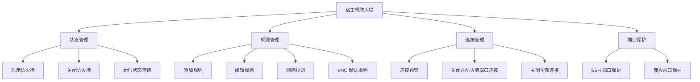
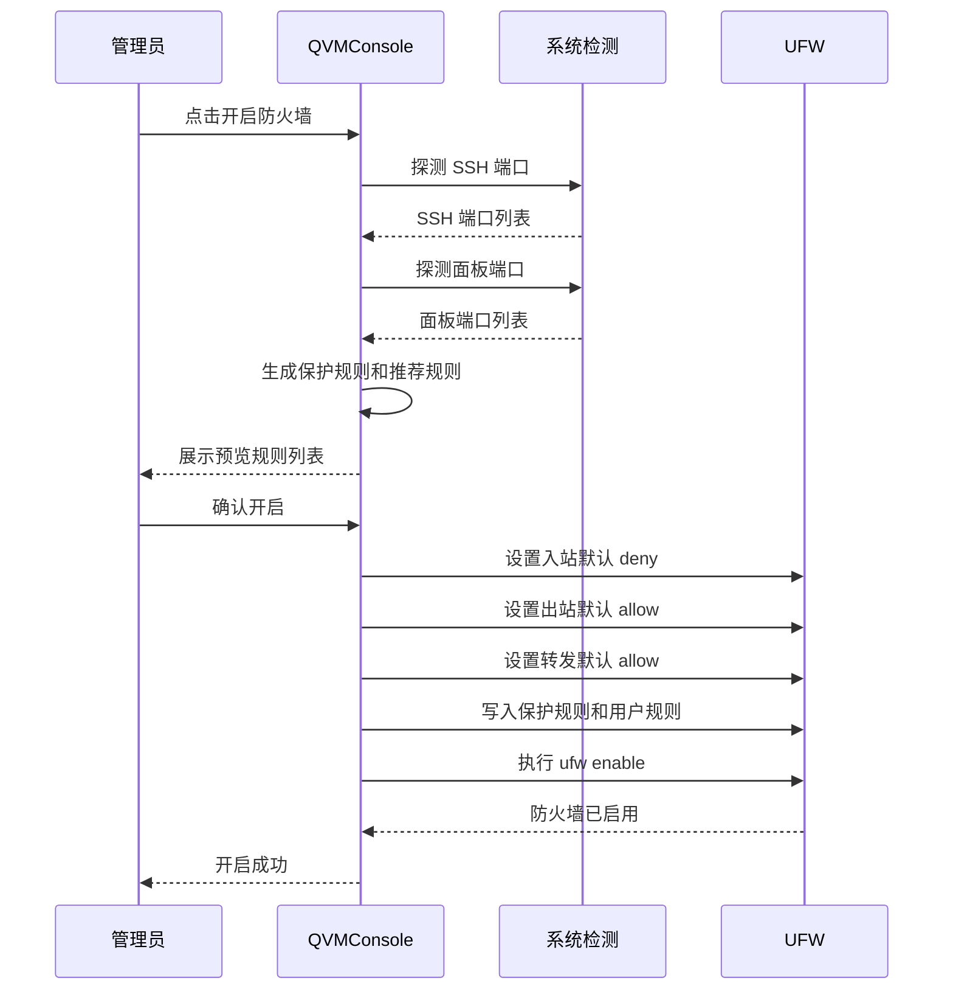
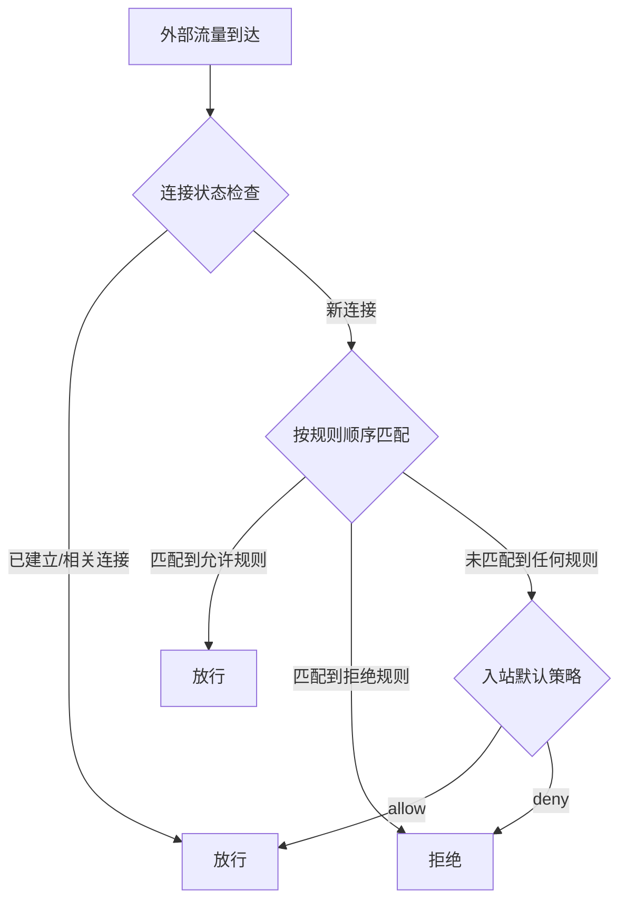

# 宿主机防火墙

宿主机防火墙基于 Linux 标准的 UFW（Uncomplicated Firewall）工具实现，专注于管控宿主机层面的入站端口访问策略。它与 KVM 网络防火墙完全分离——宿主机防火墙控制宿主机自身端口的对外暴露，KVM 网络防火墙则管控虚拟机的转发流量，二者各司其职、互不干扰。

## 功能架构

## 运行状态信息

宿主机防火墙面板提供了丰富的运行状态信息，帮助管理员全面了解当前防火墙的配置情况。

### 状态概览

| 状态项            | 说明                                   |
| -------------- | ------------------------------------ |
| **防火墙状态**      | 已启用 / 已关闭，反映 UFW 当前运行状态              |
| **UFW 可用性**    | 系统是否已安装 UFW 工具                       |
| **入站默认策略**     | 默认为 `deny`（拒绝所有入站），也可配置为 `allow`     |
| **出站默认策略**     | 默认为 `allow`（允许所有出站）                  |
| **转发默认策略**     | 默认为 `allow`（允许所有转发），确保 Docker 网络不受影响 |
| **SSH 端口**     | 自动探测并保护的 SSH 监听端口                    |
| **面板端口**       | 自动探测并保护的面板服务端口                       |
| **Docker 兼容性** | 防火墙不写入 Docker 链，Docker bridge 模式不受约束 |

### 防火墙关闭时的行为

> **持久化放通规则** 即使防火墙处于关闭状态，端口转发新增时仍会自动写入 UFW 持久放通规则。这样在下次开启防火墙时，已有端口转发不会被意外拦截。

## 开启防火墙

开启宿主机防火墙是一个高风险操作，QVMConsole 设计了严谨的防护流程来避免误操作导致整机断连。

### 开启流程

### 保护机制

开启防火墙前，系统会自动探测并加入以下受保护端口：

| 保护类型       | 探测方式                                           | 保护策略        |
| ---------- | ---------------------------------------------- | ----------- |
| **SSH 端口** | 优先通过 `sshd -T` 获取，失败时从 `ss -tlnp` 识别，最终兜底端口 22 | 开启后不允许删除和编辑 |
| **面板端口**   | 读取当前配置的面板监听端口，并结合运行端口校验                        | 开启后不允许删除和编辑 |

> **保护规则的目的** SSH 和面板端口的保护规则是为了防止管理员误删关键端口规则而导致失去对服务器的远程访问能力。受保护规则会在界面上有明确标识，编辑和删除按钮将被禁用。

## 宿主机规则管理

### 规则列表

规则列表以表格形式展示当前所有 UFW 规则，提供直观的端口访问策略总览。

| 字段          | 说明                                 |
| ----------- | ---------------------------------- |
| **动作**      | `allow`（允许）或 `deny`（拒绝）            |
| **协议**      | `tcp`、`udp` 或 `both`（添加时自动拆分为两条规则） |
| **端口**      | 单端口（如 `22`）或端口范围（如 `5900-5999`）    |
| **来源 CIDR** | 留空表示任意来源，填写后仅匹配指定 IP 地址段           |
| **备注**      | 规则说明，面板自动规则以 `kvm-console:` 前缀标识   |
| **状态**      | 受保护 / 面板管理 / 用户自定义                 |

### 添加规则

管理员可以手动创建自定义的入站端口规则：

| 配置项         | 说明                  | 约束                      |
| ----------- | ------------------- | ----------------------- |
| **动作**      | allow 或 deny        | 必填                      |
| **协议**      | TCP / UDP / TCP+UDP | TCP+UDP 会自动拆分为两条独立规则    |
| **起始端口**    | 端口范围起始              | 1-65535                 |
| **结束端口**    | 端口范围结束              | 不小于起始端口，最大 65535        |
| **来源 CIDR** | 限定来源 IP 地址段         | 留空为任意来源，支持 IPv4 CIDR 格式 |
| **备注**      | 规则备注信息              | 可选                      |

### 编辑与删除规则

* **可编辑/删除**：用户手动创建的规则和非受保护的面板管理规则
* **不可编辑/删除**：SSH 端口保护规则、面板端口保护规则

> **安全编辑策略** 编辑规则时，系统采用"先增后删"的安全策略：先创建新规则，成功后再删除旧规则。如果新规则创建失败，旧规则将被保留，确保不会出现规则空窗期。

### 添加 VNC 默认规则

QVMConsole 提供了一键添加 VNC 默认规则的便捷功能，自动创建 `5900-5999` 端口范围的 TCP 允许规则，适用于需要开放 VNC 远程桌面访问的场景。此规则不属于保护规则，后续允许编辑或删除。

## 规则筛选

为了便于在大量规则中快速定位目标，系统提供了多维度的筛选功能：

| 筛选维度      | 说明                 |
| --------- | ------------------ |
| **按端口搜索** | 输入端口号，精确匹配包含该端口的规则 |
| **按协议筛选** | TCP / UDP 筛选       |
| **按动作筛选** | 允许 / 拒绝 筛选         |
| **按备注搜索** | 关键词模糊匹配备注内容        |

## 规则状态说明

系统中存在三种不同来源和用途的规则：

| 规则类型        | 标识前缀                                                        | 来源            | 操作限制      |
| ----------- | ----------------------------------------------------------- | ------------- | --------- |
| **受保护规则**   | `kvm-console:protected:ssh` / `kvm-console:protected:panel` | 系统自动创建        | 不可编辑、不可删除 |
| **面板管理规则**  | `kvm-console:port-forward` / `kvm-console:vnc-default`      | 端口转发联动、VNC 默认 | 可编辑、可删除   |
| **用户自定义规则** | 无特定前缀                                                       | 管理员手动创建       | 可编辑、可删除   |

## 规则匹配流程

当外部流量到达宿主机时，UFW 按照以下流程进行规则匹配：

## 端口转发联动

端口转发使用 `iptables` 写入 DNAT 和 FORWARD 规则。无论宿主机防火墙是否启用，新增端口转发都会自动在 UFW 中补一条放通规则，确保下次开启防火墙时已有端口转发不会被拦截。

删除端口转发时，仅清理面板自动创建的 `kvm-console:port-forward` 前缀规则，不会误删 SSH、面板、VNC 或用户手动创建的规则。

## Docker 兼容性

宿主机防火墙在设计上充分考虑了与 Docker 的兼容性：

* **不写入 Docker 链**：防火墙规则不会修改 `DOCKER-USER` 链
* **保持转发允许**：启用时 UFW 的 `routed` 默认策略保持为 `allow`
* **Docker bridge 不受约束**：Docker 容器的 bridge 网络模式不受宿主机防火墙影响

> **设计说明** 这种设计避免了宿主机防火墙与 Docker 自身网络策略产生冲突。Docker 容器的网络访问策略由 Docker 自行管理，宿主机防火墙仅管控宿主机自身的入站端口。

## 实现原理

宿主机防火墙的规则持久化存储在 UFW 的标准配置目录 `/etc/ufw/` 中。QVMConsole 通过调用 UFW 命令行工具完成规则的增删改查操作，所有规则变更立即生效，无需额外的应用步骤。

| 文件路径                   | 说明             |
| ---------------------- | -------------- |
| `/etc/ufw/user.rules`  | 用户自定义的 IPv4 规则 |
| `/etc/ufw/user6.rules` | 用户自定义的 IPv6 规则 |
| `/etc/ufw/ufw.conf`    | UFW 全局配置       |

---

> 原文路径：/docs/tech/firewall/host-firewall（本文由 QVMConsole 文档站自动生成，供大模型阅读）
