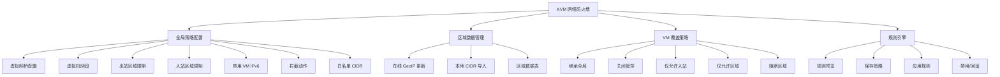
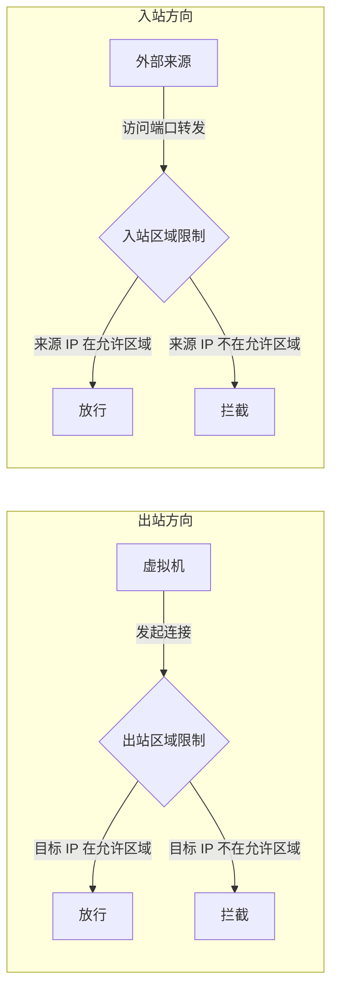
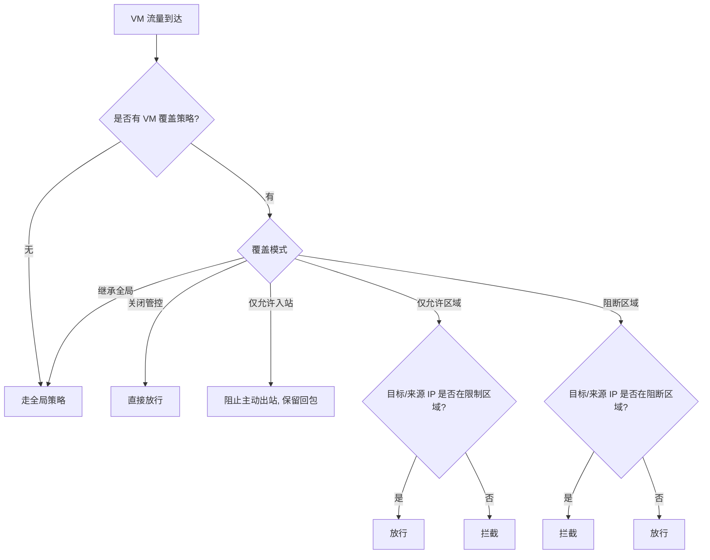
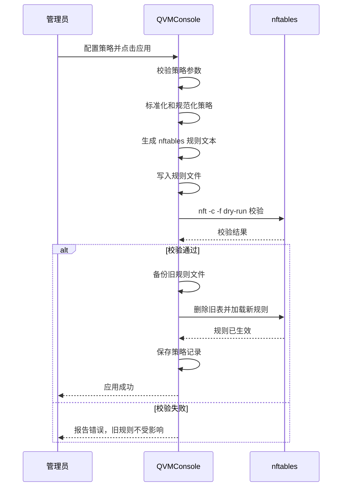

# KVM 网络防火墙

KVM 网络防火墙是 QVMConsole 的全局网络策略引擎，专注于管控 KVM 虚拟机的 IPv4 转发流量。它基于独立的 nftables 表 `kvm_console_fw` 实现，与宿主机防火墙和 Docker 网络完全隔离——不影响宿主机自身访问，也不控制 Docker 容器网络。

> **作用域** 防火墙规则挂在 nftables 的 `forward` 钩子（优先级 -50），作用接口为**主 OVS 网桥与所有 VPC 交换机网关端口**；仅过滤经过这些接口转发的虚拟机流量。防火墙对端口转发流量的入站区域限制，可通过端口转发规则的豁免开关单独放行（见 [端口转发](/docs/tech/network/port-forward)）。

## 整体架构



## 全局策略配置

全局策略定义了 KVM 防火墙的基础行为，作用于所有未设置覆盖策略的虚拟机。

### 核心配置项

| 配置项            | 说明                                  | 默认值      |
| -------------- | ----------------------------------- | -------- |
| **虚拟网桥**       | 绑定的 OVS 网桥名称，防火墙规则基于此网桥接口过滤流量       | `br-ovs` |
| **虚拟机网段**      | 虚拟机所在的子网，如 `192.168.122.0/24`       | 根据配置自动生成 |
| **出站区域限制**     | 启用后，VM 仅可访问指定区域的目标 IP               | 关闭       |
| **入站区域限制**     | 启用后，仅允许指定区域的来源 IP 访问 VM 端口转发        | 关闭       |
| **禁用 VM IPv6** | 启用后，拒绝 VM 的 IPv6 转发流量，宿主机 IPv6 不受影响 | 启用       |
| **拦截动作**       | `reject`（拒绝并回复 ICMP）或 `drop`（静默丢弃）  | `reject` |
| **白名单 CIDR**   | 不受区域限制的 IP 地址段，每行一个，命中后直接放行         | 空        |

> **白名单优先级** 白名单 CIDR 的匹配优先级最高。即使启用了出站或入站区域限制，白名单中的 IP 地址段也会被直接放行，不受任何区域策略约束。建议将内网网段、CDN 节点等可信来源加入白名单。

### 出站与入站区域限制



## 区域数据管理

KVM 网络防火墙的区域限制功能依赖于 GeoIP 区域数据。系统内置了基于 IPdeny.com 的 IP 地址块数据源，同时支持本地手动导入。

### GeoIP 区域数据

| 数据项        | 说明                                                                       |
| ---------- | ------------------------------------------------------------------------ |
| **数据来源**   | IPdeny 聚合 CIDR zone 文件（默认），或自定义下载源                                       |
| **下载地址格式** | `https://www.ipdeny.com/ipblocks/data/aggregated/{code}-aggregated.zone` |
| **数据内容**   | 每个国家或地区的 IPv4 CIDR 地址块集合                                                 |
| **版权说明**   | 使用 IPdeny 数据时请遵守其版权和使用限制                                                 |

### 下载源配置

管理员可以自定义 GeoIP 数据的下载地址，适用于生产环境无法访问外网、需要使用内部镜像源的场景。

### 在线更新

在线更新从远程源批量下载指定区域的 CIDR 数据：

| 参数         | 说明                             |
| ---------- | ------------------------------ |
| **区域代码列表** | 需要更新的国家或地区代码（如 `cn`、`us`、`jp`） |
| **下载地址**   | 可选，留空则使用默认或已配置的下载源             |

> **更新机制** 在线更新通过任务队列异步执行。下载失败时会保留旧数据，不会应用半成品规则，确保已生效的区域数据不被破坏。

### 本地导入

对于无法访问外网或需要自定义区域的场景，支持手动导入区域 CIDR 数据：

| 参数          | 说明                            | 约束                      |
| ----------- | ----------------------------- | ----------------------- |
| **区域代码**    | 唯一标识，如 `cn`、`custom-internal` | 必填，字母数字和下划线             |
| **区域名称**    | 人类可读的区域名称                     | 可选，默认使用代码大写             |
| **来源说明**    | 数据来源描述                        | 可选，默认标记为 `local-import` |
| **CIDR 列表** | 每行一个 IPv4 CIDR 地址块            | 必填，至少一个有效 CIDR          |

### 区域数据表

区域数据以表格形式管理，展示所有已导入的区域信息：

| 列           | 说明                |
| ----------- | ----------------- |
| **代码**      | 区域唯一标识            |
| **名称**      | 区域显示名称            |
| **CIDR 数量** | 该区域包含的 IPv4 地址块数量 |
| **更新时间**    | 最近一次数据更新的时间       |

## VM 覆盖策略

VM 覆盖策略允许为每台虚拟机单独配置网络访问策略，精细控制单台 VM 的出入站行为，而不影响其他虚拟机。

### 管控模式

| 模式        | 说明                          | 适用场景           |
| --------- | --------------------------- | -------------- |
| **继承全局**  | 使用全局入站/出站策略                 | 默认模式，适合大多数 VM  |
| **关闭管控**  | 对该 VM 完全放行，不执行任何区域限制        | 信任的管理 VM、网关 VM |
| **仅允许入站** | 阻止该 VM 主动发起出站连接，仅保留外部连入后的回包 | 只需接收外部请求的服务    |
| **仅允许区域** | 该 VM 仅允许指定区域访问或被访问          | 业务限定在特定区域的 VM  |
| **阻断区域**  | 该 VM 阻断指定区域，其他区域放行          | 需要屏蔽特定恶意区域的 VM |

> **仅允许入站的副作用** "仅允许入站"模式会阻断 VM 主动访问外部网络，也会影响 VM 内部的主动 DNS 查询、软件源访问、时间同步（NTP）等请求。如果业务依赖这些能力，请改用区域限制或白名单策略。

### VM 覆盖的匹配逻辑



### 限制区域配置

在"仅允许区域"和"阻断区域"模式下，管理员需要为每台 VM 指定关联的区域列表。区域数据来源于已导入的 GeoIP 区域数据，通过区域代码关联。

> **VM IP 解析** VM 覆盖策略依赖系统能正确解析到虚拟机的 IPv4 地址。建议对需要精细管控的虚拟机绑定静态 IP，避免 DHCP 地址变动导致策略失效。

## 操作按钮

KVM 网络防火墙提供了一系列操作按钮，构成完整的策略生命周期管理：

| 操作       | 说明                           | 风险等级      |
| -------- | ---------------------------- | --------- |
| **预览规则** | 将当前策略转换为 nftables 规则文本，不写入系统 | 无风险       |
| **保存策略** | 将配置保存到策略文件，不影响当前网络           | 无风险       |
| **应用规则** | 生成规则、写入系统并生效                 | 高风险，需二次验证 |
| **禁用**   | 删除独立 nftables 表，恢复到未管控状态     | 高风险，需二次验证 |
| **回滚**   | 删除独立 nftables 表，等同于禁用操作      | 高风险，需二次验证 |

> **规则生效流程** 管理员保存策略后不会立即影响网络，必须点击"应用规则"后才会将规则写入 nftables 并生效。预览功能可以在应用前检查生成的规则是否符合预期。

## 规则状态

系统通过检测 nftables 中是否存在 `kvm_console_fw` 表来判断防火墙是否已生效：

| 状态        | 含义                                       |
| --------- | ---------------------------------------- |
| **规则已生效** | nftables 中存在 `kvm_console_fw` 表，当前策略正在执行 |
| **规则未应用** | 策略已保存但未写入系统，或防火墙已被禁用/回滚                  |

## 实现原理

KVM 网络防火墙的规则生成与应用遵循严格的工程化流程：

### 规则生成流程



### 文件存储

| 文件路径                                    | 说明                    |
| --------------------------------------- | --------------------- |
| `/etc/kvm-console/firewall/policy.json` | 防火墙策略配置（JSON 格式）      |
| `/etc/kvm-console/firewall/rules.nft`   | 后端生成的 nftables 规则文件   |
| `/etc/kvm-console/firewall/backups/`    | 策略和规则备份目录，默认保留最近 10 份 |

### nftables 表结构

防火墙使用独立的 `inet kvm_console_fw` 表，包含以下组件：

| 组件                   | 类型    | 说明                                    |
| -------------------- | ----- | ------------------------------------- |
| `vm_subnets4`        | set   | 所有受管控的虚拟机子网 CIDR                      |
| `whitelist4`         | set   | 白名单 CIDR，包含内网保留地址和用户自定义白名单            |
| `out_allowed4`       | set   | 出站允许的区域 CIDR 集合                       |
| `in_allowed4`        | set   | 入站允许的区域 CIDR 集合                       |
| `vm_{name}_regions4` | set   | 单台 VM 的覆盖区域 CIDR 集合（仅 allow/block 模式） |
| `forward`            | chain | 转发流量过滤链，优先级 -50                       |

> **安全隔离** 系统不会修改 libvirt、Docker、UFW 自动生成的链。禁用或回滚时仅删除 `kvm_console_fw` 独立表，确保不会影响其他网络组件。

### 白名单默认地址段

系统自动将以下内网保留地址段加入白名单，确保内部通信不受区域限制：

| 地址段              | 说明       |
| ---------------- | -------- |
| `10.0.0.0/8`     | A 类私有地址  |
| `172.16.0.0/12`  | B 类私有地址  |
| `192.168.0.0/16` | C 类私有地址  |
| `100.64.0.0/10`  | CGNAT 地址 |
| `127.0.0.0/8`    | 环回地址     |
| `169.254.0.0/16` | 链路本地地址   |
| `224.0.0.0/4`    | 组播地址     |

## 手工回滚

如果应用防火墙规则后出现网络异常，管理员可以通过以下方式快速恢复：

```bash
nft delete table inet kvm_console_fw
```

> **紧急恢复** 在紧急情况下，可直接在宿主机终端执行上述命令删除防火墙表，立即恢复网络到未管控状态。此操作不会影响策略配置文件，后续仍可重新应用。

---

> 原文路径：/docs/tech/firewall/kvm-firewall（本文由 QVMConsole 文档站自动生成，供大模型阅读）
