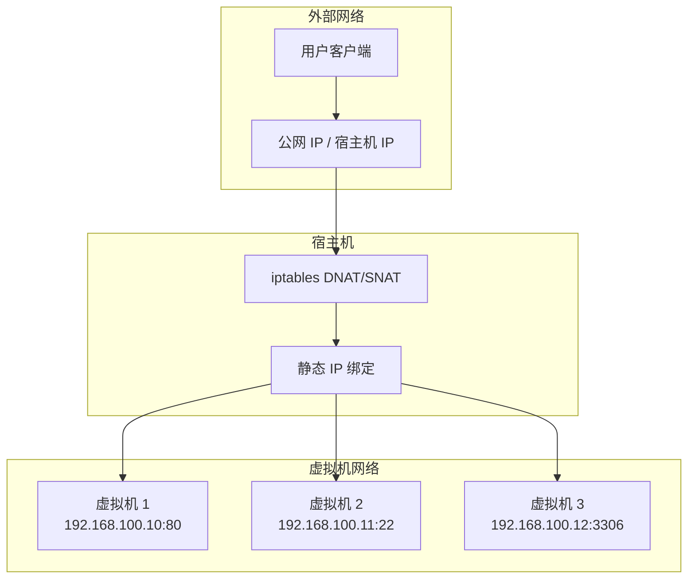
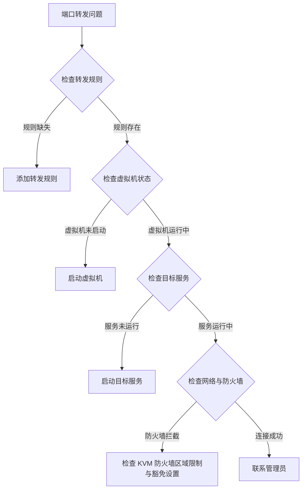

# 端口转发

端口转发是 QVMConsole 网络管理的重要功能，用于将宿主机的公网端口流量转发到虚拟机的内网端口。通过端口转发，用户可以从外部网络访问虚拟机上运行的服务，如 Web 服务器、数据库、SSH 等。

## 端口转发架构



## 使用前提

| 条件           | 说明                                                               |
| ------------ | ---------------------------------------------------------------- |
| **端口转发功能开关** | 用户需开启端口转发功能（`enable_port_forward`，管理员在用户管理中配置）                   |
| **规则数量配额**   | 普通用户受 `max_port_forward` 配额限制（默认 10，0=不限）；`tcp+udp` 双协议规则按 2 条计数 |
| **轻量云配额**    | 轻量云用户按单 VM 维度单独校验端口转发配额                                          |
| **静态 IP**    | 端口转发依赖稳定的虚拟机 IP，建议（非 VPC 绑定时必需）绑定静态 IP                           |

## 端口转发列表

端口转发列表展示所有已配置的转发规则（入口：虚拟机详情页「网络管理 → 端口转发」面板）：

| 字段           | 说明                                                                      |
| ------------ | ----------------------------------------------------------------------- |
| **协议**       | `tcp` / `udp` / `both`                                                  |
| **宿主机端口**    | 宿主机上监听的端口号（留空自动分配，范围 `auto_port_start`\~`auto_port_end`，默认 10000-20000） |
| **目标 IP**    | 虚拟机的内网 IP 地址                                                            |
| **目标端口**     | 虚拟机上服务监听的端口                                                             |
| **宿主机端口防火墙** | 该规则是否豁免 KVM 防火墙入站区域限制                                                   |
| **完整访问地址**   | 系统生成的访问地址（支持一键复制，HTTP 环境自动降级复制方案）                                       |

## 端口转发操作

### 添加转发规则

| 配置项       | 说明                                           | 必填 |
| --------- | -------------------------------------------- | -- |
| **虚拟机**   | 目标虚拟机                                        | 是  |
| **虚拟机端口** | 虚拟机服务端口                                      | 是  |
| **协议**    | tcp / udp / both                             | 是  |
| **宿主机端口** | 留空则自动分配                                      | 否  |
| **目标 IP** | 留空自动解析（VPC 绑定取绑定信息；非绑定 VM 可手动输入并记录为手动 IP 映射） | 否  |

添加规则时的校验顺序：功能开关 → 配额（含轻量云配额）→ 宿主机端口可用性 → 目标 IP 解析；成功后自动为该端口在安全组中补放行规则（若失败会提示）。

### 编辑与删除

| 操作       | 说明                         |
| -------- | -------------------------- |
| **编辑**   | 修改端口/协议/目标等字段（同样执行端口可用性校验） |
| **单条删除** | 删除单条转发规则                   |
| **批量删除** | 选中多条规则批量删除                 |

> **删除确认** 删除端口转发规则后，外部网络将无法通过原端口访问虚拟机服务。请确认后再执行删除操作。

## 完整访问地址

系统自动生成完整的访问地址，方便用户快速访问虚拟机服务。

### 地址格式

```
协议://公网IP:宿主机端口
```

### 地址示例

| 协议       | 公网 IP     | 宿主机端口  | 完整地址                 |
| -------- | --------- | ------ | -------------------- |
| **tcp**  | `1.2.3.4` | `8080` | `tcp://1.2.3.4:8080` |
| **udp**  | `1.2.3.4` | `5353` | `udp://1.2.3.4:5353` |
| **both** | `1.2.3.4` | `8080` | `tcp://1.2.3.4:8080` |

公网 IP 优先使用绑定的公网 IP，未绑定时使用系统设置的面板公网 IP（`host_ip`）。

## 防火墙联动

KVM 网络防火墙的**入站区域限制**默认作用于端口转发流量。每条端口转发规则可单独切换：

| 设置             | 说明                      |
| -------------- | ----------------------- |
| **继承全局限制（默认）** | 端口转发受 KVM 防火墙入站区域限制     |
| **豁免限制**       | 该端口转发不受入站区域限制（写入策略豁免列表） |

切换通过 `PUT /firewall/port-forward`（按规则稳定键 `协议|宿主机端口|目标IP|目标端口` 设置豁免）实现，仅保存策略，应用防火墙规则后生效。

> **安全警告** 建议保持"继承全局限制"，仅在业务必须跨区访问时豁免，避免绕过区域管控。

## 开通引导与静态 IP

首次使用端口转发功能时，面板会展示开通引导：阅读说明 → 绑定静态 IP → 配置转发规则。静态 IP 绑定是端口转发的必要条件，确保虚拟机的 IP 地址不会因 DHCP 变化而改变。

| 绑定方式     | 说明                       | 适用场景  |
| -------- | ------------------------ | ----- |
| **自动绑定** | 开通引导中自动绑定静态 IP           | 首次开通  |
| **手动绑定** | 在「网络管理 → 静态 IP」面板手动绑定/解绑 | 已有虚拟机 |

> **静态 IP 重要性** 端口转发依赖于固定的 IP 地址。如果虚拟机的 IP 地址发生变化，端口转发规则将失效。静态 IP 绑定确保 IP 地址稳定，避免转发规则失效。

### 手动 IP 映射

对于未绑定 VPC 的虚拟机，添加端口转发时手动输入的目标 IP 会记录为手动 IP 映射（`/network/port-forward/ip-mapping`），供后续规则解析复用，支持管理员增删。

## 实现原理

端口转发基于 iptables DNAT 规则实现，通过网络地址转换将外部流量转发到虚拟机。

### 规则生成示例

```bash
# 入站 DNAT 规则
iptables -t nat -A PREROUTING -p tcp --dport 8080 -j DNAT --to-destination 192.168.100.10:80

# 出站 SNAT 规则
iptables -t nat -A POSTROUTING -p tcp -d 192.168.100.10 --dport 80 -j SNAT --to-source 1.2.3.4
```

### 持久化

端口转发规则持久化存储在 `port_forward_dir`（默认 `/etc/kvm-portforward`），面板启动时自动恢复（`RestorePortForwardRules`）。删除端口转发时仅清理面板自动创建的宿主机防火墙放通规则，不会误删 SSH、面板、VNC 或用户手动创建的规则。

## 端口转发最佳实践

### 规划建议

1. **端口规划**：提前规划宿主机端口分配，避免冲突（自动分配范围可在系统设置中调整）
2. **IP 绑定**：确保所有转发规则的虚拟机 IP 稳定（绑定静态 IP 或 VPC）
3. **安全策略**：结合安全组规则与 KVM 防火墙区域限制，限制访问来源
4. **配额管理**：关注用户端口转发配额使用情况，双协议规则按 2 条计数

### 常见应用场景

| 场景         | 宿主机端口   | 目标端口    | 协议      | 说明          |
| ---------- | ------- | ------- | ------- | ----------- |
| **Web 服务** | 80, 443 | 80, 443 | TCP     | 对外提供 Web 服务 |
| **SSH 管理** | 2222    | 22      | TCP     | 远程管理虚拟机     |
| **数据库**    | 3306    | 3306    | TCP     | 外部访问数据库     |
| **游戏服务器**  | 25565   | 25565   | TCP/UDP | 游戏服务器端口     |

## 故障排除

### 常见问题

| 问题         | 可能原因           | 解决方案                     |
| ---------- | -------------- | ------------------------ |
| **无法创建规则** | 端口转发功能未开启或配额不足 | 联系管理员开启功能/调整配额           |
| **无法访问**   | 端口转发规则未配置      | 添加转发规则                   |
| **连接超时**   | 目标虚拟机未启动或防火墙拦截 | 启动虚拟机；检查 KVM 防火墙入站区域限制   |
| **连接拒绝**   | 目标服务未运行        | 启动目标服务                   |
| **规则不生效**  | IP 发生变化或规则未恢复  | 检查静态 IP 绑定；重启后等待面板自动恢复规则 |

### 诊断步骤



---

> 原文路径：/docs/tech/network/port-forward（本文由 QVMConsole 文档站自动生成，供大模型阅读）
