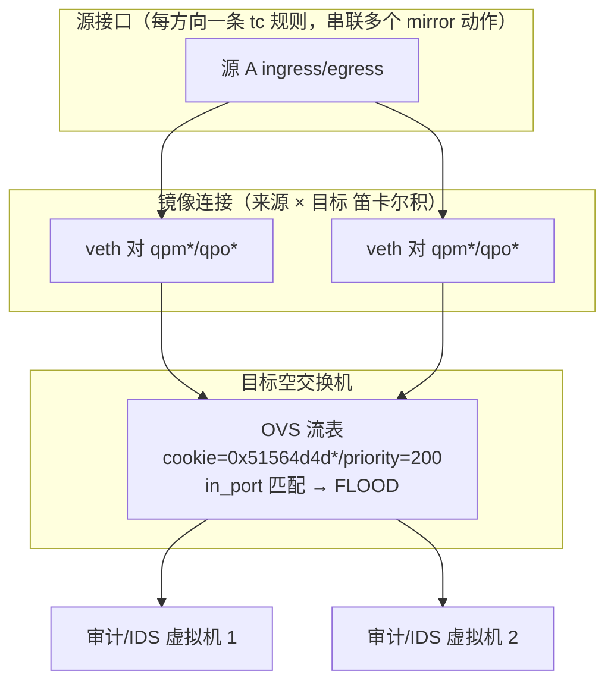

# 端口镜像

端口镜像是 QVMConsole 面向管理员的网络观测能力（位于「网络中心 → 网络概览 → 端口镜像」）。管理员可以选择一个或多个宿主机源接口，将其入方向、出方向或双向报文复制到一个或多个**空交换机**，原报文继续沿原路径转发，目标交换机内的虚拟机收到的是流量副本。

典型用途：

* 选择系统基础 OVS 网桥（如 `KVM_OVS_BRIDGE` 对应网桥），在 NAT 前采集并保留虚拟机局域网 IP
* 选择物理出口网卡，在 NAT 后采集实际线上报文
* 将副本交给接入空交换机的审计、IDS 或抓包虚拟机

## 数据路径

端口镜像不依赖 OVS 内置 mirror 功能，而是通过 **Linux tc `clsact` + `matchall` 过滤器的 `mirred mirror` 动作**复制报文，经专用 veth 对注入目标 OVS 网桥，再由 **OVS OpenFlow 流表（`in_port` 匹配 + `FLOOD` 动作）** 分发到目标交换机的全部虚拟机网口：



来源与目标按**笛卡尔积**建立连接。例如选择 2 个来源和 3 个目标时会建立 6 对 veth / OVS 注入口。每个源方向仅使用一条 tc 过滤器，在其中串联多个复制动作，避免同一源流量被重复匹配。

> **目标交换机选择**
>
> * 目标限制为**空交换机**：系统基础网络、启用内置 DHCP/NAT 或带物理上行的交换机不会出现在候选项
> * 源接口与目标网桥不能相同，以避免二层环路
> * 当前转发动作是 `FLOOD`，目标交换机中的全部虚拟机网口都会收到镜像副本，因此只应将审计设备接入专用交换机
> * 多选目标会按目标数量成倍增加复制、内存带宽与 OVS 转发开销

## 配置与操作

### 配置项

| 配置项       | 说明                                                   |
| --------- | ---------------------------------------------------- |
| **源接口**   | 一个或多个宿主机接口（OVS 网桥或物理网卡），选项附带接口类型、状态、地址、默认路由标记与采集阶段提示 |
| **目标交换机** | 一个或多个空交换机（选项显示交换机名、所属网桥与已接虚拟机数）                      |
| **镜像方向**  | `ingress`（仅入方向）/ `egress`（仅出方向）/ `both`（双向）          |

### 操作流程

| 操作          | 说明                                                                    |
| ----------- | --------------------------------------------------------------------- |
| **启用 / 更新** | 后端先执行只读预检（接口、目标交换机、OpenFlow13 能力、依赖命令、预留 tc 优先级），通过后提交异步任务（高风险，需二次验证） |
| **停用**      | 提交停用任务，清理模块持有的 tc 过滤器、veth、OVS 端口、专用流表、配置文件与看门狗（高风险，需二次验证）            |
| **状态查看**    | 实时从 `tc`、OVS 端口与 OpenFlow 流表回读，不使用数据库保存虚拟网络运行态                        |

启用示例请求体：

```json
{
  "source_interfaces": ["br-ovs", "enp61s0f0np0"],
  "target_switch_ids": [101, 102],
  "direction": "both"
}
```

### 状态统计

状态接口返回逐源、逐目标的实时计数：

| 维度         | 统计字段                                               |
| ---------- | -------------------------------------------------- |
| **逐源接口**   | 入/出方向各自的 `packets`、`bytes`、`dropped`（来自 tc 过滤器计数）  |
| **逐目标交换机** | 连接数、OVS 端口收包数与字节数                                  |
| **全局**     | 启用状态、健康状态（`healthy`）、入/出方向合计、OVS 合计、问题列表（`issues`） |

状态异常时可在界面停用后重新启用，系统会重建全部镜像对象。

## 安全与回滚机制

端口镜像直接改写宿主机 tc 与 OVS 流表，启用/更新流程内置了严格的安全保障：

1. 启用或更新前只读校验接口、目标交换机、OpenFlow13、依赖命令和预留 tc 优先级
2. 修改前创建唯一名称的 systemd 瞬态定时器，**两分钟后执行自动回滚**（看门狗）
3. 后端依次创建 veth、OVS 端口、专用 cookie 流表和 tc 过滤器，并逐项回读
4. 所有验证通过后才写入持久配置并停止看门狗
5. 任一步失败会立即清理本次对象；更新旧配置失败时还会尝试恢复旧镜像
6. 清理只匹配本模块固定的 tc 优先级（49152/49153）、专用 veth/OVS 元数据和 cookie 前缀，不改写其他网络规则
7. 启动与停用兼容早期单来源配置格式；运行态文件丢失时会按专用接口前缀、tc 动作和 OVS 元数据联合清理残留
8. 自动回滚启动前会确认全部临时接口名称空闲；名称冲突只返回错误，不删除冲突接口

### 持久化与开机恢复

| 文件                                           | 用途                                   |
| -------------------------------------------- | ------------------------------------ |
| `/etc/kvm-console/port-mirror/config.json`   | 持久化配置（启用状态、源接口、目标交换机、方向）             |
| `/run/kvm-console/port-mirror-runtime.json`  | 运行态对象清单（veth 对、OVS 端口、ofport、cookie） |
| `/run/kvm-console/port-mirror-watchdog.json` | 回滚看门狗状态                              |

服务启动时会先恢复 VPC 交换机，再根据持久配置恢复端口镜像。

## API 接口

所有接口仅管理员可用，同时兼容 API Key：

| 方法     | 路径                         | 说明                                        |
| ------ | -------------------------- | ----------------------------------------- |
| `GET`  | `/ovs/port-mirror/options` | 获取源接口与目标空交换机选项                            |
| `GET`  | `/ovs/port-mirror/status`  | 从 tc 与 OVS 回读实时状态                         |
| `POST` | `/ovs/port-mirror/enable`  | 预检后提交启用任务（高风险，`enable_port_mirror` 二次验证）  |
| `POST` | `/ovs/port-mirror/disable` | 提交停用和清理任务（高风险，`disable_port_mirror` 二次验证） |

## 运维脚本与诊断

项目提供 `scripts/port-mirror.sh` 运维脚本，供脱离面板时进行临时验证或紧急回滚；来源和目标均使用逗号分隔，脚本同样按笛卡尔积创建连接，tc 优先级、OVS 元数据、cookie、看门狗和清理边界与后端实现一致：

```bash
sudo scripts/port-mirror.sh apply br-ovs,enp61s0f0np0 qvsw101,qvsw102 both
sudo scripts/port-mirror.sh status
sudo scripts/port-mirror.sh rollback
```

宿主机侧诊断命令：

```bash
# 查看源接口镜像过滤器与计数
tc -s filter show dev <源接口> ingress
tc -s filter show dev <源接口> egress

# 列出端口镜像创建的 OVS 接口
ovs-vsctl --data=bare --no-heading --columns=name find Interface external_ids:qvm-purpose=port-mirror

# 按专用 cookie 前缀查看目标桥流表
ovs-ofctl -O OpenFlow13 dump-flows <目标网桥> 'cookie=0x51564d4d00000000/0xffffffff00000000'
```

---

> 原文路径：/docs/tech/network/port-mirror（本文由 QVMConsole 文档站自动生成，供大模型阅读）
