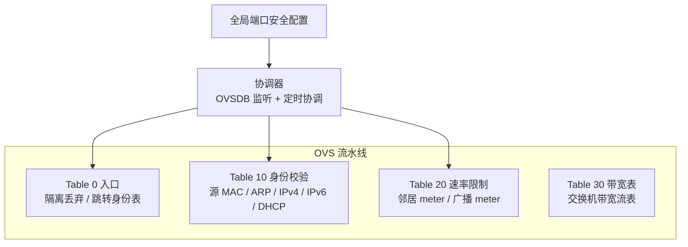

# 端口安全

端口安全是 QVMConsole 基于 Open vSwitch 流表实现的**端口级防护机制**，为每个虚拟机端口提供身份校验（防 MAC/ARP/IP 欺骗）与速率限制（邻居协议、广播/多播、入口总速率）。它与[VPC 交换机](/docs/tech/network/vpc-switch)的桥接安全开关协同工作：交换机安全策略决定策略意图，端口安全负责把策略落地为 OVS 流表与 meter。

> **功能定位** 端口安全做的是**反欺骗与包速率限制**（PPS 维度），不是字节带宽限速；VM/交换机带宽限速由 OVS meter 与 TC 的另一套机制实现。

## 功能架构

### 身份校验（Table 10）

| 校验项          | 说明                                                               |
| ------------ | ---------------------------------------------------------------- |
| **源 MAC**    | 端口发出的数据包源 MAC 必须与网口 MAC 一致                                       |
| **ARP**      | ARP 包中的 sender MAC/IP 必须与允许地址匹配                                  |
| **IPv4 源地址** | 严格模式下仅放行已登记的 IPv4 地址（网口允许地址 + 静态绑定 + DHCP 租约 + 主网卡公网 IP）         |
| **IPv6**     | 开启 IPv6 端口防护时按可信前缀/允许地址严格校验；未开启防护的端口默认丢弃 IPv6 业务流量（仅放行 ND/RS/RA） |
| **DHCP**     | 仅放行 DHCP 客户端报文，丢弃虚拟机发出的 DHCP 服务端报文（防止私接 DHCP 服务器）                |

### 速率限制

| 维度                        | 配置项                                                                     | 默认值                 |
| ------------------------- | ----------------------------------------------------------------------- | ------------------- |
| **端口入口总速率**               | `port_security_total_kpps` / `port_security_total_burst_kpackets`       | 50 kpps / 40 k 包突发  |
| **邻居协议**（ARP、ICMPv6 ND 等） | `port_security_neighbor_pps` / `port_security_neighbor_burst_packets`   | 200 pps / 400 包突发   |
| **广播/多播**                 | `port_security_broadcast_pps` / `port_security_broadcast_burst_packets` | 1000 pps / 2000 包突发 |
| **协调间隔**                  | `port_security_reconcile_interval_seconds`                              | 60 秒（最小 10 秒）       |

所有参数可在「系统设置 → 存储与网络」中调整。

## 端口模式

| 模式                  | 说明                                                    |
| ------------------- | ----------------------------------------------------- |
| **strict（严格）**      | NAT/系统交换机端口，或已登记允许地址的桥接端口：完整执行 MAC/ARP/IPv4(/IPv6) 校验 |
| **compatible（兼容）**  | 桥接直通端口且无登记 IPv4：仅做 MAC/ARP 校验，不限制 IPv4 源地址            |
| **quarantined（隔离）** | 手工隔离的端口，或无法匹配到虚拟机的孤儿 vnet/tap 端口：丢弃全部流量               |
| **disabled**        | 全局端口安全关闭时的状态                                          |

## 操作接口

| 操作          | 接口                                                        | 说明                                                 |
| ----------- | --------------------------------------------------------- | -------------------------------------------------- |
| **状态**      | `GET /ovs/port-security/status`                           | 全局开关、健康状态、各模式端口数、逐端口详情与问题列表                        |
| **预检**      | `POST /ovs/port-security/preflight`                       | 只读检查启用条件与端口问题，不改变任何状态                              |
| **启用**      | `POST /ovs/port-security/enable`                          | 异步任务，需二次验证；先执行预检，不通过则拒绝并列出阻断项                      |
| **停用**      | `POST /ovs/port-security/disable`                         | 异步任务，需二次验证；先隔离有策略流表的端口，再清理流表/meter/policing，最后解除隔离 |
| **协调**      | `POST /ovs/port-security/reconcile`                       | 异步任务，全量重新计算并应用所有端口策略                               |
| **隔离/释放端口** | `POST /ovs/port-security/ports/{port}/isolate \| release` | 异步任务，需二次验证；对指定 OVS 端口手工断网或恢复                       |

### 预检内容

* **桥能力**：桥是否存在、是否支持 OpenFlow 1.3、meter 容量是否足够（需支持按包计数的 meter 与 Interface policing 列）
* **逐端口**：MAC 缺失、端口-桥不一致、网口归属不匹配、交换机缺失、NAT 端口缺 IPv4、IPv6 前缀/地址缺失或越界
* **孤儿端口**：无法匹配虚拟机的 vnet/tap 端口会被标记隔离（非阻断项）

### 协调机制

* **OVSDB 监听**：通过 `ovsdb-client monitor` 监听 Interface 变化（新建/删除/改 ofport），任何变化立即触发协调
* **定时协调**：按 `port_security_reconcile_interval_seconds` 周期全量协调
* **触发式协调**：虚拟机创建/删除、交换机安全策略变更、网口变更等操作后自动触发

> **流表应用策略** 协调优先使用 OpenFlow 1.4 bundle 原子提交；不支持时回退为「先隔离 → 替换流表 → 校验 → 释放」的兼容流程，保证切换期间不会出现策略空窗。

## 与交换机桥接安全的关系

| 交换机开关              | 端口安全落地行为                                       |
| ------------------ | ---------------------------------------------- |
| **混杂模式**           | 通过 `mod-port no-flood/flood` 控制端口泛洪（不依赖端口安全开启） |
| **MAC 地址更改 / 伪传输** | 任一禁用时安装源 MAC 严格匹配 + 丢弃伪造流表（端口安全开启时与身份校验协同）     |
| **IPv6 端口防护**      | 开启端口安全后按可信前缀严格校验 IPv6；未开启端口安全时 IPv6 防护不生效      |

## 逐端口状态字段

状态接口返回每个端口的详情，便于排障：

| 字段                                                                            | 说明          |
| ----------------------------------------------------------------------------- | ----------- |
| `bridge` / `port` / `ofport`                                                  | OVS 位置信息    |
| `vm_name` / `interface_order` / `mac`                                         | 归属虚拟机与网口    |
| `switch_id` / `switch_name` / `direct_bridge`                                 | 所属交换机       |
| `mode` / `applied` / `isolated`                                               | 当前模式与策略应用状态 |
| `allowed_ipv4_addresses` / `allowed_ipv6_addresses` / `trusted_ipv6_prefixes` | 允许地址与可信前缀   |
| `neighbor_meter_id` / `broadcast_meter_id`                                    | 分配的 meter   |
| `policing_kpps` / `policing_burst_kpackets`                                   | 入口限速参数      |
| `drop_packets` / `neighbor_drop_packets` / `broadcast_drop_packets`           | 丢弃计数        |
| `last_error`                                                                  | 最近一次错误信息    |

## 最佳实践

| 建议                 | 说明                                            |
| ------------------ | --------------------------------------------- |
| **先在测试环境预检**       | 启用前先执行只读预检，确认 meter 容量与端口问题                   |
| **关注隔离端口**         | 孤儿端口被自动隔离属预期行为；确认无异常后再释放                      |
| **桥接直通配合 IPv6 防护** | 有 IPv6 业务的直通交换机应开启 IPv6 端口防护并登记可信前缀           |
| **限速参数按业务调整**      | 默认总速率 50 kpps 面向通用场景，高 PPS 业务（如网关虚机）需调大或评估后放行 |

---

> 原文路径：/docs/tech/network/port-security（本文由 QVMConsole 文档站自动生成，供大模型阅读）
