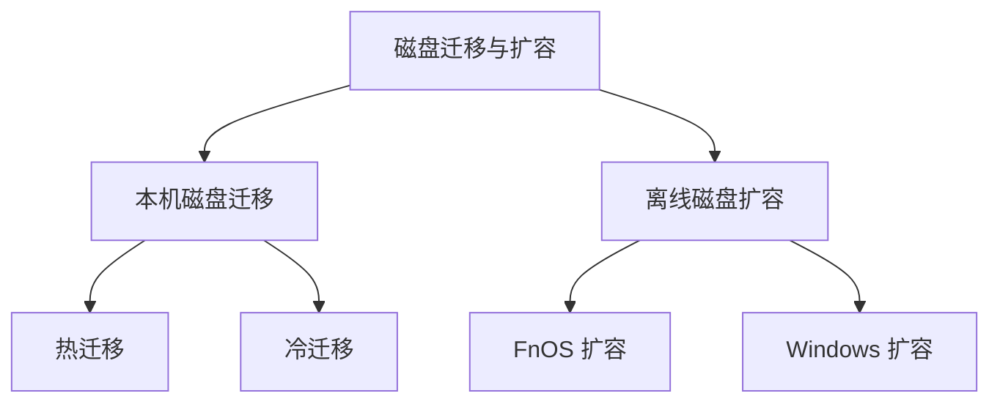
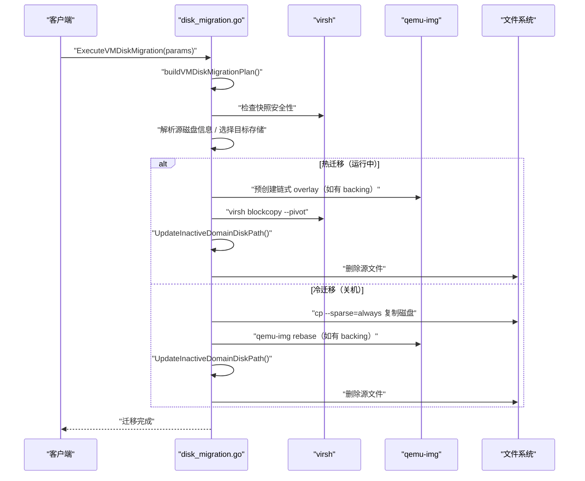
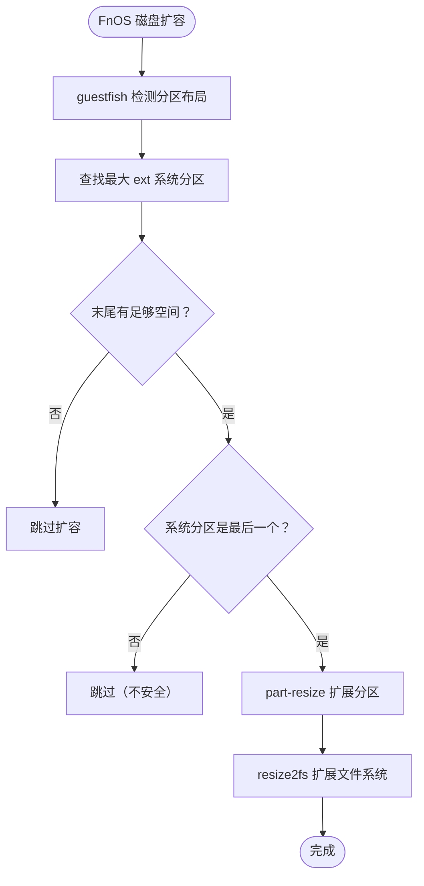
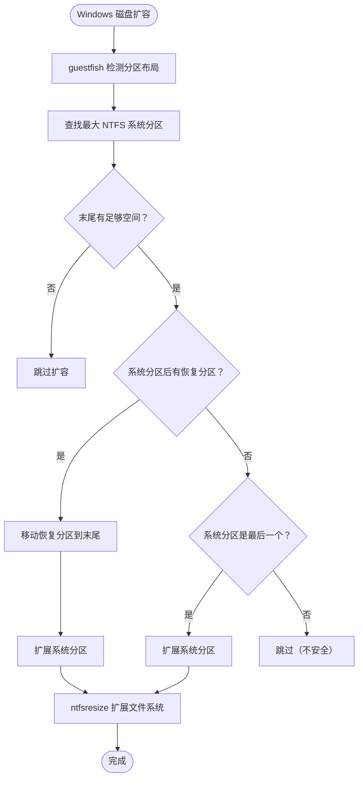

# 磁盘迁移与扩容

磁盘迁移与扩容模块提供两项核心能力：

* **本机磁盘迁移**：将虚拟机的磁盘文件从一个存储池迁移到另一个存储池，支持热迁移（运行中）和冷迁移（关机状态）
* **离线磁盘扩容**：在克隆或模板创建时自动扩展客户机系统分区，支持 FnOS（ext 文件系统）和 Windows（NTFS 文件系统）

## 功能概述



## 本机磁盘迁移

### 迁移模式

| 模式      | VM 状态 | 实现方式              | 适用场景  |
| ------- | ----- | ----------------- | ----- |
| **热迁移** | 运行中   | `virsh blockcopy` | 业务不中断 |
| **冷迁移** | 关机    | 稀疏复制 + rebase     | 更安全可靠 |

### 迁移流程



### 前置校验

| 校验项       | 说明                    | 失败处理           |
| --------- | --------------------- | -------------- |
| **VM 状态** | 必须 running 或 shut off | 提示用户开机或关机      |
| **外部快照**  | 不能存在外部快照              | 提示先删除快照        |
| **目标空间**  | 目标存储必须有足够空间           | 提示空间不足         |
| **磁盘类型**  | 仅支持 file 类型           | 提示不支持 block 类型 |

### 链式磁盘处理

对于有 backing file 的磁盘（如模板克隆的 VM）：

#### 热迁移

1. 预创建 overlay：`qemu-img create -b backing -F format -f qcow2 target.qcow2`
2. 执行 blockcopy：`virsh blockcopy --shallow --reuse-external --pivot`
3. 更新 XML 中的磁盘路径
4. 删除源文件

#### 冷迁移

1. 稀疏复制：`cp --sparse=always --reflink=auto source.qcow2 target.qcow2`
2. 修正 backing 路径：`qemu-img rebase -u -b backing -F format target.qcow2`
3. 更新 XML 中的磁盘路径
4. 删除源文件

### 目标路径冲突处理

如果目标目录已存在同名文件，系统会自动添加时间戳后缀：

```
original.qcow2 → original_migrated_20240101120000.qcow2
```

## 离线磁盘扩容

### FnOS 磁盘扩容

FnOS（飞牛 OS）使用 ext 文件系统，扩容流程如下：



#### 扩容条件

| 条件        | 说明             |
| --------- | -------------- |
| 末尾有足够空间   | 最后一个分区后面有未使用空间 |
| 系统分区是最后一个 | 否则无法安全自动扩容     |
| 文件系统类型    | ext2/ext3/ext4 |

### Windows 磁盘扩容

Windows 使用 NTFS 文件系统，扩容流程更复杂：



#### 恢复分区处理

Windows 系统通常有一个恢复分区，如果它在系统分区后面：

1. 备份恢复分区：`ntfsclone-out`
2. 删除恢复分区
3. 扩展系统分区
4. 重新创建恢复分区
5. 恢复数据：`ntfsclone-in`
6. 修复 NTFS：`ntfsfix`

### guestfish 工具链

离线扩容使用 guestfish 工具操作磁盘分区和文件系统：

| 模式 | 命令                       | 用途            |
| -- | ------------------------ | ------------- |
| 只读 | `guestfish --ro -a disk` | 检测分区布局、文件系统类型 |
| 写入 | `guestfish -a disk`      | 分区调整、文件系统扩展   |

#### 常用命令

| 命令                 | 说明           |
| ------------------ | ------------ |
| `part-list`        | 列出分区         |
| `part-resize`      | 调整分区大小       |
| `part-expand-gpt`  | 扩展 GPT 分区表   |
| `e2fsck-f`         | ext 文件系统检查   |
| `resize2fs`        | ext 文件系统扩展   |
| `ntfsclone-out/in` | NTFS 分区备份/恢复 |
| `ntfsresize`       | NTFS 文件系统扩展  |

## 故障排查

### 迁移问题

| 问题           | 原因       | 解决方案                  |
| ------------ | -------- | --------------------- |
| "虚拟机存在外部快照"  | 快照阻止迁移   | 先删除所有外部快照             |
| "硬盘格式未知"     | 磁盘格式无法识别 | 使用 `qemu-img info` 检查 |
| "目标存储可用空间不足" | 目标存储空间不够 | 清理目标存储或选择其他存储         |

### 扩容问题

| 问题                 | 原因          | 解决方案             |
| ------------------ | ----------- | ---------------- |
| "FnOS 系统分区后存在其他分区" | 分区布局不支持     | 手动调整分区           |
| "Windows 磁盘扩容超时"   | NTFS 文件系统错误 | 先在模板中运行 `chkdsk` |
| 扩容未生效              | 末尾空间不足      | 检查磁盘总容量          |

## 最佳实践

### 迁移建议

1. **备份数据**：迁移前备份重要数据
2. **删除快照**：迁移前删除所有外部快照
3. **选择时机**：热迁移建议在业务低峰期进行
4. **监控进度**：大磁盘迁移耗时较长，关注任务进度

### 扩容建议

1. **模板准备**：确保模板已正常关机且文件系统无错误
2. **Windows 检查**：Windows 模板建议先运行 `chkdsk`
3. **空间预留**：创建 VM 时预留足够磁盘空间
4. **自动扩容**：利用自动扩容功能，无需手动调整分区

## 性能考虑

| 操作   | 耗时因素        | 优化建议          |
| ---- | ----------- | ------------- |
| 热迁移  | 磁盘大小、IO 性能  | 使用高性能存储、低峰期迁移 |
| 冷迁移  | 磁盘大小、复制速度   | 使用 CoW 文件系统加速 |
| 离线扩容 | 分区数量、文件系统大小 | 确保文件系统无错误     |

---

> 原文路径：/docs/tech/virtual-machine/disk-migration-expansion（本文由 QVMConsole 文档站自动生成，供大模型阅读）
