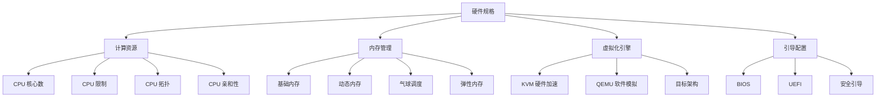
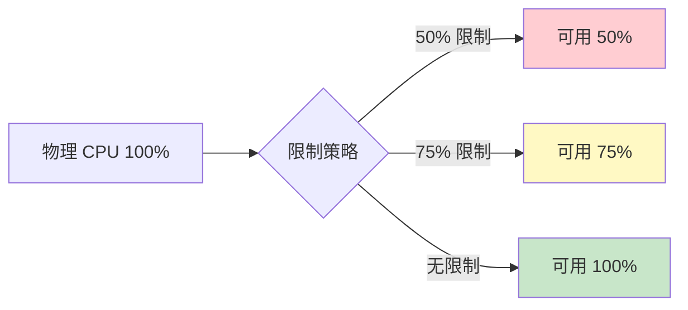
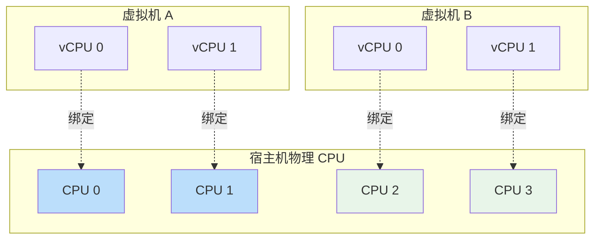
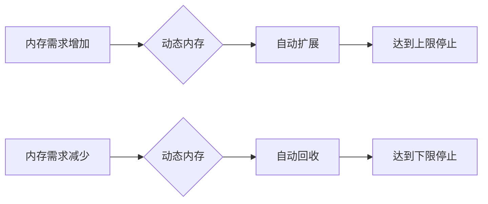
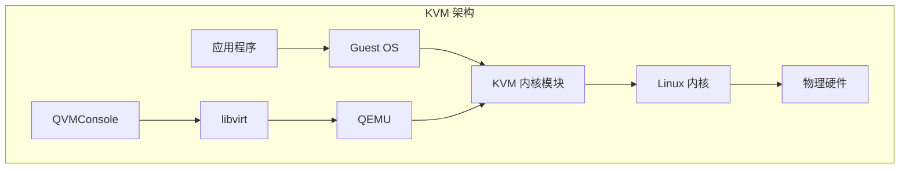
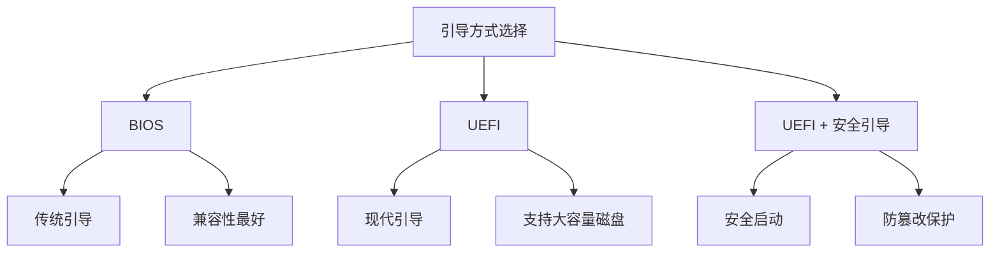

# 硬件规格

硬件规格配置是虚拟机性能的基石，直接影响计算能力、内存容量和运行效率。QVMConsole 提供了精细化的硬件配置选项，从基础的 CPU/内存分配到高级的虚拟化引擎选择，满足不同性能需求的场景。

## 配置概览

## CPU 配置

### CPU 核心数

CPU 核心数决定了虚拟机的并行计算能力，是影响性能的关键参数。

| 应用类型  | 推荐核心数  | 说明             |
| ----- | ------ | -------------- |
| 轻量级应用 | 1-2 核  | 个人网站、小型 API 服务 |
| 标准应用  | 2-4 核  | 中型网站、应用服务器     |
| 高性能应用 | 4-8 核  | 数据库、大数据处理      |
| 计算密集型 | 8-32 核 | AI 训练、科学计算     |

### 最大 vCPU（热插拔上限）

创建/编辑虚拟机时可以设置「最大 vCPU」（`max_vcpu`），用于 CPU 热插拔场景：

* 取值为 0 或不大于当前 vCPU 时，表示不启用热插拔上限
* 大于当前 vCPU 时，域定义会写入 `maxvcpus`，允许运行中在线增加 vCPU（不超过该上限）

### CPU 限制

CPU 限制功能允许管理员对虚拟机的 CPU 使用率进行精细化控制，防止单个虚拟机占用过多计算资源。

**工作原理**：

CPU 限制基于 Linux CFS（Completely Fair Scheduler）的带宽控制机制实现。当设置限制百分比时，系统会为虚拟机的 vCPU 进程组设置相应的时间配额，在一个调度周期内，超出配额的 CPU 时间将被延迟到下一个周期。

**配置说明**：

* **启用限制**：开启 CPU 使用率限制
* **限制百分比**：1-100%，表示可用 CPU 能力的百分比
* **计算基准**：基于已分配的 vCPU 总能力，而非物理 CPU 总能力

> **示例** 假设虚拟机分配了 4 个 vCPU，设置限制为 50%，则该虚拟机最多可使用相当于 2 个物理核心的计算能力。

### CPU 拓扑

CPU 拓扑定义了虚拟机内部看到的处理器布局，包括插槽（Socket）、核心（Core）和线程（Thread）的数量关系。

| 拓扑模式     | 说明         | 适用场景                          |
| -------- | ---------- | ----------------------------- |
| **自动**   | 系统自动选择最优拓扑 | 默认推荐，Windows 10/11 自动使用单插槽多核心 |
| **宿主默认** | 使用宿主机的拓扑结构 | 需要与宿主机保持一致的场景                 |
| **自定义**  | 手动指定插槽和核心数 | 特殊软件授权要求                      |

**为什么拓扑重要？**

某些操作系统和软件授权系统会根据检测到的物理 CPU 数量进行计费或功能限制。通过合理配置 CPU 拓扑，可以：

* 避免 Windows 将多核识别为多颗物理 CPU
* 满足特定软件的授权要求
* 优化操作系统的调度策略

### CPU 亲和性

CPU 亲和性（CPU Affinity）允许管理员将虚拟机的 vCPU 绑定到宿主机的特定物理 CPU 核心上，以优化性能或满足特定的资源隔离需求。

**配置格式**：

* 单个核心：`0`
* 多个核心：`0,2,4`
* 范围格式：`0-3`
* 混合格式：`0,2-4,7`

**适用场景**：

* **性能优化**：将关键业务虚拟机绑定到专用核心，避免资源竞争
* **NUMA 优化**：确保虚拟机使用同一 NUMA 节点的核心，减少跨节点访问延迟
* **实时应用**：为实时性要求高的应用预留专用计算资源

## 内存管理

### 基础内存

基础内存是虚拟机启动时分配的初始内存大小，决定了操作系统和应用程序可用的内存空间。

| 应用类型   | 推荐内存     | 说明                 |
| ------ | -------- | ------------------ |
| 轻量级服务  | 1-2 GB   | 基础 Web 服务、小型应用     |
| 标准应用   | 2-4 GB   | 中型网站、应用服务器         |
| 数据库服务  | 4-16 GB  | MySQL、PostgreSQL 等 |
| 大数据/AI | 16-64 GB | 内存数据库、机器学习         |

### 动态内存

动态内存技术允许虚拟机根据实际内存使用情况自动调整内存分配，在保证性能的同时提高资源利用率。

#### 支持的后端技术

| 后端                   | 原理                             | 优势           | 适用场景       |
| -------------------- | ------------------------------ | ------------ | ---------- |
| **气球调度（Balloon）**    | 通过 virtio-balloon 驱动与虚拟机协作回收内存 | 兼容性好，支持广泛    | 通用场景       |
| **弹性内存（virtio-mem）** | 以内存块为单位动态添加或移除内存               | 更精细的控制，支持热插拔 | Windows 系统 |

**气球调度工作原理**：

1. 宿主机需要回收内存时，向气球驱动发送"充气"指令
2. 气球驱动在虚拟机内部申请内存，使操作系统将不常用的内存页换出
3. 被换出的内存页返回给宿主机使用
4. 当虚拟机需要更多内存时，气球驱动"放气"，释放内存供虚拟机使用

**弹性内存工作原理**：

1. 内存以固定大小的块（通常 128MB-512MB）为单位管理
2. 需要扩展时，直接向虚拟机添加新的内存块
3. 需要回收时，从虚拟机移除指定的内存块
4. 块级别的操作比页面级别的气球调度更高效

#### 动态内存配置

| 参数       | 说明           | 范围            |
| -------- | ------------ | ------------- |
| **最大内存** | 动态内存可扩展到的最大值 | 基础内存 \~ 64GB  |
| **最小内存** | 动态内存可回收到的最小值 | 512MB \~ 基础内存 |

> **注意事项**
>
> * 动态内存需要虚拟机内部安装相应的驱动支持
> * Windows 系统建议使用弹性内存（virtio-mem）以获得更好的体验
> * 动态内存的调整可能会影响虚拟机性能，建议在非高峰期进行

## 虚拟化引擎

### KVM 硬件虚拟化

KVM（Kernel-based Virtual Machine）是基于 Linux 内核的硬件虚拟化解决方案，利用 CPU 的硬件虚拟化扩展（Intel VT-x / AMD-V）实现接近原生的性能。

**KVM 优势**：

* **接近原生性能**：直接使用硬件虚拟化扩展，减少模拟开销
* **硬件兼容性**：支持大多数 x86 处理器的虚拟化特性
* **安全性**：利用硬件隔离机制，提供更强的安全边界

### QEMU 软件虚拟化

QEMU 是一个通用的开源机器模拟器和虚拟化器，在没有硬件虚拟化支持时，可以通过纯软件模拟的方式运行虚拟机。

**QEMU 适用场景**：

* **跨架构模拟**：在 x86 主机上运行 ARM、RISC-V 等架构的虚拟机
* **开发测试**：测试不同架构的软件兼容性
* **旧硬件支持**：在不支持硬件虚拟化的旧处理器上运行虚拟机

### 平台架构

当选择 QEMU 软件虚拟化时，可以指定目标平台架构：

| 架构          | 说明               | 典型应用               |
| ----------- | ---------------- | ------------------ |
| **x86\_64** | Intel/AMD 64 位架构 | 主流服务器和桌面系统         |
| **aarch64** | ARM 64 位架构       | 嵌入式系统、移动设备、ARM 服务器 |
| **riscv64** | RISC-V 64 位架构    | 新兴开源架构，物联网、嵌入式     |

### 虚拟机类型（Machine Type）

虚拟机类型定义了虚拟硬件的兼容性级别，影响设备模型和特性支持：

| 类型         | 说明                | 适用场景                 |
| ---------- | ----------------- | -------------------- |
| **Q35**    | 现代 PC 芯片组，支持 PCIe | 默认推荐，支持最新特性          |
| **i440FX** | 传统 PC 芯片组         | 兼容旧系统，某些 Windows 版本  |
| **virt**   | ARM/RISC-V 虚拟化平台  | aarch64 和 riscv64 架构 |

## 引导方式

引导方式决定了虚拟机启动时使用的固件类型，影响操作系统的安装和启动过程。

### 引导方式对比

| 特性       | BIOS    | UEFI        | UEFI + 安全引导      |
| -------- | ------- | ----------- | ---------------- |
| **固件**   | SeaBIOS | OVMF (UEFI) | OVMF + 安全启动      |
| **分区表**  | MBR     | GPT         | GPT              |
| **最大磁盘** | 2TB     | 无限制         | 无限制              |
| **启动速度** | 较慢      | 较快          | 较快               |
| **安全特性** | 无       | 基础          | 完整               |
| **兼容性**  | 所有系统    | 现代系统        | Windows 11、Linux |

### 选择建议

* **BIOS**：适用于旧版操作系统或需要最大兼容性的场景
* **UEFI**：适用于现代操作系统，推荐作为默认选择
* **UEFI + 安全引导**：适用于需要安全启动特性的场景，如 Windows 11 要求

> **重要提示** 更改引导方式会导致已安装的操作系统无法启动。如需切换引导方式，建议重新安装操作系统。

## 显示设备

显示设备决定了虚拟机的图形输出能力和性能：

| 设备类型       | 说明            | 适用场景               |
| ---------- | ------------- | ------------------ |
| **VirtIO** | 半虚拟化显示设备，性能最佳 | Linux 系统（已安装驱动）    |
| **VGA**    | 标准 VGA 显示设备   | Windows 安装阶段、兼容性需求 |
| **VMVGA**  | VMware 兼容显示设备 | VMware 嵌套虚拟化       |
| **QXL**    | SPICE 协议优化显示  | 使用 SPICE 连接的场景     |
| **Cirrus** | 旧式显示设备        | 兼容旧系统              |

> **选择建议**
>
> * Linux 系统推荐使用 VirtIO 以获得最佳性能
> * Windows 安装阶段可使用 VGA，安装完成后切换到 VirtIO
> * VMware 嵌套环境建议使用 VMVGA

## Watchdog 守护者

Watchdog 是一种硬件看门狗机制，用于检测虚拟机是否发生死锁或无响应，并自动触发重启。

| 设备类型         | 说明                    | 推荐度      |
| ------------ | --------------------- | -------- |
| **不启用**      | 关闭看门狗功能               | 适用于非关键系统 |
| **i6300esb** | Intel 6300ESB ICH 看门狗 | 通用兼容     |
| **iTCO**     | Intel TCO 看门狗         | 推荐选择     |

**工作原理**：

1. 虚拟机操作系统内的看门狗驱动定期"喂狗"（重置计时器）
2. 如果虚拟机发生死锁，无法及时喂狗
3. 看门狗超时后触发系统重启

**配置建议**：

* 生产环境的关键服务建议启用看门狗
* 需要在虚拟机内安装对应的看门狗驱动
* 合理设置超时时间，避免误触发

## 开机自启

开机自启功能使虚拟机在宿主机启动时自动启动，确保服务的连续性。

**配置说明**：

* **启用**：宿主机启动时自动启动该虚拟机
* **关闭**：需要手动启动虚拟机

**启动顺序**：

当多个虚拟机启用开机自启时，可以通过调整启动顺序来控制启动的先后顺序，确保依赖关系正确的服务能够按序启动。

---

> 原文路径：/docs/tech/virtual-machine/hardware-spec（本文由 QVMConsole 文档站自动生成，供大模型阅读）
