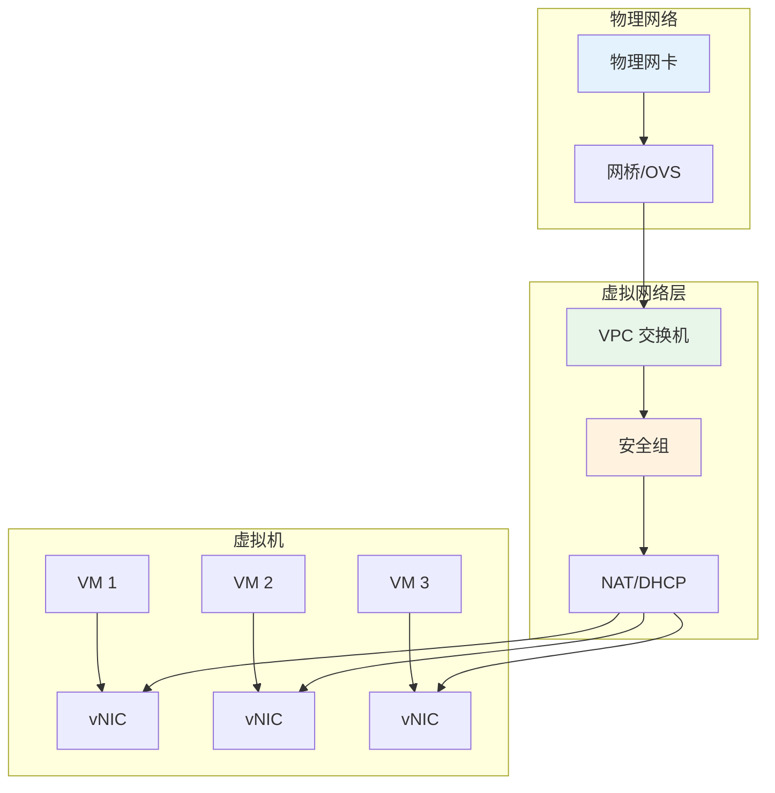
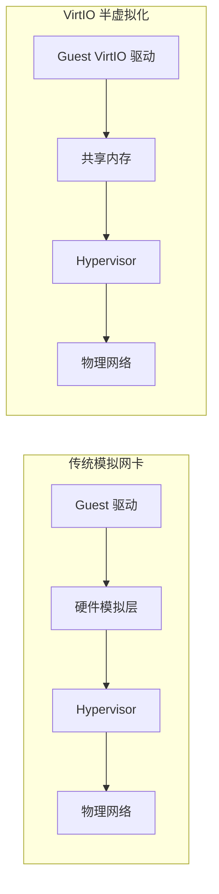
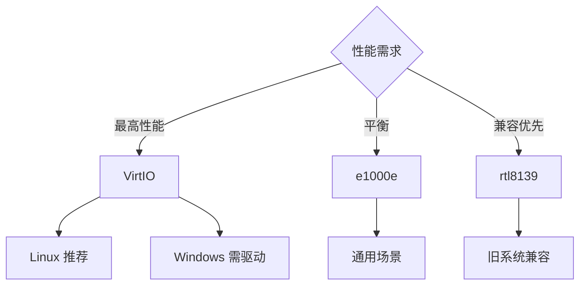
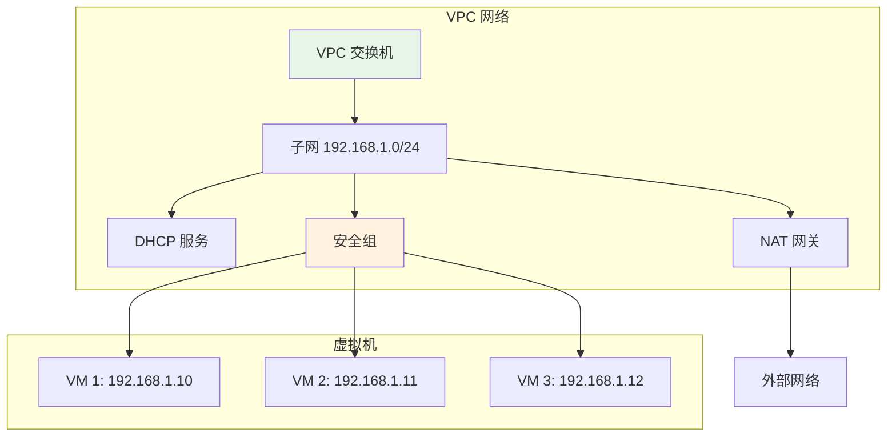
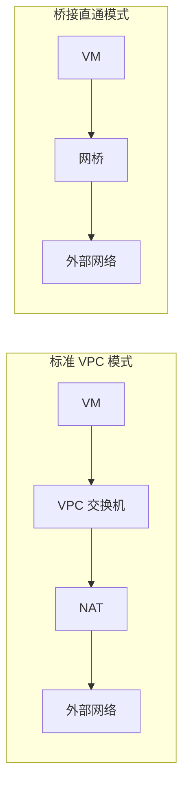
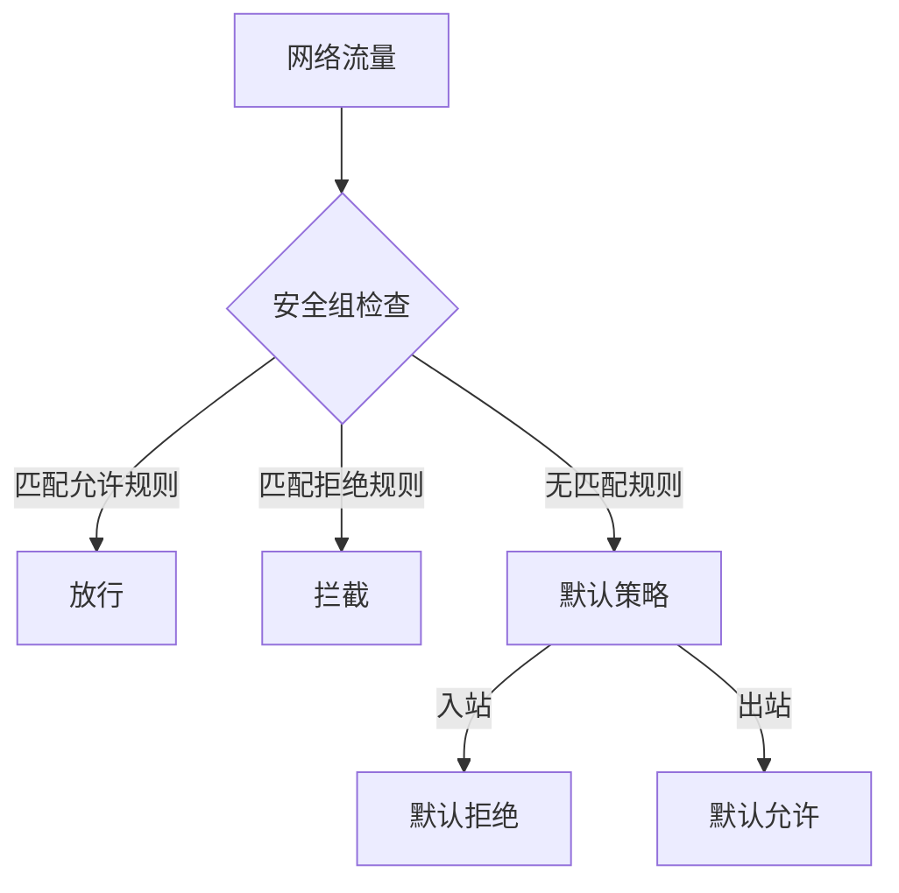
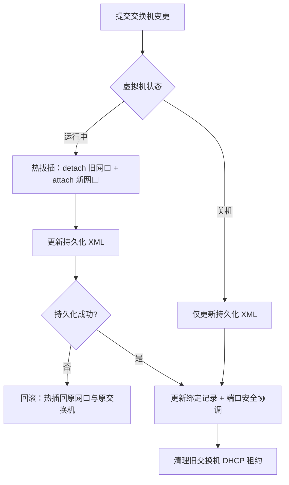
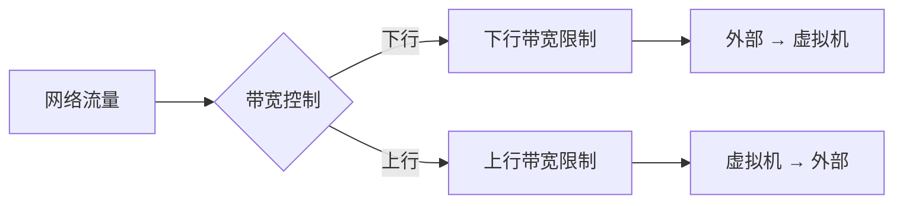
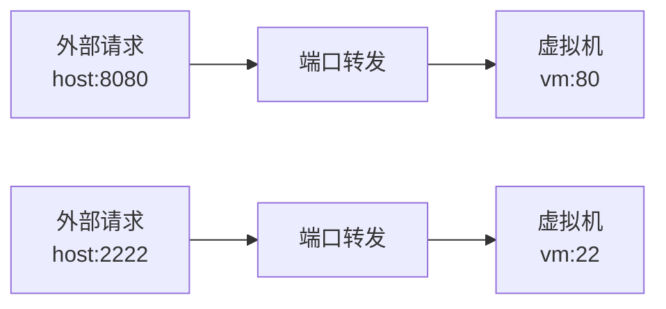
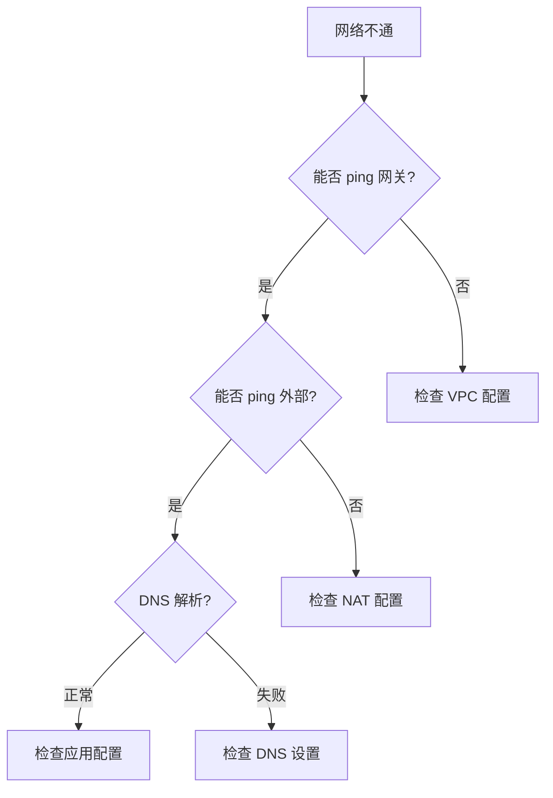

# 网络配置

网络配置是虚拟机连接外部世界的关键环节，QVMConsole 提供了完善的虚拟网络解决方案，包括灵活的网卡选择、VPC 隔离网络、安全组防护和精细化的流量管控。

## 网络架构概览



## 网卡类型

网卡类型决定了虚拟机与虚拟网络之间的通信方式，不同类型的网卡在性能和兼容性上各有特点。

### 网卡类型对比

| 网卡类型        | 性能 | 兼容性  | 说明             |
| ----------- | -- | ---- | -------------- |
| **VirtIO**  | 最佳 | 需要驱动 | 半虚拟化网卡，性能最优    |
| **e1000e**  | 良好 | 广泛兼容 | Intel 千兆网卡模拟   |
| **rtl8139** | 一般 | 最佳兼容 | Realtek 百兆网卡模拟 |

### VirtIO 网卡

VirtIO 是一种半虚拟化 I/O 框架，VirtIO 网卡通过减少虚拟化开销来提供接近原生的网络性能。



**VirtIO 优势**：

* **零拷贝传输**：通过共享内存减少数据复制
* **批量处理**：支持合并多个数据包减少中断
* **低延迟**：绕过硬件模拟层直接通信

**驱动支持**：

* Linux 内核原生包含 VirtIO 驱动
* Windows 需要安装 VirtIO 驱动（可从 ISO 加载）
* 大多数现代操作系统都支持

### e1000e 网卡

e1000e 是 Intel 千兆以太网控制器的软件模拟，提供良好的性能和广泛的兼容性。

**适用场景**：

* 需要兼容性但不想使用 VirtIO 的场景
* 旧版操作系统不支持 VirtIO 驱动
* VMware 嵌套虚拟化环境

### rtl8139 网卡

rtl8139 是 Realtek 百兆以太网控制器的模拟，提供最佳的兼容性但性能较低。

**适用场景**：

* 极旧的操作系统
* 对网络性能要求不高的场景
* 兼容性优先的测试环境

### 选择建议



> **推荐选择**
>
> * **Linux 系统**：强烈推荐 VirtIO，可获得最佳网络性能
> * **Windows 系统**：安装阶段使用 e1000e，安装 VirtIO 驱动后切换到 VirtIO
> * **旧系统**：使用 rtl8139 确保兼容性

## VPC 网络

VPC（Virtual Private Cloud）是 QVMConsole 提供的虚拟私有云网络解决方案，通过软件定义网络实现网络隔离和安全控制。

### VPC 架构



### VPC 核心组件

| 组件          | 功能          | 说明          |
| ----------- | ----------- | ----------- |
| **VPC 交换机** | 虚拟交换机，连接虚拟机 | 定义子网和网关     |
| **DHCP 服务** | 自动分配 IP 地址  | 简化网络配置      |
| **NAT 网关**  | 网络地址转换      | 实现虚拟机访问外部网络 |
| **安全组**     | 访问控制规则      | 保护虚拟机网络安全   |

### VPC 交换机配置

创建虚拟机时需要选择 VPC 交换机，配置包括：

| 参数          | 说明          | 示例                  |
| ----------- | ----------- | ------------------- |
| **交换机名称**   | VPC 交换机的标识  | `default-switch`    |
| **子网 CIDR** | 网络地址范围      | `192.168.1.0/24`    |
| **网关地址**    | 子网网关 IP     | `192.168.1.1`       |
| **DHCP 范围** | 自动分配的 IP 范围 | `192.168.1.100-200` |

### 桥接直通模式

除了标准的 VPC 模式，QVMConsole 还支持桥接直通模式：



| 特性        | 标准 VPC   | 桥接直通     |
| --------- | -------- | -------- |
| **IP 分配** | VPC DHCP | 上级路由器    |
| **网络隔离**  | 支持       | 不支持      |
| **NAT**   | 支持       | 不支持      |
| **安全组**   | 支持       | 不支持      |
| **性能**    | 略有开销     | 接近原生     |
| **适用场景**  | 多租户隔离    | 直接接入物理网络 |

## 安全组

安全组是虚拟防火墙，用于控制虚拟机的入站和出站网络流量。

### 安全组规则



### 规则配置

每条安全组规则包含以下要素：

| 要素       | 说明             | 示例                 |
| -------- | -------------- | ------------------ |
| **方向**   | 入站或出站          | `入站`               |
| **协议**   | TCP、UDP、ICMP 等 | `TCP`              |
| **端口范围** | 目标端口或端口范围      | `80` 或 `8000-9000` |
| **源/目标** | IP 地址或 CIDR    | `0.0.0.0/0`        |
| **动作**   | 允许或拒绝          | `允许`               |

### 常见规则示例

| 服务    | 协议  | 端口   | 源地址       | 说明           |
| ----- | --- | ---- | --------- | ------------ |
| SSH   | TCP | 22   | 管理员 IP    | 远程管理         |
| HTTP  | TCP | 80   | 0.0.0.0/0 | Web 服务       |
| HTTPS | TCP | 443  | 0.0.0.0/0 | 安全 Web 服务    |
| MySQL | TCP | 3306 | 应用服务器 IP  | 数据库访问        |
| RDP   | TCP | 3389 | 管理员 IP    | Windows 远程桌面 |

> **安全建议**
>
> * 遵循最小权限原则，只开放必要的端口
> * 限制管理端口（SSH/RDP）的访问源 IP
> * 定期审查安全组规则，清理不再使用的规则

## 多网口管理

QVMConsole 支持为虚拟机配置多个网口，每个网口独立绑定 VPC 交换机、安全组与带宽（**仅管理员可操作**）。

### 网口配置项

| 字段                    | 说明                                  |
| --------------------- | ----------------------------------- |
| **VPC 交换机**           | 网口接入的交换机（系统基础网络人人可用，用户交换机校验归属）      |
| **安全组**               | 网口绑定的安全组（系统交换机默认使用该用户默认安全组）         |
| **网卡型号**              | virtio / e1000e / rtl8139，默认 virtio |
| **上行 / 下行速率**         | 网口级带宽限制（Mbps，0 表示不限）                |
| **允许 IPv4 / IPv6 地址** | 端口安全的地址白名单（开启 IPv6 端口防护时 IPv6 必填）   |

### 网口操作语义

| 操作       | 说明                                                           |
| -------- | ------------------------------------------------------------ |
| **添加网口** | 自动分配网口序号（interface\_order）与确定性 MAC；运行中的虚拟机支持热插（同时写入运行态与持久配置） |
| **编辑网口** | 可修改交换机/安全组/带宽/允许地址；任意网口切换交换机均支持热拔插（见下文）；修改后清理旧 DHCP 租约       |
| **删除网口** | 按网口序号删除（MAC 兜底匹配）                                            |

### 网口切换交换机（热拔插）

在虚拟机编辑页修改任意网口的 VPC 交换机后，系统会保留该网口的 MAC、网卡型号、Open vSwitch interface ID 和带宽配置，并同步更新运行态与持久化 XML：



* 虚拟机运行中时通过热拔插切换，网口会**短暂断链**；热插或持久化失败会恢复原网口与原交换机
* 虚拟机关机时仅更新持久化 XML，下一次开机生效
* 绑定记录在实际网口切换成功**之后**才更新，避免面板数据库与实际网络不一致；后续步骤失败会连同网口一起回滚

### 物理直通 / VLAN 网口

附加网口选择物理直通（含共享直通）交换机时，网口 VLAN 按交换机配置生效：

| 项           | 说明                                                                              |
| ----------- | ------------------------------------------------------------------------------- |
| **VLAN 来源** | NAT 交换机使用系统分配的内部 VLAN；物理直通交换机使用配置的桥接 VLAN ID（`bridge_vlan_id`）                  |
| **持久化 XML** | `<vlan><tag id='...'/></vlan>` 写入网口 XML，虚拟机重启后保持相同 VLAN                         |
| **运行态**     | 运行中的虚拟机热插/切换网口后，系统同步设置对应 vnet OVS 端口的 tag（`ovs-vsctl set Port <vnet> tag=<id>`） |

宿主机核对命令：

```bash
ovs-vsctl get Port <vnet端口> tag        # 运行态 VLAN
virsh dumpxml --inactive <虚拟机名称>    # 持久化 VLAN
```

### MAC 地址管理

* 网口 MAC 由系统按「虚拟机名 + 网口序号」哈希确定性生成（前缀 `52:54:00:`），**不支持手动指定**；同一虚机重新添加同序号网口会得到相同 MAC
* 运行态 IP 展示按 MAC 匹配：优先取 QEMU Guest Agent 上报的 IP（含 IPv4/IPv6 多地址），无 Guest Agent 时回退为 OVS 静态绑定/DHCP 租约推导
* **Agent 未连接降级**：Guest Agent 连接失败后，详情与网络状态等被动查询会对同一虚拟机等待 30 秒再重试，等待期间继续使用 DHCP 租约、静态绑定、ARP 与 `virsh domifaddr` 解析 IP；磁盘自动化、在线密码重置等主动来宾操作不受该等待窗口影响
* 交换机安全策略（MAC 更改/伪传输限制）与全局端口安全会对源 MAC 做进一步校验，详见 [端口安全](/docs/tech/network/port-security)

## 流量管控

QVMConsole 提供了精细化的流量管控功能，支持带宽限制和流量配额，帮助控制网络成本和保证服务质量。

### 带宽限制

带宽限制控制虚拟机的网络传输速率，可在交换机配额（下行/上行 Mbps）与网口级速率两个层面配置：



| 参数       | 说明             | 单位   |
| -------- | -------------- | ---- |
| **下行带宽** | 从外部下载到虚拟机的速率限制 | Mbps |
| **上行带宽** | 从虚拟机上传到外部的速率限制 | Mbps |

全局带宽限制与交换机流量配额的实现细节请参阅 [VPC 交换机](/docs/tech/network/vpc-switch)。

### 流量配额

流量配额限制虚拟机在一定周期内的总网络流量，超出配额后可能触发告警或限制。

| 参数        | 说明         | 单位 |
| --------- | ---------- | -- |
| **下行月流量** | 每月允许的下行总流量 | GB |
| **上行月流量** | 每月允许的上行总流量 | GB |

### 端口转发

端口转发允许将外部端口映射到虚拟机的内部端口，实现外部访问虚拟机服务。



**端口转发配置**：

| 参数        | 说明            | 示例     |
| --------- | ------------- | ------ |
| **主机端口**  | 宿主机监听的端口      | `8080` |
| **虚拟机端口** | 虚拟机的服务端口      | `80`   |
| **协议**    | TCP 或 UDP     | `TCP`  |
| **上限**    | 每个虚拟机的最大端口转发数 | `10`   |

### 轻量云配额

对于轻量云用户，管理员可以设置更精细的网络配额：

| 配额         | 说明        | 默认值 |
| ---------- | --------- | --- |
| **下行带宽**   | 最大下行带宽限制  | 按套餐 |
| **上行带宽**   | 最大上行带宽限制  | 按套餐 |
| **下行月流量**  | 每月下行流量上限  | 按套餐 |
| **上行月流量**  | 每月上行流量上限  | 按套餐 |
| **端口转发上限** | 最大端口转发规则数 | 10  |
| **运行时长配额** | 每月最大运行小时数 | 不限  |

> **运行时长配额** 运行时长配额用于控制虚拟机的使用时间，到达配额后系统会自动关机。关机前会提前发送邮件提醒，避免数据丢失。

## 网络诊断

QVMConsole 在虚拟机详情页「网络管理」中提供内置的网络诊断工具（仅管理员），帮助快速定位和解决网络问题。

### 运行状态面板

逐网口展示：接口类型、网桥、ofport、网卡型号、MAC、运行态 IP（来源标注 Guest Agent / OVS 推导）、端口安全状态、带宽 QoS 与异常信息。

### 抓包诊断

基于 tcpdump 的 VM 网络抓包，抓包任务异步执行（`network_capture`）：

| 参数             | 说明                                        |
| -------------- | ----------------------------------------- |
| **网口**         | 选择要抓包的虚拟网卡                                |
| **协议模板**       | any / tcp / udp / icmp / arp / dhcp / dns |
| **源/目的 IP、端口** | 组合过滤条件                                    |
| **抓包时长**       | 默认 30 秒（可配置，最大 120 秒）                     |
| **大小 / 包数上限**  | 默认 64MB / 5000 包                          |

抓包会话支持启动、取消、下载 pcap 文件与删除；抓包文件存放于 `/var/lib/kvm-console/captures`。

### 常见问题排查



---

> 原文路径：/docs/tech/virtual-machine/network-config（本文由 QVMConsole 文档站自动生成，供大模型阅读）
