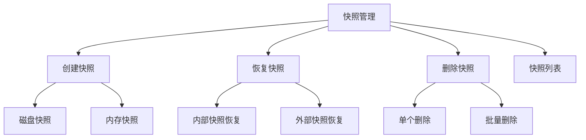
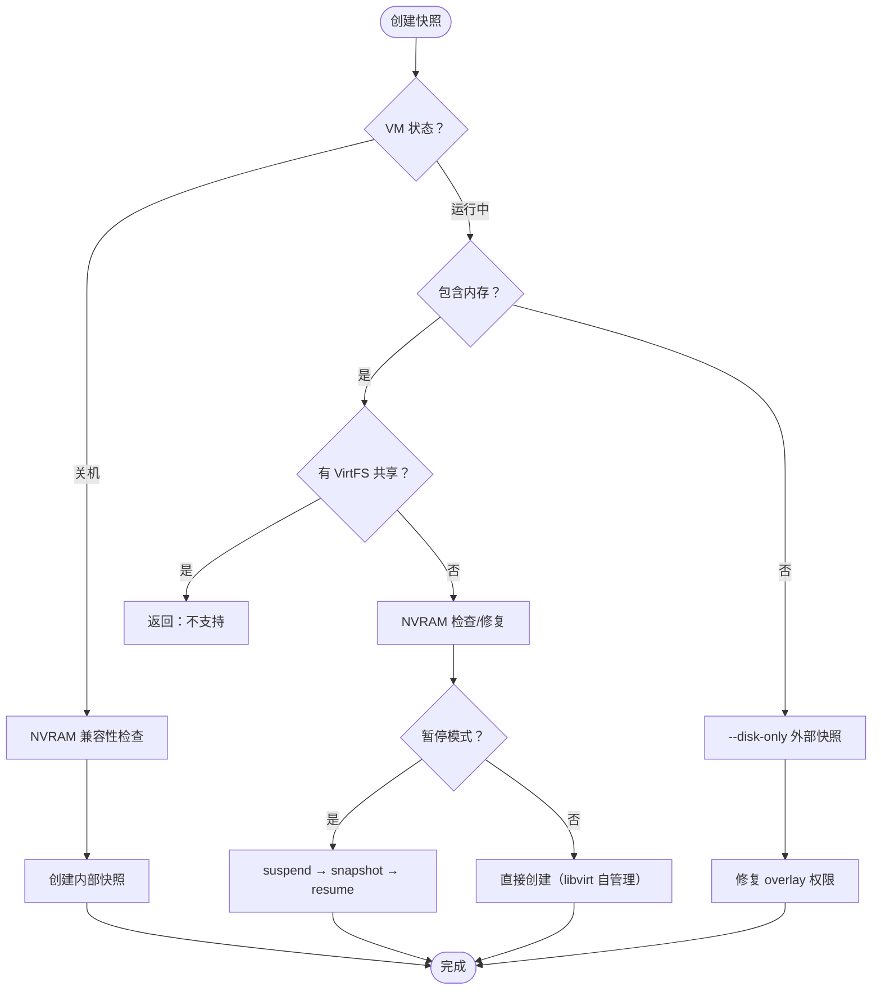
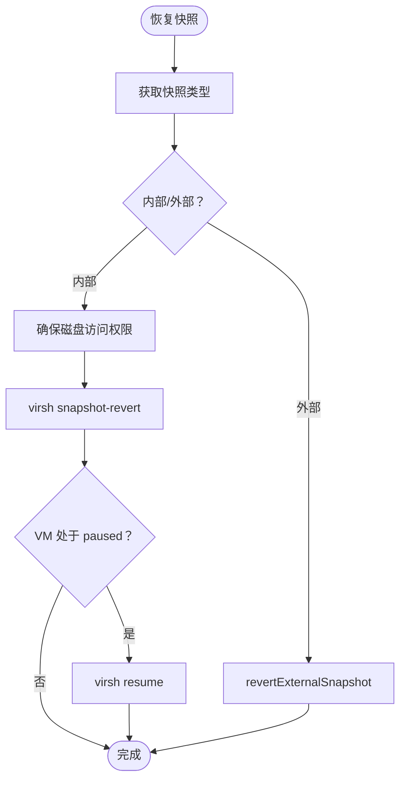
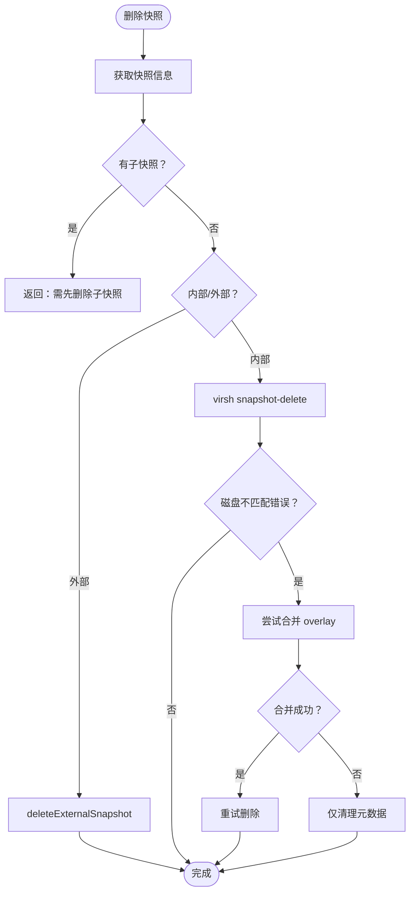

# 快照管理

快照管理模块提供虚拟机磁盘与内存状态的快照能力，支持创建、恢复、删除快照，以及批量清理全部快照。系统同时支持内部快照（libvirt 原生）和外部快照（磁盘 overlay），并针对 UEFI NVRAM、VirtFS 共享目录等特殊场景提供了兼容性检查与自动修复机制。

## 功能概述



### 核心能力

| 功能           | 说明                                     |
| ------------ | -------------------------------------- |
| **快照创建**     | 支持仅磁盘快照和包含内存状态的快照，兼容运行中和关机状态           |
| **快照恢复**     | 内部快照直接恢复，外部快照通过 blockpull/blockcopy 恢复 |
| **快照删除**     | 支持单个删除和批量删除，处理复杂的外部快照链与 overlay 合并     |
| **快照配额**     | 基于角色的快照数量限制，防止资源滥用                     |
| **NVRAM 兼容** | 自动检测 UEFI pflash NVRAM 格式兼容性，支持自动修复    |
| **并发保护**     | 通过快照锁防止并发操作冲突                          |

## 快照类型

### 内部快照 vs 外部快照

| 特性       | 内部快照                         | 外部快照              |
| -------- | ---------------------------- | ----------------- |
| **存储方式** | 快照数据保存在原磁盘文件中                | 创建新的 overlay 磁盘文件 |
| **恢复速度** | 快                            | 慢（需要合并 overlay）   |
| **磁盘空间** | 随修改量增长                       | overlay 文件增长      |
| **适用场景** | 关机状态、少量快照                    | 运行中、频繁快照          |
| **恢复支持** | `virsh snapshot-revert` 直接恢复 | 需要特殊处理            |

### 快照创建策略

系统根据虚拟机状态和用户选择自动选择快照策略：

| VM 状态 | 包含内存 | 快照类型 | 说明                          |
| ----- | ---- | ---- | --------------------------- |
| 关机    | -    | 内部快照 | 默认行为，保存磁盘状态                 |
| 运行中   | 是    | 内部快照 | 可选暂停模式，保存内存+磁盘状态            |
| 运行中   | 否    | 外部快照 | `--disk-only`，创建 overlay 磁盘 |

## 创建快照

### 创建流程



### 内存快照模式

| 模式        | 说明                        | 优点     | 缺点      |
| --------- | ------------------------- | ------ | ------- |
| **暂停模式**  | 先 suspend → 创建快照 → resume | 一致性更好  | 业务暂停    |
| **非暂停模式** | 由 libvirt/QEMU 自行管理       | 暂停窗口更短 | 行为因版本而异 |

### 创建参数

| 参数                          | 类型      | 说明                      |
| --------------------------- | ------- | ----------------------- |
| `name`                      | string  | 快照名称（支持英文、数字、下划线、点、短横线） |
| `description`               | string  | 快照描述                    |
| `include_memory`            | boolean | 是否保存内存状态（仅运行中有效）        |
| `auto_fix_nvram`            | boolean | 是否自动修复 NVRAM 格式         |
| `pause_for_memory_snapshot` | boolean | 是否暂停 VM 创建内存快照          |

## 恢复快照

### 恢复流程



### 恢复注意事项

1. **内部快照**：直接使用 `virsh snapshot-revert` 恢复
2. **外部快照**：需要通过 blockpull/blockcopy 处理
3. **暂停状态**：恢复到暂停时创建的快照后，VM 可能处于 paused 状态，系统会自动 resume

## 删除快照

### 删除流程



### 删除限制

| 限制        | 说明               | 解决方案                |
| --------- | ---------------- | ------------------- |
| **子快照保护** | 有子快照的快照不能直接删除    | 从叶子节点开始删除           |
| **磁盘不匹配** | 活动磁盘与快照所在磁盘不一致   | 先合并 overlay 或切回原始磁盘 |
| **外部快照链** | 复杂的 overlay 依赖关系 | 使用批量删除功能            |

### 批量删除

批量删除功能会从快照树的叶子节点逐步清理：

1. 获取所有快照列表
2. 找到叶子节点（无子快照的快照）
3. 删除叶子节点
4. 重复步骤 2-3 直到所有快照删除完成
5. 清理残留的 overlay 文件

## NVRAM 兼容性

### 检测机制

系统会自动检测 UEFI pflash NVRAM 格式是否兼容内部快照：

* **兼容**：直接创建快照
* **不兼容**：提示用户选择是否自动修复

### 自动修复

修复流程：

1. 检查 NVRAM 格式
2. 用户确认修复
3. 执行 NVRAM 格式转换
4. 可能需要重启 VM
5. 重新创建快照

## 快照配额

### 配额规则

| 角色       | 配额限制  | 说明        |
| -------- | ----- | --------- |
| **管理员**  | 无限制   | 可创建任意数量快照 |
| **普通用户** | 按配置限制 | 防止资源滥用    |

### 配额信息

返回的配额信息包括（`scope` 按用户云类型区分，弹性云为 `elastic`、轻量云为 `lightweight`）：

```json
{
  "scope": "elastic",
  "used_snapshots": 3,
  "max_snapshots": 10,
  "remaining_snapshots": 7
}
```

## 故障排查

### 常见问题

| 问题                         | 原因                           | 解决方案                            |
| -------------------------- | ---------------------------- | ------------------------------- |
| "当前虚拟机正在挂载 9p/VirtFS 共享目录" | libvirt 禁止在挂载 VirtFS 时创建内存快照 | 先卸载共享目录或创建仅磁盘快照                 |
| "快照名称包含不支持的字符"             | 名称格式不合法                      | 使用英文、数字、下划线、点、短横线               |
| 恢复后 VM 处于暂停状态              | 快照在暂停时创建                     | 系统会自动 resume，或手动 `virsh resume` |
| "当前快照还有子快照"                | 存在依赖关系                       | 从叶子节点开始删除                       |
| "当前活动磁盘与内部快照所在磁盘不一致"       | 使用了外部快照 overlay              | 先合并或切回原始磁盘                      |

### 手动恢复

如果自动恢复失败，可以手动操作：

```bash
# 查看快照列表
virsh snapshot-list <vm-name>

# 恢复快照
virsh snapshot-revert <vm-name> <snapshot-name>

# 删除快照
virsh snapshot-delete <vm-name> <snapshot-name>
```

## 最佳实践

1. **命名规范**：使用有意义的快照名称，如 `before_update_20240101`
2. **定期清理**：删除不再需要的快照，释放磁盘空间
3. **内存快照**：仅在需要完整状态保存时使用，内存快照耗时较长
4. **外部快照**：运行中创建仅磁盘快照时使用，注意管理 overlay 文件
5. **NVRAM 修复**：UEFI VM 创建内存快照时，建议启用自动修复

---

> 原文路径：/docs/tech/virtual-machine/snapshot-management（本文由 QVMConsole 文档站自动生成，供大模型阅读）
